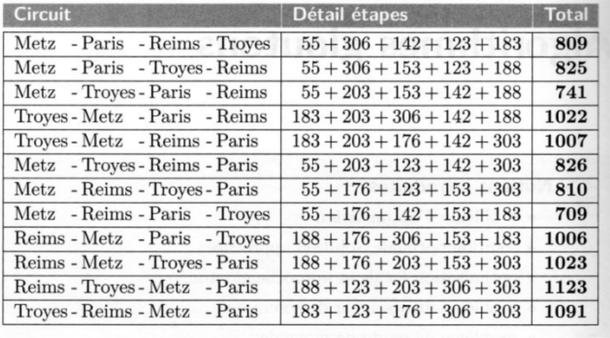

# Algorithmes gloutons

## Le problème du voyageur

### Problématique

Un voyageur se fixe un certain nombre de villes à visiter impérativement : Paris, Reims, Troyes, Nancy, Metz.

Il devra élaborer un trajet en partant d'une des villes de la liste (ville de départ), devra organiser son trajet pour visiter une seule fois toutes les autres villes de la liste et revenir en fin de parcours à la ville de départ. Pour des raisons budgétaires, il souhaite optimiser la longueur de son trajet

A l'aide du site [https://geoportail.gouv.fr](géoportail), il détermine les distances minimales entres ces différentes villes :

|distance |	Nancy | Metz | Paris | Reims | Troyes|
|:-------:|:-----:|:----:|:-----:|:-----:|:-----:|
|Nancy	  |0	  |55	 |303	 |188	 |183    |
|Metz	  |55	  |0	 |306	 |176	 |203    |
|Paris	  |303	  |306	 |0	     |142	 |153    |
|Reims	  |188	  |176	 |142	 |0      |	 123 |
|Troyes	  |183	  |203	 |153	 |123    |	0    |

### Le nombre de possibilités

!!! example "Exercice 1"
    1. A compléter : 
        * Pour la ville de départ, le voyageur a __ choix possibles ;
        * Pour le choix de la 2nde ville, il lui reste __ possibilités ;
        * Pour le choix de la 3ème ville, il lui reste __ possibilités ;
        * Pour le choix de la 4ème ville, il lui reste __ possibilités ;
        * Pour le choix de la 5ème ville, il lui reste __ possibilités ;

    2. Au final, déterminer le nombre de trajets possibles pour 5 villes puis pour $n$ villes.

    3. Parmi les différents trajets possibles, y en aura-t-il qui auront systématiquement la même distance ? En déduire le nombre de trajets possibles pour $n$ villes. Calculer ce nombre pour 10 villes, 20 villes ...

### Nécessité d'algorithmes gloutons

Les algorithmiciens qui se sont penchés sur ce problème ont de solides raisons de penser qu'il n'existe aucun algorithme qui donnera une solution optimale en un temps optimal lorsque $n$ est grand. Cependant, certains algorithmes, dit gloutons, sont capables de donner rapidement une solution acceptable.

**Résolution approchée :**

L'idée est de décomposer le problème global dont la solution optimale est quasiment impossible à déterminer en raison de son coût machine par une succession d'étapes durant lesquelles ont fera un choix local et optimal (rapide en coût machine). Sur notre exemple, à chaque étape, on va se poser la question suivante : Quelle est la ville la plus proche ? Le meilleur choix est facile à déterminer et rapide. Puis on procède ainsi jusqu'à avoir parcouru toutes les villes.

La question est de savoir si en faisant une série de choix localement optimaux, on finit par aboutir à une solution optimale. C'est parfois le cas mais pas toujours !

### Algorithme du voyageur

Résolvons ensemble le problème du voyageur :

* Dans un premier temps, créer une liste (de chaines de caractères) des villes à visiter :

``` py
villes = ["Nancy", "Metz", "Paris", "Reims", "Troyes"]
```

* Créer également le tableau des distances ci-dessous (liste de listes d'entiers) :

``` py
distance =[[0,55,303,188,183],
          [55,0,306,176,203],
          [303,306,0,142,153],
          [188,176,142,0,123],
          [183,203,153,123,0]]
```

!!! example "Exercice 2"
    Dans votre IDE, après avoir copier/coller les listes précédentes, écrire l'instruction qui permet d'afficher  :

      * la ville de "Paris" ; 
      * la ville de "Nancy" ;
      * La distance Paris-Nancy ;
      * La distance Paris-Metz.

!!! example "Exercice 3"
    Existe-t-il un lien entre la liste `villes` et la liste `distance` .Dans la liste `villes`, peut on inverser 2 éléments sans retoucher la liste `distance` ?

!!! example "Exercice 4"
    Créer un tableau de booléen nommé `visitees` qui indiquera si la ville a été visitée (True) ou non (False). Au départ, comment faut-il initialiser les éléments de la liste ?

!!! example "Exercice 5"
    Écrire une fonction nommée `plus_proche()`, qui prend en arguments l'indice de la ville, la liste `visitees` et le tableau `distance` et qui va retourner l'indice de la ville la plus proche non déjà visitée et la distance entre la ville en question et la ville la plus proche.
    
    Attention à bien initialiser le tableau visitees pour tester la fonction, la ville choisie est supposée avoir été visitée. On utilisera une variable locale nommée `pp`, initialement initialisée avec la valeur `None`, et à qui l'on assignera ensuite l'indice de la ville la plus proche. 

!!! example "Exercice 6"
    Écrire maintenant une fonction nommée `voyage()`, qui prend en arguments l'indice de la ville de départ, le tableau `distance` et la liste `villes` retourne la distance totale parcourue ainsi que la liste des villes parcourues. On utilisera 2 variables locales courante et suivante à qui l'on assignera l'indice de la ville en cours de visite et de la ville suivante.

!!! example "Exercice 7"
    Tester maintenant la globalité du programme en prenant comme ville de départ Nancy.
    Le tableau ci-dessous donne l'ensemble des trajets avec comme ville de départ Nancy. Vérifier que votre algorithme glouton n'a pas donné la solution optimale mais malgré toute une solution très satisfaisante.

    <figure markdown>
    {width=400px}
    </figure>

## Le problème du sac à dos

### Problématique

Un voleur souhaite emporter des objets d'une valeur totale maximale dans son sac à dos qui ne peut supporter plus d'une certaine masse, à définir.

|Objet	| Valeur (€)| Masse (kg)|
|:-----:|:---------:|:---------:|
|Objet 1|	500     |	15      |
|Objet 2|	320	    |    2      |
|Objet 3|	20      |	5|
|Objet 4|	500	    |   7|
|Objet 5|	180	    |   6|
|Objet 6|	80	    |     8|

### Stratégies gloutonnes

!!! example "Exercice 8"
    Proposer 3 stratégies gloutonnes pour résoudre cette problématique.

### Algorithme glouton

Suivant la stratégie gloutonne adoptée, il sera sans doute nécessaire de rajouter une colonne au tableau et de trier le tableau suivant un ordre croissant ou décroissant d'une des colonnes. Afin de trier le tableau, on utilisera la fonction `sorted()`.

Voici un exemple de la liste objet :

```py linenums="1"
# objet , valeur (euros), masse(kg)
objets = [["objet1", 500, 15],
["objet2", 320, 2],
["objet3", 20, 5],
["objet4", 500, 7],
["objet5", 180, 6],
["objet6", 80, 8]]
```

!!! example "Exercice 9"
    Après avoir ajouter une troisième colonne à la matrice, utiliser la fonction `'sorted()` pour trier la liste `objet` sur le prix, la masse.

!!! example "Exercice 10"
    Écrire une fonction nommée `sac_dos()` qui prend en argument le tableau d'objets, la masse maximale supportée par le sac à dos, l'indice de la colonne à trier, un booléen qui prend la valeur `True` pour un tri décroissant sinon la valeur False pour un tri croissant, et qui retourne un tableau dont le 1 éléments et le tableau des objets choisis, le 2nd élément la masse totale des objets emportés et le 3ème élément la valeur totale des objets emportés.

!!! example "Exercice 11"
    Appliquer vos différentes stratégies et vérifier la cohérence des réponses.

## Le problème du rendu de monnaie

### Algorithme glouton

Considérons le problème d'un commerçant devant rendre de la monnaie à l'un de ses clients. Il souhaite le faire en utilisant le moins de pièces et de billets possibles. On suppose que l'on manipule les pièces et coupures habituelles des euros (1€, 2€, 5€, 10 €, 20€, 50€, 100€ et 200€, oublions les centimes) et que le commerçant dispose d'une réserve suffisamment importante de chaque espèce.

!!! example "Exercice 12"
    1. Donner les combinaisons possibles de rendu de monnaie sur 9 €. Établir un tableau.
    2. A l'aide du tableau précédent, proposer une stratégie gloutonne pour rendre la monnaie. 

!!! example "Exercice 13"
    Écrire une fonction qui prend en argument la somme à rendre (nombre entier) et retourne le tableau des pièces ou coupures.

### Systèmes canoniques

On appelle système canonique un système où un algorithme glouton donne toujours le rendu optimal. 

!!! example "Exercice 14"
    En observant les réponses fournies par votre algorithme, pensez-vous que le système en euros soit canonique ?

**Que se passe-t-il si le système euro n'est pas cannonique :**

!!! example "15"
    Appliquer votre algorithme glouton à un système monétaire dans lequel les pièces ou coupures auraient les valeurs suivantes : 1, 6, 10 et 22 €. Montrer sur un exemple que le rendu de monnaie n'est pas optimal et donc que ce système n'est pas canonique.  
