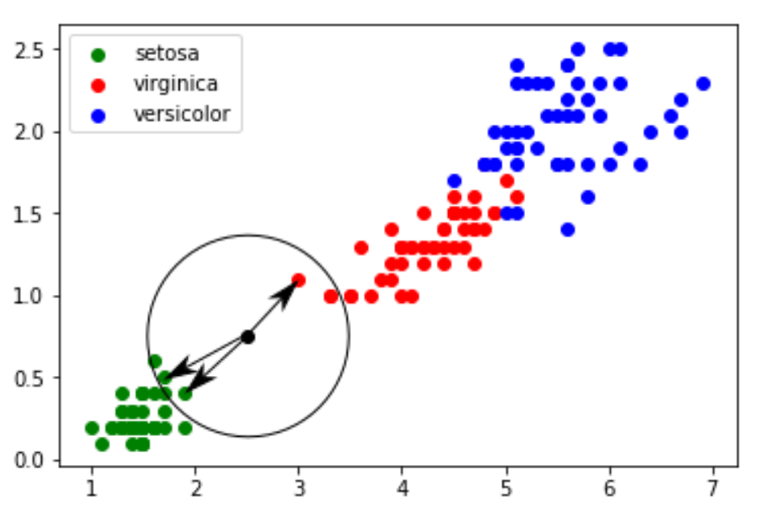

# K plus proches voisins

## Introduction

L'algorithme des k plus proches voisins est un chapitre particulier en NSI car il constitue le seul qui traite de l'intelligence artificielle.


L’intelligence artificielle (IA) regroupe un ensemble de méthodes qui permettent à une machine de résoudre des problèmes complexes en imitant certains comportements humains, comme :

* Apprendre à partir de données,
* Prendre des décisions,
* Reconnaitre des formes ou des sons,
* Traduire une langue,
* Etc.

Parmi les branches de l’IA, on trouve le machine learning (apprentissage automatique), où les machines apprennent à partir d’exemples.

Le terme machine learning vient de l’informaticien américain Arthur Samuel en 1959. Le marchine learning est souvent utilisé dans le problème de classification c'est-à-dire de pouvoir prévoir à quelle classe appartient un nouvel objet uniquement à l'aide de ses paramètres.

On relève, par exemple, sur des objets de différentes classes (chien ou chat ... ) des paramètres (longueur, largeur, couleur, poids, qualité 1, qualité 2 ..) qui vont permettre de les distinguer.

Bien que cette idée d’apprentissage automatique date de la fin des années 1950, le machine learning a pris
toute son importance avec la montée en puissance du Big Data, offrant des quantités de données à analyser sur d’innombrables sujets. À noter aussi l’importance des stratégies mises en place par les GAFAM (Google, Apple, Facebook, Amazon et Microsoft) afin de récupérer un grand nombre de données concernant leurs clients. Ces données sont très souvent utilisées pour alimenter des algorithmes de machine learning (ce qui permet par exemple à Amazon de proposer à ces clients des "suggestions d’achats" souvent très pertinentes.)

## Les données d’Edgar Anderson relatives aux différentes espèces d’iris

En 1936, Edgar Anderson a collecté des données sur 3 espèces d’iris : "iris setosa", "iris virginica" et "iris versicolor". Pour chaque iris étudié, Anderson a mesuré la largeur et la longueur des sépales, la largeur et la longueur des pétales. Par souci de simplification, nous nous intéresserons uniquement à la largeur et à la longueur des pétales. 50 de ces mesures se trouvent dans le fichier [iris.csv](img_kppv/iris.csv). Ce jeu de données présente aujourd’hui un intérêt essentiellement pédagogique. En effet,
il est exclusivement utilisé par des personnes désirant s’initier aux algorithmes de machine learning Les valeurs du champ "species"("espèces")sont 0 pour l’espèce "setosa", 1 pour "virginica" et 2 pour"versicolor".

<figure markdown>
{width=250px}
</figure>

Nous allons dans un premier temps réaliser une représentation graphique des données contenues dans le
fichier à l’aide du script python suivant :

``` py linenums="1"
import pandas
import matplotlib.pyplot as plt

iris = pandas.read_csv("iris.csv") #lecture du fichier iris.csc
x = iris.loc[:,"petal_length"] #extraction de la longueur du pétale
y = iris.loc[:,"petal_width"] #extraction de la largeur du pétale
espece = iris.loc[:,"species"]

plt.scatter(x[espece == 0], y[espece == 0], color='g', label='setosa') #tracé pour la setosa
plt.scatter(x[espece == 1], y[espece == 1], color='r', label='versicolor')
plt.scatter(x[espece == 2], y[espece == 2], color='b', label='virginica')

plt.legend() #affichage de la légende
plt.show() # affichage du graphique
```

<figure markdown>
{width=400px}
</figure>

On constate que ces points sont regroupés par espèces d’iris.


!!! example "Exercice 1"

    1. Ouvrir l’activité Capytale n° : c0d5-1738910 ;
    2. Copier/coller le code précédent et exécuter-le.
    3. Modifier ce code et observer

### Comment apprendre à reconnaître une espèce d’iris

Considérons maintenant une iris dont les pétales mesurent 0,5 cm de large et 2 cm de long.
Comment déterminer l’espèce à laquelle cette iris appartient ? Afin de répondre à cette problématique,
nous allons placer cette nouvelle donnée sur le graphique :

``` py linenums="1"
plt.scatter(2.0, 0.5, color = "black")
```

<figure markdown>
{width=400px}
</figure>

Dans ce cas, on voit clairement qu’il y a de fortes chances pour que l’iris soit de l’espèce "setosa".
Cependant, il existe des cas où il est beaucoup plus difficile de répondre, par exemple pour une iris dont
les pétales mesurent 0,75 cm de large et 2,5cm de long.

<figure markdown>
{width=400px}
</figure>

Afin de déterminer si l’iris appartient à l’espèce "sétosa" ou à l’espèce "virginica", nous allons devoir
utiliser l’algorithme des k plus proches voisins.

!!! example "Exercice 2"
    Réaliser sur cette activité capytale le code pour insérer l’iris inconnue

## Algorithme des k plus proches voisins

Quel est le principe de cet algorithme ?

* On calcule la distance entre le point correspondant à l’iris inconnu et chaque point issu du jeu de
données "iris" ;
* On sélectionne les k distances les plus petites (les k plus proches voisins) ;
* Parmi les k plus proches voisins, on détermine quelle est l’espèce majoritaire, et on attribue à notre
iris inconnu cette espèce majoritaire.

Prenons k = 3 :

<figure markdown>
{width=400px}
</figure>

Les 3 plus proches voisins sont deux "setosa" et un "virginica". D’après l’algorithme des "k plus proches voisins", notre iris inconnue appartient à l’espèce "setosa".

La bibliothèque,développée par L'[INRIA](), Python [Scikit Learn](https://scikit-learn.org/stable/index.html) propose un grand nombre d’algorithmes lié au machine learning (c’est sans aucun doute la bibliothèque la plus utilisée en machine learning) et la troiParmi tous ces algorithmes, Scikit Learn propose l’algorithme des k plus proches voisins.

Importer la bibliothèque :

``` py
from sklearn.neighbors import KNeighborsClassifier
```

Compléter le programme précédent (la fonction `plt.show()` devra être placée en fin de script) :

``` py
k = 3 #nbre de plus proches voisins
#données concernant l'iris inconnu
longueur = 2.5
largeur = 0.75

#algo knn
d = list(zip(x,y)) #permet de passer des 2 listes x et y (x = [1.4, 1.4, 1.3, 1.5, 1.4, 1.7, 1.4, ...]
#y = [0.2, 0.2, 0.2, 0.2, 0.2, 0.2, 0.4,....] à une liste de tuples
#d = [(1.4, 0.2), (1.4, 0.2), (1.3, 0.2) (1.5, 0.2), (1.4, 0.2), (1.7, 0.2), (1.4, 0.4), ...]
model = KNeighborsClassifier(n_neighbors=k) #"KNeighborsClassifier" est une méthode issue
#de la bibliothèque scikit-learn

model.fit(d,espece)
prediction= model.predict([[longueur,largeur]])

#fin algo knn
#Affichage résultats
txt = "Résultat : "
if prediction[0] == 0:
    txt = txt + "setosa"
if prediction[0] == 2:
    txt = txt + "virginica"
if prediction[0] == 1:
    txt = txt + "versicolor"
plt.text(4,0.5, txt, fontsize=12)
plt.show()
```

!!! example "Exercice 3"
    Sur cette activité capytale, réaliser le script afin de déterminer l’espèce de l’iris inconnu.

!!! example "Exercice 4"
    Le résultat dépend-t-il du nombre de voisins ? Pour répondre à cette question, relancer le script en prenant
    toujours le même iris inconnu mais en faisant varier le nombre de voisins.
    Que constatez-vous ?

## Notion de distance

### Distance cartésienne

!!! example "Exercice 5"
    Écrire une fonction `distance` qui prend en paramètre deux points A et B, chacun représenté par un tuple de coordonnées (x, y), et qui retourne la distance entre ces deux points.

    Formule utilisée :  La distance entre deux points $A(x_1, y_1)$ et $B(x_2, y_2)$ est donnée par :

    $$ d = \sqrt{(x_2 -x_1)^2 + (y_2-y_1)^2}$$

    ``` py
    >>> distance((0, 0), (3, 4))
    5.0
    ```

### Distance de Hamming

#### Exercice

!!! example "Exercice 6"
    Écris une fonction distance_hamming qui prend en paramètre deux chaînes de caractères s1 et s2, et qui retourne le nombre de positions où les caractères sont différents.
    Si les deux chaînes n’ont pas la même longueur, la fonction devra afficher None.

    ``` py
    >>> distance_hamming("karine", "marine")
    2
    >>> distance_hamming("101010", "100110")
    2
    >>> distance_hamming("abc", "abcd")
    None
    ```

#### Applications pratiques de la distance de Hamming

**Codage et détection d’erreurs (informatique)**

Lorsqu'on transmet des données (par exemple un mot binaire) sur un réseau, elles peuvent être corrompues (bruit). Les codes de Hamming permettent de détecter et même parfois corriger automatiquement des erreurs si la distance de Hamming est suffisamment grande entre les mots valides.

**Biologie et génétique**

En génétique, la distance de Hamming est utilisée pour comparer des séquences d’ADN ou ARN.

Ex. comparer deux brins d’ADN pour identifier des mutations ponctuelles.

``` plaintext

Séquence 1 : ACGTACG
Séquence 2 : ACGTTCG
                  ^
Hamming = 1 (1 mutation)
```

**Cryptographie**

Pour mesurer la différence entre une clé originale et une clé modifiée, ou pour mesurer l'effet d'une petite modification sur un chiffré (test d'avalanche). Idéal pour savoir si une modification mineure entraîne un changement global.

**Classification & apprentissage automatique**

Quand on travaille avec des vecteurs binaires (présence/absence de caractéristiques), on peut utiliser la distance de Hamming pour :

* faire de la classification (k-NN, clustering)

* mesurer la proximité entre objets binaires.
