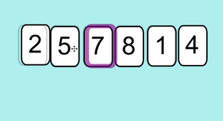
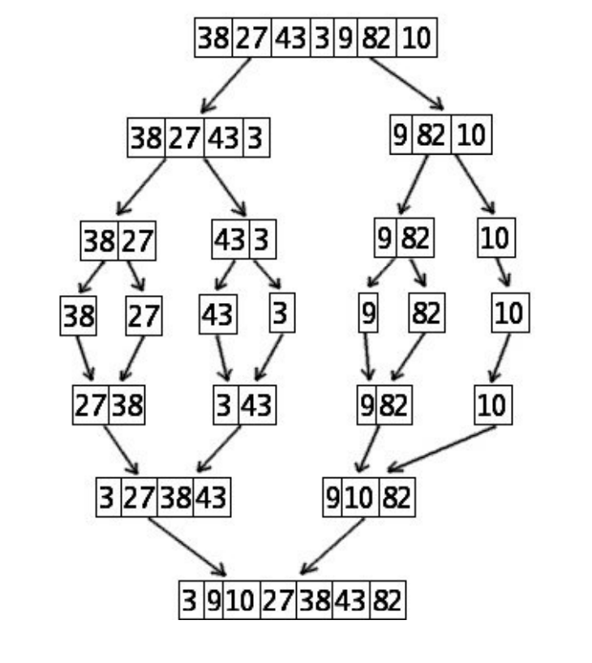

# Tris 

## Pourquoi trier les valeurs

Les tris sont une des opérations les plus souvent effectuées par les ordinateurs, que ce soit dans les applications professionnelles (gestion des bases de données, des opérations bancaires...), la compression des données ou les jeuxvidéo. On estime qu’un quart des cycles d’horloge des ordinateurs sont consacrés à des opérations de tri. Le coût énergétique de ces opérations de tris représente près de 2% de la consommation totale d’électricité en Europe. Sur des effectifs de plusieurs millions de données, les temps d’exécution des différents algorithmes de tris varient entre une dizaine de secondes et une dizaine de jours. D’où l’importance d’optimiser l’efficacité de ces algorithmes.

Bien que la plupart des algorithmes de tri soient connus depuis longtemps, la recherche sur leur optimisation est encore très active. La dernière amélioration de l’algorithme de tri "Quicksort" par Bentley & Sedgewick, considéré comme indépassable au niveau des tris par comparaison, date seulement de 2002.

Les algorithmes de tris se divisent en deux grandes catégories de complexité :

* Les tris lents parmi lesquels on trouve : tri par insertion, le tri par sélection, le tri à bulles.
* Les tris rapides parmi lesquels on dénombre : le tri fusion, le tri rapide (Quick Sort) ...

En Python, on utilise la fonction `sort()` :

``` py linenums="1"
>>> tab = [4, 8, 1, 2, 6]
>>> tab.sort()
>>> tab
[1, 2, 4, 6, 8]
```

Nous allons voir dans ce chapitre comment écrire un algorithme de tri et les différentes manières d'écrire un tel algorithme.

## Travail préparatoire sur les listes

!!! example "Exercice 1 : générer une liste aléatoire"
    Écrire une fonction `get_random_list` qui prend en argument le nombre d’éléments entiers que l’on veut générer ainsi que la valeur minimale et la valeur maximale prise par ces éléments. On nommera les paramètres de cette fonction `nb`, `val_min` et `val_max`. Cette fonction retournera la liste d’entiers `L` générée.

!!! example "Exercice 2 :  recherche du plus petit élément dans une liste"
    Écrire une fonction `get_val_min` qui retourne la plus petite valeur d’une liste d’entiers passée en argument. On supposera que la liste ne contient que des entiers et qu’elle n’est pas vide. Bien entendu, on n’utilisera pas ici la méthode `min` de Python.

!!! example "Exercice 3 : recherche de la position de la plus petite valeur"
    Écrire une fonction `get_index_min` qui cette fois-ci retourne la position de la plus petite valeur d’une liste d’entiers passée en argument.

!!! example "Exercice 4 : recherche de la position de la plus petite valeur à partir d’un indice de position donné"
    Écrire une fonction `get_index_min_since` qui retourne la position du plus petit élément d’une liste donnée en argument, à partir d’un indice de position donné également en argument facultatif et dont la valeur par défaut sera 0. On supposera que la liste passée en argument n’est pas vide et que l’indice de position existe bien dans la liste.

!!! example "Exercice 5 : échange de deux éléments dans une liste"
    Écrire une fonction `echange` qui reçoit en paramètre une liste et deux entiers correspondant à deux indices de position dans cette liste. Cette fonction retourne la liste après avoir échangé les éléments correspondant aux deux indices passés en argument. Là encore, on supposera ici que les 2 indices passés en argument ne sont pas en dehors de la liste.

## Algorithmes de tri

### Tri par sélection

#### Principe

Le principe est simple : pour un tri par valeurs croissantes de n éléments dans une liste :

* Étape 1 (première itération) : On rechercher le plus petit élément de la liste.
  
* Si c’est le premier élément, on ne fait rien ;
* Sinon on inverse ce plus petit élément avec le 1er élément de la liste ;
* A l’issue de cette étape, le plus petit élément est bien en début de la liste (indice 0).
  
* Étape 2 (seconde itération) : On recherche ensuite le plus petit élément dans la liste à partir du deuxième élément (le premier étant déjà à la bonne place).

    * Si c’est le second élément de la liste, on ne fait rien, il est à la bonne place ;
    * Sinon on l’inverse avec le second élément de la liste.
    * A l’issue de cette étape, le second plus petit élément est en seconde position et n’a plus à être déplacé.

* On poursuit ainsi les itérations jusqu’à ce que le tableau soit totalement trié.

#### Algorithme

!!! example "Exercice 6"
    Faire tourner « à la main » cet algorithme afin de trier la liste `lst = [4, 2, 8, 3, 7]`.  En déduire combien d’étapes sont nécessaires pour trier le tableau (à chaque étape surligner l’élément qui n’a plus à être déplacé). En déduire combien d’étapes sont nécessaires pour trier un tableau de n éléments.

    |     Liste origine     |    4    |     2    |     8    |     3    |     7    |
    |-----------------------|----------|----------|----------|----------|----------|
    |     Étape 1           |          |          |          |          |          |
    |                       |          |          |          |          |          |
    |                       |          |          |          |          |          |
    |                       |          |          |          |          |          |
    |                       |          |          |          |          |          |
    |                       |          |          |          |          |          |

!!! example "Exercice 7"
    Écrire une fonction `tri_selection_fct` qui prend en argument un tableau d’entiers et retourne le tableau trié. Pour tester cette fonction, écrire un programme principal qui génère un tableau de 100 entiers dont les valeurs sont comprises entre 0 et 700 et qui le trie par ordre croissant. On pourra bien entendu utiliser les fonctions réalisées auparavant.

!!! example "Exercice 8"
    Écrire de nouveau une fonction qui effectue le tri par sélection mais sans faire appel à la fonction `get_index_min_since` et à la fonction `echange`. Cette fonction sera nommée `tri_selection`.

!!! example "Exercice 9"
    Quelle est la complexité d'un algorithme d'un tel algorithme dans le pire des cas.

#### Terminaison

Les preuves de correction sont des preuves théoriques qui reposent sur la notion d'invariant de boucle.

La preuve ici s'appuie sur le concept mathématique de récurrence.

**Principe du raisonnement par récurrence :** 

Une propriété est $P(n)$ est vraie si :

* $P(0)$ par exemple est vraie
* Pour tout entier naturel $n$, si $P(n)$ est vraie alors $P(n+1)$ est vraie

Ici, la propriété (donc l'invariant de boucle) serait : « Quand varie entre 0 et `longueur(liste) -1`, la sous-liste de longueur est triée dans l'ordre croissant.

* quand $k$ vaut 0, on place le minimum $m_0$ de la liste en position 0, la sous-liste [$m_0$] est donc triée.
* si la sous-liste de $k$ éléments [$m_0$,$m_1$, ..., $m_{k-1}$] est triée, l'algorithme rajoute en dernière position de la liste le minimum de la sous-liste restante, dont tous les éléments sont supérieurs au maximum de la sous-liste de $k$ éléments. La sous-liste de $k+1$ éléments [$m_0$, $m_{1}$, ....,$m_{k-1}$,$m_k$] est donc elle aussi triée.

### Tri par insertion

#### Principe

Le tri par insertion est un algorithme de tri classique utilisé tout naturellement par les joueurs de cartes : ils prennent les cartes mélangées une à une sur la table, et forment une main en insérant chaque carte à sa place.

**Exemple :**

Considérons la liste  : `lst = [7, 5, 2, 8, 1, 4]`
Voici le fonctionnement de l'algorithme :

<figure markdown>

</figure>

**Explications :**

On traite successivement toutes les valeurs à trier, en commençant par celle en deuxième position.
Traitement : tant que la valeur à traiter est inférieure à celle située à sa gauche, on échange ces deux valeurs.

#### Algorithme

La fonction suivante prend en argument une liste de nombres et la retourne triée suivant un algorithme de tri par insertion : 

``` py linenums="1"
def tri_insertion(lst: list) -> list:
    for i in range(1, len(lst)):                 
        j = i                                    
        while j > 0 and lst[j-1] > lst[j] :      
            lst[j], lst[j-1] = lst[j-1], lst[j]      
            j = j - 1 
    return lst
```

#### Trace de la fonction `tri_insertion`

!!! example "Exercice 10"
    Effectuer la trace de cette fonction qui prend en argument la liste `[10, 2, 8, 3, 1]`. Exécuter le script afin de vérifier qu’elle réalise bien la tâche demandée. 

    | L[0]	| L[1]	| L[2]	| L[3] | L[4]	| i      | 	j  | 	elmt | Commentaires|
    |:-----:|:-----:|:-----:|:----:|:------:|:------:|:---:|:-------:|:-----------:|
    |       |       |       |      |        |        |     |         |             |

!!! example "Exercice 11"
    Déterminer la complexité de cet algorithme dans le pire des cas.

#### Terminaison

Comme pour l'algorithme de tri par sélection, on va tenter d'affirmer que le tri par insertion est correct (correction) en déterminant un invariant de boucle.

Pour déterminer un invariant de boucle (propriété), nous devons montrer que cet invariant est valide dans trois conditions :

* Initialisation : Il est vrai avant la première itération de la boucle. 
* Conservation : S’il est vrai avant une itération de la boucle, il le reste avant l’itération suivante.
* Terminaison : Une fois terminée la boucle, l’invariant fournit une propriété utile qui aide à montrer la validité de l’algorithme.

Si les deux premières propriétés sont vérifiées, alors l’invariant est vrai avant chaque itération de la boucle. La troisième propriété est utilisée pour prouver la validité de l’algorithme

**Choix de l’invariant de boucle :**

On constate qu’en début de chaque itération de la boucle for, la sous-liste `lst[0… j-1]` est triée. Nous allons considérer cette propriété comme invariant de boucle. 

!!! example "Exercice 12 "

    * Initialisation : Montrer que l’invariant de boucle est vrai avant la 1ère itération. 
    * Conservation : Montrer que chaque itération conserve l’invariant.
    * Terminaison : Montrer que l’invariant est vérifié en fin de boucle.

### Tri à bulles

#### Principe

Le tri à bulles est un algorithme de tri. Il consiste à comparer répétitivement les éléments consécutifs d’un tableau 2 à 2 et de les permuter s’ils ne sont pas dans le bon ordre. Il doit son nom au fait qu’il déplace rapidement le plus grand élément restant en fin de tableau comme une bulle qui remonterait rapidement à la surface d’un liquide.

* Étape 1 (1ère itération) : On balaye tous les éléments de la liste en les comparant 2 à 2 et on les permute s’ils ne sont pas dans le bon ordre. On remarque que le plus grand élément est bien remonté en fin de liste.
* Étape 2 (2ème itération) : On recommence de nouveau en partant du 1er élément du tableau mais le dernier élément de la liste n’est pas comparé car il se trouve déjà à la bonne place.
* On poursuit ainsi les itérations jusqu’à ce que le tableau soit totalement trié. 

!!! example "Exercice 13"
    Faire tourner àla main cet algorithme afin de trier la liste suivante `lst = [10, 2, 8, 3, 1]`.  En déduire combien d’étapes sont nécessaires pour trier le tableau (à chaque étape surligner le plus grand élément et vérifier qu’il remonte bien en fin de liste). En déduire combien d’étapes sont nécessaires pour trier un tableau de n éléments.

    | lst           |10	| 2    |	8	|3 	 |1  |
    |:-------------:|:-:|:----:|:------:|:--:|:-:|
    |   étape 1     |   |      |        |    |   |

#### algorithme

!!! example "Exercice 14"
    Écrire une fonction `tri_bulles` qui prend en argument un tableau d'entiers et retourne le tableau trié. Le tester.

### Tri fusion

#### Principe

Le tri fusion est construit suivant la stratégie "diviser pour régner", en anglais "divide and conquer". Le principe de base de la stratégie "diviser pour régner" est que pour résoudre un gros problème, il est souvent plus facile de le diviser en petits problèmes élémentaires. Une fois chaque petit problème résolu, il n’y a plus qu’à combiner les différentes solutions pour résoudre le problème global. La méthode "diviser pour régner" est tout à fait applicable au problème de tri : plutôt que de trier le tableau complet, il est préférable de trier deux sous tableaux de taille égale, puis de fusionner les résultats.

Exemple de tri par fusion appliqué à un tableau de 7 éléments :

<figure markdown>
{width=300px}
</figure>

#### Algorithme

Cet algorithme n’est pas au programme de 1ère mais à celui de terminale car il fait appel à la récursivité (une fonction qui s’appelle elle-même). Il pourra être copié-collé dans python afin d’être testé puis afin de  comparer les vitesses d’exécution des différents algorithmes de tri. 

``` py linenums="1"
def fusion(lst1:list,lst2:list)-> list:
    i1, i2, n1, n2 = 0, 0, len(lst1), len(lst2)
    t = []
    while i1 < n1 and i2 < n2:
        if lst1[i1] < lst2[i2]:
            t.append(lst1[i1])
            i1 += 1
        else:
            t.append(lst2[i2])
            i2 += 1
        if i1 == n1 and i2 < n2 :
            t.extend(lst2[i2:])
        if i2 == n2 and i1 < n1 :
            t.extend(lst1[i1:])
    return t
```

``` py linenums="1"
def tri_fusion(L:list)-> list:
    n = len(L)
    if n < 2:
        return L
    else:
        m = n // 2
        return fusion(tri_fusion(L[:m]), tri_fusion(L[m:]))
```

## Comparaison du temps d'exécution des différents algorithmes de tri

Afin de comparer les tems d’exécution des différents algorithmes de tri, nous allons utiliser la fonction time de la bibliothèque time. Cette fonction renvoie l’heure UNIX, c’est-à-dire le nombre de secondes écoulées depuis un instant de référence : le premier janvier 1970 à minuit.

Cette fonction s’utilise de la manière suivante :

```py linenums="1"
import time
t1 = time.time()
# instructions qui appellent la fonction de tri à chronométrer…
t2 = time.time()
duree = t2 -t1
print(duree)
```

!!! example "Exercice 15"
    Réaliser un programme qui génère aléatoirement une liste L de n entiers à trier (dont les valeurs sont comprises entre 0 et 100000).  Cette liste sera dupliquée en 4 listes L1, L2, L3 et L4. Les 4 listes dupliquées seront triées respectivement par sélection, par insertion, par tri à bulles et par fusion et ces 4 tris seront chronométrés.
    $n$ prendra les valeurs 100, 1000, 5000, 10000, 20000 et 30000 et on superposera 4 courbes (1 pour chaque tri) représentant le temps de calcul en fonction du nombre d’éléments à trier. Conclure. 


