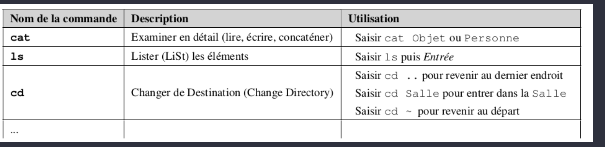
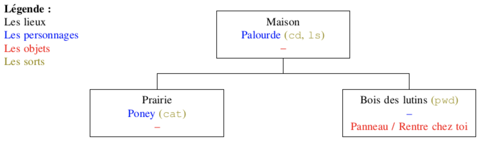
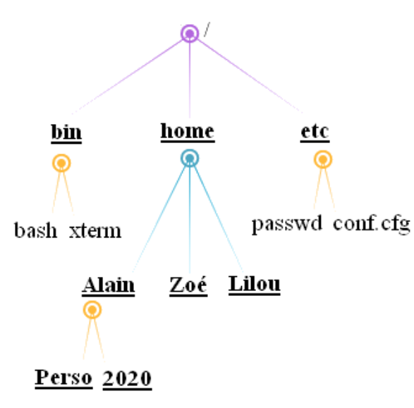

# Système d'exploitation (Operating Systeme ou OS) 

## Introduction aux systèmes d'exploitation

 Le système UNIX est un système dit "propriétaire", c'est-à-dire un système non libre. Mais plus généralement, qu'est-ce qu'un logiciel libre ?

D'après Wikipédia : "Un logiciel libre est un logiciel dont l'utilisation, l'étude,  la modification et la duplication par autrui en vue de sa diffusion sont permises, techniquement et légalement, ceci afin de garantir certaines libertés induites, dont le contrôle du programme par l'utilisateur et la possibilité de partage entre individus". 

Le système UNIX ne respecte pas ces droits (par exemple le code source d'UNIX n'est pas disponible, l'étude d'UNIX est donc impossible), UNIX est donc un système "propriétaire" (le contraire de "libre"). Attention qui dit logiciel libre ne veut pas  forcement dire logiciel gratuit (même si c'est souvent le cas), la confusion entre "libre" et "gratuit"
vient de l'anglais puisque "free" veut à la fois dire "libre", mais aussi gratuit.

En 1991, un étudiant finlandais, Linus Torvalds, décide de créer un clone libre d'UNIX en ne partant 
de rien (on dit "from scratch" en anglais) puisque le code source d'UNIX n'est pas public. Ce clone
d'UNIX va s'appeler Linux (Linus+UNIX). 

Difficile de parler des systèmes d'exploitation sans parler de Microsoft !

Microsoft a été créée par Bill Gates et Paul Allen en 1975. Microsoft est surtout connue pour son
système d'exploitation Windows. Windows est un système d'exploitation "propriétaire", la première 
version de Windows date 1983, mais à cette date Windows n'est qu'un ajout sur un autre système 
d'exploitation nommé MS-DOS. Aujourd'hui Windows reste le système d'exploitation le plus utilisé
au monde sur les ordinateurs grand public, il faut dire que l'achat de Windows est quasiment imposé 
lorsque l'on achète un ordinateur dans le commerce, car quand vous achetez un ordinateur neuf,
une partie de la somme de l'ordinateur sert à payer le système d'exploitation Windows.

Enfin pour terminer, quelques mots sur le système d'exploitation des ordinateurs de marque Apple :
tous les ordinateurs d'Apple sont livrés avec le système d'exploitation macOS. Ce système macOS est
un système d'exploitation UNIX, c'est donc un système d'exploitation propriétaire.

## Arborescence, chemin absolu et relatif

### L'arborescence

En informatique, les contenus sont généralement stockés dans des fichiers.

Comme ceux-ci sont vite très nombreux, pour s'y retrouver on a conçu les systèmes de fichiers comme des arborescences : les fichiers sont stockés dans des répertoires, et en plus des fichiers chacun de ces répertoires peut lui-même contenir plusieurs autres répertoires.

L’arborescence d’un système GNU/Linux se présente sous la forme représentée ci-dessous.

<figure markdown>
{width=400px}
</figure>

**Remarque :** tous les systèmes UNIX accordent une grande importance aux fichiers. UNIX et LINUX VOIENT leurs périphériques et leurs processus comme des fichiers.

Par exemple, dans cette arborescence :

* / le dossier racine de l’arborescence
* Tous les dossiers qui se terminent par bin contiennent des exécutables en binaire.
* `home` : dossiers des utilisateurs
* `dev` : le matériel
* `etc` : les reglages
* `root` : dossier de l’utilisateur root
* `mnt` et `media` : les points de montage des disques et partitions externes (là où apparaissent les clés usb etc.)

### Chemin absolu et relatif

La référence à une ressource (fichier ou répertoire) s'appelle un chemin d'accès (en anglais : path). Dans ce chemin, sous Linux, les noms des répertoires et éventuel fichier sont séparés par un slash / (alors qu'on utilise un antislash \ sous Windows).

Il existe deux types de chemin : **absolu** et **relatif**.

#### Chemin absolu

Un chemin absolu se base sur la racine de l'arborescence et commence par `/`, par ex. : `/home/utilisateur/<dossier>/<fichier>`. Il reste valable quel que soit le contexte (à condition quand même d'être sur le même système d'une même machine).

`/` au tout début d'un chemin est donc à peu près l'équivalent du `C:\ `sous Windows.

#### Chemin relatif

Un chemin relatif est a priori relatif au répertoire courant où se trouve l'utilisateur. Un chemin qui commence par autre chose que `/` ou `~` est un chemin relatif. Cette notion de positionnement dépend du contexte, mais sous Linux on se trouve généralement par défaut dans son répertoire personnel qui est `/home/<nom d'utilisateur>`. Dans un terminal on peut naviguer d'un répertoire à l'autre avec la commande `cd` .

On peut aussi utiliser ce type de chemin pour indiquer où se trouvent les ressources les unes par rapport aux autres, indépendamment de la racine du système, par exemple pour que les fichiers d'un site web susceptibles d'être déplacés ensemble puissent se retrouver les uns les autres.

## Terminal/console et shell

Plutôt que d'intéragir avec le système via une interface graphique, il possible aussi d'intéragir avec le système via un terminal (ou console).  Voici un exemple de terminal sous une distribution Linux (Kali):

<figure markdown>
{width=400px}
</figure>

**Le Shell est l’interpréteur en ligne de commande**, il permet à un utilisateur de s’identifier sur une console ou un terminal.

Il fournit un certaines nombres de commandes pour interagir avec le système d’exploitation.
En général, il permet aussi de créer des fichiers script que l’on nomme script pour exécuter plusieurs commandes l’une après l’autre. C’est donc aussi un langage de programmation.

* Sur Linux : Bourne shell (sh), KornShell (ksh), C shell (csh), tcsh ,bash, Z shell (zsh)
* Sur Windows : PowerShell

## UNIX et Linux

### Les différentes commandes linux utiles

* La commande `pwd` permet d'afficher le répertoire où l’on se trouve exactement ;
* La commande `cd` permet de changer le répertoire courant. Il suffit d'indiquer le chemin (relatif ou absolu) qui permet d'atteindre le nouveau répertoire. La commande `cd ..` permet de remonter d'un étage dans l'arborescence ;
* La commande `ls`permet de lister tous les fichiers et les dossiers présents dans un répertoire ;
* La commande `mkdir` permet de créer un répertoire dans le répertoire courant. La commande est de la forme `mkdir nom_du_répertoire` ;
* La commande `touch` permet de créer un fichier vide. La commande est de la forme `touch nom_du_fichier_à_créer`;
* la commande `cat` permet d'afficher dans la console le contenu d'un fichier. La commande est de la forme 'cat nom_du_fichier`;
* La commande `cp` permet de copier un fichier. La commande est de la forme `cp /répertoire_source/nom_fichier_à_copier /répertoire_destination/nom_fichier`
* la commande `mv` permet de déplacer un fichier dans un dossier. Par exemple un `mv toto.txt titi` déplacera le fichier `toto.txt` dans le répertoire `titi` ;
* la commande `man` permet de connaitre toutes les options d'une commande.
* Pour trouver un fichier, nous pouvons utiliser les commandes :

    * `find` : recherche pointue !
    * `locate` : Recherche accélérée de fichiers ou répertoire.
    * `which` : Chemin d’une commande déterminée.

### Les permissions

#### Voir les droits

La sécurité sous unix est gérée par la notion de permission.

Un utilisateur ne peut pas faire ce qu’il veut. 

Le super utilisteur root peut tout faire. Devenir root avec `$ su`, exécuter une commande comme root avec `$ sudo commande`.

L’affichage détaillé d’un fichier (`ls -lah`) montre :

* les permissions de l’utilisateur courant
* de son groupe ;
* de tout le monde.

**Exemple :**

``` shell
-rwxr-xr-x 1 eric eric  324  2 déc.  21:45 deploy.sh
-rw-r--r-- 1 eric eric 3,6M  5 déc.  08:32 inside.log
```

traduction :

* - : pas activé
* d : directory
* r : droit de lecture
* w : droit d'écritude
* x : droit d'exécution

#### Changer les droits

On change les permissions avec `chmod` soit en ajoutant ou retirant un flag : `$ chmod +x inside.log` rendra ce fichier exécutable soit en décrivant la permission par 3 chiffres :

* 1 : possibilité d'exécution ;
* 2 : possibilité d'écriture ;
* 4 : possibilité de lecture.

Il est également possible d'en faire la somme : Ex 7 = 1 + 2 + 4 = tous les droits. Et en fonction de la place de ce chiffre, la permission s'applique à l'utilisateur courant, au groupe, ou à tout le monde.

**Exemple :** `$ chmod 764 inside.log`. Avec le premier 7 je sais que je peux tout faire (lire, écrire et exécuter), le deuxième 6, je sais que mon groupe ne peut pas exécuter mais il peut lire et écrire dessus. Et enfin le dernier 4, je sais que tout le monde peut lire mais pas lire ni l'exécuter.

### Exercice

Rendez-vous à l'adresse [http://luffah.xyz/bidules/Terminus/](http://luffah.xyz/bidules/Terminus/).

Noter sur un papier chaque nouvelle commande que vous apprenez. Ces notes peuvent prendre la forme suivante :

<figure markdown>

</figure>

Écrire un plan du jeu au fur et à mesure que vous avancez dans votre quête. Par exemple :

<figure markdown>

</figure>

## Exercices

### Exercice 1

Soit l'arborescence ci-dessous :

<figure markdown>
{width=300px}
</figure>

1. Pour connaitre le répertoire dans lequel je me trouve, quelle commande dois-je utiliser ?
2. La commande précédente renvoie `/home/Zoé` et je suis Zoé. Pour créer un fichier `chat.txt`, quelle commande dois-je utiliser ?
3. Pour créer un répertoire `Photos` puis un fichier `listePhotos` dans ce répertoire, quelles commandes dois-je utiliser ?
4. Zoé a voulu faire cela, mais voici ce qu'elle à fait :
``` linux
mkdir Films
cd Films
touch listePhotos
```
Comme vous le voyez, elle s'est trompée, et veut maintenant déplacer le fichier `listePhotos` dans le répertoire `Photos`.
Pour déplacer ce fichier sans le renommer, quelle commande Zoé doit-elle utiliser ?
5. Zoé est donc toujours dans le répertoire `Film` et elle saisit `mkdir 2020`
Elle veut maintenant copier le fichier `listePhotos` dans ce nouveau répertoire mais sous un nouveau nom : `listeFilms2020`. Quelle commande Zoé doit-elle utiliser ?
6. Malheureusement Zoé s'est trompée et elle a tapé : `cp ../Photos/listePhotos ~`. Ou a-t-elle copié le fichier ? Donner le chemin absolu.
7. Comment peut elle effacer ce fichier maintenant (elle est toujours dans le répertoire Film) ? Donner le chemin relatif.

### Exercice 2 

Hubert travaille et le prompt indique : ~$. il tape `ls -l` et obtient cette réponse :

``` linux 
-rw-rw-r-- 1 user 0 Apr 15 09:35 toto
```

1. Peut-il lire ce fichier ? le modifier ? l'exécuter ?
2. Son amie Zoé qui n'est pas dans son groupe d'utilisateurs peut elle lire ce fichier ? modifier son contenu ?
3. Hubert veux exécuter toto, il tape ./toto et obtient ce message -sh: ./toto: Permission denied. Que s'est-il passé ?
4. Pour que toto devienne exécutable pour lui même, quelle commande Hubert doit-il utiliser ?