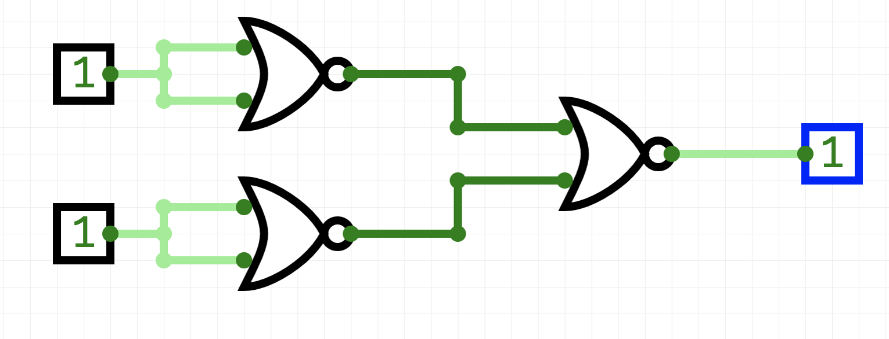
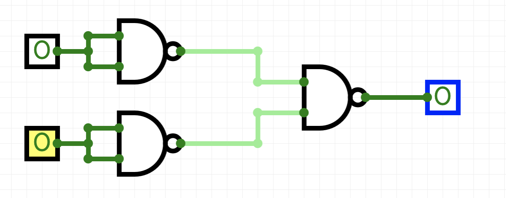
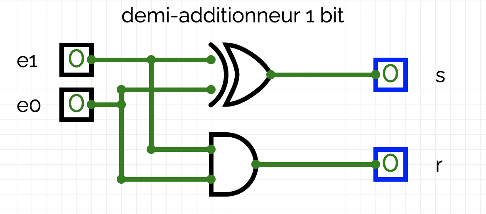
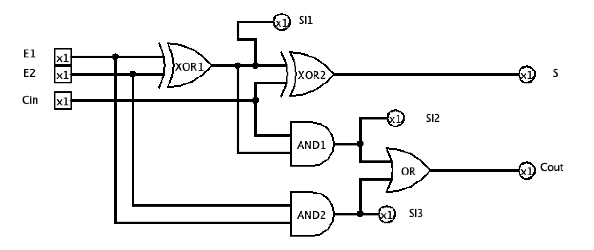
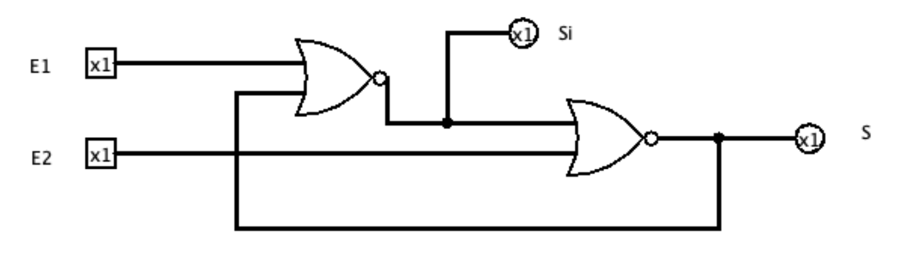

# TP

## logiciel

On utilisera le logiciel circuitverse sur le web

## Exercice 1

Écrire la table de vérité (ou encore table logique) de la porte logique représentée par le circuit ci-dessous. Quelle fonction logique correspond à cette porte logique ?

<figure markdown>
{width=400px}
</figure>

## Exercice 2

Écrire la table de vérité (ou encore table logique) de la porte logique représentée par le circuit ci-dessous. Quelle fonction logique correspond à cette porte logique ?

<figure markdown>
{width=400px}
</figure>

## Exercice 3

1. Construire un circuit représentant une porte OR uniquement avec des portes NOR.
2. Construire un circuit représentant une porte AND uniquement avec des portes NAND.

Ainsi chacune des portes, NAND ou OR permet de construire les portes NOT, OR, AND. Toute porte logique pouvant s’exprimer à l’aide de ces trois portes, les portes NAND et OR sont dites universelles

## Exercice 4

1. Effectuer les additions binaires : 0 + 0, 0 + 1, 1 + 0 et 1 + 1.
2. Un demi-additionneur binaire 1 bi|t es|t u|n circuit c|ombinatoire qui possède :

* deux entrées : deux bits d’opérande $e0$ et $e1$ ;
* deux sorties : un bit de résultat $s$ et un bit de retenue sortante $r$. La sortie $s$ prend pour valeur le bit des unités et la sortie $r$ le bit de retenue sortante, lorsqu’on additionne les deux bits d’entrée $e0$ et $e1$.

a. Recopier et compléter la table de vérité de ce circuit :

<figure markdown>

|e0 |e1   |s   | r  |
|:--:|:--:|:--:|:--:|
| 0  | 0  |    |    |
|1   |0   |    |    |
|0 |1     |    |    |
|1| 1     |    |    |

</figure>

b. Quelles sont les portes utilisées dans le schéma ci-dessous

<figure markdown>
{width=400px}
</figure>

c. Justifier qu’un demi-additionneur binaire 1 bit peut être représenté par le circuit ci-dessus.

d. Ouvrir le logiciel circuitVerse et construire un circuit combinatoire représentant un demi-additionneur binaire 1 bit.

## Exercice 5

Un additionneur peut être représenté de la manière suivante :

**1** A l’aide du circuit logique précédent, compléter le tableau suivant :

<figure markdown>
| E1 | E2 | CIN | SI1 | SI2 | SI3 | S | COUT |
|:--:|:--:|:---:|:---:|-----|-----|---|------|
| 0  | 0  | 0   |     |     |     |   |    |
| 0  | 1  | 0   |     |     |     |   |     |
| 1  | 0  | 0   |     |     |     |   |     |
| 1  | 1  | 0   |     |     |     |   |     |
| 0  | 0  | 1   |     |     |     |   |     |
| 0  | 1  | 1   |     |     |     |   |     |
| 1  | 0  | 1   |     |     |     |   |     |
| 1  | 1  | 1   |     |     |     |   |     |
</figure>

**2** Implémenter cet additionneur sur circuitVerse et vérifier votre table de vérité.

<figure markdown>

</figure>

**3** En quoi,l’additionneur et le demi-additionneur diffèrent-ils ?

## Exercice 6

On considère le circuit logique suivant.

**1** Implémenter ce circuit ;

<figure markdown>

</figure>

**2** Compléter le tableau suivant :

<figure markdown>

|E1 |E2   |SI   | S  |
|:--:|:---:|:---:|:--:|
| 0  | 0   |     |    |
|1 |0      |     |    |
|0 |1      |     |    |
|1| 1      |     |    |

</figure>

**3** Recommencer à prendre les valeurs E1 = 0 et E2 = 0. Que constater vous. Quelle peut-être l’explication ?

**4** Qu’a t-on fabriqué ?

 
Retour au site : [von Neumann](von_neumann.md)