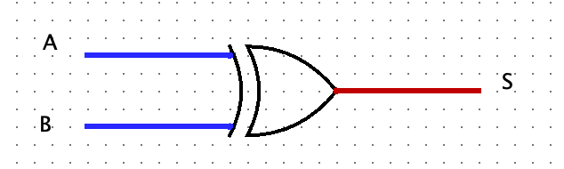

# Des portes logiques à l’ordinateur

## Les portes logiques

### Contexte

Les circuits d’un ordinateur manipulent uniquement des chiffres binaires 0 ou 1 qui sont simplement représentés par des tensions électriques (0 ou +V). On peut réaliser des opérations sur ces nombres binaires à l’aide de circuits logiques qui sont concrètement construits à partir de transistors. Ces transistors peuvent se comporter comme des interrupteurs à la manière de l’exemple suivant.

<figure markdown>
{width=200px}
</figure>

Lorsque la broche B est sous tension (+V), un courant peut s’établir entre E et la masse . Le sens du courant est indiqué par la petite flèche. Le transistor peut alors être considéré comme un interrupteur fermé.

Inversement, quand B est à 0 V, la broche E reste sous tension haute et le transistor peut être considéré comme un interrupteur ouvert.

<figure markdown>
<iframe width="560" height="315" src="https://www.youtube.com/embed/n9fb6F1MWHc?si=ADZzfyoemW9Q4MF3" title="YouTube video player" frameborder="0" allow="accelerometer; autoplay; clipboard-write; encrypted-media; gyroscope; picture-in-picture; web-share" referrerpolicy="strict-origin-when-cross-origin" allowfullscreen></iframe>
</figure>

### Porte NOT

La porte NOT implantée par un seul transistor est la plus simple de toutes les portes. Elle n’a qu’un seul bit en entrée (E) et sa sortie (S) vaut 1 quand l’entrée vaut 0 et inversement.
Elle peut la représenter comme ceci :

<figure markdown>
{width=300px}
<caption>Représentation de la porte not</caption>
</figure>

La fonction logique s'écrit $S = \overline{E}$. Nous pouvons rassembler tous les états logiques de la sortie en fonction des états logiques des entrées dans ce qui s'appelle la table de vérité. Cette dernière s'écrit de la manière suivante pour la porte NOT.

<figure markdown>
|Entrée (E) |Sortie (S)|
|:---------:|:--------:|
|0          |     1    |
|1          |     0    |

<caption>Table de vérité</caption>
</figure>

**Exemple de réalisation de porte NOT avec des transistors**

<figure markdown>
{width=500px}
</figure>

### Porte AND

Avec deux transistors, nous pouvons réaliser une porte AND. Cette porte peut se représenter comme ceci :

<figure markdown>
{width=300px}
<caption>Représentation de la porte AND</caption>
</figure>

La fonction s'écrit $S = A.B$ et la table de vérité s'écrit :

<figure markdown>
|Entrée (A)  |Entrée (B)  |Sortie (S)|
|:----------:|:----------:|:--------:|
|0           |0           |    0     |
|0           |1           |    0     |
|1           |0           |    0     |
|1           |1           |    1     |

<caption>Table de vérité</caption>
</figure>

### Porte NAND (Not AND)

<figure markdown>
{width=300px}
<caption>Représentation de la porte NAND</caption>
</figure>

La fonction s'écrit : $S = \overline{A.B}$

<figure markdown>
|Entrée (A)  |Entrée (B)  |Sortie (S)|
|:----------:|:----------:|:--------:|
|0           |0           |    1     |
|0           |1           |    1     |
|1           |0           |    1     |
|1           |1           |    0     |

<caption>Table de vérité</caption>
</figure>

**Un exemple de réalisation avec des transistors :**

<figure markdown>
{width=300px}
</figure>

### Porte OR

<figure markdown>
{width=300px}
<caption>Représentation de la porte NAND</caption>
</figure>

La fonction OR peut s'écrire : $S = A + B$

<figure markdown>
|Entrée (A)  |Entrée (B)  |Sortie (S)|
|:----------:|:----------:|:--------:|
|0           |0           |    0     |
|0           |1           |    1     |
|1           |0           |    1     |
|1           |1           |    1     |

<caption>Représentation de la porte NOR</caption>
</figure>

### Porte NOR

<figure markdown>
{width=300px}
<caption>Représentation de la porte NOR</caption>
</figure>

La fonction s'écrit $S = \overline{A + B}$.

<figure markdown>
|Entrée (A)  |Entrée (B)  |Sortie (S)|
|:----------:|:----------:|:--------:|
|0           |0           |    1     |
|0           |1           |    0     |
|1           |0           |    0     |
|1           |1           |    0     |

<caption>Table de vérité</caption>
</figure>

**Un exemple de réalisation de porte NOR avec des transistors**

<figure markdown>
{width=500px}
</figure>

### La porte XOR

<figure markdown>
{width=300px}
</figure>

<figure markdown>
|Entrée (A)  |Entrée (B)     |Sortie (S)|
|:----------:|:----------:|:--------:|
|0           |0           |    0     |
|0           |1           |    1     |
|1           |0           |    1     |
|1           |1           |    0     |

<caption> Table de vérité</figure>
</figure>

### Une application des portes logiques : les masques de sous-réseau

Dans un réseau TCP/IP, un ordinateur a une adresse IP qui l’identifie de manière unique (comme un numéro de téléphone), ainsi qu’un masque de sous-réseau.

L’adresse IP et le masque de sous-réseau sont des groupes de 4 entiers positifs, codés tous les deux sur 4 octets. Le masque identifie à quel sous réseau d’Internet il fait partie, et permet d’obtenir l’adresse IP du sous-réseau à l’aide d’une opération booléenne.

Exemple : un ordinateur a pour adresse IP 192.168.0.42 et son masque de sous-réseau est 255.255.255.0.

Pour obtenir l’adresse du sous-réseau de l’ordinateur, on effectue alors un AND entre les octets de l’adresse IP et les octets du masque. En représentation binaire, cela donne :

|IP| 11000000101010000000000000101010|
|:-|:--------------------------------|
|Masque| 11111111111111111111111100000000|
|AND|                                       |
|Adresse du sous-réseau| 11000000101010000000000000000000|

Tableau 1 – Détermination de l’adresse du sous-réseau

Sur un processeur 32 bits, le AND est une opération primitive du processeur, donc l’opération de détermination du sous-masque réseau se fait en une opération.

!!! example "Exercice 1 :"
    Cherchez l’adresse IP de votre ordinateur et le masque de sous-réseau. Sous Windows, il faut taper ipconfig et sous Linux , la commande est ifconfig. Écrire l’adresse du sous-réseau trouvé.

## Travaux pratiques sur les portes logiques

Le TP sur les portes logiques est disponible [ici](TP_logic_gates.md).

## Circuit combinatoire et circuit séquentiel

D’une manière générale, les circuits électroniques possèdent plusieurs entrées et plusieurs sorties. Quand
les sorties dépendent directement et uniquement des entrées, on parle de cicuits combinatoires. Il existe
d’autres types de circuit qui s’appellent circuits séquentiels. Les sorties de ces circuits dépendent d’un état antérieur du circuit. C’est ce type de cicuit qu’on utilise pour réaliser des mémoires (RAM, registres,etc...).

### Un exemple de circuit combinatoire logique : l’additionneur

En combinant les portes logiques, on obtient des circuits plus complexes. Par exemple en combinant 2 portes "OU EXCLUSIF", 2 portes "ET" et une porte "OU" on obtient un additionneur représenté ci-dessous

<figure markdown>
{width=400px}
</figure>

Comme son nom l’indique, l’additionneur permet d’additionner 2 bits (E1 et E2) en tenant compte de la retenue entrante ("Cin" "carry in" en anglais). En sortie on obtient le résultat de l’addition (S) et la retenue sortante ("Cout") (cf TP).

Donc nous pouvons, à partir des portes logiques de bases (NAND, NOR, XOR, etc...), nous pouvons construire des circuits logiques qui réalisent des opérations mathématiques.

### Les mémoires

On stocke l’information à l’aide de circuit dit de type "bascule". Ce circuit est une combinaison de plusieurs portes logiques.

Il n’est pas question pour nous d’étudier ce type de circuit, le schéma ci-dessus vous permet juste de vérifier qu’une fois de plus nous avons bien à faire à une combinaison de porte logique.

<figure markdown>
{width=400px}
</figure>

## Architecture de Von Neumann

### Vue globale

Les grands principes de fonctionnement des ordinateurs tels que nous les connaissons aujourd’hui reposent sur des travaux réalisés au milieu des années 1940 par une équipe de chercheurs de l’université de Pennsylvanie.

Ces travaux concernaient la conception d’un ordinateur dans lequel les programmes à exécuter étaient stockés au même endroit que les données qu’ils devaient manipuler, à savoir dans la mémoire de l’ordinateur. Cette idée d’utiliser une zone de stockage unique est toujours utilisée aujourd’hui. Cette architecture est appelée modèle de Von Neumann, en l’honneur du mathématicien et physicien John Von Neumann qui participa et qui publia en 1945 un rapport sur un ordinateur basé sur ce concept.

<figure markdown>
{width=300px}
</figure>

Ce modèle décompose l’ordinateur en 4 parties distinctes :

* l’unité arithmétique et logique (UAL ou ALU en anglais) ou unité de traitement : son rôle est d’effectuer les opérations de base ;
* l’unité de contrôle ;
* la mémoire ;
* les dispositifs d’entrée-sortie, qui permettent de communiquer avec le monde extérieur.

Les différents éléments échangent des informations à l’aide de bus.

Les deux premières parties sont habituellement rassemblées dans un ensemble de circuits électroniques qu’on appelle Unité Centrale de Traitement ou plus simplement processeur (ou CPU pour Centrale Processing Unit).

Physiquement,un système informatique est constitué de plusieurs éléments :

* Une machine, c’est-à-dire un boîtier contenant une carte mère avec un microprocesseur, des barrettes de mémoire vive, une carte graphique une carte réseau, des ports de communication et des périphériques éloignés comme un disque dur ;

* des périphériques externes comme un moniteur, un clavier, une souris, des enceintes, une imprimante, etc..

### Principaux composants du modèle de Neumann

#### Mémoires

La mémoire de l’ordinateur contient à la fois les programmes et les données. On distingue habituellement deux types de données :

* la mémoire vive ou volatile est celle qui perd son contenu dès que l’ordinateur est éteint. Les données stockées dans la mémoire vive peuvent être lues, effacées ou déplacées comme on le souhaite. Le principal avantage de cette mémoire est la rapidité d’accès aux données. On parle souvent de mémoire RAM (pour l’anglais Random Acces Memory ). Les ordinateurs actuels disposent en général de 8 ou 16 Go de RAM.
* la mémoire non-volatile est celle qui conserve ses données quand on coupe l’alimentation électrique de l’ordinateur. Il existe plusieurs types de telles mémoires. Par exemple, la ROM (pour Read-only Memory) est une mémoire non modifiable qui contient habituellement des données nécessaires au démarrage de l’ordinateur ou tout autre information dont l’ordinateur a besoin pour fonctionner. La mémoire Flash est autre exemple de mémoire non volatile. Contrairement à la ROM, cette mémoire est modifiable. Contrairement à la RAM, ces mémoires sont souvent beaucoup plus lentes.

#### L’unité arithmétique et logique UAL (ou ALU)

L’unité arithmétique et logique est le cœur de l’ordinateur. On la représente habituellement par ce schéma (en forme de V) :

<figure markdown>
{width=200px}
</figure>

* A et B sont les opérandes (les entrées) ;
* R est le résultat ;
* F est une opération binaire (opération à effectuer) ;
* D est un drapeau indiquant un résultat secondaire de la fonction (signe, erreur, etc.).
Cette unité est composée de plusieurs registres dits registres de données et d’un registre spécial, appelé accumulateur. Tous les résultats d’une instruction manipulant des registres vont être écrits dans cet accumulateur. De la même manière, toute instruction va aller manipuler le contenu de cet accumulateur. À ces deux types de registres, s’ajoutent de nombreux circuits pour réaliser des opérations logiques, arithmétiques, des comparaisons, des opérations sur les déplacements en mémoire ainsi que des opérations sur des bits.

#### Unité de contrôle

Cette unité joue le rôle de chef d’orchestre de l’ordinateur. C’est ce composant qui est chargé récupérer en mémoire la prochaine instruction à exécuter et les données sur lesquelles elle doit opérer puis les envoie à l’UAL.

<figure markdown>
{width=200px}
</figure>

#### Évolutions et limitations

Pendant des années, pour augmenter les performances des ordinateurs, les constructeurs augmentaient la fréquence d’horloge des microprocesseurs : la fréquence d’horloge d’un microprocesseur est liée à sa capacité d’exécuter un nombre plus ou moins important d’instructions machines par seconde. Plus la fréquence d’horloge du CPU est élevée, plus ce CPU est capable d’exécuter un grand nombre d’instructions machines par seconde (en fait, c’est un peu plus compliqué que cela, mais nous nous contenterons de cette explication).

<figure markdown>
{width=600px}
</figure>

Comme vous pouvez le remarquer sur le graphique ci-dessus, à partir de 2006 environ, la fréquence d’horloge a cessé d’augmenter, pourquoi ? À cause d’une contrainte physique : en effet plus on augmente la fréquence d’horloge d’un CPU, plus ce dernier chauffe. Il devenait difficile de refroidir le CPU, les constructeurs de microprocesseurs (principalement Intel et AMD) ont décidé d’arrêter la course à l’augmentation de la fréquence d’horloge, ils ont décidé d’adopter une nouvelle tactique.

On pourrait se dire que l’augmentation du nombre de coeurs entraîne obligatoirement une augmentation des performances du CPU, en fait, c’est plus que complexe que cela : pour une application qui n’aura pas été conçue pour fonctionner avec un microprocesseur multicoeur, le gain de performance sera très faible, voir même nul. En effet, la conception d’applications capables de tirer profit d’un CPU multicoeur demande la mise en place de certaines techniques de programmation (techniques de programmation qui ne seront pas abordées ici). Il faut aussi avoir conscience que les différents coeurs d’un CPU doivent se "partager" l’accès à la mémoire vive : quand un coeur travaille sur une certaine zone de la RAM, cette même zone n’est
pas accessible aux autres coeurs, ce qui, bien évidemment va brider les performances. De plus, on trouve à l’intérieur des microprocesseurs de la mémoire "ultrarapide" appelée mémoire cache (il ne faut pas confondre mémoire cache et registres). Le CPU peut stocker certaines données dans cette mémoire cache afin de pouvoir y accéder très rapidement dans le futur, en effet, l’accès à la mémoire cache est beaucoup plus rapide que l’accès à la RAM. La mémoire cache ayant un coup assez important, la quantité présente au sein d’un CPU est assez limitée, les différents coeurs vont donc devoir se partager cette mémoire cache, ce qui peut aussi provoquer des ralentissements (en faite il existe plusieurs types de mémoire cache appelés L1, L2 et L3, chaque coeur possède son propre cache L1, alors que les caches L2 et L3 sont partagés par les différents coeurs)

## Assembleur

### Introduction

Les programmes situées dans la mémoire d’un ordinateur sont constitués d’instructions de bas niveau, c’est-à-dire directement compréhensibles par le processeur. Il s’agit des instructions du langage machine.

Lorsqu’elle sont stockées en mémoire, ces instructions ne sont ni plus ni moins que de simples nombres binaires, comme les données manipulées par les programmes.
Pour progresser dans l’exécution d’un programme, l’unité de contrôle réalise de manière continue, à un rythme imposée par une horloge globale, la boucle suivante appelée cycle d’exécution d’une instruction qui est constituée de trois étapes :

* Chargement. L’unité de contrôle va récupérer l’instruction en mémoire.
* Décodage. L’instruction est décodée afin d’être exécutée. Cette étape peut nécessiter de lire d’autres
mots binaires depuis la mémoire. C’est également à cette étapes que sont chargées les données (opérandes) sur lesquelles l’opération va porter.
* Exécution. L’instruction est exécutée, soit par l’ALU s’il s’agit d’une opération arithmétique ou logique, soit par l’unité de contrôle s’il s’agit d’une opération de branchement.

Pour écrire des programmes directement en langage machine, il n’est pas raisonnable de manipuler des 0 et des 1. On utilise plutôt un autre langage appelé langage d’assemblage appelé aussi assembleur qui est le langage du plus bas niveau d’un ordinateur lisible par un humain.

Ce langage fournit un certain nombre de facilités pour programmer comme des instructions qui sont spécifiques à un processeur.

### Le simulateur

On trouve en ligne le simulateur : [http://www.peterhigginson.co.uk/AQA/](https://www.peterhigginson.co.uk/AQA/?F5=27-Jan-25_22:39:50).

**Remarque :** ne pas l’ouvrir avec Firefox car dans ce navigateur, les instructions ne s’affichent pas correctement dans la RAM.

Il se décompose ainsi :

* Une mémoire vive (à droite) dont chaque case mémoire (cellule) comporte 32 bits . Chaque cellule de
la mémoire possède une adresse (de 000 à 199), ces adresses sont codées en base 10 ;

<figure markdown>
{width=700px}
</figure>

Remarque : vous pouvez vous en assurer en cliquant sur OPTION puis binary.

* Un éditeur (à gauche) pour taper le programme en assembleur ;
* Le processeur (au centre) constitué principalement de l’Unité de Contrôle, de l’Unité Arithmétique et Logique et des registres de R0 à R12 plus un compteur de programme (PC pour Program counter) qui contient en permanence l’adresse de la prochaine instruction à exécuter.

### Les instructions

Pour le processeur précédent, le jeu d’instruction AQA est le suivant :

* LDR Rd, `<adresse mémoire> `: charge la valeur enregistrée dans l’`<adresse mémoire >` dans le registe d ;
* STR Rd,` <adresse mémoire>` : enregistre la valeur du registre d dans la mémoire spécifiée par `<adresse mémoire >`;
* ADD Rd, Rn, `<operand2>` : ajoute la valeur spécifiée par `<operand2>` à la valeur du registre n et enregistre le résultat dans le registre d
* SUB Rd, Rn, `<operand2>` : soustrait la valeur de `<operand2>` à la valeur du registre n et enregistre le résultat dans le registre d
* MOV Rd, `<operand2>` : copie la valeur `<operand2>` dans le registre d
* CMP Rn, `<operand2>` : compare la valeur de registre n avec la valeur de `<operand2>`
* B `<label> `: Branchement inconditionnel jusqu’à la positon `<label>` dans le programme.
* B`<condition>` `<label>` : branchement conditionnel vers la position `<label>` dans le programme si la dernière comparaison rempli le critère spécifié par `<condition>`. Les valeurs possibles sont : EQ :égal à ; NE : n’est pas égal à ; GT :Plus grand que ; LT : Moins grand que.
* AND Rd, Rn, `<operand2>` : effectue l’opération bit à bit logique AND (ET) entre la valeur du registre n et la valeur `<operand2>` et enregistre le résultat dans le registre d.
* ORR Rd, Rn, `<operand2>` : effectue l’opération bit à bit logique OR (OU) entre la valeur du
registre n et la valeur `<operand2> `et enregistre le résultat dans le registre d.
* EOR Rd, Rn, `<operand2>` : effectue l’opération bit à bit logique XOR(OU exclusif) entre la valeur du registre n et la valeur `<operand2> `et enregistre le résultat dans le registre d.
* MVN Rd, `<operand2> `: effectue l’opération bit à bit logique NOT (NON) sur la valeur `<operand2>` et enregistre le résultat dans le registre d.
* LSL Rd, Rn, `<operand2>` : décale de `<operand2>` bit(s) vers la gauche la valeur du registre n et enregistre le résultat dans le registre d
* LSR Rd, Rn, <`operand2>` : décale de <`operand2>` bit(s) vers la droite la valeur du registre n et enregistre le résultat dans le registre d
* HALT : arrête l’exécution du programme.
`<operand2>` peut être #n (c’est à dire un nombre, exemple #42) ou bien Rm (c’est à dire le registre m, par exemple R1 est le registre numéro 1)

Les registres vont de R0 à R12.

Compléments data, INP et OUT :

* la pseudo instruction DAT vous permet de mettre un nombre dans la mémoire en utilisant l’assembleur.
* Un label peut aussi être pris comme donnée. 
* INP Rd,2 lis un nombre dans le registre d. 
* OUT Rd,4 retourne en sortie le nombre du registre d Pour OUT, vous pouvez retourner des nombres signés (paramètre 4), des nombres non signés (paramètre 5), des hexadécimaux (paramètre 6) ou des charactères (paramètre 7). Vous pouvez entrer des hexa comme 0xnnn partout où un nombre est attendu

### Exemples et exercices

#### Exemple 1

``` asm linenums="1"
MOV R0,#42
STR R0,150
HALT
```

Interprétation :

* On place dans le registre R0 du processeur la valeur 42 ;
* On place le contenu du registre R0 (à savoir 42) dans la mémoire vive à la place 150 ;
* On stoppe le programme

Taper ce programme dans l’éditeur du simulateur, et le faire fonctionner. Observer.

#### Exercices

``` asm linenums="1"
// Programme de l’exercice 3
MOV R0,#42
MOV R1,#45
ADD R0,R0,R1
OUT R0,4
HALT
```

!!! example "Exercice 3 :"
    À l’aide des instructions décrites dans le chapitre précédent, dites ce que fait ce programme ligne par ligne, puis l’exécuter. Vérifier ce que vous aviez trouvé.

!!! example "Exercice 4 :" 
    Écrire un programme qui effectue une soustraction entre 95 et 52, l’enregistre en mémoire (à la place 143) et qui affiche le résultat dans la console Output. Le taper et l’exécuter.

#### Exemple 2

Cet exemple s’affiche quand on clique sur SELECT puis max dans le simulateur.

``` asm linenums="1"
INP R0,2
INP R1,2
CMP R1,R0
BGT HIGHER
OUT R0,4
B DONE
HIGHER:
OUT R1,4
DONE:
HALT
// Input two numbers and output the higher
```

Interprétation :

* On place deux nombres dans les registres R0 et R1 grâce à la fonction INP ;
* On compare le contenu du registre R1 au contenu du registre R0 ;
* Si le contenu de R1 est plus grand que celui de R0, on effectue un branchement jusqu’au label HIGHER et on affiche le contenu de R1 ;
* Sinon, on affiche le contenu de R0 ;
* On effectue le branchement conditionnel vers done qui stoppe le programme.
  
!!! example "Exercice 5 :"
    Réaliser un programme qui prend deux nombres et qui retourne le plus petit.

!!! example "Exercice 6 :"
    Traduire le programme python ci-dessous en assembleur.

    ``` py linenums="1"
    x=0    
    while x<3:
        x=x+1
    print(x)
    ```

!!! example "Exercice 7"
    Traduire le programme python ci-dessous en assembleur.

    ```py linenums="1"
    for i in range(4):
        print(5)
    ```


## Ressources

<figure markdown>
<iframe width="560" height="315" src="https://www.youtube.com/embed/c9pL_3tTW2c?si=VnWHW4xbtuyX6r66" title="YouTube video player" frameborder="0" allow="accelerometer; autoplay; clipboard-write; encrypted-media; gyroscope; picture-in-picture; web-share" referrerpolicy="strict-origin-when-cross-origin" allowfullscreen></iframe>
</figure>