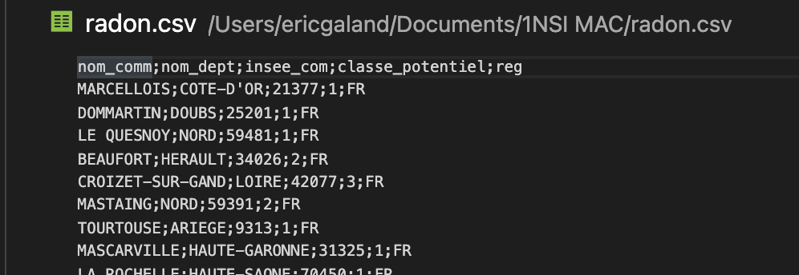
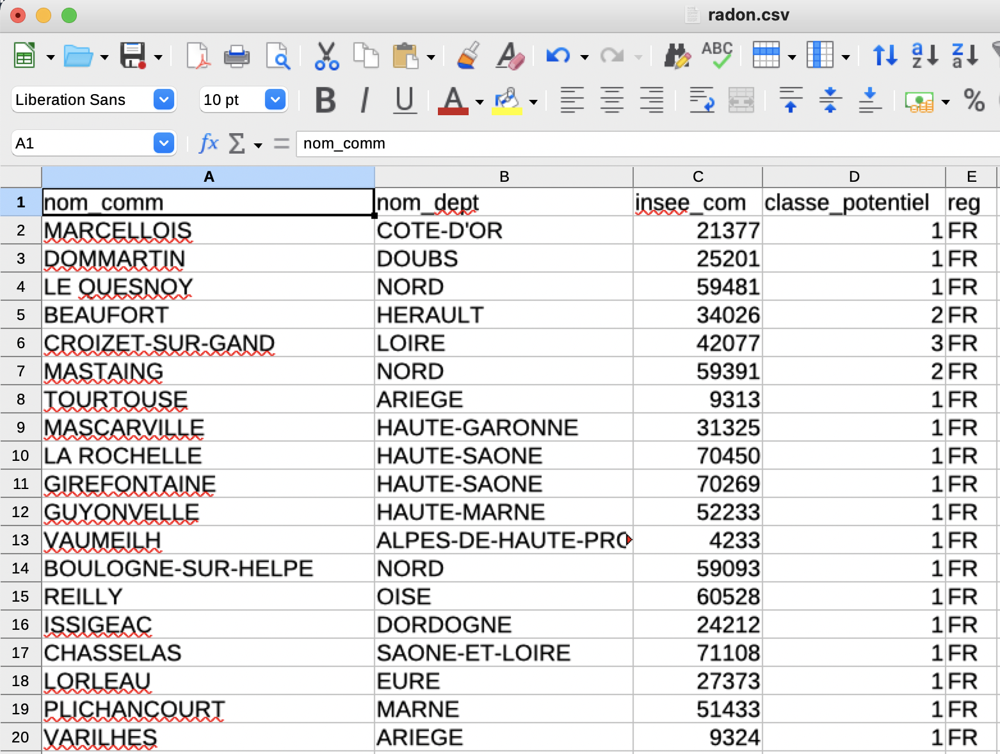

# Traitement des données en table avec Python

## Introduction

L'organisation tabulaires de données (sous forme de tableaux) est très répandue et très ancienne : les tables les plus anciennes sont des tables de comptes de l'Égypte ancienne. 

Aujourd'hui, les données informatiques de plus en plus nombreuses et importantes doivent pouvoir être stockées, gérées, partagées et modifiables à distance. Les recherches sur des systèmes offrant ces possibilités datent du début des années 1960 avec les missions Apollo. Avec l'introduction du modèle relationnel introduit dans les années 1970 par Edgar Franck Codd (employé d'IBM qui travaillait sur un SGBD (Système de Gestion de Base de Données) utilisant le langage SQL (Structured Query Language), les tables de données, stockées dans des bases de données deviennent rapidement le principal moyen de stocker de l'information structurée.

## Les données structurées au format CSV

### Open data

Les données ouvertes ou open data sont des données numériques dont l'accès et l'usage sont laissés libres aux usagers. Elles peuvent être d'origine publique ou privée, produites notamment par une collectivité, un service public, un collectif citoyen ou une entreprise.

Le gouvernement met en ligne des Open data sur le site [data.gouv.fr](https://www.data.gouv.fr/fr/).

Dans ce [fichier](data_donnee_table/radon.csv),  les données au format CSV de l'IRSN (Institut de Radioprotection et de Sureté Nucléaire) concernant les émanations de radon, gaz radioactif produit par la désintégration naturelle de l’uranium présent dans les roches. Cancérigène, il peut présenter un risque pour la santé lorsqu’il s’accumule dans les bâtiments. Le fichier classe le potentiel radon des communes du territoire métropolitain en 3 catégories, numérotée de 1 à 3, par risque croissant.

### Format csv

Le format csv (Comma-separated values) est très répandu sur internet : c'est un format informatique ouvert représentant des données tabulaires sous forme de valeurs séparées par des virgules.

Un fichier csv est un fichier texte, par opposition aux formats dits « binaires ». Chaque ligne du texte correspond à une ligne du tableau et les virgules correspondent aux séparations entre les colonnes. Les portions de texte séparées par une virgule correspondent ainsi aux contenus des cellules du tableau.

Ouvrir le fichier csv avec le bloc-note ou VSCode.

<figure markdown>
{width=450px}
</figure>

La 1ère ligne contient la liste des champs (les noms des colonnes) :
"nom\_comm","nom-dept", "insee\_com" ,"classe\_potentiel" et "reg" sont appelés des descripteurs.
"MARCELLOIS", "COTE D'OR", "25377", "1" et "FR" sont les valeurs du descripteur.

Vous constatez qu'ici le séparateur n'est pas la virgule mais le point-virgule (;). La virgule est effectivement un standard
pour les données anglo-saxonnes, mais pas pour les données aux normes françaises (où la virgule est déjà utilisée pour
séparer les chiffres décimaux). Cela peut engendrer quelques problèmes, il faut donc rester vigilants sur le type de séparateur utilisé.

Ouvrir maintenant le fichier avec le tableur "Calc" (libre Office) ou "Excel" (Windows) et vérifier que les données y sont bien rangées sous forme tabulaire :

<figure markdown>
{width=450px}
</figure>

## Importation des données

L'objectif est d'extraire les données puis de les enregistrer dans une liste de listes ou éventuellement dans une liste de tuples (p-uplets), c’est-à-dire dans une table.

!!! example "Exercice 1"
    Télécharger `radon.csv` puis exécuter le code `extraction csv` sous Spyder.
    
    1. Que font les fonctions `readlines()` et `readline()`? 
    2. Que fait la méthode `rstrip()` ?
    3. Que fait la méthode `split()`?

``` py linenums="1" title="extraction csv"
fichier = open("radon.csv","r")

descripteurs = fichier.readline()
liste_descripteurs=descripteurs.rstrip().split(";")

valeurs = fichier.readlines()

fichier.close()
```

!!! example "Exercice 2"
    1. Que fait le code `radon.py` suivant ?
    2. Que représente la variable `i` dans la boucle `for i in valeur' ?
    3. Commenter chacune des lignes du programme. 

``` py linenums="1" title="radon.py"
fichier = open("radon.csv","r")

descripteurs = fichier.readline()
liste_descripteurs=descripteurs.rstrip().split(";")

valeurs = fichier.readlines()
table = []

for i in valeurs:
     liste = i.rstrip().split(";")
     liste[3] = int(liste[3])
     table.append(liste)
fichier.close()
```

## Recherche dans une table

La  recherche  dans  une  table  consiste  à  obtenir  les  valeurs  de  certains  descripteurs  (champs)  avec  éventuellement  des critères les concernant.

!!! exemple "Exercice 3"

    A partir du fichier radon.csv, extraire les informations suivantes :

    * Liste des communes de France présentant un potentiel radon de 3. La liste nommée `recherche1` comportera tous les champs du fichier csv.
    * Liste  des  communes  de l'Aude  présentant  un  potentiel  radon de 2 et  dont  le  nom  commence  par  "A".  La liste nommée `recherche2` comportera uniquement le champ correspondant au nom de la commune. 
    * Liste des communes de métropole à risque faible ou moyen (présentant un potentiel radon de 1 ou 2). La liste nommée `recherche3` sera une liste de tuples comprenant respectivement le nom du département, de la commune et du potentiel radon.
    * Liste des départements de France dont au moins 1 des communes présente un potentiel radon de 2 ou 3. La liste nommée `recheche4` sera une liste de tuples comprenant le nom du département et le potentiel radon.
  
Remarque : la méthode index("nomDescripteur") retourne l'indice du descripteur dans la table. Par exemple :

```py
index_com = list_descripteur.index("nom_comm")
```

!!! example "Exercice 4"
     Parmi les listes précédentes, y-en-a-t-il qui présentent des doublons. Si oui, lesquelles ? Écrire une fonction nommée `sansDoublon(list)`, qui prendra en argument une liste et retournera une nouvelle liste sans doublon. Appliquer cette fonction aux listes concernées par les problèmes de doublons.

## Tri d'une table suivant une colonne

Le tri dans une table consiste à modifier l’ordre des données pour qu'elles soient présentées dans un ordre croissant ou décroissant selon le choix d’un ou plusieurs critères.

!!! example "Exercice 5"
     Nous avons établi précédemment une liste des communes à risque faible ou moyen nommée `recherche3` (liste de tuples comprenant le nom du département, de la communeet le potentiel radon).
     Trier la liste `recherche3` par ordre alphabétique croissant des communes. Pour effectuer un tri, il est possible de programmer nous même une fonction de tri. Il est aussi possible d'utiliser la fonction `sorted()`
     ```

## Fusion de deux tables

On peut distinguer 2 situations:

* La concaténation: on ajoute les enregistrements (c’est-à-dire les lignes de la table) de la table2 dans la table1
* La jointure : on ajoute des champs(c'est-à-dire les colonnes de la table) de la table 2 dans la table 1.

**Remarque :** Il faut bien évidement faire attention à ce que les données soient compatibles entres elles.

### Concaténation

Si les 2 tables possèdent exactement les mêmes descripteurs (nom de la colonne), dans le même ordre, et que les valeurs sont de même type, la fusion est facile car il suffit de concaténer les 2 tables c'est-à-dire ajouter les enregistrements (lignes) de la tables 2 sous les enregistrements de la tables 1. Il peut être nécessaire de supprimer ensuite d'éventuels doublons. On peut aussi rajouter les éléments de la table 2 à la table 1, un par un, en vérifiant systématiquement qu'ils ne sont pas déjà présents dans la table 1. 

S'il manque un champ à une table, il suffit de le créer dans la table en insérant les valeurs `None` dans le champ. On peut également décider de ne pas prendre les champs qui n'existent pas dans les 2  tables (s'ils ne sont pas utiles). Dans ce cas il faut les supprimer avant de concaténer.

!!! example "Exercice 6"
    * Établir la liste des communes de France à risque moyen (présentant un potentiel radon de 2). La liste nommée `recherche5` comportera tous les champs du fichier csv.
    * Fusionner cette liste avec la liste `recherche1` des communes de France à risque fort (présentant un potentiel radon de 3) afin de générer une liste des communes de France à risque (moyen ou fort) nommée `recherche6`.

### Jointure

!!! example "Exercice 7"
    * Établir une liste de tuples nommée `recherche7` de toutes les communes de Métropole comprenant respectivement le nom de la commune, le nom du département et le numéro d'insee.
    * Établir une jointure avec la liste `recherche3` de toutes les communes de métropole à risque faible ou moyen afin d'obtenir une liste de tuples nommée recherche8 comprenant le nom du département, de la commune, le numéro d'insee et le potentiel radon. Cette liste ne sera plus sous la forme d'une liste de tuples mais d'une liste de listes.

**Remarque :** Vérifier bien que votre liste `recherche8` ne comporte pas plus d'éléments que la liste recherche3 ! Si c'est le cas, est-ce possible ? Quelle est la cause de ce problème ? y remédier. 

## Exportation des données de la table traitée au format csv

Afin d'exporter le fichier au format csv, il faut convertir toutes les valeurs qui ne sont pas déjà au format str.

!!! example "Exercice 8"
     Écrire le script python permettant cette conversion (2 lignes de code devraient suffire).

Le code suivant permet ensuite l'exportation des données de la table recherche8 dans le fichier csv nommé `fichierE.csv` :

``` py linenums="1"
descripteurs = ["com","dep","insee","potRadon"] #liste des descripteurs
fichierE = open("fichierE.csv","w") #ouverture du fichier en écriture
liste_descripteurs = ";".join(descripteurs)+"\n" # création de la chaine de caractère 
#des descripteurs sépararés par des ";"
fichierE.write(listeDescripteurs) #écriture dans le fichier
for i in recherche8 :
    valeurs = ";".join(i) + "\n" #création de la chaine de caractère d'une ligne de valeurs
#séparées par ";"    
    fichierE.write(valeurs) #écriture dans le fichier
fichierE.close()   #fermeture du fichier
```
