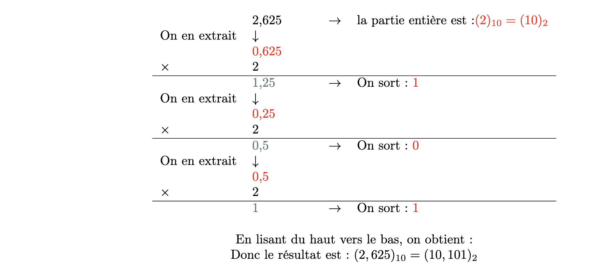

# Représentation et codage des entiers relatifs et des nombres réels

## Les additions en binaire

**Rappel (en décimal) :**

$$
\begin{align} 
& 21\\ 
+& 19 \\ \hline
=    &46  
\end{align}
$$

Dans cet exemple, étant donné que $7 + 9 = 16$ et que 16 > 9 (le plus grand chiffre associé à la base 10), nouus positionnons 6 en dessous du 9 et nous reportons une unité au_dessus du 2. Ensuite, nous additionnons les dizaines c'est-à-dire 2 + 1 + 1(la retenue) = 4.

**En binaire :** il faut reproduire exactement le même protocole :

$$
\begin{align}
 & 010101 \\
+ & 111111 \\ \hline
= & 1010100
\end{align}
$$

**Méthode :**

* 1 + 1 = 2 > 1 (le plus grand des chiffres associés à la base 2) : on pose 0 et on retient 1
* 1 + 0 + 1 = 2 : on pose 0 et on retient 1
* 1 + 1 + 1 = 3 : on pose 1 et on retient 1
* Et ainsi de suite…

!!! example "Exercice 1"
    Effectuer les calculs suivants.

$$\begin{align}
  & 1011\\
+ & 0110 \\ \hline
= & ...................
\end{align}$$

$$
\begin{align}
  & 0111\\
+ & 1110\\ \hline
= & ..................  
\end{align}
$$

$$
\begin{align}
  & 11010101\\
+ & 00000001\\ \hline
= & ..................  
\end{align}
$$

$$
\begin{align}
  & 11010100\\
+ & 11111111\\ \hline
= & ..................
\end{align}
$$

## Représentation des entiers relatifs

### Contexte

Pour coder un entier relatif, il est nécessaire de coder les informations tout en respectant les propriétés mathématiques des entiers signés. Pour cela, il faut :

* S'assurer que : -(-a) = a
* S'assurer que : a + (-a) = 0

### En binaire : codage en complément à 2

On impose le codage sur un certain nombre de bit, par exemple de 8 bits.

L'opposé d’un nombre est obtenu en 2 étapes :

* Première étape : inverser tous les bits du nombre
* Deuxième étape : ajouter 1 au résultat. On obtient alors l'opposé du nombre.

**Exemple :** prenons le cas de $+43$, nous savons que $(+43)_{10} = (00101011)_2$.

* On inverse tous les bits du nombre et l'on obtient : $(11010100)_2$
* On ajoute 1  

$$
\begin{align}
 & 11010100 \\
+ & 00000001 \\ \hline
= & 11010101  
\end{align}
$$

!!! example "Exercice 2"
    Vérifier qu’en binaire :

    * $(-43) + (43) = 0$
    * $-(-43)=43$.

!!! example "Exercice 3"
    Convertir $(-7)_{10}$ en binaire, ainsi que $(-35)_{10}$.

## Représentation et codage des nombres réels

### De la base 2 vers la base 10

**Rappel :**

Pour un nombre entier : $(108)_{10} = 1 × 10^2 + 0 × 10^1 + 8 × 10^0$

De même, pour un nombre réel :

$(108,893)_{10} = 1 × 10^2 + 0 × 10^1 + 8 × 10^0 + 8 × 10^{-1} + 9 × 10^{-2} + 3 × 10^{-3}$

Pour passer un réel de la base 2 vers la base 10 :

$(10,1011)_2 = 1 × 2^1 + 0 × 2^0 + 1 × 2^{-1} + 0 × 2^{-2} + 1 × 2^{-3} + 1 × 2^{-4}$

$(10,1011)_2 = 1 × 2 + 0 × 1 + 1 × 0.5 + 0 × 0.25 × 1 × 0.125 + 1 × 0.0625$

$(10,1011)_2 = (2,6875)_{10}$

!!! example "Exercice 4"
    Traduire $(11,101)_2$ de la base 2 vers la base 10 

!!! example "Exercice 5"
    Traduire $(4B,8)_{16}$ de la base 16 vers la base 10

### De la base 10 vers la base 2

**Méthode :**
Pour la partie entière, on utilise la méthode des divisions successives vue précédemment. Pour la partie fractionnaire, on utilise la méthode des multiplications successives.

**Exemple :**

<figure markdown>

</figure>

!!! example "Exercice 6"
    Traduire en binaire :
    
    * $(8,3125)_{10}$
    * $(0,546875)_{10}$
    * $(2,921875)_{10}$.
  
!!! example "Exercice 7"
    Problème : traduire en binaire $(0, 4)_{10}$.

### Codage en virgule flottante

!!! success "Représentation normalisée"
    Tout nombre binaire ($N$) peut se représenter comme ceci :

    $$N = 1, mantisse \times 2^{e}$$

    avec e l'exposant du nombre $N$ 

**Exemple :** $(1011, 101)_2 = 1,0011101 \times 2^3$ et $(0, 0101)2 = 1, 01 \times 2^{−2}$

!!! success "Codage"
    Chaque nombre peut se coder de la manière suivante :

    
 Partie signe (ps)  + Partie exposant (pe) + Partie mantisse (pm)

 
    Partie signe : On utilise la convention 0 pour les nombres positifs et le 1 pour les nombres négatifs. Donc nous n'avons besoin que d'un seul bit pour stocker ce signe.

    Partie mantisse : 
    À une exception près, tous les nombres ont une représentation normalisée sous la forme : $1, mantisse \times 2 ^{exposant}$
    Par conséquent, il n’est pas nécessaire de stocker le 1 situé à gauche de la virgule. On économise ainsi un précieux bit pouvant être utilisé à meilleur escient.

    Partie exposant Pour stocker l’exposant de la représentation normalisée du nombre, il faut stocker la valeur absolue de l’exposant ainsi que son signe. Pour cela, on applique un décalage à l’exposant trouvé et on stocke cette valeur décalée. La valeur du décalage dépend du nombre $n$ de bits utilisés pour cette partie.

    Soit $d$ ce décalage :

    $$ d = 2^{n-1} - 1$$

    De plus, il faudra stocker dans cette partie également l'exposant $e$. 

    Donc, la partie exposant $pe$ peut s'écrire ainsi comme la somme de l'exposant et du décalage en binaire :

    $$pe = d + exposant$$

Exemple : pour une partie exposant stockée sur 5 bits :

$1011, 101101 = 1, 011101101 \times 2^3$. Le décalage vaut $d = 2{5−1} − 1 = 15$, l’exposant vaut $e = +3$ donc la valeur stockée sur ces 5 bits vaut $15 + 3 = 18$. Il ne reste plus qu'à traduire ce nombre en binaire.

**Remarque :** comme indiqué ci-dessus, il existe une exception : 0 (zéro). Pour cette valeur, il sera nécessaire d’utiliser une combinaison binaire spéciale.

!!! quote "Exemple 1"
    coder 2007 sur 12 bits repartis de la manière suivante :

    * 1 bit pour le signe ;
    * 5 bits pour la partie exposant ;
    * 6 bits pour la partie mantisse.

    **étape 1 :** convertir le nombre en binaire :
    $$ (2007)_{10} = (11111010111)_2 $$

    **étape 2 :** on cherche l'écriture normalisée :
    $$ (11111010111)_2 = (1,1111010111 \times 2^{10})_2$$
    Donc l'exposant $e$ vaut 10.

    **étape 3 :**  on code

    - Partie signe   : 0  car positif
    - Partie mantisse  : 111101
    - Partie exposant : le décalage vaut $d = 2 ^ {5-1} - 1 = 15$ car on a 5 bits pour coder la partie exposant.  Donc la partie exposant vaut :

    $$pe = d + e = 15 + 10 = (25)_{10} = (11001)_2$$ 

    **Conclusion** le codage en virgule flottante de 2007 est :  0  11001111101

!!! quote "Exemple 2"
    coder $(−0,28125)_{10}$ sur 12 bits repartis de
    la même manière que dans l’exemple 1.

    **étape 1 :** convertir le nombre en binaire :
    $$ (−0, 28125)_{10} = (−0,01001)_2$$

    **étape 2 :** on cherche l'écriture normalisée :
    $$ (-0,01001)_2)_2 = (-1,001 \times 2^{-2})2$$
    Donc l'exposant $e$ vaut -2.

    **étape 3 :**  on code

    - Partie signe   : 1  car négatif
    - Partie mantisse  : 001000
    - Partie exposant : le décalage vaut $d = 2 ^ {5-1} - 1 = 15$ car on a 5 bits pour coder la partie exposant.  Donc la partie exposant vaut :

    $$pe = d + e = 15 + (-2) = (13)_{10} = (01101)_2$$ 

    **Conclusion** le codage en virgule flottante de 2007 est :  1  10110101101

!!! example "Exercices 8"
    **1.** Donner la représentation en virgule flottante de (0, 9375)10 sur 11 bits repartis de la manière suivante :
  
    - 1 bit pour le signe ;
    - 4 bits pour la partie exposant ;
    - 6 bits pour la partie mantisse.

    **2** Donner la représentation en virgule flottante de (−3, 625)10 sur 10 bits repartis de la manière suivante :

    - 1 bit pour le signe ;
    - 3 bits pour la partie exposant ;
    - 6 bits pour la partie mantisse.

### Norme IEEE 754

Cette norme définit deux types de nombres en virgule flottante : simple précision (32 bits) et double précision (64 bits).

**Simple précision**

* taille totale : signe(1 bit) + partie exposant(8 bits) + mantisse(23) = 32 bits

* exposant sur 8 bits =› décalage = $2^{8-1}-1 = 127$

* Dans de nombreux langages de programmation (C, C++, Java...) le type de donnée associé est nommé float 

**Double précision**

* taille totale : signe(1 bit)+partie exposant(11 bits)+mantisse52) =  64 bits

* exposant sur 11 bits =› décalage = $2^{11-1}-1 = 1023$

* Dans de nombreux langages de programmation (C, C++, Java...) le type de donnée associé est nommé double 

**Valeurs particulières**

La norme IEEE 754 réserve les exposants 000...000 (uniquement des 0) et 111...111 (uniquement des 1) pour coder des valeurs particulières

<figure markdown>
| Exposant  | Mantisse            | Valeur représentée                                                  |
|-----------|---------------------|---------------------------------------------------------------------|
| 000...000 | 000...000           | 0 (zéro)                                                            |
| 000...000 | 000.001 à 111...111 | nombre dénormalisé $valeur= \pm 0,mantisse\times 2^{-126 ou -1022}$ |
| 111...111 | 000...000           | $\pm \infty$                                                        |
| 111...111 | 000.001 à 111...111 | NaN                                                                 |
</figure>

!!! example "Exercices 9"
	* Soit le nombre flottant au format simple précision : 00111101110011001100110011001100. Trouvez la représentation en base 10 de ce nombre.
	* Déterminez la représentation au format simple précision d'un tiers (1/3) en binaire et en hexadécimal.  
\end{enumerate}