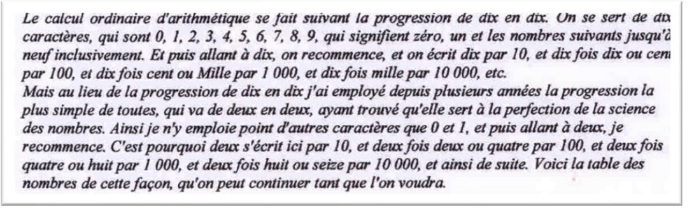
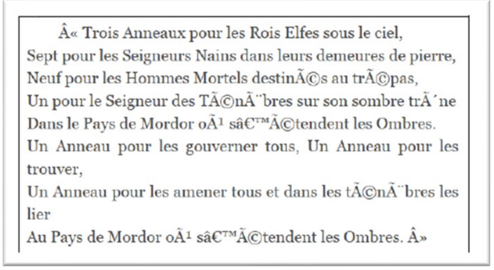
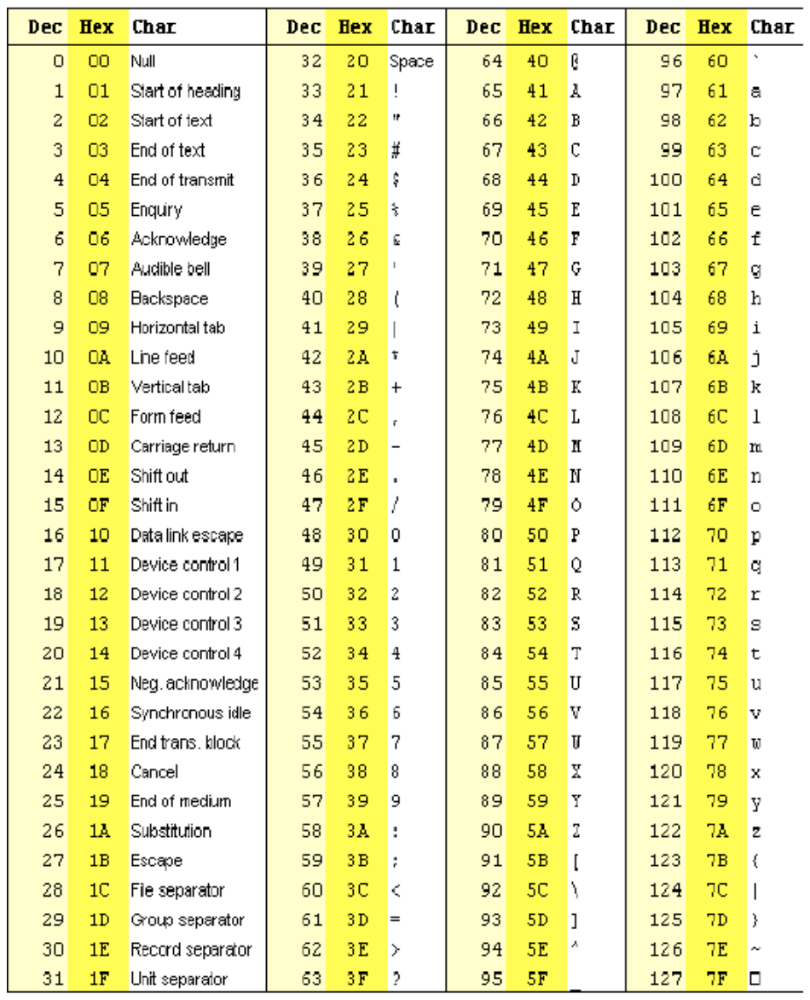
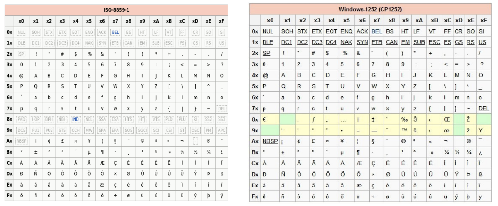

# Représentation des entiers

## Représentation binaire de l'information

### Les bases de calcul

!!! example "Exercice 1"
    Reproduire et compléter le tableau ci-dessous :

    <figure markdown>

    | Base | Système | Utilisation|
    |:----:|:-------:|:----------:|
    |2     |         |            |
    |8     |         |            |
    |10    |         |            |
    |12    |         |            | 
    |16    |         |            |
    |20    |         |            |
    |60    |         |            |  
    </figure>

### Pourquoi le bit est-il l’unité de base du codage des informations dans les systèmes informatiques ?

Il est simple de représenter deux états physiques grâce à :

* La lumière (exemple : la fibre) ;
* La tension (exemple : le processeur en 0 ou 5V ou en 3,5V) ;
* Le champ magnétique (exemple : le disque dur).

### Unité élémentaire

L’unité élémentaire utilisée en informatique pour coder l’information est appelée bit, contraction de *Binary digit*.

!!! example "Exercice 2"
    Application au codage d’une couleur : Supposons que l’on souhaite coder des couleurs en binaire :

    1. Combien de couleurs peut-on coder sur un bit ? 
    2. Si l’on souhaite coder davantage de couleurs, il va falloir utiliser une séquence de plusieurs bits appelée mot binaire (ou nombre binaire). Quelles sont les deux manières de nommer un mot de 8 bits. 
    3. Combien de couleurs peuvent coder des mots de 2 bits, 3 bits ... n bits, 1 octet ? 

## Principe de la numération binaire et hexadécimal

### Principe de la représentation d’un nombre en binaire

Le texte de Leibnitz (en figure 1) datant du début du XVIII siècle nous explique le principe de la numération en binaire (base 2) :

<figure markdown>

</figure>

!!! example "Exercice 3"
    A partir de ce texte, recopier et compléter le tableau suivant (ne pas tenir compte de la dernière colonne pour l’instant) :

    <figure markdown>

    |Décimal|Binaire (4 bits)| Hexadécimal|
    |:----:|:-------:|:----------:|
    |0     |         |            |
    |1     |         |            |
    |2    |         |            |
    |3    |         |            | 
    |4    |         |            |
    |5    |         |            |
    |6    |         |            | 
    |7     |         |            |
    |8     |         |            |
    |9    |         |            |
    |10    |         |            | 
    |11   |         |            |
    |12   |         |            |
    |13   |         |            | 
    |14     |         |            |
    |15    |         |            |
    |16   |         |            |
   
    </figure>

### Conversion décimal vers binaire
Pour effectuer cette conversion, on effectue une suite de divisions euclidiennes par 2 jusqu'à obtenir un quotient nul. Il suffit ensuite de lister les restes des diverses divisions en commençant par la dernière effectuée.

Exemple :

$$
\begin{array}{r|l}
14 & 2 \\
\hline
0 &  \begin{array}{r|l}
7 & 2 \\
\hline
1 & \begin{array}{r|l}
3 & 2 \\
\hline
1 &\begin{array}{r|l}
1 & 2 \\
\hline
1 & 0
\end{array}
\end{array}
\end{array}
\end{array}
$$

$(14)_{10} = (1110)_2$

!!! example "Exercice 4"

    1. Convertir $(4)_{10}$ en base 2 ;
    2. Convertir $(35)_{10}$ en base 2 ;
    3. Convertir $(255)_{10}$ en base 2.

### Vers le décimal à partir des autres bases

Pour convertir un nombre $N$ d’une base $b$ dans la base $10$, on décompose ce nombre dans l’ordre des puissances décroissantes de la base. Le nombre $N$ s’écrit de façon unique sous la forme :

$$
N = a_n\times b^{n} + ....+ a_2\times b_2 + a_1\times b_1 + a_0 \times b_0\ avec 
	\begin{cases}
	 n  : \text{ un entier naturel ;}  \\
	 b : \text{la base de numération ;}\\
	 a_i : \text{les chiffres associés à  }\\ \text{la base tels que } 0 \le a_i < b.
	\end{cases}
$$

Exemple : $(1101)_2 = 1 \times 2^3 + 1 \times 2^2 + 0 \times 2^1 + 1 \times 2^0 = 1 \times 8 + 1 \times 4 + 0 \times 2 + 1 \times 1$
            $(1101)_2 = 13$

!!! example "Exercice 5"

    1. Convertir $(1111)_2$ en base 10 ;
    2. Convertir $(10110)_2$ en base 10 ;

**Remarque :** afin d'effectuer des conversions binaires vers décimal ou décimal vers binaire, il est également possible d'utiliser le tableau ci-dessous : 

<figure markdown>
|  1 octet  |           |          |          |          |         |         |         |         |
|:---------:|:---------:|:--------:|:--------:|:--------:|:-------:|:-------:|:-------:|:-------:|
| $2^8=256$ | $2^7=128$ | $2^6=64$ | $2^5=32$ | $2^4=16$ | $2^3=8$ | $2^2=4$ | $2^1=2$ | $2^0=1$ |
|           |           |          |          |          |         |         |         |         |
|           |           |          |          |          |         |         |         |         |
|           |           |          |          |          |         |         |         |         |
|           |           |          |          |          |         |         |         |         |
</figure>

!!! example "Exercice 6"
    Coder en utilisant le tableau $(1010100)_2$ en décimal

### L'hexadécimal au secours de la manipulation des nombres binaires

La manipulation de nombres binaire est très laborieuse. Pour cette raison, les informaticiens travaillent en hexadécimal (base 16). Dans cette base, 16 caractères sont nécessaires : 0, 1, 2, 3…9, A, B, C,..., F.

!!! example " Exercice 7"
    Compléter le tableau du paragraphe précédent.

!!! example " Exercice 8"
    Sur combien de bits peut-on coder un chiffre hexadécimal ?

Afin de convertir un nombre binaire en nombre hexadécimal, il suffit de "découper" ce nombre en paquets de 4 bits en partant du bit de poids faible (bit le plus à droite), puis d'attribuer le chiffre hexadécimal correspondant à chaque paquet de 4 bits. La conversion hexadécimale vers binaire est intuitive et encore plus simple.

!!! example " Exercice 9"
    1. Coder $(11111111)_2$, $(1000101)_2$ et ($1110100011)_2$ en hexadécimal
    2. Coder $(12)_{16}$ et $(1AF)_{16}$ en binaire.

## Application au codage de la couleur

Nous allons étudier le codage de la couleur d’un pixel à l’aide de Gimp.

!!! example "Exercice 10"

    * Lancer Gimp et ouvrir une image ;
    * Sélectionner l’outil pipette puis cliquer sur un pixel de l’image ;
    * composantes Rouge Vert Bleu s’affichent alors

Il est possible de modifier manuellement la valeur des composantes RVB du pixel et de visualiser la couleur correspondante.

!!! example "Exercice 11"

    1. Qu’appelle-t-on "composantes RVB" (en français) ou « RGB » (en anglais) ?
    2. Quelle sont les valeurs minimales et maximales qui peuvent être attribuées à chaque composante RVB ?
    3. Sur combien d’octets chaque composante RVB est-elle codée ?
    4. Sur combien d’octets est codée chaque couleur de pixel ?
    5. Combien de couleurs le logiciel peut-il gérer ?
    6. Prévoir les couleurs dont les composantes RVB sont : $(FF; FF; FF )_{16}$ et $(255; 255; 0)_{10}$. Vérifier avec GIMP.
    7. Donner le codage RVB en binaire de la couleur cyan. Vérifier avec GIMP.

## Application à l'encodage d'un texte

### Problème

En recherchant un extrait du « seigneur des anneaux », nous sommes tombés sur la page web représentée sur la figure ci-dessous :

<figure markdown>
{width=400px}
</figure>

Nous allons essayer de comprendre pourquoi une partie du texte n’est pas compréhensible.

### Le code 

Le code ASCII (American Standart Code for Information Interchange), défini aux Etats-Unis en 1963 est basé sur un tableau contenant les caractères les plus utilisés en langue anglaise. Dans cette table, il existe 128 caractères.

<figure markdown>
{width=400px}
</figure>

**Exemples :**

* Le caractère "A" est codé en ASCII par 0x41 en hexadécimal (65 en décimal ou 0100 0001 en binaire) ;
* Le caractère "1" est codé en ASCII par 0x31en hexadécimal (49 en décimal ou 0110 0101 en binaire) ;
* En fait, les codes compris entre 0x00 et 0x1F ne représentent pas des caractères, ils ne sont pas affichables. Ces codes, souvent nommés caractères de contrôles sont utilisés pour indiquer des actions comme :
    * passer à la ligne (CR Carriage Return qui se traduit en français par retour charriot)  codé 0x0D
    * sauter une ligne (LF Line Feed – LF) $\rightarrow$ codé 0x0A

!!! example "Exercice 12"

    1. Sur combien de bits est-il possible de coder la totalité des codes ASCII ?
    2. Les ordinateurs travaillant avec des cases mémoires de 1 octet, quelle pouvaient être l’utilité du rajout d’un 8ième bit à une époque où les erreurs de mémoire et de transmission étaient fréquentes ?
    3. Encoder en hexadécimal à l’aide de la table ASCII : « les Rois Elfes ».
    4. Retrouver le texte correspondant au code ASCII suivant : (46 72 6F 6E 64 6F 20 6C 65 20 47 6F 62 62 69 74 $)_16$.
    5. Justifier, pourquoi il n’est pas possible d’encoder correctement le texte « les ténèbres » à l’aide du code ASCII. Comment peut-on palier à cet inconvénient ?

### Les codes ISO 8859-1 et ANSI utilisé par WINDOWS

La nécessité de représenter des caractères non présents dans la table ASCII tels que ceux de l’alphabet latin comme le « à », le « é », le « ç »... impose l’utilisation d’un autre code. Ces codes sont des extensions du code ASCII. Pour cela, le 8ème bit est utilisé. On parle de code ASCII étendu. L’ISO, organisation internationale de normalisation, propose plusieurs variantes de ce code, adaptées aux différentes langues. Il existe la norme ISO-8859-1 nommée aussi ISO- latin-1.

<figure markdown>

</figure>

Microsoft propose le codage Windows-1252 appelé aussi code ANSI (American National Standard Institute). Ce code ne diffère de l’ISO-8859-1 que pour quelques caractères tels que le signe e, la ligature o-e ou certains guillemets. Il propose des extensions différentes selon le code page retenu. Ce code est choisi lors de la configuration du système et permet de définir le jeu de caractères qui va être employé avec la machine.

!!! example "Exercice 13"

    1. Quel est le code hexadécimal, binaire et décimal de la lettre A dans chacune des 2 normes ?
    2. En ANSI, encoder 70 € en hexadécimal. Est-ce compatible avec le codage ISO-8859-1 ?
    3. Répondre à la question posée en début de paragraphe : pourquoi une partie du texte extrait du « seigneur des anneaux » n’est elle pas compréhensible ?

### Codage Unicode

La généralisation de l’utilisation d’internet dans le monde a ainsi nécessité une prise en compte d’un nombre beaucoup plus important de caractère. Pour cela, en 1991 une nouvelle norme a vu le jour : Unicode. Unicode a pour ambition de rassembler tous les caractères existant afin qu’une personne utilisant Unicode puisse, sans changer la configuration de son traitement de texte, à la fois lire des textes en français ou en japonais. Unicode est uniquement une table qui regroupe
tous les caractères existant au monde, il ne s’occupe pas de la façon dont les caractères sont codés dans la machine.

Unicode accepte plusieurs systèmes de codage : UTF-8, UTF-16, UTF-32.

Le plus utilisé, notamment sur le Web, est UTF-8. Pour encoder les caractères Unicode, UTF-8 utilise un nombre variable d’octets : les caractères "classiques" (les plus couramment utilisés) sont codés sur un octet, alors que des caractères "moins classiques" sont codés sur un nombre d’octets plus important (jusqu’à 4 octets). Un des avantages d’UTF-8 c’est qu’il est totalement compatible avec la norme ASCII : les caractères classiques Unicode codés avec UTF-8 ont exactement
le même code que les mêmes caractères en ASCII.

!!! example "Exercice 14"
    Quel est le code du "b" minuscule Unicode codé avec UTF-8 ? et du caractère "€" ?