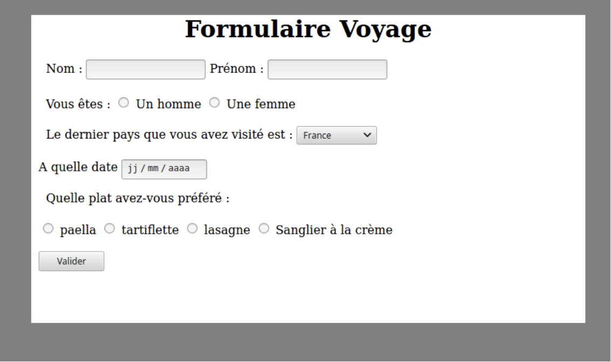

# Formulaires


## Premier exemple

### Code

Sur de nombreuses pages web, des formulaires sont utilisés que ce soit pour une authentification par identifiant et mot de passe ou pour une recherche d’informations.
Le formulaire est un élément codé en HTML.

``` html
<form action="" method="get">
<div> Nom : <input type="text" name="nom" /> </div>
<div> Prénom : <input type="text" name="prenom" /> </div>
<div> Age : <input type="text" name="age" /> </div>
<button type="submit"> Envoyer </button>
</form>
```

!!! example "Exercice 1 :"
    Insérer ce code dans une page html. Modifier et observer ce que fait ce code.

### Explications

Dans ce fragment de code , on remarque en premier lieu l’élément `form` qui possède deux attributs. Le valeur de l’attribut action est l’URL à laquelle envoyer les paramètres. Le deuxième attribut définit le mode de passage des paramètres.
Ces derniers sont à saisir dans trois champs de saisie de texte, correspondant à des éléments HTML input. Ces éléments possèdent deux attributs. Le premier, type, indique que l’on souhaite un champ de saisie de texte (il existe d’autres types de d’éléments). Le second, name, indique le nom du paramètre auquel ce champ correspond.

Enfin, le dernier élément `button`, correspond au bouton de soumission du formulaire.

## Mode de passage des paramètres

### Méthode GET

La méthode `GET` est la méthode par défaut d’envoi de formulaire. Avec cette méthode, les paramètres et leurs valeurs sont directement transmis au serveur via l’URL sous la forme :

```
Protocole ://nom-ou-adresse/document ?n1 = v1 & n2 = v2 & ....& nk = vk
```

avec `n1 = v1` : la valeur `v1` donnée par l’utilisateur au nom `n1` ;

Cette méthode est utilisée pour passer des paramètres limités soit en nombre soit en taille. En effet, les navigateurs et les serveurs web imposent tous des limites à la taille des URL. Mais cette méthode pose aussi un problème de confidentialité. Si on tape un mot de passe dans un formulaire, celui-ci va se retrouver en clair dans l’URL. La méthode `POST` n’offre d’ailleurs pas beaucoup plus de sécurité.

### Méthode POST

Si l’attribut method vaut `post`, alors les éléments sont passés de manière différente. Le navigateur forme bien la chaîne de caractères `n1 = v1 & n2 = v2 & ....& nk = vk`. Cependant, il envoie un message HTTP commençant par POST. Les paramètres sont alors placés dans le corps de la requête HTTP de la manière suivante :
```
POST /form HTTP/1.1
Host : www.nsi-première.fr
Content-Type : application/x-www-form-urlencoded
Content-Length : 30
nom=LAMBERT&prenom=Justin&age=23
```

## Autres types de formulaires

### Texte

La balise `<input type="text">` permet la saisie d’une chaîne de caractère sans retour à la ligne. La variante `<input type="password">` fonctionne de manière similaire mais n’affiche pas les caractères saisis.

La balise `<textarea>` correspond à une zone de saisie multilignes et redimensionnable.

### Type "Radio"

Ce type de formulaire permet à l’utilisateur de choisir une valeur parmi plusieurs. Il correspond à la balise `<input type="radio">`. Tous les boutons appartenant au même groupe doivent avoir la même valeur pour l’attribut `name`. L’attribut `value` définit la valeur utilisée, alors que le contenu de la balise définit chaîne de caractère affichée dans l’interface.

Exemple :

=== "html"

    ``` html
    <div> <input type="radio" name="choix" value="0"> Non </input> </div>
    <div> <input type="radio" name="choix" value="1"> Oui </input> </div>
    <div> <input type="radio" name="choix" value="2"> Ne sait pas </input></div>
    <button type="submit"> Envoyer </button>
    ```
=== "rendu"
    <div> <input type="radio" name="choix" value="0"> Non </input> </div>
    <div> <input type="radio" name="choix" value="1"> Oui </input> </div>
    <div> <input type="radio" name="choix" value="2"> Ne sait pas </input></div>
    <button type="submit"> Envoyer </button>

### Liste

La paire d’éléments `select` et `option` permettent de définir une liste de choix. C’est sur l’élément `select` que l’on définit l’attribut `name`. Les éléments `option`, imbriquées dans l’élément `select` définissent les valeurs et les chaines affichées.

Exemple :

=== "html"

    ``` html
    Moyen de transport :
    <div><select name="moyens">
    <option value="bus"> Bus </option>
    <option value="avion"> Avion </option>
    <option value="bateau"> Bateau </option>
    <option value="voiture"> Voiture </option>
    </select>
    </div>
    ```
=== "Rendu"
    Moyen de transport :
    <div><select name="moyens">
    <option value="bus"> Bus </option>
    <option value="avion"> Avion </option>
    <option value="bateau"> Bateau </option>
    <option value="voiture"> Voiture </option>
    </select>
    </div>

### Autres

Il existe beaucoup d’autres possibilités. Vous pouvez consulter l’adresse suivante :
[https://developer.mozilla.org/fr/docs/Web/HTML/Element/Input.](https://developer.mozilla.org/fr/docs/Web/HTML/Element/Input.)

## Exercice

Réaliser une page internet qui comportera un formulaire. Celui-ci devra utiliser les trois types d’entrée vus dans ce cours. Celui-ci peut ressembler à la page web suivante :

<figure markdown>

</figure>