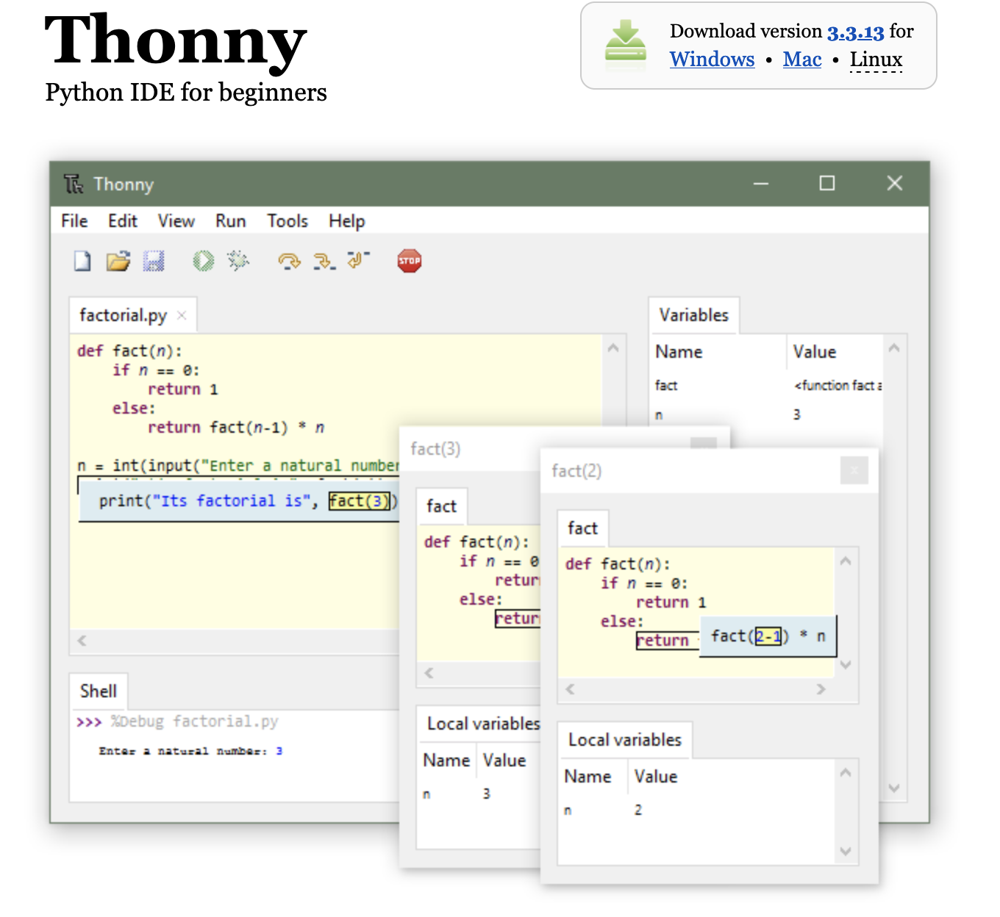
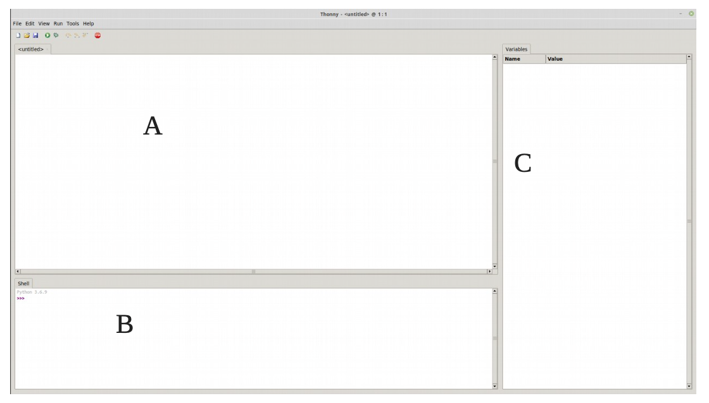

# Les bases en Python

## Présentation de Python

### Python : bref historique

Python est un langage de programmation, dont la première version est sortie en 1991. Créé par [Guido van Rossum](https://fr.wikipedia.org/wiki/Guido_van_Rossum), il a voyagé du Macintosh de son créateur, qui travaillait à cette époque au Centrum voor Wiskunde en Informatica aux Pays-Bas, jusqu'à se voir associer une organisation à but non lucratif particulièrement dévouée, la Python Software Foundation, créée en 2001.

<figure markdown>
{width=300px}
</figure>

Ce langage a été baptisé ainsi en hommage à la troupe de comiques les « Monty Python ».

Python est un langage puissant, à la fois facile à apprendre et riche en possibilités.

Dès l'instant où vous l'installez sur votre ordinateur, vous disposez de nombreuses fonctionnalités intégrées au langage.

Il est, en outre, très facile d'étendre les fonctionnalités existantes. Ainsi, il existe ce qu'on appelle des bibliothèques qui aident le développeur à travailler sur des projets particuliers. 

Plusieurs bibliothèques peuvent ainsi être installées pour, par exemple, développer des interfaces graphiques en Python.

### Installation de Thonny

#### Présentation du logiciel

Thonny est un environnement de développement intégré pour Python conçu pour les débutants. Il prend en charge différentes façons de parcourir le code, l'évaluation d'expression étape par étape, la visualisation détaillée de la pile d'appels et un mode pour expliquer les concepts de références et de tas.

#### Installation

* Aller sur le site : [https://thonny.org/](https://thonny.org/)
* Cliquer sur Windows (en haut à droite).

<figure markdown>
{width=600px}
</figure>

* Le télécharger.
* Se rendre dans le dossier où vous l’avez téléchargé (en général, dans le dossier Téléchargements) et cliquer, pour
cette version, sur le fichier : thonny-3.3.13.exe

#### Présentation 

<figure markdown>
{width=§00px}
</figure>

Avec :

* A : zone d’édition où vous allez taper votre code
* B : console
* C : explorateur de variables

### L'édition et l'exécution d'un premier programme

Comme la coutume l’exige, notre premier programme sera l’affichage du texte "Hello World". Pour cela :

*  Créer un répertoire dans votre dossier `NSI`, un autre dossier `Bases`  dans lequel vous y stockerez tous vos programmes de ce chapitre.
* Dans la barre d'outils cliquer sur $Nouveau Fichier$.
* Puis dans la zone de saisie, taper :

``` py linenums='1'
print("hello world")   #affiche le texte entre parenthèses 
```

*  Enregistrer ce fichier sous le nom de `hello.py` (vous remarquerez que l'extension .py est réservée à python);
* Cliquer dans la barre d'outils sur la flèche verte {width=17px} qui signifie Exécuter (ou Ctrl+F9).

Si tout va bien, votre programme s'effectue dans la console.

**Remarque :** il est possible (et fortement conseillé) d'inclure des commentaires dans les lignes de code, ils doivent être précédés de # afin qu'ils ne soient pas interprétés, ce qui sinon provoquerait un message d'erreur.

## La déclaration et l'affectation du contenu de variables

### La déclaration d'une variable

Si on écrit dans la zone de saisie maintenant l'instruction :

``` py linenums='1'
print(texte) # sans les guillemets
```

L'interpréteur affiche maintenant le message d'erreur suivant :

``` py
>>> %Run -c $EDITOR_CONTENT
Traceback (most recent call last):
  File "<string>", line 1, in <module>
NameError: name 'texte' is not defined
```

Le message d'erreur vient du fait que "hello world" était entre guillements alors que texte non. En effet, l'interpreteur Python cherche à afficher la variable `texte` et que cette variable n'a pas été définie dans ce programme.

Pour définir cette variable, on rajoute la ligne suivante en début de programme :

``` py linenums='1'
texte = "Hello world" # ou encore "Hello world"
print(texte) # affiche le contenu de la variable texte
```

Nous venons de déclarer une variable nommée `texte` et de lui affecter (ou assigner) le texte "Hello World". En Python comme dans bien d'autres langages, l'opération d'affectation est représentée par le signe `=`.

### Quel intérêt d'utiliser une variable ?

Définition du mot ordinateur d’après le dictionnaire Le Petit Larousse :

« Machine automatique de traitement de l’information, obéissant à des programmes formés par des suites d’opérations arithmétiques et logiques. »

Qui dit traitement de l’information, dit donc données à manipuler. Un programme passe donc son temps à traiter des données. Pour pouvoir traiter ces données, l’ordinateur doit les ranger dans sa mémoire . La mmoire se compose de cases dans lesquelles nous allons ranger ces données.


Une variable est un espace mémoire dans lequel il est possible de mettre une valeur. Par exemple, si en français je dis $x$ est égal à 1, j’utilise la variable dont le nom est $x$ pour lui fixer la valeur 1. Pour faire la même chose en Python, je note simplement : `x = 1`.

Cette opération est appelée "affectation" (ou "assignation"), et consiste à stocker une valeur en mémoire vive de l’ordinateur. On dit donc que l’on procède à l’affectation de la variable $x$ avec la valeur "1".

### Types des variables

Les variables peuvent contenir des types de données différents. Les différents types sont :

|Type Python| Traduction | Exemple|
|:-:|:-:|:-:|
|`int`|entier|`#!python 42`|
|`float`|flottant (décimal)|`#!python 3.1416`|
|`str`|chaîne de caractères (string)|`#!python "NSI"`|
|`bool`|booléen (True ou False)|```#!python True```|
|`tuple`|p-uplet| `#!python (255, 127, 0)`|
|`list`|liste|`#!python [0, 1, 2, 3, 4, 5]`|
|`dict`|dictionnaire|`#!python {'Homer':43, 'Marge':41, 'Bart':12, 'Lisa':10, 'Maggie':4}`|
|`function`|fonction| `#!python print`|

Python est un langage à typage dynamique, cela signifie qu'en fonction du contenu affecté à la variable, il détermine automatiquement le type de la variable.

Il existe beaucoup de langages (C++, Java....) où l’utilisateur doit absolument définir le type d’une variable avant de pouvoir l’utiliser, faute de quoi cela entraînera une erreur.

Remarque : L'explorateur de variables permet d'afficher le nom de la variable et sa valeur. Il suffit d'aller dans affichage puis variables.

La fonction `type()` vous permet de connaître le type d’une variable.

Le type d'une variable peut être modifié de manière dynamique en cours de programme. Le vérifier en testant le programme suivant :

``` py linenums='1'
a = 8
print(a)
a = a + 2 # ou a += 2
print(a)
```

**Remarque :** L'explorateur de variable affiche uniquement les dernières valeurs et types pris par les variables en fin de programme.

### Affectations (assignations) multiples

Sous Python, on peut assigner une valeur à plusieurs variables simultanément.

``` py linenums='1'
x = y = 7
print("x vaut :", x)
print("y vaut :", y)
```

On peut aussi effectuer des affectations parallèles à l’aide d’un seul operateur = :

``` linenums='1'
x, y = 7, 9.4
print("x vaut :", x)
print("y vaut :", y)
```

Les variables `x` et `y` prennent simultanément les nouvelles valeurs 7 et 9,4

## Les opérations

### Arithmétiques

Un ordinateur est bien évidemment capable d’effectuer des opérations arithmétiques et mathématiques.

Dans le tableau ci-après, sont présentés les symboles utilisés pour les opérations de base.

<figure markdown>
|     Opération                  |     Symbole    |     Exemples à tester    |
|--------------------------------|----------------|--------------------------|
|     Addition                   |     +          |     3+5 donne 8          |
|     Soustraction               |     -          |     7-2 donne 5          |
|     Multiplication             |     *          |     7*8 donne 56         |
|     Division                   |     /          |     7/2 donne 3.5        |
|     Reste de la division       |     %          |     7%3 donne 1          |
|     Quotient de la division    |     //         |     7//2 donne 3         |
|     Puissance                  |     **         |     10**3 donne 1000     |
</figure>

**Remarque :** l’utilisation du signe + ne se limite pas à l’addition. Il est aussi utilisé pour la concaténation.

Le terme concaténation désigne l’action de mettre bout à bout au moins deux chaînes.

!!! example "Exercice 1"
    Sans l'exécuter, que fait le programme suivant. Puis le tester
    ``` py linenums='1'
    a = " chaîne de "
    b = " caractère "
    monExpression = a + b
    print ( monExpression )
    ```

!!! example "Exercice 2"
    Écrire un programme qui multiplie le contenu de 2 variables. Par exemple : `c = 5` et `d = 9`. Le résultat de cette opération devra être "rangé" dans une troisième variable (`resultat`).
    Votre programme devra afficher le contenu de la variable `resultat`.

!!! example "Exercice 3"
    Écrire le code pour l'instruction suivante : on initialise une variable cellule à 1 et on la multiplie par 2.

!!! example "Exercice 4"
    Écrire le code pour l'instruction suivante : on initialise une variable capital à 1000 et on lui enlève 5%.

## Quelques fonctions mathématiques

Pour utiliser certaines fonctions mathématiques plus avancées ($x^a$, $exp(x)$, $sin(x)$, $log(x)$ ... ) il est nécessaire d’importer des bibliothèques.

Si l’on utilise la bibliothèque `math`, la première ligne de code devra commencer par : `import math`. Cette bibliothèque inclus entre autres les fonctions suivantes :

<figure markdown>
|     Fonction       |     Symbole       |     Exemples à tester        |
|------------------------------------------------------------------------|-------------------|-----------------------------------------------------|
|     constante p                                                       |     pi            |     pi donne 3.141592653589793                      |
|     sinus (angle en radians)                                       |     sin(x)        |     sin(pi/2)   donne 1.0                           | 
|     arc sinus                                                 |     asin(x)       |     asin(1) donne 1.5707963267948966 radians        |
|     conversion radians en degrés                                      |     degrees(x)    |     degrees(pi)   donne 180.0 degrés                |
|     conversion degrés en radians                                     |     radians(x)    |     radians(90) donne 1.5707963267948966 radians    |
|     logarithme décimal                                                 |     log10(x)      |     log10(100)   donne 2                            |
|     logartithme népérien                                               |     log(x)        |     log(100) donne 4.605170185988092                |
|     exponentielle                                                      |     exp(x)        |     exp(100)   donne 2.6881171418161356e+43         |
|     puissance xy                                                       |     pow(x,y)      |     pow(2,8) donne 256.0                            |
|     racine carrée                                                      |     sqrt(x)       |     sqrt(100)   retourne 10                         |
|     arrondi au plus proche entier                                      |     round(x)      |                                                     |
|     arrondi au plus proche réel avec y décimales   après la virgule    |     round(x,y)    |     round(100.235789,2)   retourne 100.24           |
|     arrondi au plus petit entier&gt;=x                                 |     ceil(x)       |     ceil(100.235789,2) retourne 101                 |
|     arrondi au plus grand entier&lt;=x                                 |     floor(x)      |     floor(100.235789,2)   retourne 100              |
</figure>

**Exemple complet :**

``` py linenums='1'
import math
a = math.pow(2.8)
print(a) # affiche 256
```

### Génération de nombres aléatoires

La bibliothèque `random` permet de générer des nombres aléatoires, la première ligne de code devra commencer par `import random`.

Cette bibliothèque inclus entre autres les fonctions suivantes :


**Exemple complet :**
``` py linenums='1'
import random
a = random.randint(0,5) 
print(a) # affiche 3

b = random.randint(0,5)
print(b) # affiche 1

c = random.random()
print(c) # affiche 0.28974251561751374
```

**Remarque :** Plutôt que de répéter `random` avant l'itilisation de chaque fonction, nous pouvons utiliser un alias de la manière suivante :

``` py linenums='1'
import random as rd
a = rd.randint(0,5) 
print(a) # affiche 3

b = rd.randint(0,5)
print(b) # affiche 1

c = rd.random()
print(c) # affiche 0.28974251561751374
```

## Les entrées

On peut alors lire depuis le clavier la valeur d’une chaîne de caractères par la méthode `input()`.

**Exemple :**
```py linenums='1'
a = input() #les parenthèses sont obligatoires .
a = input(" Nom : ") # le texte dans les parenthèses permet d’indiquer ce que l'on attend
```

La commande `input()` renvoie toujours à une chaîne de caractères. Pour affecter un nombre, il faut le convertir grâce aux fonctions `int()` pour convertir une chaine de caractère en entier et `float()` pour convertir une chaîne de caractère en flottant.

**Exemple :**

```py linenums='1'
a = int(input(" Donner une valeur entière : " ))
x = float(input("Donner une valeur réelle : " )
print(" L’entier a vaut " , a ," et le réel x vaut ", x)
```

## Trace d'un programme

Pour représenter l'évolution d'un programme dans en fonction, nous utilisons ce qui s'appelle la trace d'un programme.
Celle-ci se présente sous la forme d'un tableau avec dans la première ligne :

* le numéro de ligne ;
* les différentes variables ;
* les commentaires.

***Exemple :***

``` py linenums="1"
a = 5
b = 3 + a
c = 2 * b
print(c)
```

On peut donner la trace de ce programme.
<figure markdown>
| N°ligne | a | b | c | Commentaires                             |
|:-------:|:--|:-:|:-:|:----------------------------------------:|
| 1       | 5 |   |   | On affecte la valeur 5 à la variable `a `|
|   2     | 5 | 8 |   | a + 3 = 5 + 3 = 8 -> b                   |
|    3    | 5 |8  |16 | 2 * b = 2 * 8 = 16 -> c                  |
|   4     | 5 | 8 |16 | On affiche la valeur contenue dans c     |
</figure>

!!! example "Exercice 5"
    Effectuer la trace du programme suivant :

    ``` py linenums="1"
    x = 20
    x += 5
    y = 3 * x + 2
    print(y,x) 
    ```

## Exercices

!!! example "Exercice 6"
    Faire un programme qui demande un nombre et qui affiche sa racine carrée et son carré.

!!! example "Exercice 7"
    L'octogone est un polygone comportant huit côtés, et donc huit angles. L'octogone régulier isométrique s'inscrit dans un cercle.
    Sa surface lorsqu'il a un côté $c$ vaut : $A= 2\times c \times 2(1+\sqrt{2})$.
    Faire un programme demandant à l’utilisateur le côté puis afficher la surface de l'octogone.

!!! example "Exercice 8"
    Écrire un programme qui vous demande votre nom, votre prénom, votre classe, une discipline et les 5 notes obtenues dans cette discipline. Il calculera la moyenne dans cette discipline, arrondie à l’entier supérieur et affichera le résultat sous la forme :
    PEREAU Vincent – classe de 2GT7 : moyenne en MATHÉMATIQUES = 13

!!! example "Exercice 9"
    Écrire un programme qui calcul l’angle de réfraction $i_2$ (exprimé en degrés et avec 1 chiffre après la virgule) d’un faisceau lumineux, après avoir demandé l’angle d’incidence $i_1$ (en degrés) ainsi que les indices de réfractions $n_1$ et $n_2$ des milieux 1 et 2.
    Donnée : Loi de Descartes relative à la réfraction : $n_1 \times sin(i_1) = n_2 \times sin(i_2)$

!!! example "Exercice 10"
    Écrire un programme qui calcule combien de bonbons recevra chaque élève de la classe ainsi que le nombre de bonbons restants, après avoir demandé le nombre total de bonbons et le nombre d’élèves de la classe. Le résultat
    sera affiché sous la forme : "chaque élève recevra 5 bonbons et il en restera 3"