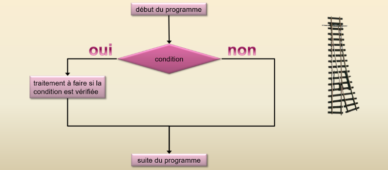
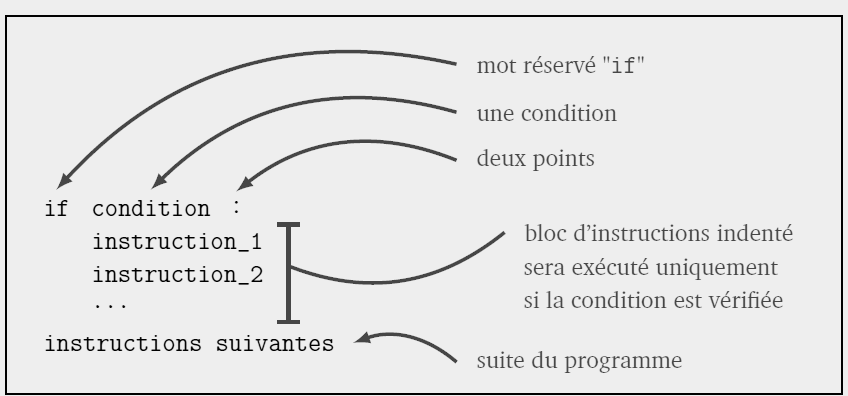
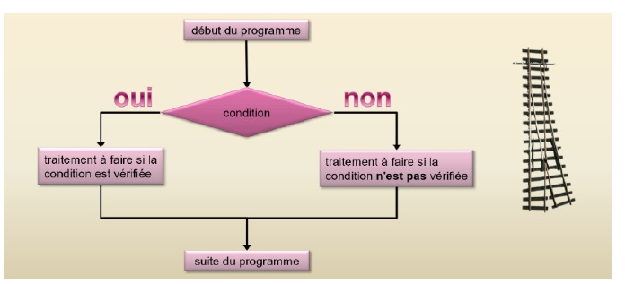
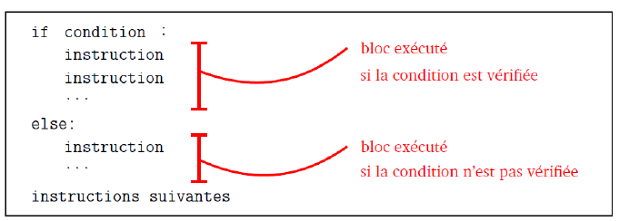
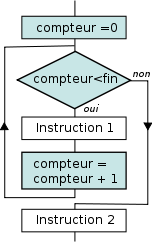
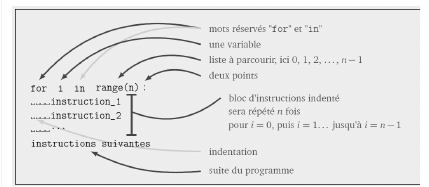
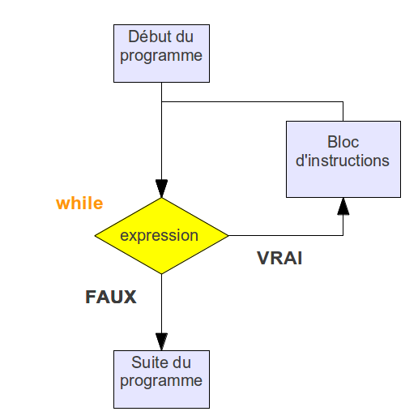
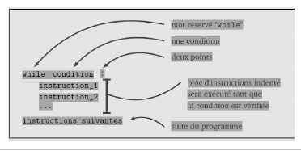

# Contrôle du flux d'éxecution

## Introduction

Jusqu'à présent, nous avons vu des algorithmes simples qui se déroulent en séquence de la première à la dernière
instruction.

Cependant, ces instructions en séquence ne suffisent pas à exécuter des algorithmes plus complexes où :

* Certaines séquences d'instructions ne peuvent être exécutées que sous certaines conditions : structures
conditionnelles (if… else)
* Certaines séquences d'instructions nécessitent d'être exécutées un certain nombre de fois : structures itératives
(boucle for et boucle while)

Le chemin suivi par le programme est appelé le flux d'exécution et les instructions qui le modifient sont appelées les instructions de contrôle de flux.

## Les structures conditionnelles

### L'instruction conditionnelle Si (if)

Dans certains cas, on ne veut exécuter une série d’instructions que sous une condition.

<figure markdown>
{width=400px}
</figure>
Syntaxe :

<figure markdown>
{width=400px}
</figure>

Après avoir tapé `if condition :` et appuyé sur entrée, l'éditeur va alors automatiquement indenter (décalage vers la droite) les lignes d'instructions suivantes. En effet, toutes les instructions qui doivent être effectuées si la condition est vraie doivent être indentées, et elles doivent avoir impérativement la même indentation.

**Exemple :** le programme suivant affiche `candidat reçu` mais uniquement que celui-ci ait une moyenne supérieure ou égale à 10.

``` py linenums='1'
m = float(input("Moyenne : "))

if m >= 10:
    print("Candidat accepté")

print("programme terminé")
```

### L’évaluation de la condition

En fait la condition évaluée `m >= 10` renvoie un booléen, `True` (vrai) ou `False` (faux). Il est
possible de le vérifier en rajoutant l’instruction suivante en fin de programme :

```py linenums='1'
m = float(input("Moyenne au bac = "))

condition = m>=10

print("La condition évaluée était bien : ", condition)
print("boolean est bien du type :", type(condition))
```

### Opérateurs de comparaison et opérateurs logiques

Afin d’écrire une condition, on utilise les opérateurs de comparaison suivants :

<figure markdown>
|Opérateur | Signification littérale|
|:--:|:--:|
|< |strictement inférieur à|
|>| strictement supérieur à|
|<=| inférieur ou égal à|
|>=| supérieur ou égal à|
|==| égal à|
|!=| différent de|
</figure>

**Attention :** l’égalité de deux valeurs est exprimée avec l’opérateur « == » et non « = ». Ce dernier
est en effet l’opérateur d’affectation et ne doit pas être utilisé dans une condition.

Ces opérateurs de comparaisons peuvent être combinés aux opérateurs logiques (ou opérateurs
booléens) suivants :

<figure markdown>
|Opérateur | Rôle|
|:--------:|:-----:|
| a and b  | Vraie si a et b sont vraie |
|a or b    | vraie si a ou b  (ou les deux) sont vraies|
| not(a)   | si a est vraie, not(a) est fausse et inversement|

</figure>

**Exemple :** le programme suivant détermine si le candidat
aura une mention BIEN. Pour cela sa note doit être supérieure
ou égale à 12 et inférieure strictement à 14 :

```py linenums='1'
m = float(input("Moyenne au bac : "))
if m >= 12 and m < 14:
    print("mention bien")
```

Là encore, l'expression évaluée : m >= 10 and m < 12 renvoie un booléen :

```py linenums='1'
m = float(input("Moyenne au bac : "))
boolean = m>=10 and m<14
if boolean:
	print("mention bien")
print("La condition évaluée était bien : ", m>=10 and m<14 )
print(("boolean est bien du type :",type(boolean)))
```

**Remarque n°1 :** En python (contrairement au langage Java par exemple),
la condition if (m>= 12 and m <1 4) :  peut être remplacée par
la condition if(12 <=  m <14).

**Remarque n°2 :** En python, la condition évaluée n'est pas
obligatoirement entre parenthèses, mais dans le cas d'expressions
complexes, les parenthèses sont vivement conseillées.

### L'instruction conditionnelle   Si... Sinon ...    (if… else…)

Dans certains cas on ne veut exécuter une séquence d'instructions
que si la condition évaluée est vraie et exécuter une
autre séquence d'instruction si la condition évaluée est fausse.

<figure markdown>
{width=400px}
</figure>

Syntaxe :

<figure markdown>
{width=400px}
</figure>

**Exemple :** le programme renvoie systématiquement une réponse :
"candidat reçu" (si condition évaluée vraie) sinon
"candidat non reçu" si condition évaluée fausse) :

```py linenums='1'
m = 
float(input("Moyenne ua bac : "))
if m<=10:
      print("Candidat reçu")
else:
      print("Candidat non reçu")
print("Programme terminé")
```

!!! example  "Exercice 1"
    Écrire un programme qui demande la température d'une maison.
	Si celle-ci est inférieure à 19°C, afficher "il faut allumer la chaudière".
    Sinon, afficher "La chaudière reste éteinte".

### L'intruction elif

Il est possible d'ajouter autant de conditions précises que l'on souhaite en ajoutant le mot clé `elif`, contraction de "else" et "if", qu'on pourrait traduire par "sinon".

!!! example  "Exercice 2"
    Écrire un script qui demande la note au bac et qui affiche la mention correspondante.
    Données :

    * si la note est supérieure ou égale à 16, la mention au bac est TB ;
    * si la note est supérieure ou égale à 14 et inférieure à 16, la mention au bac est B ;
    * si la note est supérieure ou égale à 12 et inférieure à 14, la mention au bac est AB ;
    * si la note est  inférieure à 12 et supérieure ou égale à 10, la mention au bac est Passable ;
    * si la note est inférieure à 10, vous n'avez pas le bac.

### Tester autre chose que des nombres

Il est possible de tester autre chose que des nombres, par exemple des caractères

```py linenums='1'
caract = input('caractère=')

if carac == 'H':
	print('lettre H')
else:
	print("lettre autre que le H")
	
print("programme terminé")
```

Il est même possible de savoir si la lettre tapée se trouve avant ou après une lettre donnée dans l'alphabet :

```py linenums='1'
caract = input('caractère=')

if caract == 'H':
	print('lettre H')
elif caract > 'H':
	print("la lettre se trouve après le H")
else:
	print("la lettre se trouve avant le H")
	
print("programme terminé")
```

### Tracer l’exécution d’une structure de choix

Dans un programme contenant une structure de choix, Il y a deux chemins d’exécution possibles suivant si la condition
évaluée est vraie ou fausse. Si l’on veut analyser les deux chemins, on doit faire la trace une première fois avec une valeur qui remplit la condition, puis une seconde fois avec une valeur qui ne la remplit pas.

Considérons le script ci-dessous.

``` py linenums="1"
val = int(input("Rentrez une valeur entière"))
if val >= 10 and val <= 20 :
    res = -val
else :
    res = val * 2
    res = res + 20
print(res)

```

!!! example "Exercice 3 "
    Choisir une valeur de la variable val qui satisfait la condition évaluée est réaliser la trace. Recommencer avec une valeur de variable qui ne satisfait pas la condition évaluée.

## Structures itératives

### Boucle for

Les traitements informatiques nécessitent souvent l'exécution de tâches répétitives.
La boucle `for` permet d’effectuer un nombre de fois bien déterminé le corps de boucle (séquence d'instructions). Elle
s'utilise généralement avec la fonction `range(n)` qui permet de générer une séquence de nombres entiers allant de 0 à
$n$ exclu.

<figure markdown>
{width=200px}
</figure>

**Syntaxe :**

<figure markdown>
{width=400px}
</figure>

Après avoir tapé `for i in range(n):` et appuyé sur entrée, l'éditeur va alors automatiquement indenter les lignes
d'instructions suivantes. En effet, toutes les instructions à répéter doivent être indentées, et elles doivent avoir
impérativement la même indentation.

**Exemple 1  :** le code suivant répète 10 fois l'instruction suivante.

```py linenums='1'
for i in range(10):
    print("Hello world")
```

La fonction `range()` peut accepter 3 arguments :
`range (valeur_début, valeur_fin, pas)`. Les 3 arguments (valeur_début, valeur_fin, pas) sont obligatoirement des entiers.

!!! example "Exercice 4"
    Écrire un programme, qui affiche 50 fois ”Je dois travailler ma NSI tous les soirs” à l’aide de l’instruction `for'.

!!! example "Exercice 5"
    Écrire deux programmes qui affichent tous les nombres pairs entre 8 et 17.

!!! example "Exercice 6"
    Écrire un programme qui compte de 100.4 à 103.2 par pas de 0.1

!!! example "Exercice 7"
    L’«ASCII Art» consiste à utiliser les caractères alphanumériques du code ASCII  pour produire des images. Nous allons commencer par dessiner un carré à l’aide de la lettre X. Écrire le programme qui affiche le carré ci-dessous (taille 8), en définissant une fonction qui prend en paramètre la longueur du côté.

<figure markdown>
{width=100px}
</figure>

!!! example "Exercice"
    Que réalise le code suivant :
    ```py linenums='1'
    for i in range(4):
        print(i)
    ```

**Exemple 3 :**

Le programme suivant calcule $x^n$ :

```py linenums='1'
x = float(input(" x ? "))
n = int(input(" n ? "))

resultat = 1
for i in range(1, n+1):
    resultat = resultat * x

print("x^n = ", resultat)
```

### Tracer l’exécution d’une boucle for

!!! example "Exercice  8"
    La fonction factorielle réalise le calcul suivant : n! = 1 × 2 × 3 × … × (n-1) × n

    Par exemple : 5 ! = 1 × 2 × 3 × 4 × 5 = 120.

    Réaliser la trace du programme suivant qui calcul la factorielle d’un nombre entier saisi par l’utilisateur. 
    
    On prendra $n$ = 5

    ``` py linenums="1"
    n = int(input("nombre n = "))
    x = 1
    for i in range(2, n + 1):
        x = i * x # x *= i 
    print (x)
    ```

    Trace du programme :

    | N°  ligne | n | x | i | Commentaires |
    |-----------|---|---|---|--------------|
    |           |   |   |   |              |
    |           |   |   |   |              |
    |           |   |   |   |              |
    |           |   |   |   |              |
    |           |   |   |   |              |
    |           |   |   |   |              |
    |           |   |   |   |              |
    |           |   |   |   |              |
    |           |   |   |   |              |

### La boucle while  (boucle conditionnelle non bornée)

La boucle `while` est assez peu différente de la boucle for. On l'utilise lorsque l'on ne sait a priori pas combien de boucles vont être effectuées. On l'utilise également lorsque l'on veut réaliser des incrémentations avec un pas qui ne soit pas entier, par exemple lors d'un tracé de courbe.

La boucle « tant que » exécute le corps de boucle (instructions indentées) tant qu’une condition
évaluée dans le test de poursuite est vraie. Dès que la condition devient fausse, elle passe aux
instructions suivantes.

<figure markdown>
{width=400px}
</figure>

**Syntaxe :**

<figure markdown>
{width=400px}
</figure>

**Attention :** lorsque que l'on utilise une boucle `while`, il faut s'assurer que la condition évaluée dans le test de poursuite deviendra fausse à un moment ou un autre, sinon ...le programme va boucler indéfiniment !

**Exemple :** Le programme suivant indique tous les entiers x dont le carré est inférieur à un nombre n donné et indique également leur nombre (0 compris).

``` py linenums='1'
n = float(input("nombre n="))
x = 0
while x**2 <= n:
    print(x)
    x = x + 1  #ou x+=1

print("Il y a ",x,"nombres entiers dont le carré est inférieur ou égal à ",n)
```

!!! example "Exercice 9"

    ``` py linenums="1"
    a = 19
    b = 6
    q = 0
    while ((a - b) > 0 or (b - a) == 0):
        a = a - b
        q = q + 1
        r = a
    print(q)
    print(r)
    ```
    Effectuer la trace du programme précédent et préciser le rôle de ce programme.

!!! example "Exercice 10"
    exercice 6 p 42 du livre

!!! example "Exercice 11"
    exercice 7 p 42 du livre

!!! example "Exercice 12"
    exercice 9 p 42 du livre

!!! example "Exercice 13"
    Écrire le script du jeu de devinette suivant. Le jeu consiste à deviner un nombre entre 1 et 100. Le programme demande à l'utilisateur de rentrer une valeur et le programme lui affiche si ce nombre est trop petit, trop grand ou gagné. Le programme compte aussi le nombre d'essai pour trouver la bonne valeur.

**Exemple :**
``` PY
--->   50
trop petit !
--->   75
trop petit !
--->   87
trop grand !
--->   81
trop petit !
--->   84
trop petit !
--->   85
Gagné en 6 coups !
```

**Données :** pour choisir un nombre au "hasard", on utilise la fonction `randint()` de la bibliothèque `random`.

**Exemple :**

``` py linenums='1'
from random import*  #importation de la bibliothèque random
n = randint(1,5)      #prend un nombre compris entre 1 et 5
```

### Boucle for ou boucle while

Lorsque l’on sait au départ combien d’itérations devront être réalisées, il faut utiliser une boucle `for`, moins consommatrice en ressources machine que la boucle `while`. La boucle `while`, quant à elle, est utilisée lorsque l’on ne sait pas à priori combien d’itérations seront effectuées (par exemple si on écrit un programme qui effectue de manière aléatoire un lancé de dés, et cela jusqu’à ce que le 6 sorte). 

### Imbrication de boucles

Il est possible d’imbriquer des boucles, c’est-à-dire que dans le bloc d’une boucle (boucle extérieure), on utilise une nouvelle boucle (boucle intérieure).

**Exemple :** Il est possible de modifier le programme de la table de multiplication vu précédemment afin qu'il affiche
toutes les tables de multiplication de 1 jusqu'à 10. Pour cela, il suffit d'imbriquer le programme précédent à l'intérieur d'une boucle qui fait varier $n$ de 1 à 10

``` py linenums='1'
for n in range(1,11):
    print("table de multiplication par", n)
    for i in range(11):
             print(i, 'x', n, '=', i*n)
    print("")
```

## Les chaînes de caractères

### Les énumérables

En mathématiques, on dit qu'un ensemble est dénombrable lorsqu'on peut associer à chaque élément de l'ensemble un nombre (traditionnellement 1, 2, 3 ...)

* les fraises Tagada d'un paquet sont dénombrables.
* les voitures qui roulent sur l'autoroute sont dénombrables.
* l'eau qui coule d'un robinet n'est pas dénombrable.
  
En informatique, il existe un concept similaire qui va désigner les objets que l'on peut énumérer, c'est-à-dire les décomposer en une succession ordonnée d'éléments. On les appelle les énumérables ou les itérables (Python utilise le mot anglais iterable).

* la variable "NSI" (qui est de type String) est énumérable : on peut la décomposer en `N`, `S`, `I`.
* la variable [4, 3, 17] (qui est de type List) est énumérable : on peut la décomposer en `4`, `3`, `17`.
* la variable 5 (qui est de type Int) n'est PAS énumérable : on ne peut pas la décomposer.

#### Solution directe : parcours d'une chaine par les éléments

Une chaîne de caractères (type string) est composée de ... caractères ! Il est possible de parcourir ces caractères avec une structure for... in...

**Exemple :** le programme suivant demande une chaîne de caractères et insère un "." entre chaque caractère :

```py linenums='1'
chaine = input("Chaîne de caractère = ")
for i in chaine:
    print(i, end='.')
```

#### Solution indirecte : parcours d'une chaîne à partir des indices

Il est possible d'accéder à chaque caractère d'une chaîne à l'aide de son indice de position. Le premier
caractère est toujours indexé 0.

**Exemple :** pour afficher le 1er et 5ème caractère d'une chaîne :

```py linenums='1'
chaine = "NUMERIQUE"
print("le premier caractère est :", chaine[0])
print("le cinquième caractère est :", chaine[4])
```

Pour balayer l'ensemble des caractères de
la chaîne de caractères :

```py linenums='1'
chaine = input("Chaîne de caractère = ")
for i in range(len(chaine)):
    print(chaine[i], end='.')
```

**Remarque :** le fonction `len()` retourne la longueur de la chaîne.

!!! example  "Exercice 14"
    Réaliser un programme qui demande une chaîne de caractères et une lettre et indiquera le nombre de fois que la lettre à été rencontrée dans la chaîne de caractères.

!!! example  "Exercice 15"
    Réaliser un programme qui demande un mot et détermine si oui ou non ce mot est un palindrome, c’est-à-dire qu'il peut se lire indifféremment dans les 2 sens, par exemple radar, S.O.S, ...

## Exercices

!!! example  "Exercice 16"
    Réaliser un programme qui simule un lancer de 3 dés. Le programme devra :

    * Afficher le résultat du lancer ;
    * Indiquer s'il y a un triple et si oui, indiquer la valeur.
	* Indiquer s'il y a un double et si oui, indiquer la valeur (ne pas afficher dans le cas d'un triple)
	* Indiquer également s'il n'y a aucun double ou triple.

!!! example  "Exercice 17"
	Résoudre à l'aide d'un programme le problème suivant.
	Une balle est lâchée d'une hauteur initiale $h$ et rebondit à chaque fois au 2/3 de sa hauteur. On considère qu'elle ne	rebondit plus lorsque la hauteur devient strictement inférieure 5 cm. Calculer le nombre de rebonds de la balle

!!! example  "Exercice 18 pour ceux qui ont terminé"
	A l'aide d'un programme, vérifier que la probabilité de tirer un 6 lors d'un jeter de dé est bien de 1/6.

!!! example  "Exercice 20"
    Exercice 28 p 44 du livre