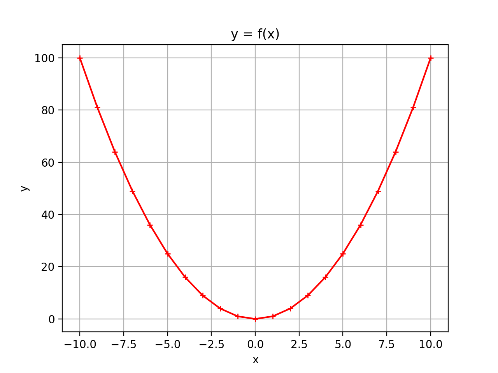

# Tuples et listes avec Python

## Introduction

Il est possible de "stocker" plusieurs grandeurs dans une même structure, ce type de structure est appelé une séquence : ensemble fini et ordonné d'éléments indicés de $0$ à $n-1$ (si la séquence comporte $n$ éléments).

**Rappel :** nous avons vu dans les chapitres précédents qu'il est possible d'accéder à n'importe quel caractère d'une chaîne de caractères à l'aide de son indice de position (le premier caractère étant indexé 0) :

``` py linenums='1'
chaine = "numérique"
print ("le 1er caractère est ", chaine[0])
print ("le 5eme caractère est ", chaine[4])
```

Nous avons vu également qu'il est possible de balayer l'ensemble des caractères de la chaîne de caractères :

```py linenums='1'
chaine = "numérique"
for i in range(len(chaine)) :
    print (chaine[i], end=".")
```

Une chaîne de caractère est donc bien un type de structure finie et ordonnée d'éléments indexés de `0` à `len(chaine)-1`, c'est à dire une séquence.
Il existe d'autres types de séquences que nous allons découvrir ici, notamment les n-uplets (encore appelés tuples) et les listes.

## Les tuples

### Définition

Un tuple est une collection d’éléments séparés par des virgules et généralement entouré de parenthèses même si ce n’est pas une obligation. Cela permet toutefois d’améliorer la lisibilité du code. Le tuple est une séquence immuable (une fois déclaré, le tuple ne peut plus être modifié) d’objets indicés qui peuvent être de tout type : entiers, flottants, chaînes de caractères…

```py linenums='1'
tup = (4, 6)
print ("tuple = ", tup)
```

### Afficher un élément d'un tuple

Pour afficher un élément, il faut s'aider de son indice élément.Comme pour les chaines de caractères, 
pour un tuple de longueur $n$, le premier élément porte l'indice 0 et le dernier indice porte l'indice $n-1.

Exemple : pour afficher le deuxième élément, la commande est la suivante :

```py linenums='1'
tup = (4, 6)
print (tup[0])
```

### Parcourir un tuple

Comme pour une chaine de caractères, il est possible de parcourir directement les éléments du tuple à l'aide d'une boucle `for` :

```py linenums='1'
tup = (4, 6)
for i in tup :
    print ("i prend la valeur : ", i)
```

Ou bien, Il est possible de parcourir les éléments d'un tuple à l'aide des indices. De plus, comme avec une chaine de caractères, la fonction `len()` prenant un tuple comme argument renvoie le nombre d'éléments
(longueur) du tuple.

```py linenums='1'
tup = (4, 6)
for i in range(len(tup)):
    print ("i prend la valeur : ", i, " et tup[i] la valeur :", tup[i])
```

**Autre possibilité :**

```py linenums='1'
tup = ("mon age est ", 18, "ans")
a, b, c = tup
print("a = ",a)
print("b = ",b)
print("c = ",c)
```

### Immuabilité d'un tuple

Essayons de modifier un tuple prédéfini :

```py linenums='1'
tup = ("mon age est ", 18, "ans")
tup[1] = 19
print("tuple ", tup)
```

On constate que python refuse effectivement la modification d'un élément du tuple :
```py linenums='1'
>>> # script executed
Traceback (most recent call last):
  File "<input>", line 2, in <module>
TypeError: 'tuple' object does not support item assignment
```

### Quel peut être l'intérêt d'un tuple ?

Nous souhaitons écrire une fonction qui prend en argument deux nombres entiers et nous renvoie le quotient et le reste de la division euclidienne du premier nombre par le second. Or nous avons vu qu'une fonction ne retourne qu'un seul élément ! 

Il est possible de solutionner ce problème en demandant à la fonction de renvoyer le résultat sous forme d'un tuple (quotient, reste).

```py linenums='1'
def division_euclidienne (a:int, b:int)-> tuple :
    tup = (a//b, a%b)
    return tup


x = 100
y = 9
quotient, reste = division_euclidienne(x,y)
print (x, "que divise ", y, " donne ", quotient, "et il reste ", reste)
```

## Les listes

### Définition

Tout comme un tuple, une liste est une collection d’informations qui peuvent être de même type ou de type différent. Les éléments de la liste sont séparés par des virgules et placés entre des crochets. La grande différence entre une liste et un tuple, c'est que la liste est modifiable.

Création de listes par affectation :

```py linenums='1'
list_vide = []
list_int = [-12, 6, -9, 32]
list_float = [3e8, 1.6e-19, 37.2]
list_str = ["janvier", "février", "mars"]2.
list_mixte = ["Eric", 1.75, 70e-3, [9,7,2], True]

# pour afficher les différents éléments de la liste
print (list_mixte)
# pour afficher le type de la liste
print (type(list_mixte))
# pour afficher la longueur (nombre d'éléments) de la liste
print(len(list_str))
```

### Affichage des divers éléments de la liste

Comme pour les tuples, chaque élément est repéré dans la liste par un indice. Là aussi, l'indexation commence à 0 et non pas à 1.

```py linenums='1'
list_mois = ["janvier", "février", "mars", "avril", "mai", "juin"]
print ("1er mois =", list_mois[0])
```

Il est donc possible d'afficher un par un l'ensemble des éléments d'une liste grâce à leur indice à l'aide d'une boucle for :

```py linenums='1'
list_mois = ["janvier", "février", "mars", "avril", "mai", "juin"]
numero = ["1er", "2eme", "3eme", "4eme", "5eme", "6eme"]
for i in range(len(list_mois)) :
    print ("le =", numero[i], " mois de l'année, indexé ", i, " est : ", list_mois[i])
```

Il est possible de balayer directement les éléments d'une liste (comme pour les chaines de caractères):

```py linenums='1'
list_mois = ["janvier", "février", "mars", "avril", "mai", "juin"]
for i in list_mois :
    print (i)
```

### Ajout d'éléments dans une liste

#### L'opérateur `+`

Une autre méthode consiste à concaténer notre liste existante avec une autre liste. L'intérêt est que plusieurs éléments peuvent être rajoutés en même temps :

```py linenums='1'
list_mois = list_mois + ["juiller ", "août"]
```

Attention à l’ordre dans lequel les chaines sont concaténées. Dans l'exemple qui suit le mois d'octobre sera rajouté en début de liste et non en fin de liste :

```py linenums='1'
list_mois = ["octobre"] + list_mois
```

#### La méthode `append()`

Pour rajouter un élément dans une liste, par exemple  `septembre` à notre liste `liste_mois`, il est possible d’utiliser la méthode `append()` (to append signifie « ajouter »). L'élément est ajouté en fin de liste. La méthode `append()` ne permet **d'ajouter qu'un seul élément à la fois**.

```py linenums='1'
list_mois.append("septembre")
```

#### La méthode `extend()`

Il est également possible d'utiliser la méthode `extend()` qui permet de concaténer non pas un seul élément mais une seconde liste.

```py linenums='1'
lst_mois.extend(["novembre", "décembre"])
```

## Test d'appartenance

On peut tester si un élément se trouve dans une liste grâce à l'instruction `in` :

```python linenums="1"
list_mois = ["janvier", "février", "mars", "avril", "mai", "juin"]
if "Janvier" in list_mois :
    print ("Ok")
```


### Suppression d'éléments dans une liste

Pour supprimer un élément dans une liste, il est possible d'utiliser les trois  suivantes.

#### La commande `del`
 
Pour supprimer un élément dans une liste, par exemple l'élément de rang `i`, il est possible d’utiliser la commande `del` (del signifie « delete »).

```py linenums='1'
del lst_mois[0] # supprime le 1er élément
```

#### La méthode `remove()`

Il est possible de supprimer un élément dans un tableau à partir non pas de son indice, mais de sa valeur. La méthode `remove()` supprime uniquement la première occurrence trouvée.

```py linenums='1'
lst = [2, 5, 3, 8, 5, 5]
lst.remove(5)
print(lst)
```

Si l'élément n'est pas trouvé, un message d'erreur est retourné et le programme s'arrête, donc bien s'assurer auparavant que l'élément à supprimer est présent dans la liste.

```py linenums='1'
lst = [2, 5, 3, 8, 5, 5]
lst.remove(4)
print(lst)
```

Nous donne :

```py linenums='1'
>>> # script executed
Traceback (most recent call last):
  File "<input>", line 2, in <module>
ValueError: lst.remove(x): x not in list
```

On peut résoudre le problème en utilisant la fonction `in` de la manière suivante :

```py linenums='1'
lst = [2, 5, 3, 8, 5, 5]
while 5 in lst : # la fonction in teste l'appartenance d'un élément à une liste
    lst.remove(5)
print(list)
```

#### La méthode `pop()`

La méthode `pop()` utilisée sans argument retire le dernier élément de la liste.

**Exemple :**
```py linenums='1'
lst = [2, 5, 3, 8, 5, 5]
lst.pop()
print(lst) # affiche [2, 5, 3, 8, 5]
```

Quand la méthode `pop()`possède un argument, celui-ci désigne l'indice de l'élément à supprimer.
```py linenums='1'
lst = [2, 5, 3, 8, 5, 5]
lst.pop(0)
print(lst) # affiche [5, 3, 8, 5, 5]
```

**Remarque :** si l'argument donné à la méthode `pop()` correspond à un indice qui dépasse la longueur de la liste. Il se produit une erreur.

### Construction d'une liste par compréhension

Les compréhensions de listes fournissent un moyen de construire des listes de manière très concise. Une compréhension de liste consiste à placer entre crochets une expression suivie par une boucle for (ou plusieurs boucles imbriquées) et éventuellement un test conditionnel pour filtrer.

**Exemple 1 :**  pour réaliser une liste contenant le carré des nombres de 1 à 10 :

=== "Classique"

    ``` py linenums='1'
    list_carres = []
    for i in range (1,11) :
        list_carres.append(i**2)
    print(list_carres)
    ```

=== "Compréhension"

    ``` py linenums='1'
    list_carres =[ i**2 for i in range(1,11)]
    print(list_carres)
    ```

**Exemple 2 :**  pour filtrer la liste précédente en ne prenant que le carré des nombres paires.
=== "Classique"

    ``` py linenums='1'
    list_carres = []
    for i in range (1,11) :
        if i % 2 == 0:
            list_carres.append(i**2)
    print(list_carres)
    ```

=== "Compréhension"

    ``` py linenums='1'
    list_carres =[ i**2 for i in range(1,11) if i % 2 == 0]
    print(list_carres)
    ```

**Exemple 3 :** création de la liste des caractères qui se trouvent dans une chaîne de caractère, dans l'ordre où ils sont rencontrés.

=== "Classique"

    ``` py linenums='1'
    mot = "anticonstitutionnellement"
    list = []
    for i in mot :
        list.append(i)
    print (list)
    ```

=== "Compréhension"

    ``` py linenums='1'
    mot = "anticonstitutionnellement"
    list=[i for i in mot ]
    print (list)
    ```

**Exemple 4 :** création de la liste des voyelles qui se trouvent dans une chaîne de caractère (itérable)

=== "Classique"

    ``` py linenums='1'
    mot = "anticonstitutionnellement"
    voyelles = ["a", "e", "i", "o", "u", "y"]
    lst = []
    for i in mot :
        for j in voyelles :
            if i == j :
                lst.append(j)
    print(lst)
    ```

=== "Compréhension"

    ``` py linenums='1'
    mot = "anticonstitutionnellement"
    voyelles = ["a", "e", "i", "o", "u", "y"]
    lst = [i for i in mot for j in voyelles if i==j]
    print(lst)
    ```

### Des listes de listes pour représenter des matrices

Voici un exemple de liste de listes :

``` py linenums='1'
matrice = [[1,2,3],[4,5,6], [7,8,9]]
print(matrice)
```

Pour des raisons de lisibilité, il est cependant plus commode de la représenter de la manière suivante, sous forme matricielle :

``` py linenums='1'
matrice = [[1,2,3],
          [4,5,6],
          [7,8,9]]
print(matrice)
```

Pour cibler un élément de la matrice, on peut utiliser la notation avec des doubles crochets : `matrice[ligne][colonne]`

**Attention :** les numéros de ligne et colonne démarrent à 0.

``` py linenums='1'
print(matrice[1][2]) # affiche l'élement de le 2eme ligne et 3eme colonne
```

Pour affecter à cet élément la valeur 10 :

``` py linenums='1'
matrice[1][2] = 10
print(matrice)
```

Pour parcourir l'ensemble des éléments de la matrice, il faut utiliser 2 boucles for imbriquées :

``` py linenums='1'
for i in range(3) : # 3 = nombre de lignes
    for j in range(3) : # 3 = nombre de colonnes
        print (matrice[i][j])
```

### Pour aller plus loin

#### Trancher des listes (Slices)

On peut découper une partie de la liste :

* `lst[a:b]` renvoie la sous-liste des éléments de rang `a` à `b – 1` (l'élément de rang `b` est exclu).
* `lst[:a]` renvoie la sous-liste des éléments de rang `0` à `a – 1` (l'élément de rang `a` est exclu).
* `lst[a:]` renvoie la sous-liste des éléments de rang `a` inclus jusqu'au dernier.

``` py linenums='1'
list = [0, 1, 2, 3, 4, 5, 6, 7, 8, 9]
list_centre = list[3:8]
print(list_centre)

list_moitie_gauche = list[:5]
print(list_moitie_gauche)

list_moitie_droite = list[5:]
print(list_moitie_droite)
```

#### Des méthodes pour inverser et trier des listes

La méthode `reverse()` permet d'inverser une liste et la méthode `sort()` permet de trier la liste :

``` py linenums='1'
list = ["H", "E", "L", "L", "O"]
list.reverse()
print(list)
list.sort()
print(list)
```

#### Documentation en ligne python

[https://docs.python.org/fr/3/tutorial/datastructures.html](https://docs.python.org/fr/3/tutorial/datastructures.html)

## Exemple de tracé d'une courbe en utilisant des listes et la bibliothèque matplotlib.pyplot

Le programme suivant trace la courbe $y=f(x²)$ en utilisant la bibliothèque `matplolib.pyplot`.
Pour cela il est nécessaire de remplir une liste des abscisses des points de la courbe nommée x et une liste des ordonnées nommée y :

``` py linenums='1'
from matplotlib.pyplot import *

x = []
y = []

for i in range (-10,11): # le pas est forcément entiers
    x.append(i)
    y.append(i**2)

title("y = f(x)")
xlabel("x")
ylabel("y")
plot (x, y, color ="red", marker = "+", markersize = 5, linestyle="-")
grid()
show()
```

<figure markdown>
{width=600px}
</figure>

## Exercices 

### Exercice n°1 :

Écrire un programme Python qui permet de :

1. Définir une liste (nommée liste) contenant les nombres : 45, 17, 89, 38, 10 et 74 dans cet ordre ;
2. Afficher la liste obtenue ;
3. Ajouter l'élément 12 à la liste et afficher la liste ;
4. Afficher l'indice de l'élément 10 ;
5. Enlever l'élément 38 et afficher la liste obtenue ;
6. Afficher la sous-liste du 2ème au 3ème élément ;


### Exercice n°2 :

Écrire un programme qui demande à un élève le nombre de notes ainsi que les notes elles-mêmes. Le programme
stockera toutes les notes dans un tableau qu'il affichera.

### Exercice n°3 :

Écrire une fonction qui prend en argument un tableau et qui retourne la somme des différents éléments.

**Exemple :**

``` py linenums="1"
lst = [3, 4, 8, 9, 2, 5]
somme = tab_somme(lst)
print(somme) # doit afficher 31
```

### Exercice n°4 :

Écrire une fonction `genere_tab()` qui prend en argument la taille du tableau et qui génère un tableau où les nombres
vont croissant par pas de 1 à partir de 0.

**Exemple :**

`lst = genere_tab(10)` génère une liste `lst` telle que : `lst = [0, 1 ,2, 3, 4, 5, 6, 7, 8, 9]`


### Exercice n°5 :

On donne les chaînes suivantes :

``` py linenums="1"
chaine1 = "abc"
chaine2= "de"
```

Écrire un programme nous permettant de créer la liste suivante :
``` py 
lst = ['ad', 'ae', 'bd', 'be', 'cd', 'ce']
```
à partir de chaine1 et chaine2

### Exercice n°6 :

Écrire une fonction `occurence()` qui prend en argument un tableau et une valeur de type quelconque et retourne le nombre d'occurrences du 2nd argument dans le tableau.

### Exercice n°7 :

Écrire une fonction `extremes()` qui prend en argument un tableau d'entiers et renvoie un tuple comportant la valeur minimale, moyenne et maximale du tableau. 

### Exercice n°8 :

Écrire une fonction `genere_tab` qui prend en argument 2 entiers et retourne un tableau de longueur égale au 1er argument et dont chaque élément est un nombre entier aléatoire compris entre 0 et le 2nd argument (inclus)