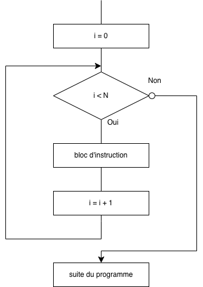
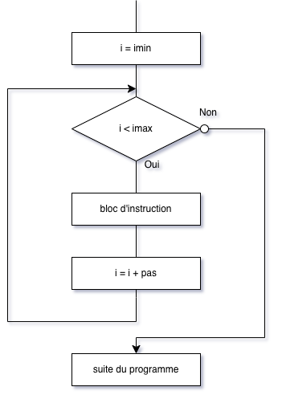
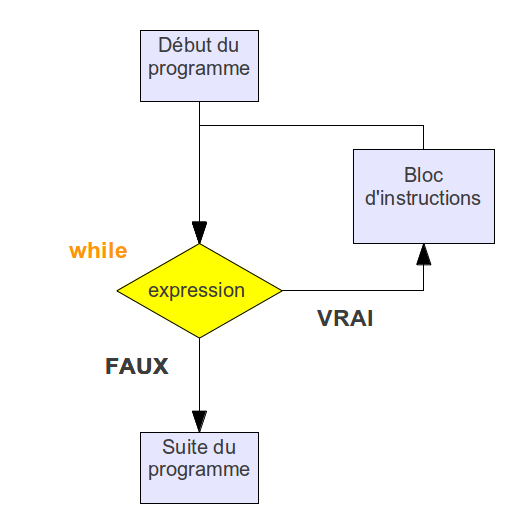

# Contrôle du flux d'exécution

## Introduction

Jusqu'à présent, nous avons vu des algorithmes simples qui se déroulent en séquence de la première à la dernière instruction.

Cependant, ces instructions en séquence ne suffisent pas à exécuter des algorithmes plus complexes où :

* Certaines séquences d'instructions ne peuvent être exécutées que sous certaines conditions : structures
conditionnelles (if... else)
* Certaines séquences d'instructions nécessitent d'être exécutées un certain nombre de fois : structures itératives
(boucle for et boucle while)


Le chemin suivi par le programme est appelé le flux d'exécution et les instructions qui le modifient sont appelées les instructions de contrôle de flux.

## La structure conditionnelle "if - else"

En Python, voici la structure :

``` py
if condition :
    instruction(s) à effectuer dans la cas où la condition est remplie
else :
    instruction(s) à effectuer dans la cas contraire
```

**Remarque :**

* Le bloc `else` n'est pas obligatoire
* Vous remarquerez le symbole `:` très important en Python qui marque le début d'un bloc.
* C'est l'indentation (le décalage) qui délimite le bloc d'instructions.

Les conditions doivent nécessairement introduire de nouveaux opérateurs, dits opérateurs de comparaison. Ces opérateurs sont les suivants :

<figure markdown>

| Opérateur | Signification littérale |
|:---------:|:-----------------------:|
| <         | strictement inférieur à |
| >         | strictement supérieur à |
| <=        | inférieur ou égal à     |
| >=        | supérieur ou égal à     |
| ==        | égal à                  |
| !=        | différent de            |

</figure>

Ces opérateurs de comparaisons peuvent être combinés aux opérateurs logiques (ou opérateurs
booléens) suivants :

<figure markdown>
|Opérateur | Rôle|
|:--------:|:-----:|
| a and b  | Vraie si a et b sont vraie |
|a or b    | vraie si a ou b  (ou les deux) sont vraies|
| not(a)   | si a est vraie, not(a) est fausse et inversement|

</figure>

**Exemple :** le programme suivant détermine si le candidat
aura une mention BIEN. Pour cela sa note doit être supérieure
ou égale à 12 et inférieure strictement à 14 :

```py linenums='1'
m = float(input("Moyenne au bac : "))
if m >= 12 and m < 14:
    print("mention bien")
```

!!! exemple "Exercice 1"
    Que fait le programme suivant ? Placer des commentaires aux lignes 2 et 4.

    ``` py linenums="1" 
    temperature = float(input("Quelle est la température de la pièce ?"))
    if temperature >= 20 :
        print("Il faut éteindre la chaudière")
    else :
        print("Il faut allumer la chaudière")
    ```

!!! exemple "Exercice 2"
    Qu'affiche le programme de l'exemple dans chacun des cas suivants :

    1. Avec `a = 8` ?
    2. Avec `a = -6` ?
    3. Avec `a = 0` ?
    4. Avec `a = "positif"` ?

    ``` py linenums="1"
    a = float(input("Entrer un nombre réel : "))
    if a >= 0 :
        print("Vous avez entré un nombre positif ou nul",a)
    else :
        print("Vous avez entré un nombre négatif",a)
    ```

!!! exemple "Exercice 3"
    Écrire un programme qui :

    1. Demande l'âge d'une personne ;
    2. Affiche si la personne est majeure où mineure.

## L'instruction `elif`

Il est possible de simplifier l'écriture de ces imbrication en utilisant le mot clé `elif` qui est la contraction de `else if`.

**La structure elif :**

``` py
if condition1 :
	instruction(s)
elif condition2 :
	instruction(s)
elif condition3 :
	instruction(s)
else :
	instruction(s)
```

**Exemple :**

=== "elif"

    ``` py linenums='1'
    a = float(input("Entrer un nombre réel : "))
    if a > 0:
        print("Vous avez entré un nombre strictement positif",a)
    else: # ici, on est dans le cas où a<= 0
        if a == 0:
            print("Vous avez entré un nombre nul",a)
        else: # ici, on est dans le cas où a<=0 et a!=0 donc où a<0
            print("Vous avez entré un nombre négatif",a)
    ```

===  "else if"

    ``` py linenums='1'
    a = float(input("Entrer un nombre : "))
    if a > 0 :
        print("Vous avez entré un nombre strictement positif",a)"  
    elif a == 0 :
        print("Vous avez entré un nombre nul",a)
    else :
        print("Vous avez entré un nombre strictement négatif",a)
    ```

!!! exemple "Exercice 4"
    Un cinéma pratique trois types de tarifs pour deux personnes.

    * si les deux personnes sont mineures, elles payent 7€ chacune,
    * si l'une seulement est mineure, elles payent un tarif de groupe de 15€,
    * si les deux personnes sont majeures, elles payent 18 € en tout.
 
    Écrire un programme qui :

    * Demande l'âge de chacune des personnes,
    * Affiche le prix à payer 

!!! exemple "Exercice 5"
    Dans une école de rugby, il y a quatre groupes :

    * le groupe des U8 pour les joueurs entre 8 ans inclus et 10 ans exclus ;
    * le groupe des U10 pour les joueurs entre 10 ans inclus et 12 ans exclus ;
    * le groupe des U12 pour les joueurs entre 12 ans inclus et 14 ans exclus ;
    * le groupe des U14 pour les joueurs entre 14 ans inclus et 16 ans exclus.

    Le dirigeant veut qu'un enfant, accompagné de ses parents, allant sur le site Internet de l'école puisse connaître le groupe qui lui correspondrait une fois son âge saisi.

    Ne sachant comment structurer le programme, il fait appel à vous afin que vous lui écriviez un programme, écrit en langage Python, qui demande l'âge de l'enfant et renvoie la catégorie une fois la saisie de l'âge effectuée.

## Les boucles

### La boucle `for`

#### version par défaut

La boucle `for`, comme on l'a déjà vu, nous sert à répéter un certain nombre de fois N un bloc d'instructions. Dans le cas de la boucle `for`, le nombre de fois où le bloc d'intruction est répété est connnu. On l'indique grâce à :

```py linenums="1"
for i in range(N):
    #bloc d'instruction
#suite du programme
```

Plus précisement, la boucle `for`fonctionne ainsi :

<figure markdown>
{width=300px}
</figure>

**Exemple :** 
```py linenums="1"
for i in range(4):
    print("toto")
print("suite du programme")
```

**Remarque :**

* l'instruction `break`, à l'intérieur de la boucle `for` provoque une sortie immédiate d'une boucle `for`
* `i` est un nom de variable usuel mais on peut tout aussi bien utiliser un autre nom de variable (exemple : compteur)

!!! exemple "Exercice 6"
    Écrire un programme, qui affiche 50 fois ”Je dois ranger mon bureau” à l’aide d'une boucle `for`.

On peut avoir besoin aussi du "tour de boucle courant".

**Exemple :** le code suivant affichera 0, 1, 2, 3,.., 8, 9

```py linenums='1'
for i in range(10)):
    print(i) 
```

<iframe width="800" height="500" frameborder="0" src="https://pythontutor.com/iframe-embed.html#code=for%20i%20in%20range%284%29%3A%0A%20%20%20%20print%28i%29%0Aprint%28%22suite%20du%20programme%22%29&codeDivHeight=400&codeDivWidth=350&cumulative=false&curInstr=0&heapPrimitives=nevernest&origin=opt-frontend.js&py=3&rawInputLstJSON=%5B%5D&textReferences=false"> </iframe>

!!! exemple "Exercice 7"
    Écrire un programme qui effectue la table de multiplication par 7 et qui l’affiche.

#### Version complète

<figure markdown>
{width=300px}
</figure>

**Syntaxe :**
``` py linenums="1"
for i in range(imin,imax,pas) :
	#bloc d'instruction 
#suite du programme
```

Avec :

 * `imin` : valeur de départ de la variable `i`(0 par défaut);
 * `imax` : valeur d'arrêt `i` de la variable. Dans la partie précédente, `imax` est appelé `N`.
 * `pas` : la variable va de `imin` à `imax` par pas (1 par défaut).

**Exemple :**
```py linenums='1'
for i in range(3,10,2):
    print(i) 
```

Ce programme affichera : 3, 5, 7, 9

### La boucle while

La boucle `while` , "tant que " en français, sert à répeter un bloc d'instruction tant que une condition est vraie. Autrement dit, on n'a pas besoin de connaître le nombre de fois où le bloc d'instructions doit être répété.

<figure markdown>
{width=300px}
</figure>

***Syntaxe :***

``` py
while expression:    # ne pas oublier le signe  '
    #bloc d'instructions# attention à l'indentation
# suite du programme
```

Si l'expression est vraie (True) le bloc d'instructions est exécuté, puis l'expression est à nouveau évaluée.

Le cycle continue jusqu'à ce que l'expression soit fausse (False) : on passe alors à la suite du programme.

!!! exemple "Exercice 8"
    Quel est le résultat attendu après l’exécution du programme ci-dessous ?

    ``` py linenums='1'
    i = 0

    while i <= 10:
        print(f"i vaut : {i}")
        i = i + 1

    print("C'est terminé")
    ```

!!! exemple "Exercice 9"
    Écrire un programme, qui affiche 50 fois ”Je dois ranger mon bureau” à l’aide de l’instruction `While`

!!! exemple "Exercice 10"
    Écrire un programme à l'aide de la boucle `while` qui effectue la table de multiplication par 7 et qui l’affiche.

!!! exemple "Exercice 11 : bonus"
    Écrire une boucle `while` qui permet d’afficher :
    ``` py
    C’est dans 10 ans je m’en irai j’entends le loup le renard chanter
    C’est dans 9 ans je m’en irai j’entends le loup le renard chanter
    C’est dans 8 ans je m’en irai j’entends le loup le renard chanter
    ...
    C’est dans 1 ans je m’en irai j’entends le loup le renard chanter
    ```
    Dans un premier temps, on ne s’occupera pas de la faute d’orthographe de la dernière ligne.

!!! exemple "Exercice 12 : Bonus" 
    Écrire le script du jeu de devinette suivant. Le jeu consiste à deviner un nombre entre 1 et 100. Le programme demande à l'utilisateur de rentrer une valeur et le programme lui affiche si ce nombre est trop petit, trop grand ou gagné. Le programme compte aussi le nombre d'essai pour trouver la bonne valeur.

    Exemple :

    ``` py linenums='1'
    --->   50
    trop petit !
    --->   75
    trop petit !
    --->   87
    trop grand !
    --->   81
    trop petit !
    --->   84
    trop petit !
    --->   85
    Gagné en 6 coups !
    ```

    **Données :** pour choisir un nombre au "hasard", on utilise la fonction `randint()` de la bibliothèque
    random.
    **Exemple :**

    ``` py linenums='1'
    from random import*      #importation de la bibliothèque random
    N = randint(1,5)     #prend un nombre compris entre 1 et 5
    ```
    Et on peut utiliser aussi un booléen c'est-à-dire une variable qui peut-être `True` ou `False`.