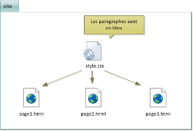

# Créer ses propres pages web

## Introduction

Nous consultons tous les jours des sites Web. Pour les sites les plus connus, on peut s’apercevoir que l’affichage et les fonctionnalités sont identiques quel que soit le navigateur utilisé (ce n’est pas toujours le cas pour des sites moins connus) à quelques détails près.

Les pages Web sont créées à l’aide de langages informatiques. Le respect des règles définies pour ces langages permet de créer des pages WEB qui pourront être lues correctement quel que soit le navigateur.

Pour créer la page Web visualisée, ont été utilisés les langages HTML et CSS. Le langage HTML a été créé en 1991 par Tim Berners-Lee. Ce dernier a aussi créé le World Wide WebConsortium (W3C) qui définit les nouvelles versions et les standards des langages liés au Web.

## Ma première page

### HTML et éditeurs

Pour créer des pages Web, on peut utiliser:

* Des logiciels WYSIWYG (What You See Is What You Get); ce sont des programmes(Mozilla Composer, Dreamweaver et même les traitements de texte) qui permettent de créer des sites sans apprendre de langage particulier. Les pages web sont générés automatiquement. Permettant une création plus rapide au démarrage, ils présentent cependant l’inconvénient de modifications plus laborieuses (le codage n’est pas optimisé,rendant toute modification problématique)

* Des éditeurs de texte, ce sont des programmes dédiés à l'écriture de code (pas seulement HTML ou CSS) plus ou moins évolués (les fonctionnalités de certains facilitent l'écriture du code). Nous utiliserons l'éditeur de texte Visual Studio Code Pour télécharger ce logiciel, il faut se rendre à l’adresse suivante : [https://code.visualstudio.com](https://code.visualstudio.com).

### Code

* Dans vos documents, créer un dossier nommé `site_essai`. 
* Puis dans ce dossier, créer à nouveau un dossier nommé `img` pour les images.
* Ouvrir *Visual Studio Code* et créer un nouveau document. Pour cela, il faut cliquer sur `Fichier` dans la barre d’outil puis `Nouveau Fichier texte` ou `CTRL+N`.
* Cliquez `Selectionnez un langage`et choisir `html`.
* Faire `Fichier` puis `Enregistrer` et choisir `site1.html`.
* Maintenant, vous pouvez écrire votre propre page web. Dans l'éditeur taper `!` suivi de TAB. Vscode créé alors automatiquement la structure minimaliste suivante d'une page Web.

``` html linenums="1"
<!DOCTYPE html>
<html lang="en">
<head>
    <meta charset="UTF-8">
    <meta name="viewport" content="width=device-width, initial-scale=1.0">
    <title>Document</title>
</head>
<body>
    
</body>
</html>
```

* Entre les balises `<body>`et `</body>` insérer la ligne de code html suivante : 

``` html linenums="1"
<p> Bonjour tout le monde </p> 
```

* Mettre en forme votre code en effectuant un clic droit sur votre code puis `Mettre le document en forme`.

* A ce stade, vous devriez obtenir le code suivant :

``` html title="Code 1" linenums="1" 
<!DOCTYPE html>
<html lang="en">

<head>
    <meta charset="UTF-8">
    <meta name="viewport" content="width=device-width, initial-scale=1.0">
    <title>Document</title>
</head>

<body>

    <body>
        <p> Bonjour tout le monde </p>
    </body>

</body>

</html>
```

* Pour visualiser votre page web, plusieurs solutions :
  
    * soit retourner dans votre dossier `site_essai`, puis puis ouvrez votre page web dans votre navigateur par défaut en double-cliquant sur le fichier `site1.html`.
    * soit installer une nouvelle extension `Open in Browser`. Une fois redemarré *VSCODE*, il suffit de cliquer droit sur votre éditeur puis sélectrionner `Open In Défault Browser`. 
    * soit installer une autre extension `Live Preview`. Une fois redemarré *VSCODE*, il suffit de cliquer sur cette icône  en haut à droite de l'éditeur {width=3%} ou afficher l'aperçu après un clic droit.

## Le langage HTML

### Présentation

Le langage HTML (HyperText Markup Language) permet de structurer les éléments d’une page Web. Comme son nom l'indique il permet de créer des liens hypertextes (liens internes à la page ou liens vers d'autres pages web). Il permet également d'inclure dans les pages web des ressources multimédias (images, vidéo…), des formulaires de saisie ...

 HTML n'est pas un langage de programmation (comme Python par exemple), c'est un langage de description qui utilise des balises sémantiques.

### Balises fondamentales

Il y a la balise `<!DOCTYPE html>`. Le doctype (pour Document Type Declaration) permet de renseigner le navigateur Web sur la version de HTML utilisée par le document Web. Le doctype utilisé dans l'exemple fait référence à HTML5. Un fichier HTML est composé de deux parties.

`<head>` et `</head>` : les éléments contenus dans l'entête n'ont pas vocation à être affichés sauf l'élément title dont le contenu apparaît dans l'onglet du navigateur Web. Les informations contenues dans l'entête renseignent sur l'auteur et le contenu du document.

`<body>` et `</body>`: l'ensemble des informations contenues entre ces balises sont affichées dans la fenêtre du navigateur Web.

Les titres importants, de niveau 1, sont insérés entre les balises `<h1>` et `</h1>`.
Les titres moins importants, de niveau 2, insérés entre les balises `<h2>` et `</h2>`. (On peut aller jusqu'à des titres de nveau 7).

L'élément `p`, que nous avons utilisé délimite un paragraphe de texte, a pour balise ouvrante `<p>` et pour balise fermante `</p>`. 

!!! example "Exercice 1"
    Placer dans le *Code 1* un titre et un sous-titre et y placer un second paragraphe.

### Commentaires

Éventuellement des commentaires qui peuvent être insérés n'importe où dans une page web à l'intérieur de la balise orpheline `<!-- commentaires -->`. Les commentaires ne sont pas interprétés par le navigateur et donc pas affichés à l'écran.

!!! example "Exercice 2"
    Placez deux commentaires dans la page web correspondant au *Code1*

### Balises de mise en forme du texte

Bien qu'il existe un langage de mise en forme (le CSS), il peut être utile de connaître certaines balises de mise en forme du texte.

<figure markdown>

| Balises               | Rôle               |
|-----------------------|--------------------|
| `<b>` et `</b>`       | Mise en gras       |
| `<i>` et `</i>`       | Mise en italique   |
| `<u>` et `</u>`       | Soulignement       |
| `<sub>` et `</sub>`   | Mise en indice     |
| `<sup>` et `</sup>`   | Mise en exposant   |
| `<code>` et `</code>` | Code               |
| `<mark>` et `</mark>` | Texte surligné     |

</figure>

!!! example "Exercice 3 : "
    Écrivez une page web nommée `site2.html` et composée d'un titre, d'un sous titre et de deux paragraphes où vous utiliserez toutes les balises de mise en forme du texte. Ces deux paragraphes pourront être du Lorem Ipsum. Pour utiliser cette fonctionnalité, tapez `Lorem` puis la touche tabulation.

### Insertion de liens

HTML (Hyper Text Markup Language) est un langage hypertexte, cela signifie qu'il vous permet en cliquant sur un mot, généralement souligné (ou une image) de vous rendre :

* sur un autre endroit de la page ;
* sur un autre fichier HTML situé sur votre ordinateur.
* sur un autre ordinateur en réseau, y compris sur le Web.
  
Pour écrire un lien sur une page web, il faut adopter la syntaxe suivante :

``` html linenums="1"
<a href="lien"> texte </a>`
```

avec:

* texte: mot ou expression qui apparaît en bleu souligné dans la page
* lien :
  1. adresse d'un site (Exemple : https://fr.wikipedia.org/wiki/Informatique)
  2. adresse d'une autre page html située dans notre dossier `site_essai` (exemple: site.html à créer ultérieurement)
  3. ou bien un mot dans la même page web. Pour ce faire, il faut définir un mot cible  grâce à la balise `span` ou `div` en en fonction du fait que l'on veuille une balise de type en ligne ou en bloc. Exemple  : `<div id="mon_ancre">mot_cible<div>` ou `<span id="cible">mot_cible<span>`. On l'appelle par la balise `<a href="#mon_ancre">Aller vers l'ancre</a>`

!!! example "Exercice 4"
    Écrire une troisième page web appelée `site3.html`.  Y placer un titre et 5 paragraphes. Ces deux paragraphes comprendront les trois types de liens : 

    * un  vers une page wikipédia
    * un autre vers `site2.html`
    * enfin un lien qui sera inséré dans le premier paragraphe 1 vers un mot du cinquième paragraphe.

### Insertion d’images

On peut insérer une image (au format png, jpeg ou gif) qui se trouve sans le dossier `img` du dossier `site_essai` grâce à la balise ``.  Pour insérer une image nommée `smiley.png`   préalablement enregistrée dans le sous-dossier ìmg`, on peut procéder de la manière suivante :

``` html linenums="1"
  
```

Détaillons cette ligne :

* `src="img/smiley.png"` Cet attribut obligatoire. L'attribut `src` a comme valeur le chemin de l'image que vous voulez afficher. Il est conseillé de mettre un chemin relatif. 
*  `alt="Smiley face"` spécifie un texte alternatif  si l’image ne s’affiche pas (Smiley face). Cet attribut est recommandé.
* `width="42" height="42"` spécifie la largeur (42 pixels) et la hauteur (42 pixels). Ces attributs sont facultatifs. Il est d'usage plutôt d'utiliser le css pour spécifier la hauteur et la largeur d'une image.

**Exemple : avec une image issue du web.**

<iframe height="300" style="width: 100%;" scrolling="no" title="img" src="https://codepen.io/ga78523/embed/wvJQqyv?default-tab=html%2Cresult&theme-id=dark" frameborder="no" loading="lazy" allowtransparency="true" allowfullscreen="true">
  See the Pen <a href="https://codepen.io/ga78523/pen/wvJQqyv">
  img</a> by eric (<a href="https://codepen.io/ga78523">@ga78523</a>)
  on <a href="https://codepen.io">CodePen</a>.
</iframe>

!!! example "Exercice 5"
    Télécharger sur le web une photographie libre de droit et l'inserer dans une page web.

### Les listes

On peut organiser le texte en liste. Il existe 2 types de listes : 

* Les listes énumérées. Elles sont contenues dans un élément `ol` (abréviation de l’anglais ordered list) ;

* Les listes non-énumérée. Elles sont contenues dans un élément `ul` (abréviation de l’anglais unordered list). 

Quelque soit le type de liste, chaque entrée de liste est contenue dans un élément `li`. Les listes peuvent évidemment être imbriquées.

**Exemple :**

<iframe height="300" style="width: 100%;" scrolling="no" title="liste" src="https://codepen.io/ga78523/embed/dyarxJp?default-tab=html%2Cresult&theme-id=dark" frameborder="no" loading="lazy" allowtransparency="true" allowfullscreen="true">
  See the Pen <a href="https://codepen.io/ga78523/pen/dyarxJp">
  liste</a> by eric (<a href="https://codepen.io/ga78523">@ga78523</a>)
  on <a href="https://codepen.io">CodePen</a>.
</iframe>

### Les tableaux

On peut enfin organiser du texte dans des tableaux au moyen de l’élément `table`, qui contient l’ensemble des lignes du tableau, chacune d’elle consistant en un élément `tr`(abréviation de l’anglais table row = ligne de tableau). Enfin chaque ligne décrit les cases qu’elle contient au moyen de l’élément `td`.

<iframe height="300" style="width: 100%;" scrolling="no" title="Untitled" src="https://codepen.io/ga78523/embed/mdWzByV?default-tab=html%2Cresult&theme-id=dark" frameborder="no" loading="lazy" allowtransparency="true" allowfullscreen="true">
  See the Pen <a href="https://codepen.io/ga78523/pen/mdWzByV">
  Untitled</a> by eric (<a href="https://codepen.io/ga78523">@ga78523</a>)
  on <a href="https://codepen.io">CodePen</a>.
</iframe>

### Pour en savoir plus...

Pour connaître d’autres balises et d’autres attributs, consulter le site [MDN](https://developer.mozilla.org/fr/).

## Le langage CSS (Cascading Style Sheet)

### Introduction

Si nous voulons donner une unité au site, il est recommandé, pour chaque page, de définir un même fond d'écran, une même police de caractères, une même couleur pour les caractères...

Il est possible, dans chacune des pages web, de le faire directement depuis le code html. Par exemple, Dans l'élément body, on peut placer l’attribut bgcolor="# 33CCFF". Celui-ci permet de colorer le fond d’écran en bleu clair (La couleur est écrite en hexadécimal). 

** Exemple :**

``` html linenums="1"
<body bgcolor="#E6E6FA">
    <p>Et voici un fond d'écran bleu clair</p>
</body>
```

Or, nous pouvons aussi utiliser une page de style écrite dans un autre langage : le CSS. Le Langage CSS, apparu en 1996, est complémentaire du langage HTML et permet de gérer la mise en forme (l'apparence) des différentes pages d’un site Web (couleur du texte, police, taille du texte, bordures, fond ...)

Ainsi, dans l’exemple précédent, il suffit de créer une page de style CSS (avec Visual Studio Code par exemple) dans le dossier `site_essai` dans laquelle il est écrit que les fonds d'écran sont en bleu. 

<figure markdown>
{width=400px}
</figure>

**Toutes les pages html créées appelleront la feuille de style nommée ici `style.css` dans l’en-tête (head) de la page grâce à l’instruction :**

``` html linenums="1"
<link href="style.css" rel="Stylesheet" type="text/css">
```

### Exemple de fichier CSS

``` css linenums="1"
body{
    background-color: azure;
}
h1{
    color :red;
    margin: auto;
}
h2{
    color:green;
}
h3{
    color :blueviolet;
}
p{
    color: black;
    text-align: justify;
    font-style: italic;
}
```

Ici, on indique que l’élément `p` (paragraphe) contient du texte aligné des deux côtés (justifié), en italique et de couleur noire. On indique également que l’élément `body` (corps de la page HTML) aura un fond d’écran couleur `gainsboro` c’est-à-dire bleu très clair, que les titres de niveau 1 seront en rouge, ceux de niveau 2 en vet ...

En CSS :

* `Body` et `p `sont nommés **selecteur** ;
* `color`, `text-align`, `background-color` sont nommés** propriétés** CSS ;
* `gainsboro`, `blue`, `justify` sont nommés **valeurs**.

### Pour en savoir plus...

Vous pouvez aller sur :

* le site MDN ([site](https://developer.mozilla.org/fr/)) : la référence ;
* le site W3S où il existe un validateur HTML5 ([site](https://www.w3schools.com));
* le site de Pierre Giraud ([site](https://www.pierre-giraud.com/html-css-apprendre-coder-cours/)).


