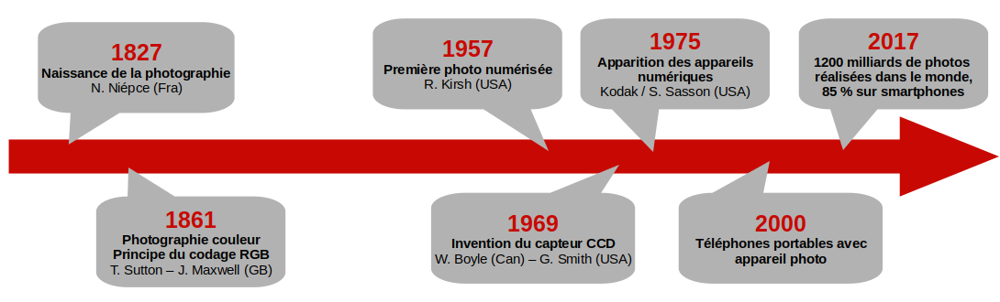
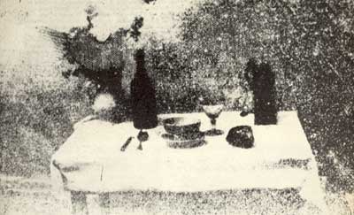
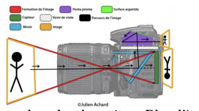
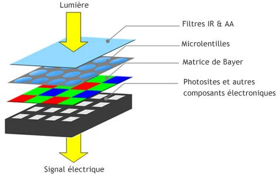

# Du capteur CCD au fichier image

## Brêve histoire de l'appareil photo

L'ancêtre de la photographie numérique, appelé photographie argentique, fonctionnait grâce à des réactions chimiques successives, permettant de fixer sur du papier la lumière capturée par l’objectif de l’appareil photo. L'une des premières photographies (physautotype), attribuée à Nicéphore Niépce, prise à une date non connue au début des années 1820 ou des années 1830 est représentée ci-dessous.

<figure markdown>

</figure>

## Principe d’un appareil photo numérique

### Formation d’une image sur une surface photosensible

<figure markdown>

</figure>

Un appareil photo est composé d’une lentille qui va former une image réduite sur une surface photosensible. Autrefois, la surface
photosensible était une pellicule photographique argentique, aujourd’hui la pellicule est remplacée par un capteur CCD ou un
capteur CMOS.

<figure markdown>

</figure>

Un capteur CCD est une surface photosensible composée d’un grand nombre de photosites. Plus l’intensité lumineuse reçue par le photosite est importante plus le photosite produira une tension électrique importante (effet photoélectrique). Cette tension électrique sera ensuite "convertie" en un nombre (on parle de numérisation) qui sera fonction de la quantité de lumière reçue.

### Nécessité d’une matrice de Bayer

Si l’on se contentait de ce système, nous aurions uniquement des images en niveau de gris. Afin de pouvoir gérer les couleurs, on rajoute
un filtre coloré devant chaque photosite. On utilise des filtres rouges (qui ne laissent passer que le rouge), des filtres verts et des filtres bleus qui correspondent aux 3 couleurs primaires.

<figure markdown>

</figure>

L’image ci-dessus montre que les matrices dites "de Bayer" sont constituées de 50% de filtres verts, de 25% de filtres rouges et de 25%
de filtres bleus. Cette répartition est adaptée à la physiologie de l’oeil humain qui est nettement plus sensible à la couleur verte qu’aux couleurs bleue et rouge. L’association de 4 photosites (deux verts, un rouge et un bleu) permettra de fournir les informations de couleur d’un pixel de l’image.

## Les caractéristiques d’une image

### La définition d’une image

!!! success "Définition :  PIXEL"
    Abréviation de PIcture Element. C’est le plus petit élément d’une image numérique.

!!! success "Définition :  définition d'une image"
    La définition d’une image correspond au nombre de pixels qui la composent. Une image ayant une
    définition de 4000×3000 est composée de 4000 pixels en largeur et de 3000 pixels en hauteur, soit en
    tout 4000× 3000 = 12 millions de pixels = 12 M pixels

!!! success "Définition : résolution d'une image"
    La résolution d’une image est le nombre de pixels par unité de longueur . Elle s’exprime en pixels par pouce (ppp), en anglais en dots per inch (dpi). Sachant qu’un pouce mesure 2,54 cm, une résolution de 2400 ppp signifie que l’image a une définition de 2400 points sur une longueur de 2,54 cm.

**Remarque :** la résolution de l’image ne doit pas être confondue avec la résolution du capteur (en nombre de photosites par pouce) qui est généralement bien plus grande que la résolution de l’image.

!!! exemple "Exercice 1"
    Soit une image de définition 4000× 6000 pixels que l’on imprime sur du papier photo de taille 19,8 cm × 29,7 cm. Calculer la résolution de cette image en pixels par cm puis en pixels par pouce (ppp).

!!! exemple "Exercice 2"
    Calculer la résolution d’un capteur plein format (24 mm x 36 mm) qui a permis de saisir l’image de définition 4000 × 6000 pixels mentionnée dans la question Q1. Comparer les 2 résolutions.

!!! exemple "Exercice 3"
    Sachant que l’on estime que pour avoir une impression de qualité il faut atteindre une résolution de 300 ppp, calculer la définition minimale d’une image dans le cas d’une impression sur du papier photo de dimensions 10 cm × 15 cm.

### La profondeur de couleur

#### Unité élémentaire du stockage informatique

L’unité élémentaire utilisée en informatique pour coder l’information est appelée bit, contraction de binary digit (chiffre binaire).
Il peut prendre deux valeurs, désignées le plus souvent par les chiffres 0 et 1.

!!! exemple "Exercice 4"
    Supposons que l’on souhaite coder des couleurs en binaire.

    * Combien de couleurs peut-on coder sur un bit ? 
    * Si l’on souhaite coder davantage de couleurs, il va falloir utiliser une séquence de plusieurs bits appelée
    mot binaire (ou nombre binaire). Commment est appelé un mot de 8 bits ?
    * Combien de couleurs peuvent coder des mots de 2 bits, 3 bits ... n bits.

#### Les composantes RVB

!!! exemple "Exercice 5"

    * Lancer GIMP et charger une image depuis le menu fichier Ouvrir ;
    * Si la boite à outils n’est pas ouverte, l’ouvrir depuis le menu Outils puis Boite à outils. 
    * Sélectionner l’outil pipette puis cliquer sur un pixel de l’image.
    * Cliquer ensuite sur la couleur de premier plan sélectionnée afin d’afficher les informations relatives à la
    couleur du pixel.

!!! success "Définition : synthèse additive"
    Les couleurs sont réalisées en superposant des lumières colorées (synthèse additive). Elle utilise trois couleurs primaires : le rouge, le vert et le bleu, ce qui est connu sous le sigle RVB (ou RGB pour Red Green Blue). Chaque couleur est l’addition de 3 composantes : le rouge le vert et le bleu

#### La profondeur de couleur

!!! success "Définition : profondeur de couleur"
    On appelle profondeur de couleur le nombre de bits qui permet de décrire la couleur d’un pixel. Elle
    est généralement de 8 bits (1 octet) par composante RVB, soit 3×8 = 24 bits au total (3 octets).

!!! exemple "Exercice 6"
    Avec une profondeur de couleur de 8 bits, à quelle couleur correspondent RVB(255, 0, 0), RVB(0,255,0), RVB(125,125,125)

!!! exemple "Exercice 7"
    Les 3 composantes RVB suffisent-elles à décrire la palette complète des couleurs visibles ?

!!! exemple "Exercice 8"
    Combien de couleurs peut on coder avec une profondeur de couleur de 24 bits ?

!!! exemple "Exercice 9"
    Quels seraient les avantages et les inconvénients d’utiliser une profondeur de couleur plus importante ?

#### La taille (ou poids) d’une image

!!! success "Définition : taille"
    La taille de l’image correspond au nombre d’octets qu’occupe le fichier de l’image lors de son stockage.

!!! exemple "Exercice 10"
    Comment peut-on calculer la taille de l’image si elle n’est pas compressée ?

## Les métadonnées EXIF

Une image numérique n’est pas qu’une liste de pixels. C’est aussi un fichier qui peut contenir des informations diverses : les métadonnées EXIF (Exchangeable Image File Format).

Un moyen simple de lire ces métadonnées est d’effectuer un clic droit sur l’image depuis l’explorateur de fichier et de sélectionner "propriétés".

!!! exemple "Exercice 11"
    Quels types d’informations renferment les métadonnées ?

!!! exemple "Exercice 12"
    Pourquoi les métadonnées peuvent-elles s’avérer... sensibles ?
