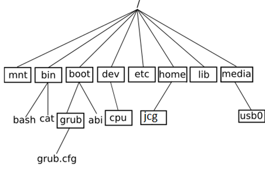

# Commandes Linux

## Chemin absolu et relatif

### introduction

En informatique, les contenus sont généralement stockés dans des fichiers.

Comme ceux-ci sont vite très nombreux, pour s'y retrouver on a conçu les systèmes de fichiers comme des arborescences : les fichiers sont stockés dans des répertoires), et en plus des fichiers chacun de ces répertoires peut lui-même contenir plusieurs autres répertoires.

La référence à une ressource (fichier ou répertoire) s'appelle un chemin d'accès (en anglais : path). Dans ce chemin, sous Linux, les noms des répertoires et éventuel fichier sont séparés par un slash / (alors qu'on utilise un antislash \ sous Windows).

Il existe deux types de chemin : absolu et relatif.

### Chemin absolu

Un chemin absolu se base sur la racine de l'arborescence et commence par `/`, par ex. : `/home/utilisateur/<dossier>/<fichier>`. Il reste valable quel que soit le contexte (à condition quand même d'être sur le même système d'une même machine).

`/` au tout début d'un chemin est donc à peu près l'équivalent du `C:\ `sous Windows.

### Chemin relatif

Un chemin relatif est a priori relatif au répertoire courant où se trouve l'utilisateur. Un chemin qui commence par autre chose que `/` ou `~` est un chemin relatif. Cette notion de positionnement dépend du contexte, mais sous Linux on se trouve généralement par défaut dans son répertoire personnel qui est `/home/<nom d'utilisateur>`. Dans un terminal on peut naviguer d'un répertoire à l'autre avec la commande `cd` .

On peut aussi utiliser ce type de chemin pour indiquer où se trouvent les ressources les unes par rapport aux autres, indépendamment de la racine du système, par exemple pour que les fichiers d'un site web susceptibles d'être déplacés ensemble puissent se retrouver les uns les autres.

## Arborescence Linux

Une façon d’interagir avec le système est d’utiliser un terminal (ou console) dans lequel vous pourrez taper des commandes (qui ne sont rien d’autre que des programmes). Le programme avec lequel vous interagissez pour exécuter les
commandes s’appelle le shell.

Pour ouvrir une console, il faut aller dans le menu, puis Administration et terminal .

Le shell vous indique qu’il est prêt en affichant une invite (ou prompt), en général le caractère dollar ($\$$) ou supérieur ($>$), en début de ligne. Le shell est idéal pour exécuter des commandes « simples » permettant souvent de manipuler des fichiers sur le disque dur et qui affichent leur résultat directement dans le shell (ls, cp, mv,...). Ces commandes, puisqu’elles
utilisent le shell pour leurs interactions, ne peuvent être exécutées en dehors d’un terminal.

L’arborescence d’un système GNU/Linux se présente sous la forme représentée en Figure 2.

<figure markdown>

</figure>

Tous les systèmes UNIX accordent une grande importance aux fichiers.

UNIX VOIT SES PÉRIPHÉRIQUES ET SES PROCESSUS COMME DES FICHIERS.

Par exemple :
``` shell
$ ls /
bin   dev         lib    media  proc  run   sys  var
boot  etc         lib64  mnt    root  sbin  tmp
home  lost+found  opt    srv    usr
```

* / le dossier racine de l’arborescence
* Tous les dossiers qui se terminent par bin contiennent des exécutables en binaire.
* `home` : dossiers des utilisateurs
* `dev` : le matériel
* `etc` : les reglages
* `root` : dossier de l’utilisateur root
* `mnt` et `media` : les points de montage des disques et partitions externes (là où apparaissent les clés usb etc.)

## Les différentes commandes linux utiles pour le bac

* La commande `cd` permet de changer le répertoire courant. Il suffit d'indiquer le chemin (relatif ou absolu) qui permet d'atteindre le nouveau répertoire. La commande `cd ..` permet de remonter d'un étage dans l'arborescence ;
* La commande `ls`permet de lister tous les fichiers et les dossiers présents dans un répertoire ;
* La commande `mkdir` permet de créer un répertoire dans le répertoire courant. La commande est de la forme `mkdir nom_du_répertoire` ;
* La commande `touch` permet de créer un fichier vide. La commande est de la forme `touch nom_du_fichier_à_créer`;
* la commande `cat` permet d'afficher dans la console le contenu d'un fichier. La commande est de la forme 'cat nom_du_fichier`;
* La commande `cp` permet de copier un fichier. La commande est de la forme `cp /répertoire_source/nom_fichier_à_copier /répertoire_destination/nom_fichier`
* la commande `mv` permet de déplacer un fichier dans un dossier. Par exemple un `mv toto.txt titi` déplacera le fichier `toto.txt` dans le répertoire `titi` ;
* la commande `man` permet de connaitre toutes les options d'une commande.

## Les permissions

### Voir les droits

La sécurité sous unix est gérée par la notion de permission.

Un utilisateur ne peut pas faire ce qu’il veut. 

Le super utilisteur root peut tout faire. Devenir root avec `$ su`, exécuter une commande comme root avec `$ sudo commande`.

L’affichage détaillé d’un fichier (`ls -lah`) montre :

* les permissions de l’utilisateur courant
* de son groupe ;
* de tout le monde.

**Exemple :**

``` shell
-rwxr-xr-x 1 eric eric  324  2 déc.  21:45 deploy.sh
-rw-r--r-- 1 eric eric 3,6M  5 déc.  08:32 inside.log
```

traduction :

* - : pas activé
* d : directory
* r : droit de lecture
* w : droit d'écritude
* x : droit d'exécution

### Changer les droits

On change les permissions avec `chmod` soit en ajoutant ou retirant un flag : `$ chmod +x inside.log` rendra ce fichier exécutable soit en décrivant la permission par 3 chiffres :

* 1 : possibilité d'exécution ;
* 2 : possibilité d'écriture ;
* 4 : possibilité de lecture.

Il est également possible d'en faire la somme : Ex 7 = 1 + 2 + 4 = tous les droits. Et en fonction de la place de ce chiffre, la permission s'applique à l'utilisateur courant, au groupe, ou à tout le monde.

**Exemple :** `$ chmod 764 inside.log`. Avec le premier 7 je sais que je peux tout faire (lire, écrire et exécuter), le deuxième 6, je sais que mon groupe ne peut pas exécuter mais il peut lire et écrire dessus. Et enfin le dernier 4, je sais que tout le monde peut lire mais pas lire ni l'exécuter.