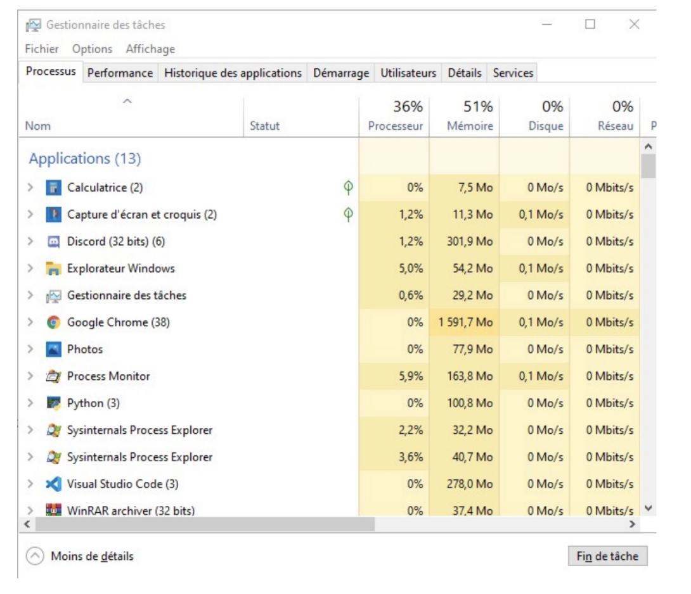

# Gestion des processus et ressources

## Introduction

Le système d'exploitation permet :

* aux applications et programmes de s'exécuter en bonne intelligence sur un ordinateur.
* la prise en charge de périphériques comme le clavier, l'écran ;
* la prise en charge de la mémoire.

L'exécution des programmes est prise en charge par les processus et les périphériques identifiés comme des ressources dont la disponibilité est gérée par le système.

Ce chapitre a pour but de présenter ce qu'est un processus et de présenter le mécanisme d'ordonnancement du système d'exploitation pour partager l'utilisation du ou des processeurs entre l'ensemble des processus.

## Programme et processus

Un **programme** est composé d'une suite d'instructions. Ces instructions sont généralement stockées dans un fichier. L'exécution de ce programme consiste en l'exécution, les unes après les autres des instructions composant ce programme.

Cette exécution est prise en charge par un processus crée par le système d'exploitation. Celui-ci va :

* charger les instructions du programme en mémoire ;
* écrire l'adresse mémoire de la première instruction dans le compteur de programme (CP).

Le cycle d'exécution du processeur permet l'exécution une à une des instructions du programme par le microprocesseur.

La notion de processus se distingue donc de la notion de programme. Un programme est une description statique des intructions tandis qu'un processus correspnd à une exécution effective de ces instructions. Un même programme peut être exécuté plusieurs fois, chaque exécution est prise en charge par un processus différent. On dit qu'un processus est un **instance d'exécution** du programme.

Un processus est donc un entité qui évolue dans le temps. Dans un premier temps, il est crée par l'utilisateur (on dit  qu'il lance le programme). Le processus est actif, c'est-à-dire qu'il exécute les intructions qui compose son programme. Le processus opère des variables (celles définies dans le programme) et manipule des ressources (telles que des fichiers, des fenêtres, etc...). Ces éléments constitue le contexte d'exécution du processus. Enfin, un processus peut se terminer . Les ressources présentes dans son contexte d'exécution sont alors libérées (les fenêtres fermées, les variables supprimées, etc...).

## Exemple de processus

### Avec windows

Microsoft Windows est architecturé en services (processus) fonctionnant en arrière-plan. Il est possible d'afficher facilement la liste des processus en cours dans le gestionnaire des tâches en appuyant simultanément sur CTRL+SCHIFT+ESC, ou en exécutant directement taskmgr.exe dans la barre de recherche

Si vous lancez le gestionnaire de tache pour la première fois, vous serez peut-être amené à cliquer sur "Plus de détails " en bas à Gauche de la fenêtre.

Vous verrez alors une fenêtre avec six onglets.

Dans l'onglet Processus, vous verrez tous ceux s'exécutant sur votre machine, ainsi que les ressources qu'ils consomment. On distingue trois catégories:

* Applications ;
* Processus en arrière-plan ;
* Processus Windows.

<figure markdown>

</figure>

Par un simple clic droit sur son nom, suivi de fin de tâche on peut facilement tuer un processus, c'est très pratique lorsqu'un programme ne répond plus.

Dans l'onglet *Performance*, nous pouvons voir graphiquement les ressources utilisé.

<figure markdown>

</figure>

Dans l’onglet *Historique des applications*, nous pouvons voir les ressources utilisées par application.

<figure markdown>

</figure>

Dans l’onglet *Démarrage*, nous pouvons voir toutes les applications qui se lancent au démarrage de Windows.

Dans l’onglet *Détails*, nous pouvons voir le PID (Processus IDentifier) des processus et leurs statuts.

<figure markdown>

</figure>

### Avec Linux ou un système UNIX

#### La commande ps

La commande `ps` (penser à ProcessuS) est utilisée pour afficher des informations sur un processus.

L’option u permet de préciser le propriétaire, l’option l permet d’afficher plus d’attributs (long).

Par exemple, pour connaître les processus appartenant à l’utilisateur :

``` shell linenums="1"
% ps -lu ericgaland
UID PID PPID F CPU PRI NI SZ RSS WCHAN S ADDR TTY TIME CMD
502 441 1 4004 0 37 0 33665772 3752 - S 0 ?? 1:19.89 /usr/sbin/distnoted ag
502 442 1 4004 0 4 0 33730640 4252 - S 0 ?? 0:23.41 /usr/sbin/cfprefsd age
502 444 1 40004004 0 31 0 33761664 12568 - S 0 ?? 0:07.38 /usr/libexec/UserEvent
502 447 1 4004 0 4 0 33765408 9420 - S 0 ?? 0:00.46 /System/Library/Privat
502 449 1 4004 0 4 0 33773364 27668 - S 0 ?? 0:15.94 /usr/libexec/knowledge
502 451 1 4004 0 4 0 33729300 3500 - S 0 ?? 0:00.52 /usr/libexec/WiFiVeloc
502 452 1 4004 0 4 0 33767788 12048 - S 0 ?? 0:05.87 /usr/libexec/lsd
502 453 1 4004 0 31 0 33768668 12676 - S 0 ?? 0:01.93 /usr/sbin/usernoted
```

* La colonne S indique l’état (state) du processus : S pour stopped, R pour Running et Z pour Zombie
* PID est le processus identifier : un identifiant sous forme d’entier donné par le système.
* PPID est le parent processus identifier qui donne l’identifiant du parent qui a engendré le processus
* CMD est le nom de la commande

### La commande `top`

<figure markdown>

</figure>

#### La commande `pstree`

À noter que la commande `pstree` permet d'afficher les processus sous forme d'arborescence :


#### La commande `kill`

Il n’est parfois pas possible de fermer un processus graphique en cliquant par exemple sur la croix prévue pourtant à cet effet.On peut utiliser la commande kill si on connait le PID du processus à "tuer".

## L'ordonnancement des processus

### Différents types d'ordonnancement

Si on vous donne 4 tâches A, B, C et D à accomplir, vous pouvez décider :

* de faire la tâche prioritaire d'abord ;
* de faire la tâche la plus rapide d'abord ;
* de faire la tâche la plus longue d'abord ;
* de les faire dans l'ordre où elles vous ont été données ;
* de faire à tour de rôle chaque tâche pendant un temps fixe jusqu'à ce qu'elles soient toutes terminées;
* ...

Plusieurs stratégies peuvent être appliquées :

Le schéma ci-dessous (issu de ce [site](https://medium.com/@sheenam.mca17.du/process-scheduling-b86975413079)) présente quelques politiques d'ordonnancement :

<figure markdown>

</figure>

C'est la partie du système d'exploitation appelée **ordonnanceur** qui est en charge de ce choix.

Généralement, l'ordonnanceur applique une politique de **temps partagé**. Le principe de fonctionnement est le suivant. Un algorithme d'ordonnancement choisit un processus parmi l'ensemble des processus en attente d'exécution. Ce choix est guidé par différents critères qui dépendent du système d'exploitation. Ce processus élu s'exécute alors pendant une certaine tranche de temps appelée **quantum d'ordonnancement**. A l'issue de ce quantum, l'ordonnanceur interromp l'exécution de ce processus et sollicite l'algorithme d'ordonancement pour procéder à un nouveau choix.

### Les états d'un processus

Selon que l'ordonnanceur aura décidé de le confier ou non au processeur pour son exécution, un processus peut donc se trouver dans 3 états :

* **Prêt** : il attend qu'arrive le moment de son exécution.
* **Élu ou actif** : il est en cours d'exécution par le processeur.
* **Bloqué** : pendant son exécution (état Élu), le processus réclame une ressource qui n'est pas immédiatement disponible. Son exécution s'interrompt.Lorsque la ressource sera disponible, le processus repassera par l'état Prêt et attendra à nouveau son tour.

Il existe aussi un état **zombie**. Il s'agit d'un processus qui s'est terminé, mais qui n'est pas entièrement retiré immédiatement de la mémoire.

<figure markdown>

</figure>

## Interblocage

### Définition et exemple

Comme nous venons de le voir, un processus peut être dans l'état bloqué dans l'attente de la libération d'une ressource.

Ces ressources (l'accès en écriture à un fichier, à un registre de la mémoire...) ne peuvent être données à deux processus à la fois. Des processus souhaitant accéder à cette ressource sont donc en concurrence sur cette ressource. Un processus peut donc devoir attendre qu'une ressource se libère avant de pouvoir y accéder (et ainsi passer de l'état Bloqué à l'état Prêt).

**Problème :** Et si deux processus se bloquent mutuellement la ressource dont ils ont besoin ?

**Exemple :** Considérons 2 processus A et B, et deux ressources R et S. L'action des processus A et B est décrite ci-dessous :

<figure markdown>

</figure>

Déroulement des processus A et B :

* A et B sont créés et passent à l'état Prêt.
* L'ordonnanceur déclare Élu le processus A (ou bien B, cela ne change rien).
* L'étape A1 de A est réalisée : la ressource R est donc affectée à A.
* L'ordonnanceur déclare maintenant Élu le processus B. A est donc passé à Prêt en attendant que son tour revienne.
* L'étape B1 de B est réalisée : la ressource S est donc affectée à B.
* L'ordonnanceur déclare à nouveau Élu le processus A. B est donc passé à Prêt en attendant que son tour revienne.
* L'étape A2 de A est donc enclenchée : problème, il faut pour cela pouvoir accèder à la ressource S, qui n'est pas disponible. L'ordonnanceur va donc passer A à Bloqué et va revenir au processus B qui redevient Élu.
* L'étape B2 de B est donc enclenchée : problème, il faut pour cela pouvoir accèder à la ressource R, qui n'est pas disponible. L'ordonnanceur va donc passer B à Bloqué.

Les deux processus A et B sont donc dans l'état Bloqué, chacun en attente de la libération d'une ressource bloquée par l'autre : ils se bloquent mutuellement.

Cette situation (critique) est appelée **interblocage ou deadlock**.

### Représentation schématique

* Les processus seront représentés par des cercles, les ressources par des carrés.
* Si à l'étape A1 le processus A a demandé et reçu la ressource R, la représentation sera :

<figure markdown>
{width=150px}
</figure>

* Si à l'étape A2 le processus A est en attente de la ressource S, la représentation sera :

<figure markdown>
{width=150px}
</figure>

* Avec ces conventions, la situation précédente peut donc se schématiser par :

<figure markdown>
{width=150px}
</figure>

Ce type de schéma fait apparaître un cycle d'interdépendance, qui caractérise ici la situation de deadlock.