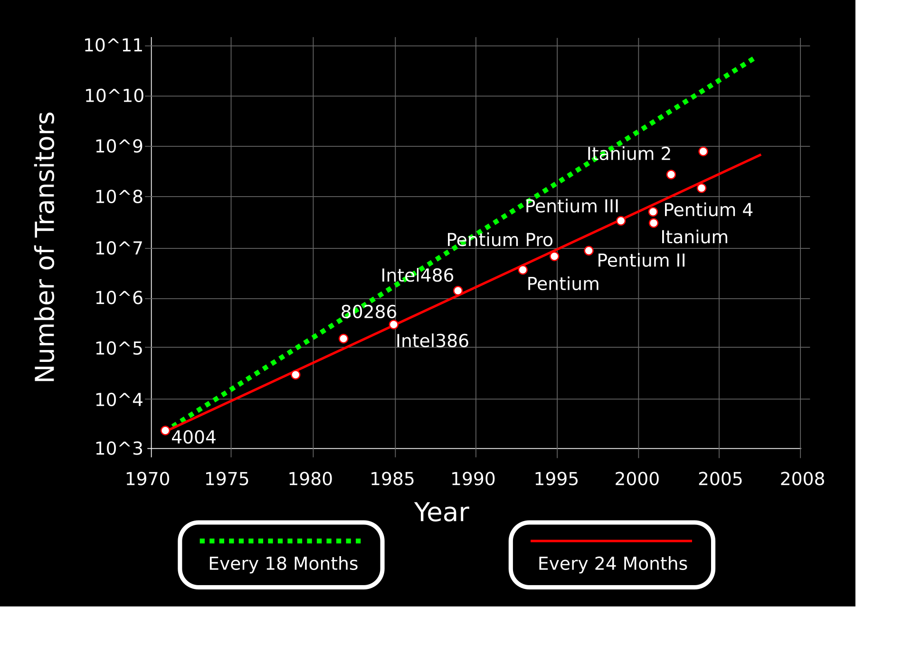
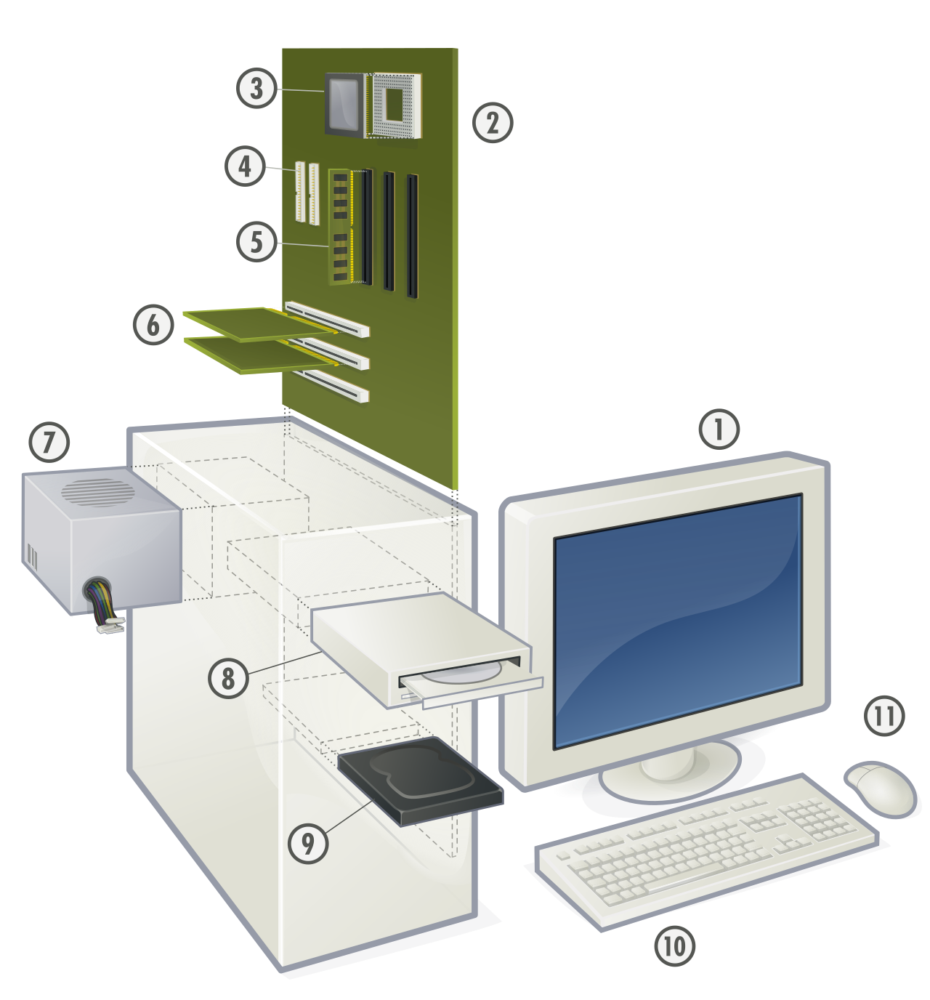
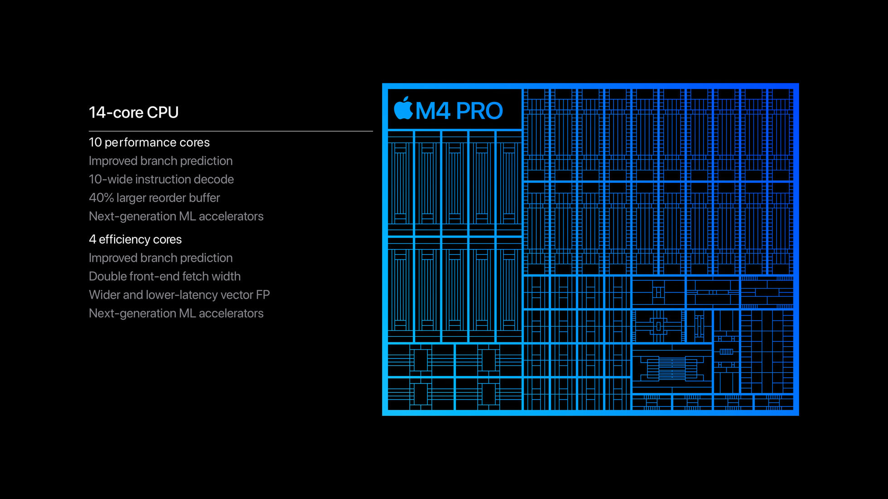
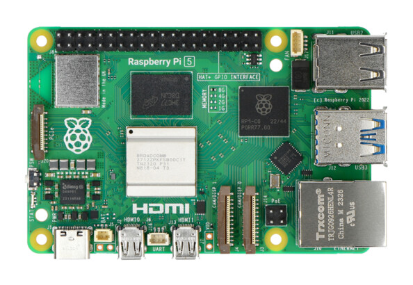
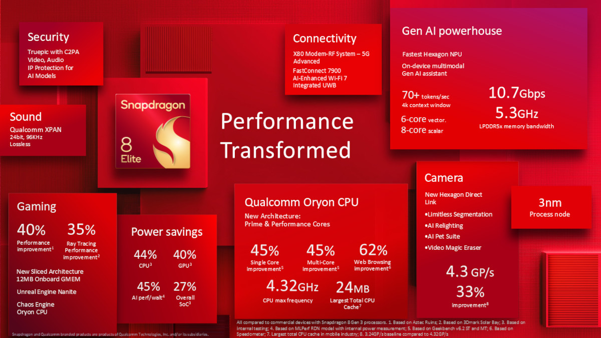

# Les SoC (System on a Chip)

## Rappels

### Transistor et loi de Moore

<figure markdown>
<iframe width="560" height="315" src="https://www.youtube.com/embed/n9fb6F1MWHc?si=ADZzfyoemW9Q4MF3" title="YouTube video player" frameborder="0" allow="accelerometer; autoplay; clipboard-write; encrypted-media; gyroscope; picture-in-picture; web-share" referrerpolicy="strict-origin-when-cross-origin" allowfullscreen></iframe>
</figure>

En 1965, Gordon Moore postule que le nombre de transistors présents sur une puce de microprocesseur doublera tous les deux ans.

<figure markdown>
{width=500px}
</figure>

!!! example "Exercice 1"
    Si dans les années 70, on pouvait placer 2000 transistors sur une surface de 10 mm2, quelle surface aurait été nécessaire pour placer deux milliards de transistor ?

### Fonctionnement d'un ordinateur

Le fonctionnement d’un outil numérique, que ce soit un ordinateur, une tablette, un téléphone, un assistant GPS ou un appareil photo est basé sur des éléments fondamentaux :

* le processeur (CPU)
* la mémoire
* la carte graphique
* les interfaces réseaux

<figure markdown>
{width=400px}
</figure>

Éclaté d'un ordinateur personnel : 1 : Écran ; 2 : Carte mère ; 3 : Processeur ; 4 : Parallèle ATA ; 5 : Mémoire vive (RAM) ; 6 : Connecteurs d'extensions : Carte Graphique, Carte Son, Carte réseau, etc. ; 7 : Alimentation électrique ; 8 : Lecteur de disque optique ; 9 : Disque dur, disque électronique ; 10 : Clavier ; 11 : Souris.

## Loi de Moore

## Les SoC

### Définition

Un SOC (System on  a Chip) est une puce électronique dans laquelle on
peut retrouver :

* le processeur central à un ou plusieurs cœurs
de calcul ;
* un processeur graphique ;
* la mémoire vive ;
* la mémoire statique (Rom, Flash, EPROM) ;
* les puces de communications (Bluetooth, WiFi,
2G/3G/4G/5G, . . . )
* des capteurs ;
*  ...
  
En clair, le système sur une puce comprend tous
les éléments essentiels d’un ordinateur comprimé dans une 
forme réduite.

!!! example "Exercice 2 :"
    Rechercher le SOC de votre téléphone portable.

### Les avantages des SOC

* moindre consommation électrique
* moindre encombrement
* pas besoin de refroidissement
* meilleure sécurité (vue globale sur la sécurité qui n'est plus dépendante d'une multitude de composants)
* moindre coût (forte automisation du processus, gros volumes de production)

### Les inconvénients des SOC

* Impossibilité de choisir indépendamment ses composants
* Pas de mise à jour possible / remplacement / ajout d'un composant
* La panne d'un seul composant entraîne la panne totale du SoC

### Les familles de SoC

Il n’y a pas un seul système sur une puce. Les utilisations variées de ce type de circuit intégré demande des architectures sensiblement différente. On distingue trois grandes familles de SoC :

* Le système sur une puce construit autour d’un **microcontrôleur**, la forme la plus simple d’un SoC qui a donné naissance aux **cartes Arduino**.

* Le système sur une puce construit autour d’un **microprocesseur**. Il s’agit du SoC, le plus répandu parce qu’utilisé par tous les fabricants de smartphones. Doté d’un Bus externe, il permet de connecter de nombreux capteurs.

* Le système sur une puce dédié à une tâche spécifique. Cette dernière famille comprend notamment les puces reprogrammables FPGA.
  
L’Internet des objets peut faire intervenir les trois familles de système sur une puce, suivant la complexité de l’objet, du capteur ou du système embarqué connecté à concevoir.

 Cependant, le Soc basé sur un microprocesseur prend généralement place dans la plupart des objets connectés. Suivant les fabricants et les besoins, il existe plusieurs architectures. Deux d’entre elles prennent place dans la grande majorité des produits électroniques conçus ces vingt dernières années.

**L’architecture ARM :**

Conçu par la société du même nom, l’architecture ARM a été développé en interne à la fin des années 1980. C’est en 1987 qu’elle est la première fois utilisée dans la gamme d’ordinateurs 32 Bits Archimede. L’architecture ARM ne dépend pas d’un seul fabricant. Le modèle économique de l’entreprise repose sur la vente de licences à d’autres fabricants. Les SoC d’ARM se retrouvent ainsi dans la plupart des smartphones et des objets connectés.

**L’architecture X86 :**

Voici l’architecture la plus répandu dans le monde. Conçue par Intel, elle est utilisée commercialement depuis 1978. Cette architecture a permis de développer les processeurs des ordinateurs, des serveurs ou encore de certaines tablettes. Intel Atom est la gamme SoC du célèbre fondeur. Cependant, l’architecture X86 est beaucoup moins utilisée pour développer les modèles d’un système sur puce IoT.

**Quelles sont les différences entre les systèmes ARM et les sytèmes x86 :**

* Jeu d'instructions : ARM utilise un jeu d'instructions RISC (Reduced Instruction Set Computing) simplifié, tandis que x86 utilise un jeu d'instructions CISC (Complex Instruction Set Computing) plus complexe.
* Efficacité énergétique : Les SoC ARM sont généralement plus économes en énergie, ce qui les rend idéaux pour les appareils mobiles et les systèmes embarqués. Les SoC x86, en revanche, consomment plus d'énergie mais offrent des performances brutes plus élevées13.
Performance : Historiquement, les SoC x86 ont dominé en termes de performances pures, mais les SoC ARM ont considérablement progressé ces dernières années, se rapprochant des performances x86 dans certains domaines.
* Domaines d'application : Les SoC ARM sont largement utilisés dans les smartphones, tablettes et systèmes embarqués, tandis que les SoC x86 dominent dans les ordinateurs de bureau, les serveurs et les ordinateurs portables.
* Compatibilité logicielle : Les SoC x86 bénéficient d'un écosystème logiciel plus riche, particulièrement pour les systèmes d'exploitation de bureau et les applications professionnelles. Les SoC ARM ont un fort support pour les systèmes d'exploitation mobiles, mais un support plus limité pour les logiciels de bureau.
* Méthodes d'accès à la mémoire : Les SoC ARM se concentrent sur le traitement basé sur les registres, limitant l'accès direct à la mémoire pour améliorer l'efficacité énergétique. Les SoC x86 offrent une interaction plus directe avec la mémoire, permettant une plus grande variété de tâches de calcul.
* Complexité de programmation : La programmation pour les SoC ARM nécessite généralement des commandes plus détaillées, ce qui peut représenter une courbe d'apprentissage pour les développeurs. Les SoC x86 ont des couches supplémentaires qui facilitent la gestion des instructions complexes.
* Production de chaleur : Les SoC ARM génèrent généralement moins de chaleur, ce qui les rend adaptés aux appareils portables. Les SoC x86 nécessitent donc des mesures de dissipation thermique plus strictes.

Ces différences font que chaque architecture est mieux adaptée à certains types d'applications.

### Exemples de SOC

* [L'Apple M4](https://fr.wikipedia.org/wiki/Apple_M4) est un système sur puce (SoC) basé sur une architecture ARM conçu par Apple, faisant partie de la série Apple Silicon, comprenant une unité centrale de traitement (CPU), une unité de traitement graphique (GPU), une unité de traitement neuronal (NPU) et un processeur de signal numérique (DSP). 
Le SoC M4 est fabriqué avec le procédé 3 nm (en) de deuxième génération de TSMC et contient 28 milliards de transistors.

    <figure markdown>
    {width=500px}
    </figure>
    Il possède une variante : le A18 (SOC des iphones 16)

    Il est fabriqué par TSMC (Taiwan Semiconductor Manufacturing Company). TSMC est, en 2021, la plus importante fonderie de semiconducteurs indépendante5. Son siège social est situé à Hsinchu, à Taïwan. Fondée en 1987, elle fabrique notamment les puces graphiques de Intel, Nvidia et AMD ainsi que les systèmes sur une puce Snapdragon de Qualcomm, mais également les puces d'Apple.

* On trouve aussi ce système de SoC sur des nano-ordinateurs comme le Rasberry Pi

<figure markdown>
{width=500px}
</figure>

* Snapdragon 8 Elite Mobile Platform SOC qui équipe les samsung S25 ;

<figure markdown>
{width=500px}
</figure>