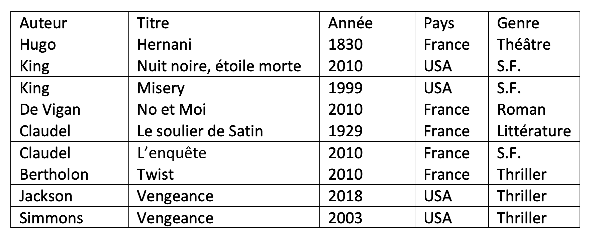

# Introduction aux bases de données

## Introduction aux bases de données

### Introduction

Selon les dernières estimations, le volume de données numériques créées ou répliquées à l’échelle
mondiale a été multiplié par plus de trente au cours de la dernière décennie, passant de 2 zettaoctets(Unité de mesure de quantité d’information numérique, valant $10^{21}$ octets, et dont le symbole est Zo) en 2010 à 64 zettaoctets en 2020. Mais cette quantité apparaît peu élevée en comparaison avec ce qui est attendu dans les prochaines années.

<figure markdown>
{width=400px}
</figure>

 Comme le révèlent les prévisions, le volume de données générées dans le monde devrait dépasser 180 zettaoctets à l’horizon 2025, soit une croissance annuelle moyenne de près de 40 % sur cinq ans. La démocratisation croissante des objets connectés et le développement de la 5G constituent les principaux moteurs de ce "Big Bang" de la donnée. Les données, la gestion et le contrôle des données sont devenues des enjeux très importants.

(source : Statistica)

Depuis quelques années, pour stocker ces données et les rendre disponibles au plus grand nombre. l’utilisation des bases de données relationnelles est la solution.

### Définition d’une base de données (BDD)

Une base de données stocke des informations en rapport avec une activité. Ces informations peuvent être de natures très hétérogènes.

 Les informations sont contenues dans une structure qui permet d’insérer, de supprimer, de mettre à jour et d’interroger les informations contenues.

**Exemple 1 :**
Vous avez un de nombreux livres et vous voulez stocker des informations à propos de ces livres (auteur, pays, date, édition, etc....)

**Exemple 2 :**
Vous disposez chez vous de nombreuses cartes Arduino, capteurs, composants électroniques diverses et variés et vous voulez avoir un inventaire précis de ce que vous avez.

### Définition d’un système de base de données (SGBD)

Un Système de gestion de Base de Données (SGBD) peut être vu comme le logiciel qui prend en charge la structuration, le stockage, la mise à jour et la maintenance des données. C’est en fait l’interface entre la base de données et les multiples utilisateurs (ou leurs programmes).

### Historique

Quasiment toutes les bases de données que nous utilisons aujourd’hui sont basées sur les travaux de Edgar Frank Codd(1970. C’est le point essentiel dans l’histoire des bases de données.

On peut établir la chronologie suivante.

<figure markdown>
{width=600px}
</figure>

Nous pouvons d'ailleurs regarder la vidéo suivante pour plus d'information. 

<iframe width="560" height="315" src="https://www.youtube.com/embed/lZ2JPNDCjq8?si=7vzS8WYcKALJwnLi" title="YouTube video player" frameborder="0" allow="accelerometer; autoplay; clipboard-write; encrypted-media; gyroscope; picture-in-picture; web-share" referrerpolicy="strict-origin-when-cross-origin" allowfullscreen></iframe>

### Pourquoi ne pas utiliser un tableur pour réaliser une base de données

!!! example "Exercice 1 :"
    Regarder la vidéo suivante et en déduire les avantages et les inconvénients du tableur pour réaliser une base de données.

<iframe width="560" height="315" src="https://www.youtube.com/embed/Q1Mt6re8Q-8?si=WUM0c3fdy-YWpQxo" title="YouTube video player" frameborder="0" allow="accelerometer; autoplay; clipboard-write; encrypted-media; gyroscope; picture-in-picture; web-share" referrerpolicy="strict-origin-when-cross-origin" allowfullscreen>
</iframe>

## Vocabulaire des bases de données

### Notion de relation, d’attribut et de domaine d’attribut

La notion de relation est au cœur des bases de données relationnelles. Une relation (ou table) peut être vue comme un tableau à 2 dimensions, composé d’une en-tête et d’un corps. Le corps est lui-même composé de t-uplets (lignes) et d’attributs (colonnes). L’en-tête contient les intitulés des attributs de l’entité LIVRE. Le corps contient les données proprement dites.

Un exemple de relation peut se voir sur la figure suivante.

<figure markdown>
{width=600px}
</figure>

Le t-uplet encadré en jaune sur le schéma ci-dessus contient les valeurs (ou éléments) suivantes :

* 11 ;
* La Planète des singe ;
* Boulle ;
* 1963 ;
* 8.
  
L’attribut "titre" est composé des valeurs suivantes :

* 1984 ;
* Dune ;
* Fondation ;
* Le meilleur des mondes ;
* Fahrenheit 451 ;
* Ubik ;
* Chroniques martiennes ;
* La nuit des temps ;
* Blade Runner ;
* Les Robots ;
* La Planète des singes ;
* Ravage ;
* Le Maître du Haut Château ;
* Le monde des A ; ¯
* La Fin de l’éternité ;
* De la Terre à la Lune.
  
Pour chaque attribut d’une relation, il est nécessaire de définir un domaine : Le domaine d’un attribut donné correspond à un ensemble fini ou infini de valeurs admissibles.

**Par exemple :** le domaine de l’attribut "id" correspond à l’ensemble des entiers (la colonne "id" devra obligatoirement contenir des entiers).

**Autre exemple :** le domaine de l’attribut "titre" correspond à l’ensemble des chaînes de caractères (noté TEXT en
général).

**Dernier exemple :** le domaine de l’attribut "note" correspond à l’ensemble des entiers positifs (notés INT en général)

### Résumé

* Relation (ou table) : c’est l’ensemble des enregistrements qui existent sur les données ;
* Enregistrement (t*uplet, éléments ou encore ligne) sont les données elles-mêmes. Le nombre d’enregistrements d’une relation R est appelé cardinal de R ou #R.
* Attribut (champs ou colonne) : les différents champs à remplir ;
* Domaine : un ensemble de valeur que peut prendre une donnée. La notion de domaine est à rapprocher de la notion de type en Python. Ce domaine peut être infini (chaîne de caractère pour caractériser un nom) ou fini
(date de sortie d’un film de 1900 à nos jours ...)

!!! example "Exercice 2 :"
    Dans une médiathèque, les livres sont répertoriés sous forme de base de données. Un extrait sous forme de tableau est représentée ci-dessous. Répondre au questions suivantes.

    1. Quels sont les attributs de ce tableau ?
    2. Combien y a-t-il d’enregistrements ?
    3. Quel est le domaine de chaque attribut ? Précisez s’il est fini ou non.

<figure markdown>
{width=600px}
</figure>

## Le modèle relationnel

### Notion de clé primaire

Afin de ne pas avoir deux t-uplets identiques, on définit la notion de "clé primaire" (ou Primary Key).

Dans une base de données relationnelle, une clé primaire est la donnée qui permet d'identifier de manière unique un enregistrement dans une table

 Autrement dit, si un attribut est considéré comme cléprimaire, on ne doit pas trouver dans toute la relation 2 fois la même valeur pour cet attribut.

Exemple : Dans la relation précédente, l’attribut auteur ne peut pas être une clé primaire ni l’année de publication.
Par contre, il n’est pas inconcevable que le titre du livre soit une clé primaire mais en général, on crée un attribut
particulier pour jouer le rôle de clé primaire.

**Remarques :**

* Une clé primaire peut être composée d’une ou plusieurs colonnes.
* De plus, une clé primaire ne peut jamais avoir la valeur NULL.
* En général, on rajoute un attribut (colonne) nommé id unique pour chaque enregistrement pour jouer le rôle
de clé primaire

### Notion de clé étrangère

Revenons à notre relation "LIVRES". Nous désirons maintenant un peu enrichir cette relation en ajoutant des
informations supplémentaires sur les auteurs, nous obtenons alors la relation de la Figure suivante.

<figure markdown>
{width=600px}
</figure>

Nous avons ajouté 3 attributs ("prenom_auteur","date_nai_auteur" et "langue_ecriture_auteur"). Nous avons aussi renommé l’attribut "auteur" en "nom_auteur".

Comme vous l’avez peut-être remarqué, il y a pas mal d’informations dupliquées, par exemple, on retrouve 3 fois "K.Dick Philip 1928 anglais", même chose pour "Asimov Isaac 1920 anglais"...Cette duplication est-elle indispensable ?

Non ! Est-elle souhaitable ? Non plus ! En effet, dans une base de données, on évite autant que possible de dupliquer l’information (sauf à des fins de sauvegarde, mais ici c’est toute autre chose). Si nous dupliquons autant de données inutilement c’est que notre structure ne doit pas être la bonne ! Mais alors, comment faire pour avoir aussi des informations sur les auteurs des livres ?

La solution est relativement simple : travailler avec 2 relations au lieu d’une seule et créer un "lien" entre ces 2 relations (voir Figure ci-dessous).

Nous avons créé une relation AUTEURS et nous avons modifié la relation LIVRES : nous avons remplacé l’attribut "auteur" par un attribut "id_auteur".

Comme vous l’avez sans doute remarqué, l’attribut "id_auteur" de la relation LIVRES permet de créer un lien avec la relation AUTEURS. "id_auteur" correspond à l’attribut "id" de la relation AUTEURS. L’introduction d’une relation AUTEURS et la mise en place de liens entre cette relation et la relation LIVRES permettent d’éviter la redondance d’informations.

Pour établir un lien entre 2 relations RA et RB, on ajoute à RA un attribut x qui prendra les valeurs de la clé primaire de RB. Cet attribut x est appelé clé étrangère (ou Foreign Key). Cet attribut correspond à la clé primaire d’une autre table, d’où le nom.

<figure markdown>
{width=600px}
</figure>

Dans l’exemple ci-dessus, l’attribut "id_auteur" de la relation LIVRES permet bien d’établir un lien entre la
relation LIVRES et la relation AUTEURS, "id_auteur" correspond bien à la clé primaire de la relation AUTEURS,
conclusion : "id_auteur" est une clé étrangère.

### Les contraintes d’intégrité

Il existe un certain nombres de règles à respecter pour respecter l’intégrité d’une base de données. Ces règles visent
à préserver la cohérence des données et garantir une stabilité de notre base dans le temps.
Il existe des catégories de contraintes d’intégrité à respecter :

* contrainte d’entité :
* contrainte de domaine
* contrainte de référence

#### Contraintes d’entité

Par définition, une relation est un ensemble d’enregistrement. Un ensemble n’ayant pas d’éléments en double, il ne peut pas exister deux fois le même enregistrement dans une relation. Toute relation doit donc posséder une clé unique (clé primaire).

#### Contraintes de domaine

Les données que nous souhaitons stocker dans notre base de données ont des formats différents. On parle alors de domaine. On peut s’inspirer des types de données des langages de programmation que nous avons étudiés (integer, booléens, float, char, string).
Les contraintes de domaine doivent permettre de :

* représenter les données sans perte d’information ;
* d’éviter les erreurs de saisies.
  
#### Contraintes de référence

Correctement construite, une base de données fait appel à des données situées dans différentes relations. Pour que les données restent utilisables et cohérentes, il ne faut pas que l’on puisse détruire des données qui dépendent les une des autres. C’est le rôle de l’intégrité référentielle de protéger ces relations. Autrement dit, l’intégrité référentielle vérifie qu’une valeur de clé étrangère existe bien en tant que valeur de clé primaire dans une autre table.

### Schéma d’une relation (schéma relationnel)

On appelle schéma relationnel l’ensemble des relations présentes dans une base de données. C’est à dire qu’il faut fournir :

* les noms des relations
* la liste des attributs et de leurs domaines
* la clé primaire (on la souligne)
* les clés étrangères (précédées d’un #)
  
Pour notre exemple cela donne :

* LIVRES (id : entiers positifs, titre : str , #id_auteur : entiers positifs, ann_publi : entiers positifs, note : entiers positifs)
* AUTEURS (id : entiers positifs, nom : str, prenom : str, ann_naissance : entiers positifs, langue_ecriture : str )

On peut aussi représenter ce schéma relationnel par :

<figure markdown>
{width=600px}
</figure>