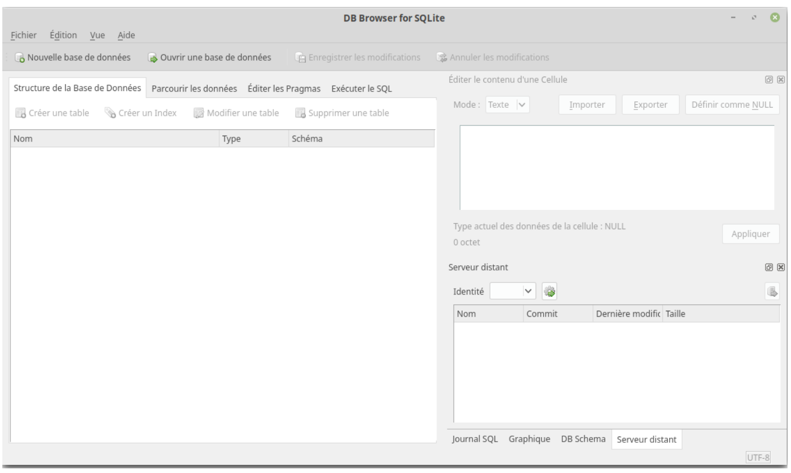
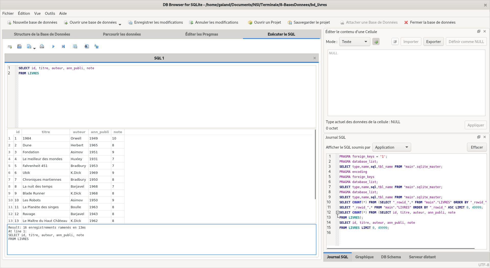

# SQL

## Notion de SGBD relationnel

Un Système de Gestion de Base de Donnée doit répondre aux objectifs suivants :

* **indépendance physique** : la façon dont les données sont définies doit indépendantes des structures de stockage utilisées.
* **indépendance logique** : un même ensemble de données peut-être vu différemment par des utilisateurs différents. Toutes ces visions personnelles des données doivent être intégrées dans une vision globale.
* **accès aux données** : l’accès aux données se fait par l’intermédiaire d’un langage de manipulation de donnée. Il est crucial que ce langage permette d’obtenir des réponses aux requêtes en
un temps "raisonnable". Ce langage doit donc être optimisé, minimiser le nombre d’accès au
disques et tout cela de façon totalement transparente pour l’utilisateur.
* **administration centralisée des données** (intégration) : toutes les données doivent être centralisées dans un réservoir unique commun à toutes les applications.
* **non-redondance des données** : afin d’éviter les problèmes lors des mises à jour, chaque donnée ne doit pas être présente qu’une seule fois dans la base de données.
* **cohérence des données** : les données sont soumises à un certain nombre de contraintes d’intégrité qui définissent un état cohérent de la base. Elles doivent être exprimées simplement et vérifiées automatiquement à chaque insertion, modification ou suppression des données.
* **partage des données** : il s’agit de permettre à plusieurs utilisateurs d’accéder aux mêmes données au même moment de manière transparente. si ce problème est simple à résoudre quand il s’agit d’interrogations, cela ne l’est plus quand il s’agit de modifications dans un contexte multi-utilisateurs.
* **sécurité des données** : les données doivent être protégées contre les accès non autorisées. Pour cela, il faut pouvoir associer à chaque utilisateur des droits d’accès aux données.
* **résistances aux pannes** : que se passe-t-il si une panne survient lors d’une modification de la base de données, si certains fichiers deviennent illisibles ? Il faut pouvoir récupérer une base de données dans un état "sain". Ainsi, après une panne intervenant au milieu d’une modification, deux solutions sont possibles : soit récupérer les données dans l’état dans lequel elles étaient avant la modification, soit terminer l’opération interrompue.

Parmi les SGBD, les plus connus, on peut citer MySQL, PostgreSQL,SQLite, Oracle Database,
Microsoft SQL Server et Microsoft Access. Nous utiliserons SQlite.

## Le langage SQL et le SGBD SQlite

Nous allons maintenant apprendre à réaliser des requêtes, c’est-à-dire que nous allons apprendre
à créer une base des données, créer des attributs, ajouter de données, modifier des données et enfin,
nous allons surtout apprendre à interroger une base de données afin d’obtenir des informations.
Pour réaliser toutes ces requêtes, nous allons devoir apprendre un langage de requêtes : SQL
(Structured Query Language). SQL est propre aux bases de données relationnelles, les autres types
de bases de données utilisent d’autres langages pour effectuer des requêtes.

Pour créer une base de données et effectuer des requêtes sur cette dernière, nous allons utiliser le
logiciel [https://sqlitebrowser.org](DB Browser for SQLite).

## Création de notre première base de données

Après avoir installé et lancé le logiciel "DB Browser for SQLite", vous devriez obtenir ceci :

<figure markdown>
{width=600px}
</figure>

Cliquez sur Nouvelle base de données. Après avoir choisi un nom pour votre base de données
(exemple par exemple "db_livres.db"), vous devriez avoir la fenêtre suivante :

<figure markdown>
{width=600px}
</figure>

Mais pour l’instant elle ne contient aucune table (aucune relation), pour créer une table, cliquez
sur l’onglet "Exécuter le SQL". On obtient alors :

<figure markdown>
{width=600px}
</figure>

Copiez-collez le texte ci-dessous dans la fenêtre "SQL 1"

```sql linenums="1"
CREATE TABLE LIVRES
(id INT, titre TEXT, auteur TEXT, ann_publi INT, note INT);
```

Cliquez ensuite sur le petit triangle situé au-dessus de la fenêtre SQL 1 (ou appuyez sur F5), vous
devriez avoir ceci :

<figure markdown>
{width=600px}
</figure>

Comme indiqué dans la fenêtre, "Requête exécutée avec succès" !

Vous venez de créer votre première table.

**Explications :**

Revenons sur cette première requête :
Le `CREATE TABLE LIVRES` ne devrait pas vous poser de problème : nous créons une nouvelle table nommée "LIVRES".

La suite est à peine plus complexe, nous créons ensuite les attributs :

* id
* titre
* auteur
* ann_pulbi
* note
  
Nous avons pour chaque attribut précisé son domaine : id : entier (INT), titre : chaîne de caractères
(TEXT), auteur : chaîne de caractères, ann_publi : entier et note : entier

L’attribut "id" va jouer ici le rôle de clé primaire. On peut aussi, par souci de sécurité (afin
d’éviter que l’on utilise 2 fois la même valeur pour l’attribut "id"), modifier le l’instruction SQL vue
ci-dessus, afin de préciser que l’attribut "id" est bien notre clé primaire :

```sql linenums="1"
CREATE TABLE LIVRES
(id INT, titre TEXT, auteur TEXT, ann_publi INT, note INT, PRIMARY KEY (id));
```

Notre système de gestion de base de données nous avertira si l’on tente d’attribuer 2 fois la même valeur à l’attribut"id".

Nous allons maintenant ajouter des données :

Toujours dans l’onglet "Exécuter le SQL", après avoir effacé la fenêtre SQL 1, copiez-collez dans
cette même fenêtre la requête ci-dessous :

```sql linenums="1"
INSERT INTO LIVRES
(id,titre,auteur,ann_publi,note)
VALUES
(1,'1984','Orwell',1949,10),
(2,'Dune','Herbert',1965,8),
(3,'Fondation','Asimov',1951,9),
(4,'Le meilleur des mondes','Huxley',1931,7),
(5,'Fahrenheit 451','Bradbury',1953,7),
(6,'Ubik','K.Dick',1969,9),
(7,'Chroniques martiennes','Bradbury',1950,8),
(8,'La nuit des temps','Barjavel',1968,7),
(9,'Blade Runner','K.Dick',1968,8),
(10,'Les Robots','Asimov',1950,9),
(11,'La Planète des singes','Boulle',1963,8),
(12,'Ravage','Barjavel',1943,8),
(13,'Le Maître du Haut Château','K.Dick',1962,8),
(14,'Le monde des ¯A','Van Vogt',1945,7),
(15,'La Fin de l’éternité','Asimov',1955,8),
(16,'De la Terre à la Lune','Verne',1865,10);
```

Ici aussi, aucun problème, la requête a bien été exécutée :

<figure markdown>
{width=600px}
</figure>

La table LIVRES contient bien les données souhaitées (onglet "Parcourir les données") :

<figure markdown>
{width=600px}
</figure>

## Requêtes d’interrogations de la base de données

Nous allons apprendre à effectuer des requêtes d’interrogation sur la base de données que nous
venons de créer.

Toutes les requêtes se feront dans la fenêtre SQL 1 de l’onglet "Exécuter le SQL"

### Requête avec SELECT et FROM

```sql linenums="1"
SELECT id, titre, auteur, ann_publi, note
FROM LIVRES
```

puis appuyez sur le triangle (ou la touche F5). Vous devriez voir s’afficher ceci :

<figure markdown>
{width=600px}
</figure>

Comme vous pouvez le constater, notre requête SQL a permis d’afficher tous les livres. Nous avons ici 2 mots clés du langage SQL `SELECT` qui permet de sélectionner les attributs qui devront être "affichés" (je mets "affichés" entre guillemets, car le but d’une requête sql n’est pas forcément d’afficher les données) et `FROM` qui indique la table qui doit être utilisée.

Il est évidemment possible d’afficher seulement certains attributs (ou même un seul) qui indique la table qui doit être utilisée.

**Remarque :** on aurait pu écrire également pour obtenir tous les attributs :

```sql linenums="1"
SELECT *
FROM LIVRES
```

!!! example "Exercice 1 :"
    Écrivez et testez une requête permettant d’obtenir uniquement uniquement les titres et les auteurs des livres

!!! example "Exercice 2 :"
    Écrivez et testez une requête permettant d’obtenir uniquement les titres des livres

### Requête avec condition : WHERE, AND, OR

Il est possible d’utiliser la clause `WHERE` afin d’imposer une (ou des) condition(s) permettant de sélectionner uniquement certaines lignes. La condition doit suivre le mot-clé `WHERE`. Exemple :

```sql linenums="1"
SELECT titre, ann_publi
FROM LIVRES
WHERE auteur='Asimov'
```

Vérifiez que vous obtenez bien uniquement les livres écrits par Isaac Asimov.

!!! example "Exercice 3 :"
    Écrivez et testez une requête permettant d’obtenir uniquement les titres des livres écrits par  Philip K.Dick.

Il est possible de combiner les conditions à l’aide d’un `OR` ou d’un `AND`.

```sql linenums="1"
SELECT titre, ann_publi
FROM LIVRES
WHERE auteur='Asimov' AND ann_publi>1953
```

Vérifiez que nous obtenons bien le livre écrit par Asimov publié après 1953 (comme vous l’avez sans doute remarqué, il est possible d’utiliser les opérateurs d’inégalités).

!!! example "Exercice 4 :"
    Écrire une requête permettant d’obtenir les titres des livres publiés après 1945 qui ont une note supérieure ou égale à 9.

### Obtenir des réponses dans un ordre précis avec ORDER BY

Il est aussi possible de rajouter la clause `SQL ORDER BY` afin d’obtenir les résultats classés dans un ordre précis.

Exemple :

```sql linenums="1"
SELECT id, titre, auteur, ann_publi, note
FROM LIVRES ORDER by ann_publi
```

ou bien :

```sql linenums="1"
SELECT titre
FROM LIVRES
WHERE auteur='Asimov' ORDER BY ann_publi
```

Il est possible d’obtenir un classement en sens inverse à l’aide de la clause DESC qu’il faut ajouter après l’attribut de tri.

!!! example "Exercice 5 :"
    Écrire la requête pour obtenir les livres de K.Dick classés du plus récent au plus ancien.

On remarque qu’il est possible d’éviter les doublons grâce à la clause `DISTINCT`.

### Éviter les doublons avec DISTINCT

Tapez la reqête suivante :

```sql linenums="1"
SELECT auteur
FROM LIVRES
```

Et comparez la à celle-ci :

```sql linenums="1"
SELECT DISTINCT auteur
FROM LIVRES
```

### Les jointures

Grâce aux jointures nous allons pouvoir associer 2 tables dans une même requête.

En général, les jointures consistent à associer des lignes de 2 tables. Elles permettent d’établir un
lien entre 2 tables. Qui dit lien entre 2 tables dit souvent clef étrangère et clef primaire.

Créer une nouvelle base de données par exemple db_livres_auteurs.db dans laquelle vous créerez
deux nouvelles tables : la table `AUTEUR` et la table `LIVRE`.

```sql linenums="1"
CREATE TABLE AUTEURS
(id INT, nom TEXT, prenom TEXT, ann_naissance INT, langue_ecriture TEXT, PRIMARY KEY (id));

CREATE TABLE LIVRES
(id INT, titre TEXT, id_auteur INT, ann_publi INT, note INT, PRIMARY KEY (id));
```


**Remarque :** on aurait pu aussi écrire :

```sql linenums="1"
CREATE TABLE LIVRES
(id INT, titre TEXT, id_auteur INT, ann_publi INT, note INT, PRIMARY KEY (id),
FOREIGN KEY (id_auteur) REFERENCES AUTEURS(id));
```

Grâce à cette précision, sqlite sera capable de détecter les anomalies au niveau de clé étrangère :
essayez par exemple d’ajouter un livre à la table LIVRES avec l’attribut "id_auteur" égal à 11 !

!!! example "Exercice 6 :"
    Remplissez les tables avec leurs données (cf cours précédents).

Réalisons maintenant la jointure entre les deux tables :

```sql linenums="1"
SELECT *
FROM LIVRES
INNER JOIN AUTEURS ON LIVRES.id_auteur = AUTEURS.id
```

Le `FROM LIVRES INNER JOIN AUTEURS` permet de créer une jointure entre les tables `LIVRES` et `AUTEURS` ("rassembler" les tables `LIVRES` et `AUTEURS` en une seule grande table).

Le `ON LIVRES.id_auteur = AUTEURS.id` signifie qu’une ligne quelconque A de la table LIVRES devra être fusionnée avec la ligne B de la table `AUTEURS` à condition que l’attribut id de la ligne A soit égal à l’attribut `id_auteur` de la ligne B.

Par exemple, la ligne 1 (`id=1`) de la table `LIVRES` (que l’on nommera dans la suite ligne A)
sera fusionnée avec la ligne 1 (`id=1`) de la table `AUTEURS` (que l’on nommera dans la suite B) car
l’attribut id_auteur de la ligne A est égal à 1 et l’attribut `id` de la ligne B est aussi égal à 1.

Autre exemple, la ligne 1 (`id=1`) de la table `LIVRES` (que l’on nommera dans la suite ligne A)
ne sera pas fusionnée avec la ligne 2 (id=2) de la table `AUTEURS` (que l’on nommera dans la suite
B’) car l’attribut id_auteur de la ligne A est égal à 1 alors que l’attribut id de la ligne B’ est égal à 2.

!!! example "Exercice 7 :"
    Saisissez et testez la requête SQL suivante :

```sql linenums="1"
SELECT *
FROM AUTEURS
INNER JOIN LIVRES ON LIVRES.id_auteur = AUTEURS.id
```

Comme vous pouvez le constater, le résultat est différent, cette fois-ci ce sont les lignes de la table `LIVRES` qui viennent se greffer sur la table AUTEURS.

Dans le cas d’une jointure, il est tout à fait possible de sélectionner certains attributs et pas d’autres :

!!! example "Exercice 8 :"
    Saisissez et testez la requête SQL suivante :

```sql linenums="1"  
SELECT nom, prenom, titre
FROM AUTEURS
INNER JOIN LIVRES ON LIVRES.id_auteur = AUTEURS.id
```

!!! example "Exercice 9 :"
    Saisissez et testez la requête SQL suivante :

```sql linenums="1" 
SELECT titre,nom, prenom
FROM LIVRES
INNER JOIN AUTEURS ON LIVRES.id_auteur = AUTEURS.id
```

Si un même nom d’attribut est présent dans les 2 tables (par exemple ici l’attribut `id`), il est nécessaire d’ajouter le nom de la table devant afin de pouvoir les distinguer (`AUTEURS.id` et `LIVRES.id`)

!!! example "Exercice 10 :"
    Saisissez et testez la requête SQL suivante :

```sql linenums="1" 
SELECT titre,AUTEURS.id,nom, prenom
FROM LIVRES
INNER JOIN AUTEURS ON LIVRES.id_auteur = AUTEURS.id
```

Il est possible d’utiliser la clause `WHERE` dans le cas d’une jointure :

!!! example "Exercice 11 :"
    Saisissez et testez la requête SQL suivante :

```sql linenums="1" 
SELECT titre,nom, prenom
FROM LIVRES
INNER JOIN AUTEURS ON LIVRES.id_auteur = AUTEURS.id
WHERE ann_publi>1950
```

Enfin, pour terminer avec les jointures, vous devez savoir que nous avons abordé la jointure la plus
simple (`INNER JOIN`). Il existe des jointures plus complexes (`CROSS JOIN`, `LEFT JOIN`, `RIGHT JOIN`), ces autres jointures ne seront pas abordées ici.

## Requêtes de mise à jour : INSERT, UPDATE, DELETE

Nous allons repartir avec une base de données qui contient une seule table :
Créez une nouvelle base de données que vous nommerez par exemple db_livres.db
Créez une table LIVRES à l’aide de la requête SQL suivante :

```sql linenums="1" 
CREATE TABLE LIVRES
(id INT, titre TEXT, auteur TEXT, ann_publi INT, note INT, PRIMARY KEY (id));
Ajoutez des données à la table LIVRES à l’aide de la requête SQL suivante :
INSERT INTO LIVRES
(id,titre,auteur,ann_publi,note)
VALUES
(1,'1984','Orwell',1949,10),
(2,'Dune','Herbert',1965,8),
(3,'Fondation','Asimov',1951,9),
(4,'Le meilleur des mondes','Huxley',1931,7),
(5,'Fahrenheit 451','Bradbury',1953,7),
(6,'Ubik','K.Dick',1969,9),
(7,'Chroniques martiennes','Bradbury',1950,8),
(8,'La nuit des temps','Barjavel',1968,7),
(9,'Blade Runner','K.Dick',1968,8),
(10,'Les Robots','Asimov',1950,9),
(11,'La Planète des singes','Boulle',1963,8),
(12,'Ravage','Barjavel',1943,8),
(13,'Le Maître du Haut Château','K.Dick',1962,8),
(14,'Le monde des ¯A','Van Vogt',1945,7),
(15,'La Fin de l’éternité','Asimov',1955,8),
(16,'De la Terre à la Lune','Verne',1865,10);
```

Nous avons déjà eu l’occasion de voir la requête permettant d’ajouter une entrée (utilisation d’INSERT)

!!! example "Exercice 12 :"
    Que va faire cette requête ? Vous pourrez vérifier votre réponse en faisant une requête `SELECT * FROM LIVRES`.

``` sql linenums="1"
INSERT INTO LIVRES
(id,titre,auteur,ann_publi,note)
VALUES
(17,'Hypérion','Simmons',1989,8);
```

!!! example "Exercice 13 :"
    Écrivez et testez une requête permettant d’ajouter le livre de votre choix à la table `LIVRES`.

`UPDATE` va permettre de modifier une ou des entrées. Nous utiliserons `WHERE`, comme
dans le cas d’un `SELECT`, pour spécifier les entrées à modifier.

Voici un exemple de modification :

!!! example "Exercice 14 :"
    Que va faire cette requête ?  Vous pourrez vérifier votre réponse en faisant une requête `SELECT * FROM LIVRES`.

``` sql linenums="1"
UPDATE LIVRES
SET note=7
WHERE titre = 'Hypérion'
```

!!! example "Exercice 15 :"
    Écrivez une requête permettant d’attribuer la note de 10 à tous les livres écrits par Asimov publiés après 1950. Testez cette requête.

`DELETE` est utilisée pour effectuer la suppression d’une (ou de plusieurs) entrée(s). Ici aussi
c’est le `WHERE` qui permettra de sélectionner les entrées à supprimer.

!!! example "Exercice 16 :"
    Que va faire cette requête ? Vérifiez votre réponse en l’exécutant et en faisant une requête `SELECT * FROM LIVRES`.

``` sql linenums="1"
DELETE FROM LIVRES
WHERE titre='Hypérion'
```

!!! example "Exercice 17 :"
    Écrivez une requête permettant de supprimer les livres publiés avant 1945. Testez cette requête.