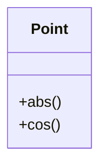

# La programmation objet

## L’architecture objet

### Histoire

La programmation orientée objet, qui fait ses débuts dans les années 1960 avec les réalisations dans le langage Lisp, a été formellement définie avec les langages Simula (vers 1970) puis SmallTalk. Puis elle s’est développée dans les langages anciens comme le Fortran, le Cobol et est même incontournable dans des langages récents comme Java.

### Concept

La notion d’objet constitue une étape fondamentale pour réutiliser des composants ou "briques logicielles" . L’adoption de cette approche nous invite à répondre d’abord à la question "De quoi parle-t-on ?" et non pas "Que veut-on faire ?".
La conception objet possède un aspect intuitif fort dans la mesure ou l’on s’efforce de calquer la représentation informatique sur des entités physiques ou conceptuelles apparaissant dans le processus à modéliser.

## Principes et terminologie objet

### Objets et encapsulation

Un objet comprend :

* une partie figée qui représente son état et les liens qui l’unissent à d’autres objets ;
* et une partie dynamique qui décrit son comportement , c’est-à-dire toutes les opérations qu’on peut lui appliquer ainsi que sa manière de réagir aux évènements de l’environnement.
* 
Sa partie fixe est constituée d’un ensemble de champs (ou attributs) et sa partie dynamique d’opérations appelées méthodes. Certaines de ces méthodes constituent la partie visible de l’objet. C’est par elles que l’on s’adresse à lui. Elles constituent autant de services qu’on peut demander à l’objet de fournir.
Certains champs peuvent être partiellement ou totalement inaccessibles à d’autres objets. C’est alors qu’on parle d’encapsulation.

On peut représenter graphiquement une classe de la manière représentée ci-dessous :

### Classes et instances

Quand les objets possèdent une structure et des comportement en commun, on peut les regrouper sous forme de classe.

Une classe est une sorte de moule à partir duquel sont produits les objets que l’on appelle instances de la classe. Les instances d’une même classes ne diffèrent que par les valeurs de leurs attributs.
La programmation objet consiste alors à définir les bonnes classes dotées de leurs champs et méthodes, puis à les instancier pour créer des objets et les faire intéragir.

## Une première classe

Supposons que l’on souhaite manipuler des entiers représentant des temps mesurés en heures, minutes et secondes. On appellera la structure correspondante Chrono. Les trois nombres pourront être appelés dans l’ordre heures,minutes et secondes. On peut représenter le temps "21 heures 34 minutes et 55 secondes" de la manière suivante :

Python permet la définition de cette structure Chrono sous la forme d’une classe avec le code définit dans le programme 1.

``` py linenums="1" title="Programme 1"
class Chrono:
    "une classe pour représenter le temps mesuré en heures, minutes et secondes"
    
    def __init__(self, h, m, s):
        "le constructeur prend comme arguments temps, minutes et secondes"
        self.heures = h
        self.minutes = m
        self.secondes = s
    
    def display(self):
        """ affiche les heures, minutes, secondes"""
        return (str(self.heures) + "h"
                + str(self.minutes) + "m"
                + str(self.secondes) + "s")
```

Ce que contient la définition de la class Chrono :

* la définition d’une classe est introduite par le mot-clé class suivi du nom choisi pour la classe et d’un symbole : (deux points) ;
* le nom de la classe commence en général par une majuscule ;
* la chaîne de documentation ;
* tout le reste de la définition est placé en retrait.
* la définition d’une méthode particulière : le constructeur. En python, son nom est imposé : __init__. Un constructeur est une méthode invoquée lors de la création d’un objet. Cette méthode effectue les opérations nécessaires à l’initialisation d’un objet. Cette méthode n’a aucune valeur en retour, c’est l’objet qui est renvoyé.
* une méthode display() qui affiche l’heure.

Nous pouvons maintenant instancier notre classe. Pour créer un objet (une instance), on utilise la syntaxe :

``` py linenums="1" title="Programme 2"
t = Chrono(21,34,55)
```

L’appel à la méthode `display()` s’appliquant au chronomètre `t` est réalisé comme dans le programme 3 :

``` py linenums="1" title="Programme 3"
print(t.display()) # affiche 21h34m55s
```

**Remarque 1 :** on peut accéder à la documentation de la classe et du constructeur grâce aux instructions suivantes.

``` py linenums="1" title="Programme 4"
t = Chrono(21, 34, 55)
print(t)
print(t.__doc__)
print(t.__init__.__doc__)
```

**Remarque 2 :** La variable `t` ne contient à strictement parler l’objet qui vient d’être construit mais un pointeur vers le bloc mémoire qui a été alloué à cet objet. La situation correspond donc au schéma suivant.

**Remarque 3 :** 

En fait, plutôt que d’utiliser cette méthode `display()`, on utilise plutôt la méthode suivante :

``` py linenums="1" title="Programme 5"
def __str__(self):
    """ affiche les heures, minutes, secondes"""
    return (str(self.heures) + "h"
            + str(self.minutes) + "m"
            + str(self.secondes) + "s")
```

Ensuite pour visualiser l’heure, il nous faut l’appeler comme dans le programme 6.

``` py linenums="1" title="Programme 6"
print(t)    # affiche 21h34m55s
```

!!! example "Exercice 1"
    Écrire une classe Dinosaure dont les attributs sont :
    * sa longueur ;
    * sa hauteur ;
    * son poids ;
    * sa vitesse maximale

    Vous construirez l’instance triceratops avec comme caractéristiques : 9 m de longueur, 3 m de hauteur, une masse de 9 tonnes environ, et une vitesse maximale donnée à 32 km/h. Puis l’instance Tyrannosaurus Rex. Celui-ci mesurait 13 m de longueur, pesait 8 t environ, 6 m de haut et devait courir à 27 km/h.

## Encapsulation

### Le problème des accès aux données

On peut accéder aux attributs d’un objet t de la classe Chrono avec la notation t.a où a désigne le nom de l’attribut visé. Par exemple, le code d’accès à l’attribut secondes s’écrit comme dans le programme 7.
Pour rendre privé les attributs d’une classe, il faut les faire précéder de 2 tirets. Exemple, dans le constructeur de la classe Chrono, self.__heures = h.

Remarque : on peut rendre privé aussi les méthodes en les faisant précéder de deux tirets.

### Les accesseurs ou "getters"

On ne va généralement pas utiliser la manière de procéder précédente nom_objet.nom_attribut permettant d’accéder aux valeurs des attributs car on ne veut pas forcement que l’utilisateur ait accès à la représentation interne des classes.

Pour utiliser ou modifier les attributs, on utilisera de préférence des méthodes dédiées dont le rôle est de faire l’interface entre l’utilisateur de l’objet et la représentation interne de l’objet (ses attributs). Les attributs sont alors en quelque sorte encapsulés dans l’objet, c’est à dire non accessibles directement par le programmeur qui a instancié un objet de cette classe.

Pour obtenir la valeur d’un attribut nous utiliserons la méthode des accesseurs (ou "getters") dont le nom est généralement : `get_nom_attribut()`. Par exemple, pour afficher la valeur des heures, on peut employer la méthode `get_heure()` comme dans le programme 8.

``` py linenums="1" title="Programme 8"
class Chrono:
    "une classe pour représenter le temps mesuré en heures, minutes et secondes"
    def __init__(self, h, m, s):
        "le constructeur prend comme arguments temps, minutes et secondes"
        self.heures = h
        self.minutes = m
        self.secondes = s

    def __str__(self):
        "affiche l'heure "
        return (str(self.heures) + "h"
                +str(self.minutes) + "m"
                +str(self.secondes) + "s")
    
    def get_heure(self):
        "retourne la valeur des heures"
        return self.heures
```

### Modifications contrôlées des valeurs des attributs : les mutateurs ou "setters"

En cas de besoin, on peut modifier les valeurs attribuées aux attributs. Pour cela, on passe par des méthodes particulières appelées **mutateurs (ou "setters")** qui vont modifier la valeur d’une propriété d’un objet. 

Le nom d’un mutateur est généralement : `set_NomAttribut()`.

``` py linenums="1" title="Programme 9"
def set_heure(self, h2):
    self.heures = h2
```

## Exercices

!!! example "Exercice 2"
    On souhaite caractériser informatiquement la notion de point telle qu’elle existe en 2 dimensions : aussi bien en coordonnées cartésiennes $(x, y)$ qu’en coordonnées polaires $(r, \theta)$.
    
    1. Remplir le modèle de la classe `Point` ci-dessous en listant les attributs privés et les actions permettant seulement d’y accéder (accesseurs) :
    
    ```mermaid
    ---
    config:
    theme: forest
    look: handDrawn
    ---
    classDiagram
        class Point {
	        +abs()
	        +cos()
    }
    ```

    2. Implémenter cette classe en python. On utilisera le module `math`. On rappelle que dans le l’intervalle $]−\pi, \pi[$, on a :

    $$ \theta(rad)= \left \{
     \begin{array}{lll}
        Arctan(y/x)  & si &x>0 \\
       Arctan(y/x)+\pi  & si & x<0\ et\ y\ge 0\\
       Arctan(y/x)-\pi  & si & x<0\ et\ y< 0\\
      \pi/2           & si &x=0\ et\ y>0\\
      -\pi/2         & si &x=0\ et\ y<0\\
      0   &si& x=0\ et\ y=0
      \end{array}
      \right .
    $$

    A l’aide de classe, on donnera les coordonnées polaires des 4 points suivants : $A(-2,5) ; B(5,5) ; C(-2,-2) ; D(5-2)$.

!!! example "Exercice 3"
    Définir une classe Angle pour représenter un angle degrés. Cette classe contient un unique attribut, angle qui est un entier. On demande quoi qu’il arrive, que l’égalité $0 ≤ angle < 360$ reste vérifiée.

    1. Écrire le constructeur de cette classe.
    2. Ajouter une méthode `__str__()`qui renvoie une chaîne de caractères de la forme “60 degrés”.
    3. Ajouter une méthode `ajoute`qui reçoit un autre angle en argument (un objet de la classe `A`ngle et l’ajoute au champ `angle` de l’objet. Attention à ce que la valeur de l’angle reste bien dans l’intervalle de l’objet.
    4. Ajouter deux méthodes `cosinus` et `sinus` pour calculer respectivement le cosinus et le sinus de l’angle. On utilisera pour cela les fonctions `cos` et `sin` de la bibliothèque `math`. Attention : il faut convertir l’angle en radian avant d’appeler les fonctions cosinus et sinus.

!!! example  "Exercice 4"
    Définir une classe Date pour représenter une date avec trois attributs jour, mois et annee. Attention, on rentre le mois par son numéro.

    1. Écrire son constructeur
    2. Ajouter une méthode `__str()__`()` qui renvoie une chaîne de caractères de la forme “8 mai 45”. On pourra se servir d’un attribut de classe qui est tableau donnant les douzes mois de l’année. Tester en construisant des objets de la classe Date puis en les affichant avec print.
    3. ajouter une méthode `anterieur_a()` qui permet de déterminer si une date `d1` est antérieur à une date `d2` en écrivant `d1 < d2`. Cette méthode renvoie un booléen.

