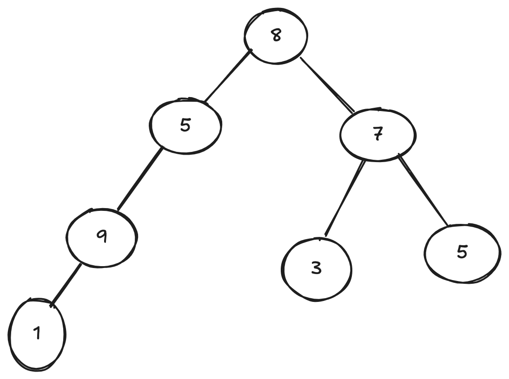
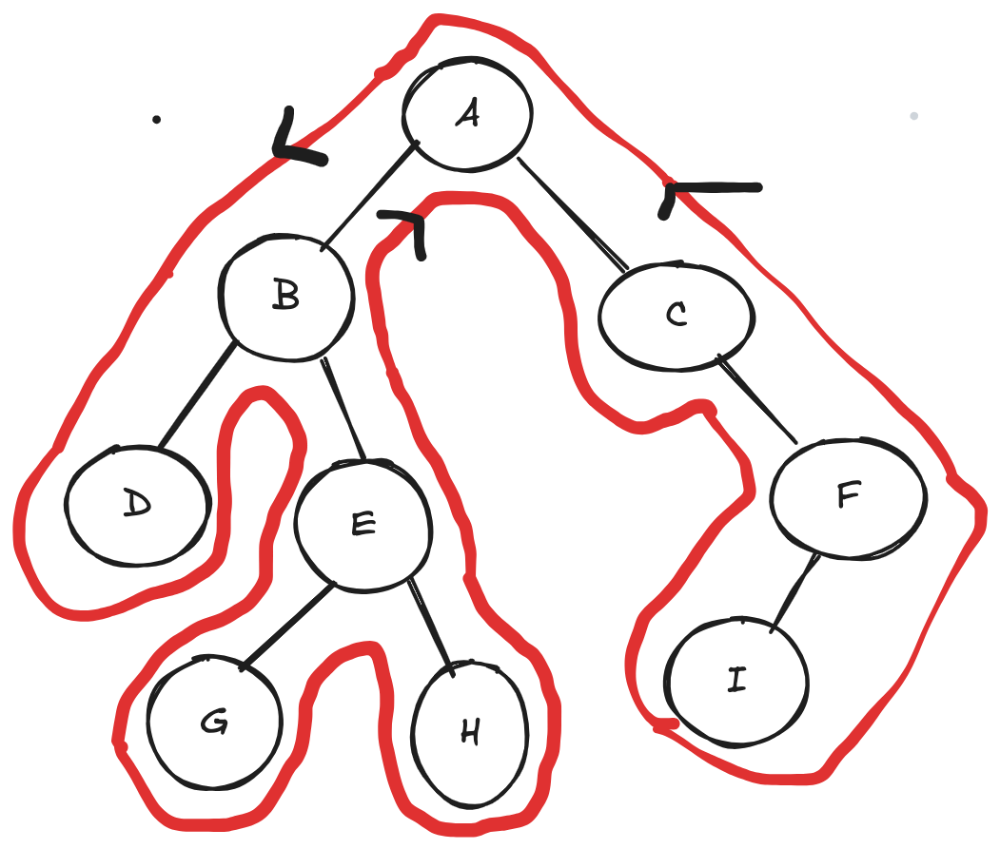
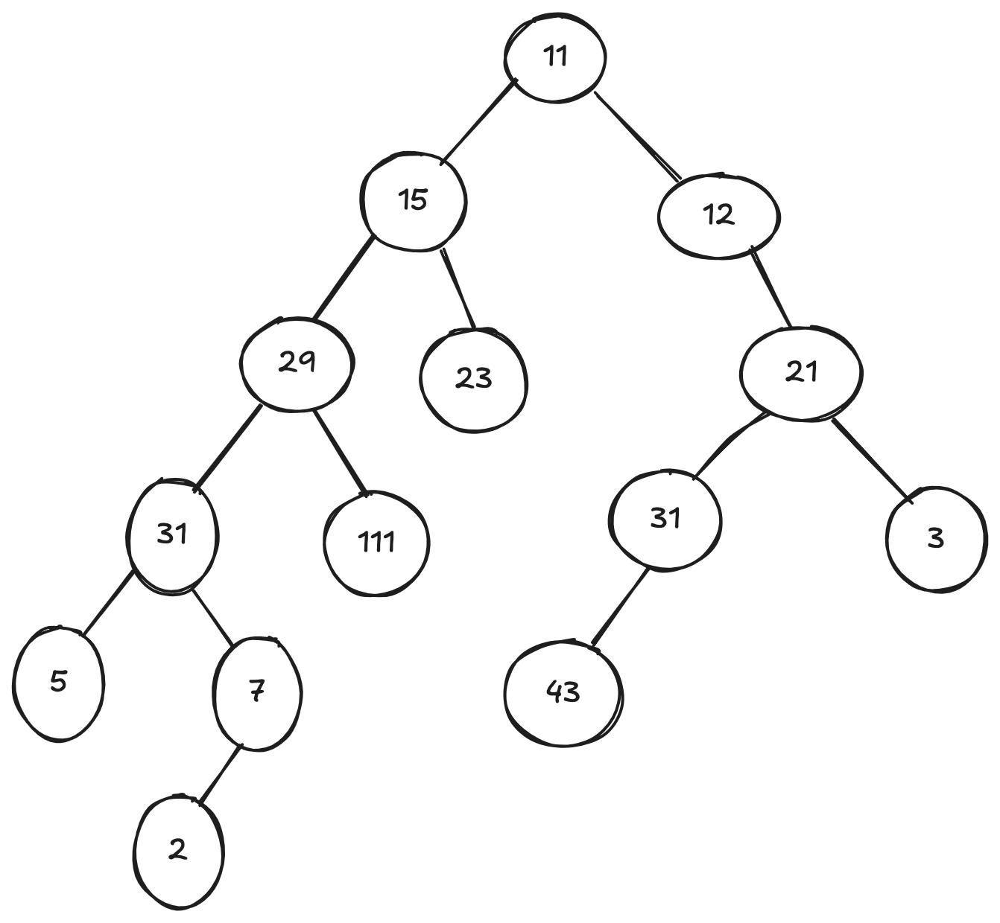
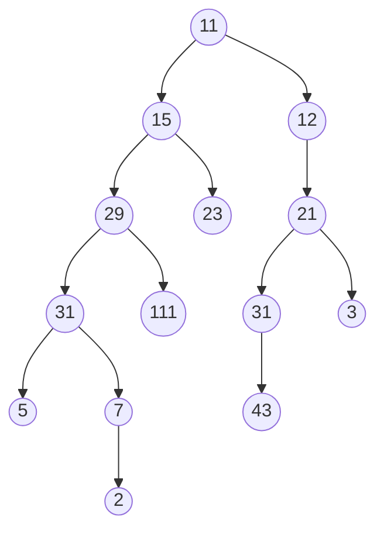
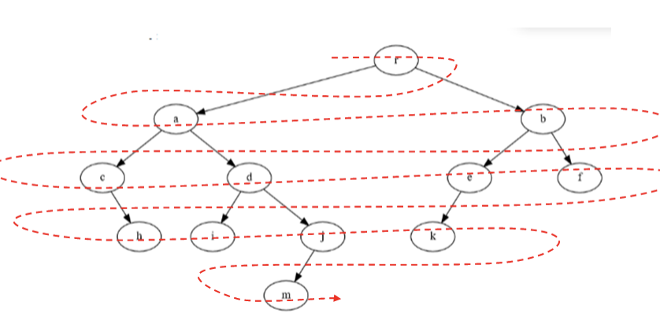
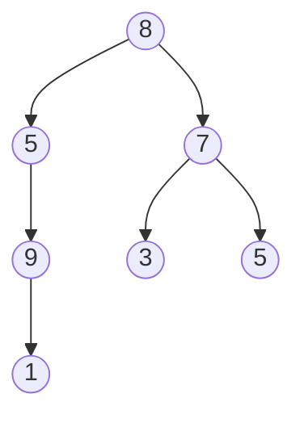

# ALgorithmes arbres

## Rappels

### Exercice de rappel

!!! example "Exercice 1"
    Déterminer  la racine ; le nombre de feuilles ; le nombre de branches ; l’arité ; sa taille : T(B); la hauteur de B : H(B); LC(B); LCE(B); LCI(B); PM(B); PME(B); PMI(B) pour l'arbre ci-dessous.

<figure markdown>
{width=500px}
</figure>

### Représentation d'un arbre binaire avec classe

L'implémentation d'un arbre binaire peut être la suivante :

``` py linenums="1"
class ArbreBinaire:
    def __init__(self, val=None):
        self.valeur = val
        self.gauche = None
        self.droite = None

    def affiche(self):
        """Affiche l'arbre sous forme récursive."""
        if self.gauche is not None:
            gauche_affiche = self.gauche.affiche()
        else : 
            gauche_affiche = None
        if self.droite is not None:
            droite_affiche = self.droite.affiche()
        else:
            droite_affiche = None
        return [self.valeur, gauche_affiche, droite_affiche]
```

!!! example "Exercice 2"
    Implémenter l'arbre de l'exercice 1.

### Taille d'un arbre

La taille d'un arbre est le nombre de ses nœuds.

!!! example "Exercice 3"
    Écrire la fonction `taille()`. Elle prendra comme argument l'arbre dont il faut déterminer la taille. Si l'arbre est vide, on retourne 0. Par contre, s'il n'est pas vide, on retourne 1 plus la taille du sous-arbre gauche plus la taille du sous-arbre droit.

### Hauteur d'un arbre

On prendra comme convention que l'arbre vide a pour hauteur 0.

!!! example "Exercice 4"
    Écrire la fonction `hauteur()`. Elle prendra comme argument l'arbre dont il faut déterminer la hauteur. Si l'arbre est vide, on retourne 0. Par contre, s'il n'est pas vide, on retourne 1 plus le maximum entre la  hauteur du sous-arbre gauche et la hauteur du sous-arbre droit 

### Calcul du nombre de feuilles d'un arbre

Une feuille est un nœud d'arité 0, autrement dit sans fils gauche ni fils droit.

```py linenums="1"
def nb_feuilles(arbre):
    if arbre is None:
        return 0
    if (arbre.gauche is None) and (arbre.droite is None):
        return 1
    return nb_feuilles(arbre.gauche) +  nb_feuilles(arbre.droite)
```

!!! example "Exercice 5"
    Tester cette fonction sur l'arbre de l'exercice 1.

### Recherche d'une valeur dans un arbre

On renverra `True` ou `False` en fonction de la présence ou non de la valeur dans l'arbre.

``` py linenums="1"
def recherche(arbre,valeur):
    if arbre is None:
        return False
    if arbre.valeur ==  valeur:
        return True
    return recherche(arbre.gauche, valeur) or recherche(arbre.droite, valeur)
```

!!! example "Exercice 6"
    Tester cette fonction sur l'arbre de l'exercice 1.

## Différents parcours d'un arbre binaire

Parcourir un arbre binaire signifie accéder à l'information contenue dans les noeuds.

### Parcours en profondeur

Nous allons donc imaginer que l'on parcourt l'arbre de la façon indiquée ci-dessous.

Ce type de parcours est appelé parcours en profondeur de l'arbre.

<figure markdown>
{width=500px}
</figure>

Il existe trois façon d'énumérer les noeuds.

#### Parcours préfixe

On liste les noeuds dans l'ordre dans lequel on les rencontre pour la première fois (donc par la gauche).

**Exemple :**
Le parcours préfixe de l'arbre ci-dessus nous donne :

A-B-D-E-G-H-C-F-I

!!! example "Exercice 7"
    Réaliser à la main le parcours préfixe de l'arbre ci-dessous :

<figure markdown>
{width=500px}
</figure>

**Code Python de la fonction donnant le parcours préfixe: **

``` py linenums="1"
def parcours_prefixe(a):
    """affiche tous les éléments de a dans un parcours préfixe"""
    if a:
        print(a.valeur, end=' ')
        parcours_prefixe(a.gauche)
        parcours_prefixe(a.droite)
```

**Efficacité :** La fonction `parcours_prefixe` directement proportionnelle au nombre de noeud de l'arbre. Tout comme les méthodes `taille` et `hauteur`, elle fait un nombre d'opérations fini sur chaque noeud (ici l'affichage de la valeur) et parcourt une fois et une seule chaque noeud.

#### Parcours infixe

Le parcours infixe consiste à lister les noeuds quand on passe dessous.

!!! example "Exercice 8"
    Réaliser à la main le parcours infixe de cet arbre :



**Code Python de la fonction donnant le parcours infixe :**

``` py linenums="1"
def parcours_infixe(a):
    """affiche tous les éléments de a dans un parcours infixe"""
    if a:
        parcours_infixe(a.gauche)
        print(a.valeur, end=' ')
        parcours_infixe(a.droite
```

#### Parcours suffixe ou postfixe

On liste les noeuds dans l'ordre dans lequel on les rencontre pour la dernière fois (donc par la droite).

**Exemple :** Le parcours suffixe de l'arbre donné en exemple nous donne : 

D-G-H-E-B-I-F-C-A

!!! example "Exercice 9"
    Réaliser à la main le parcours suffixe de cet arbre :


!!! example "Exercice 10"
    Donner le code de la fonction donnant le parcours suffixe d'un arbre. Cette fonction prend en argument un arbre binaire et affiche le parcours suffixe.

### Le parcours en largeur

Quand on parcourt en largeur un arbre, on note chaque sommet niveau par niveau et en commençant par la gauche.

Ce parcours est parfois noté *BPS* pour Breadth-First Search.

<figure markdown>
{width=600px}
</figure>

**Exemple :** le parcours en largeur de l'arbre ci-dessous donne 8-5-7-9-3-5-1



!!! example "Exercice 11"
    Ce parcours nécessite l'utilisation d'une file d'attente (donnée ci-dessous).

Au départ, on place l'arbre dans la file d'attente, puis, tant que la file contient des éléments, on défile un élément, on affiche son étiquette (sa valeur), on ajoute les deux sous-arbres dans la file d'attente et on recommence.

Écrire une fonction qui réalise la parcours en largeur. Cette fonction prendra un arbre en argument et affichera le parcours en largeur (sur une seule ligne).

**Complément :**

``` py linenums="1"
class File:
    """Classe file"""
    
    def __init__(self):
        self.file = []
        
    def fileVide(self):
        "Teste si la file est vide"
        test = False
        if len(self.file) == 0:
            test = True
        return test
 
     
    def enfiler(self, x:int): 
        """Empile la valeur x sur la file"""
        self.file.append(x)
        
    def retirer(self):
        """enlève la valeur avec l'indice 0"""
        if self.fileVide():
            print("Erreur : débordement négatif")
        else :
            premier = self.file[0]
            del self.file[0]
            return premier
        
    def premier(self)->int:
        """Donne la valeur du sommet"""
        return self.file[0]

    def taille(self)->int:
        """ Donne la taille de la file"""
        return len(self.file) 
    
    def __str__(self):
        ch = "\n Etat de la file:\n"
        for x in self.file:
            ch +=  str(x) + " "
        return ch   
```

## Algorithmes sur les arbres binaires de recherche

### Rappels

Un arbre binaire de recherche est un arbre binaire dont les valeurs des nœuds (valeurs qu'on appelle étiquettes, ou clés) vérifient la propriété suivante :

* l'étiquette d'un nœud est supérieure ou égale à celle de chaque nœud de son sous-arbre gauche.
* l'étiquette d'un nœud est strictement inférieure à celle du chaque nœud de son sous-arbre droit.

### Implémentation d'un arbre binaire de recherche

L'implémentation des arbres binaires de recherche peut être réalisée à partir de la même structure que les arbres binaires.

Une différence importante est le code pour insérer des données.

**Remarque :** Les fonctions `hauteur()` et `taille()` restent identiques.

### Insertion d'une clé

L'insertion d'une clé va se faire au niveau d'une feuille, donc au bas de l'arbre. Dans la version récursive de l'algorithme d'insertion, que nous allons implémenter, il n'est pourtant pas nécessaire de descendre manuellement dans l'arbre jusqu'au bon endroit : il suffit de distinguer dans lequel des deux sous-arbres gauche et droit doit se trouver la future clé, et d'appeler récursivement la fonction d'insertion dans le sous-arbre en question.

**Algorithme :**

* Si l'arbre est vide, on renvoie un nouvel objet Arbre contenant la clé.
* Sinon, on compare la clé à la valeur du nœud sur lequel on est positionné :
    * Si la clé est inférieure à cette valeur, on va modifier le sous-arbre gauche en le faisant pointer vers ce même sous-arbre une fois que la clé y aura été injectée, par un appel récursif.
    * Si la clé est supérieure, on fait la même chose avec l'arbre de droite.
    * on renvoie le nouvel arbre ainsi créé.

**Code de la fonction**

``` py linenums="1"
def insertion(arbre, cle):
    if arbre is None :
        return ArbreBinaire(cle)
    else :
        val = arbre.valeur
        if cle <= val :
            arbre.gauche = insertion(arbre.gauche, cle)
        else:
            arbre.droite = insertion(arbre.droite, cle)
        return arbre
```

### Recherche d'une clé

!!! example "Exercice 12"
    Écrire une fonction `recherche(arbre,val)` qui renvoie `True` si `val` est une valeur de l'arbre et `False` sinon. Cette fonction, différente de celle réalisée pour les arbres binaires, doit exploiter les caractériques des arbres binaires de recherche.

**Remarque :** le principe est celui de la dichotomie, on élimine grâce à la structure des arbres binaires de recherche la moitié des noeuds restant à chaque étape.

### Recherche d'extremum

!!! example "Exercice 13"
    Écrire une fonction `minimum(arbre)` qui renvoie la clé minimale d'un arbre.

!!! example "Exercice 14"
    Écrire une fonction `maximum(arbre)` qui renvoie la clé maximale d'un arbre.

### Exercices sur les arbres

!!! example "Exercice 15"
    Donner tous les arbres binaires de recherche formés des trois nœuds : 7, 52, 40

!!! example "Exercice 16"
    Écrire une fonction `liste_arbre(l)` qui en paramètre reçoit une liste d'entiers et qui renvoie un arbre binaire de recherche contenant les éléments de la liste l.