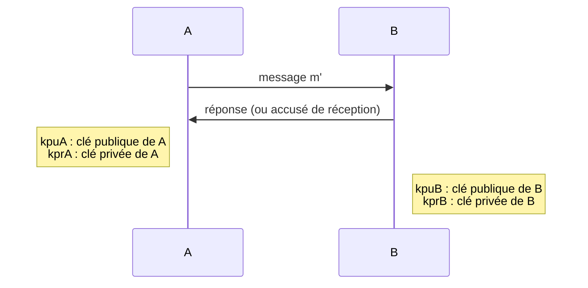
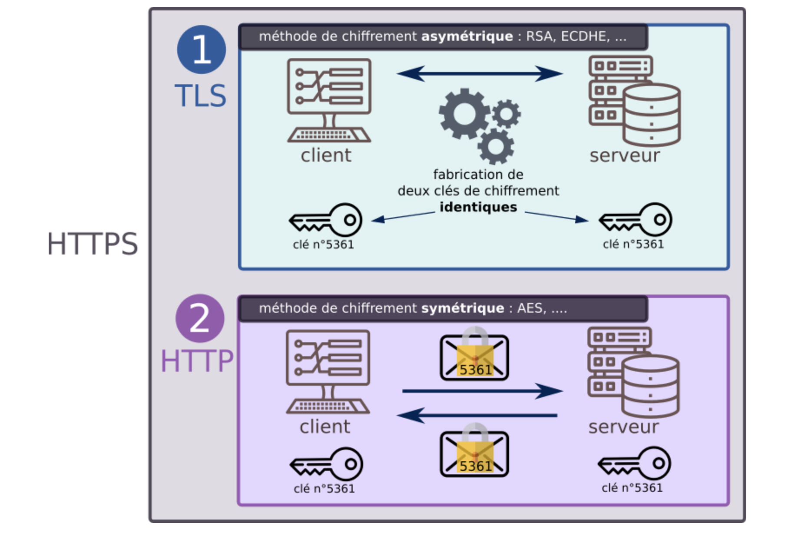

# Sécurisation des communications

## Cryptage symétrique et asymétrique

Pour qu’un message entre deux machines dans un réseau informatique ne puisse pas être compréhensible s’il est
intercepté, il faut qu’il soit chiffré. Il y a deux manières principales pour le faire :

* Par **un chiffrement symétrique** qui utilise une clé unique, connue seulement de l’émetteur et du récepteur. L’émetteur chiffre le message avec la clé et le récepteur le déchiffre avec **la même clé**.
* Par **un chiffrement asymétrique** qui utilise un couple de clé, l’une publique connue de tout le monde, l’autre privée
connue uniquement par le récepteur. L’émetteur chiffre le message avec la clé publique. Le récepteur le déchiffre
avec la clé privée.

## Chiffrement symétrique

Dans un chiffrement symétrique, la clé utilisée par l’expéditeur pour chiffrer le message est la même que celle utilisée par le récepteur pour déchiffrer le message.

### Qu'appelle-t-on une clé ?

La clé est un renseignement permettant de chiffrer ou déchiffrer un message. Cela peut être :

* un nombre (dans un simple décalage des lettres de l'alphabet, comme le chiffre de César)
* une phrase (dans la méthode du [masque jetable](https://fr.wikipedia.org/wiki/Masque_jetable))
* une image.

Un chiffrement est dit symétrique lorsque la connaissance de la clé ayant servi au chiffrement permet de déchiffrer le message. Par exemple, Alice chiffre son message en décalant les lettres de 3 rangs vers la droite dans l'alphabet, Bob saura qu'il doit les décaler de 3 rangs vers la gauche pour retrouver le message initial.

### Exemple 1 : le codage de César

Le codage de César avec une clé de 13. En ne considérant que les lettres en majuscule et non accentuées, notre alphabet se réduit à 26 lettres (ABCDEFGHIJKLMNOPQRSTUVWXYZ). Avec un décalage de 13 : (A$\to$N) et (N$\to$A). On utilise bien la même clé, il s’agit donc d’un chiffrement symétrique.

Par exemple le message "BONJOUR, COMMENT ALLEZ-VOUS" se code par : "OBAWBHE, PBZZRAG NYYRMIBHF" (seules les lettres ont été codées...) et le déchiffrement nous redonne bien le message d’origine.

!!! example "Exercice 1"
    Écrire un programme qui réalise ce chiffrement de César avec une clé passée en paramètre. Ce programme utilisera les dictionnaires. ce programme pourra réaliser le codage et le décodage.

### exemple 2 : le codage XOR

Le cryptage XOR est un système de cryptage basique mais pas trop limité. Ainsi, il a beaucoup été utilisé dans les débuts de l'informatique et continue à l'être encore aujourd'hui car il est facile à implémenter, dans toutes sortes de programmes.

 Le XOR est un opérateur logique qui correspond à un "OU exclusif" : c'est le (A OU B) qu'on utilise en logique mais qui exclue le cas où A et B sont simultanément vrais. Voici sa table de vérité :

<figure markdown>
| A | B | S |
|:-:|:-:|:-:|
| 0 | 0 | Ø |
| 0 | 1 | 1 |
| 1 | 0 | 1 |
| 1 | 1 | 0 |
</figure>

Une particularité de cette opération est : si b1 xor b2 = b3 alors b1 xor b3 = b2 et b2 xor b3=b1. Ce qui permet un chiffrement symétrique.

Prenons le mot ’bonjour’dont le code Unicode est donné par ce programme :

``` py linenums="1"
m = "bonjour"
for c in m:
    print(ord(c),end=’ ’)
```

**Rappels :**

* le code Unicode est un standard informatique qui permet des échanges de textes dans différentes langues, à un niveau mondial. Il est développé par le Consortium Unicode, qui vise au codage de texte écrit en donnant à tout caractère de n'importe quel système d'écriture un nom et un identifiant numérique, et ce de manière unifiée, quelle que soit la plateforme informatique ou le logiciel utilisé.
* Pour obtenir le code Unicode d'un caractère $c$, on utilise la fonction `ord(c)`.

Soit : 98 111 110 106 111 117 114. Le mot "nsi" va nous servir de clé ("nsi" $\to$ 110 115 105). Le mot "nsi" est appelé aussi masque. La méthode consiste alors à aligner le mot et la clé en la répétant autant de fois que nécessaire et d’effectuer un XOR entre les codes Unicode :

<figure markdown>
| b   | o   | n   | j   | o   | u   | r   |
|-----|-----|-----|-----|-----|-----|-----|
| 98  | 111 | 110 | 106 | 111 | 117 | 114 |
| n   | s   | i   | n   | s   | i   | n   |
| 110 | 115 | 105 | 110 | 115 | 105 | 110 |
</figure>

En pratiquant un XOR lettre par lettre entre les nombres obtenus (après une écriture en binaire...), on obtient les codes Unicode suivant : 12 28 7 4 28 28 28 (que l’on pourrait transformer en caractères mais ce n’est pas très utile...)

Pour décoder le message, il suffit alors de recommencer l’opération avec les codes Unicode du message chiffré en utilisant la même clé : (12 xor 110→98 donc ’b’), etc...

En Python l’opérateur $∧$ permet d’effectuer un xor directement sur deux entiers. Le programme suivant chiffre un message en utilisant cette méthode :

``` py linenums="1"
message = "Bonjour, comment allez-vous ?"
cle = "mystère"

def chiffre(message:str, cle:str)->list:
    """ fonction qui chiffre le message avec le clé suivant la méthode xor"""
    msg_chiffre = []
    taille_msg = len(message)
    taille_cle = len(cle)
    j = 0
    for i in range(taille_msg):
        msg_chiffre.append(ord(message[i]) ^ ord(key[j]))
        j = (j+1) % taille_cle
    return msg_chiffre

print(chiffre(message,cle))
```

Ce qui donne en console :

``` py
[47, 22, 29, 30, 135, 7, 23, 65, 89, 16, 27, 133, 31, 0, 3, 13, 83, 21,132, 30, 0, 23, 84, 5, 27, 157, 1, 69, 82]
```

Chaque nombre peut être converti en caractère (le contenu complet du message est chiffré, y compris les caractères de ponctuation et d’espace).

!!! example "Exercice 2 "
    Modifier la fonction `chiffre` pour qu’elle renvoie le message chiffré (avec les caractères)

!!! example "Exercice 3"
    Écrire une fonction `dechiffre` qui prend en paramètres le message chiffré et la clé et qui renvoie le message déchiffré.

Si le masque avec lequel on effectue le XOR sur le message est aussi long que le message, alors il est impossible de retrouver le message initial. Pourquoi ?

Imaginons que l'émetteur veuille transmettre le message clair "LUNDI". Il le chiffre avec un masque jetable (que connait aussi le réepteur), et ce dernier reçoit donc "KHZOK". Si quelqu'un intercepte le message "KHZOK", même s'il sait que la méthode de chiffrement utilisée est celle du masque jetable il n'a pas d'autre choix que de tester tous les masques de 5 lettres possibles.

Ce qui lui donne $26^5$ possibilités (plus de 11 millions) pour le masque, et par conséquent (propriété de bijectivité du XOR) possibilités pour le message «déchiffré»...

Cela signifie qu'il verra apparaître, dans sa tentative de déchiffrage, les mots "MARDI", "JEUDI", "JOUDI", "STYLO", "FSDJK", "LUNDI", "LUNDA"... Il n'a aucune possibilité de savoir où est le bon message original parmi toutes les propositions (on parle de sécurité sémantique).

### Avantages d'un chiffrement symétrique

Les chiffrements symétriques sont souvent rapides, consommant peu de ressources et donc adaptés au chiffrement de flux important d'informations.

### Inconvénients d'un chiffrement symétrique

L'inconvénient est l'échange de la clé.

Le chiffrement symétrique impose que l'émetteur et le récepteur aient pu se rencontrer physiquement au préalable pour convenir d'une clé secrète, ou bien qu'ils aient réussi à établir une connexion sécurisée pour s'échanger cette clé.

### Les chiffrements symétriques actuels

L'algorithme de chiffrement symétrique le plus utilisé actuellement est le chiffrement [AES](https://fr.wikipedia.org/wiki/Advanced_Encryption_Standard), pour Advanced Encryption Standard.

L'AES est un algorithme de chiffrement par blocs, les données sont traitées par blocs de 128 bits pour le texte clair et le chiffré. La clef secrète a une longueur de 128 bits, d’où le nom de version : AES 128 (il existe deux autres variantes dont la clef fait respectivement 192 et 256 bits).

Le système cryptographique AES est très fréquemment associé à la sécurisation de l'affichage des pages web ou des échanges de mails à travers l'usage de TLS. Son utilisation est extrêmement répandue.

## Chiffrement asymétrique

Dans le cas du chiffrement asymétrique l’expéditeur (A) et le récepteur (B) n’ont pas besoin de partager une "clé secrète" :

* A possède une "clé privée" que l’on notera kprA et une "clé publique" que l’on notera kpuA. En aucun cas A ne devra divulguer sa clé privée à quiconque, elle devra rester strictement secrète. En revanche sa clé publique pourra être connue de tout le monde sans aucun problème.
* B possède une "clé privée" que l’on notera kprB et une "clé publique" que l’on notera kpuB. En aucun cas B ne devra divulguer sa clé privée à quiconque, elle devra rester strictement secrète. En revanche sa clé publique pourra être connue de tout le monde sans aucun problème.

Si A désire envoyer un message m à B, il va utiliser la clé publique de B afin de réaliser le chiffrement (m est chiffré en m’). Le message chiffré (m0) va ensuite pouvoir transiter entre A et B. Une fois le message m’ en sa possession, B va utiliser sa clé privée afin de pouvoir déchiffrer le message m0 et ainsi obtenir le message m. Le processus peut être résumé
par le schéma suivant :



Si P intercepte le message m0, il sera incapable de déterminer m à partir de m0 sans la clé privée de B

1) KpuB(m) $\to$ m'

2) A $\rightarrow{\text{m'}}$ B

3) KprB(m') $\to$ m

Le chiffrement asymétrique repose sur des problèmes très difficiles à résoudre dans un sens et faciles à résoudre dans l’autre sens.

Prenons un exemple : l’algorithme de chiffrement asymétrique RSA (du nom de ses 3 inventeurs : Rivest Shamir et Adleman), est très couramment utilisé, notamment dans tout ce qui touche au commerce électronique. RSA se base sur la factorisation des très grands nombres premiers.

Si vous prenez un nombre premier A (par exemple A = 16813007) et un nombre premier B (par exemple B = 258027589), il facile de déterminer C le produit de A par B (ici on a A $\times$ B = C avec C = 4338219660050123). En revanche si je vous donne C (ici 4338219660050123) il est très difficile de retrouver A et B. En tous les cas, à ce jour, aucun algorithme n’est capable de retrouver A et B connaissant C dans un temps "raisonnable". Nous avons donc bien ici un problème relativement facile dans un sens (trouver C à partir de A et B) est extrêmement difficile dans l’autre sens (trouver A et B à partir de C). Les détails du fonctionnement de RSA sont relativement complexes (mathématiquement parlant) et ne seront pas abordés ici. Vous devez juste savoir qu’il existe un lien entre une clé publique et la clé privée correspondante, mais qu’il est quasiment impossible de trouver la clé privée de quelqu’un à partir de sa clé publique.

**Remarque :** Un nombre premier est un entier naturel qui admet exactement deux diviseurs distincts entiers et positifs.

Ces deux diviseurs sont 1 et le nombre considéré, puisque tout nombre a pour diviseurs 1 et lui-même (comme le montre l’égalité n = 1 $\times$ n), les nombres premiers étant ceux qui n’en possèdent aucun autre. Par exemple, le nombre entier 7 est premier car 1 et 7 sont les seuls diviseurs entiers et positifs de 7.

## HTTPS

Aujourd'hui, plus de 90 % du trafic sur internet est chiffré : les données ne transitent plus en clair (protocole http) mais de manière chiffrée (protocole https), ce qui empêche la lecture de paquets éventuellements interceptés.

Le protocole https est la réunion de deux protocoles :

* le protocole TLS (Transport Layer Security, qui a succédé au SSL) : ce protocole, basé sur du **chiffrement asymétrique**, va conduire à la génération d'une clé identique chez le client et chez le serveur.
* le (bon vieux) protocole http, mais qui convoiera maintenant des données chiffrées avec la clé générée à l'étape précédente. Les données peuvent toujours être interceptées, mais sont illisibles. Le **chiffrement symétrique** utilisé est actuellement le chiffrement AES.
  
<figure markdown="span">
  { width="600" }
</figure>

## Pour plus d'information

Regarder la [conférence](https://www.youtube.com/watch?v=rZB-K2wMV_I) de Cécile Pierrot (mathématicienne et informaticienne, chercheuse à l’Inria, Nancy) à la Cité des Sciences.
