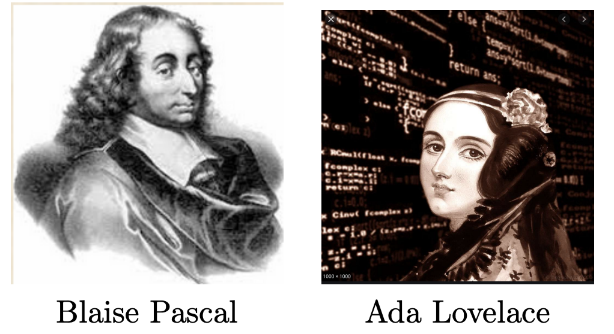
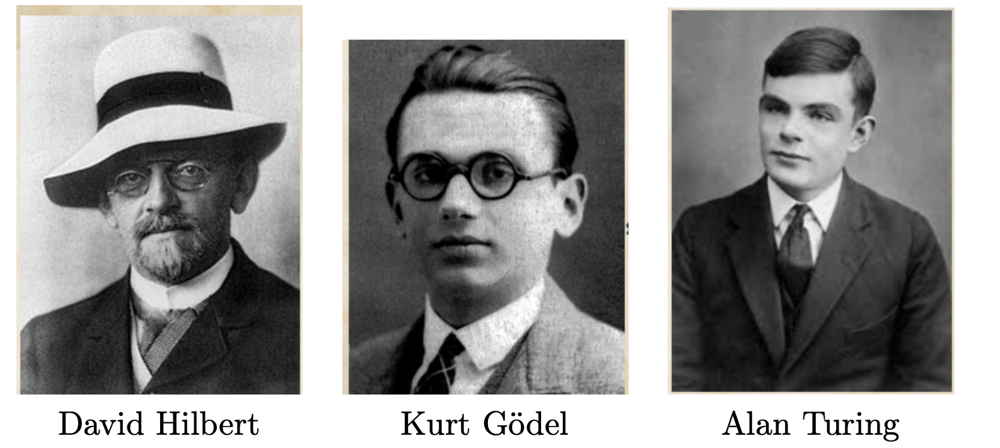
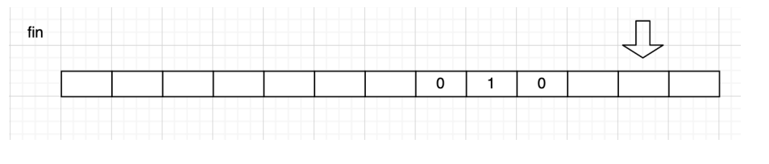
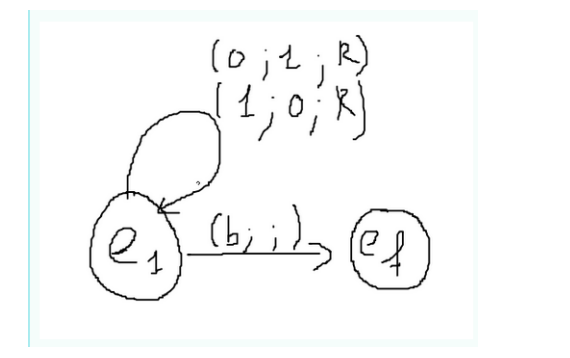
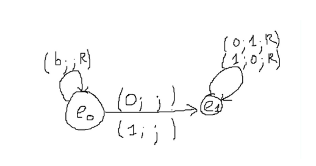

# Calculabilité décidabilité

## Quelques repères historiques

* Wilhelm Schickard (1592 – 1635), professeur à l’Université de Tübingen (Allemagne), aurait dessiné les plans de la première machine à calculer (mécanique), mais elle n'a pas été construite.
Blaise Pascal (1623 – 1662), mathématicien et philosophe, construit à 19 ans la Pascaline, première machine à calculer opérationnelle.
* Gottfried Wilhelm Leibniz (1646 – 1716), développe une machine à calculer et propose des idées modernes : la machine universelle, le schéma "entrée-calcul-sortie", et la base 2 pour la représentation des nombres.
* Joseph Marie Jacquard (1752 – 1834), avec son métier à tisser basé sur les cartes perforées, inspire les premiers programmes de calcul.
* Charles Babbage (1791 – 1871), professeur à Cambridge, conçoit la machine analytique, ancêtre des ordinateurs modernes.
* Ada Lovelace (1815 – 1852), réalise le premier véritable programme informatique pour la machine analytique de Babbage. Elle est considérée comme la première programmeuse.

<figure markdown>
{width=300px}
</figure>

* David Hilbert (1862 – 1943), mathématicien, propose des problèmes dont certains restent irrésolus. En 1920, il énonce l’"Entscheidungsproblem", questionnant la décidabilité en mathématiques.
* Kurt Gödel (1906 – 1978), démontre en 1931 que tout système formel suffisamment puissant est soit incomplet soit incohérent.
* Alan Turing (1912 – 1954) et Alonzo Church (1903 – 1995), montrent en 1936 que l'"Entscheidungsproblem" est indécidable, proposant la machine de Turing et le lambda-calcul.

<figure markdown>
{width=400px}
</figure>
  
Pour en savoir plus sur la vie de Turing :

<figure markdown>
<iframe width="560" height="315" src="https://www.youtube.com/embed/7dpFeXV_hqs?si=TcB179GQSH7Wlpid" title="YouTube video player" frameborder="0" allow="accelerometer; autoplay; clipboard-write; encrypted-media; gyroscope; picture-in-picture; web-share" referrerpolicy="strict-origin-when-cross-origin" allowfullscreen></iframe>
</figure>

## Machine de Turing

### Définition

Il s'agit d'une machine imaginaire inventée par Alan Turing en 1936 pour expliquer la notion de "procédure mécanique" : l'équivalent de d'un algorithme. Cette machine est la plus élémentaire possible destinée à mettre en oeuvre ces mécanismes de calcul, numériques ou symboliques, comme le font notamment les ordinateurs.

Une machine de Turing est un appareil disposant :

* d'un ruban infiniment long divisé en cases, dans lesquels la machine peut écrire des symboles ;
* d'une tête qui peut lire et écrire sur ce ruban ;
* d'une table de transition. Chacune des lignes de cette table est associée à un état et spécifie les actions à effectuer quand la machine est dans cet état, en fonction du symbole présent sous la tête de lecture. Ces actions peuvent être l'écriture d'un symbole (ici un 0 ou un 1) et le déplacement du ruban d'une case à droite ou à gauche. La table spécifie également le nouvel état après exécution de ces actions. La machine s'arrête quand un état marqué comme final est atteint.

Cette machine fonctionne comme une machine à calculer en binaire. Turing envisage le cas particulier où les symboles utilisés sont 0 et 1.

L'entrée du programme est un liste de symboles binaires. Une fois effectué, c'est sur ce même ruban que sera écrit la sortie du programme.

**Remarque 1 :** En 2012, pour célébrer le centenaire de la naissance d'Alan Turing, huit étudiant en master de l'École Normale Supérieure (ENS) de Lyon ont fabriqué en LEGO la première machine réelle (purement mécanique) du modèle de Turing. Voici le site du projet : [lien](http://rubens.ens-lyon.fr/fr/).

### Exemple

 La machine peut être dans deux états e1 et e2. Si la machine est dans l'état e1 et contient un blanc, elle écrit un blanc. Le rubanc se déplace vers la gauche et la machine est dans l'état e2. Si la machine est dans l'état e2 et qu'elle lit un 0, elle écrit un 1 et si elle lit un 1 elle écrit un 0. Dans les deux cas, le ruban se déplace vers la gauche et la machine reste dans l'état e2. Enfin, si elle lit un blanc, elle écrit un blanc et la machine s'arrête.

Ce qui nous donne table de transition suivante :

<figure markdown>
| **État** | **Lecture** | **Écriture** | **Déplacement** | **État suivant** |
| -------- | ----------- | ------------ | --------------- | ---------------- |
| e1       | blanc       | blanc        | gauche          | e2               |
| e2       | 0           | 1            | gauche          | e2               |
| e2       | 1           | 0            | gauche          | e2               |
| e2       | blanc       | blanc        | gauche          | Fin              |
</figure>

Les étapes successives sont représentées ci-dessous. Initialement la machine se trouve dans l'état e1.

<figure markdown>

</figure>

La machine lit un blanc, passe dans l'état e2 et le ruban se déplace vers la gauche.

<figure markdown>

</figure>

La machine lit un 1, donc écrit un 0, reste dans l'état e2 et ruban se déplace vers la gauche

<figure markdown>

</figure>

La machine lit un 0, donc écrit un 1, reste dans l'état e2 et le ruban se déplace vers la gauche.

<figure markdown>

</figure>

La machine lit un 1 donc écrit un 0, reste toujours dans l'état e2 et le ruban se déplace vers la gauche.

<figure markdown>

</figure>

La machine lit un blanc, écrit un blanc, le ruban se déplace encore vers la gauche et la machine s'arrête.

<figure markdown>

</figure>

**Remarque 2 :** Voici un émulateur de cette machine de [Turing](https://interstices.info/comment-fonctionne-une-machine-de-turing/)

!!! example "Exercice 1:"
    Considérons une machine de Turing se promenant sur un ruban constitué d’une suite de cases pouvant être vierges ("V") ou contenir une information binaire ("0" ou "1").  

    Elle possède la faculté de se déplacer d’une case vers la gauche ou vers la droite, de lire le caractère inscrit sur le ruban et d’écrire un caractère sur le ruban (remplaçant le précédent).  
    
    De plus, elle possède un certain nombre d’états qui vont déterminer son comportement. Ces états sont précisés dans la table des transitions ci-dessous :

    | **État** | **Caractère lu** | **Écrire** | **Déplacement** | **Nouvel état** |
    | -------- | ---------------- | ---------- | --------------- | --------------- |
    | E₀       | V                | V          | droite          | E₀              |
    | E₀       | 1                | 0          | droite          | E₁              |
    | E₀       | 0                | 1          | droite          | E₁              |
    | E₁       | V                | Arrêt      | Arrêt           | Arrêt           |
    | E₁       | 1                | 0          | droite          | E₁              |
    | E₁       | 0                | 1          | droite          | E₁              |

    Au commencement, la tête de lecture/écriture est positionnée dans l’état **E₀** sur une des cases vierges située à gauche du nombre binaire.

    1. Faire fonctionner cette machine de Turing sur le ruban suivant :
    ... | V | V | 0 | 1 | 0 | 0 | 1 | 1 | V | V | ...
    2. Quelle est l’opération effectuée par cette machine de Turing ?

!!! example "Exercice 2"
    Prenons maintenant une nouvelle machine de Turing avec 9 états et dont la table de transition est la suivante :

    | **État**  | **Caractère lu** |  **Écrire**  | **Déplacement** |** Nouvel état** |
    | :---: | :----------: | :------: | :---------: | :---------: |
    |  E₀   |      V       |  arrêt   |
    |  E₀   |      0       |    V     |   droite    |     E₁      |
    |  E₀   |      1       |    V     |   droite    |     E₅      |
    |  E₁   |      V       |    V     |   droite    |     E₂      |
    |  E₁   |     0-1      | inchangé |   droite    |     E₁      |
    |  E₂   |      V       |    0     |   gauche    |     E₃      |
    |  E₂   |     0-1      | inchangé |   droite    |     E₂      |
    |  E₃   |      V       |    V     |   gauche    |     E₄      |
    |  E₃   |     0-1      | inchangé |   gauche    |     E₃      |
    |  E₄   |      V       |    0     |   droite    |     E₀      |
    |  E₄   |     0-1      | inchangé |   gauche    |     E₄      |
    |  E₅   |      V       |    V     |   droite    |     E₆      |
    |  E₅   |     0-1      | inchangé |   droite    |     E₅      |
    |  E₆   |      V       |    1     |   gauche    |     E₇      |
    |  E₆   |     0-1      | inchangé |   droite    |     E₆      |
    |  E₇   |      V       |    V     |   gauche    |     E₈      |
    |  E₇   |     0-1      | inchangé |   gauche    |     E₇      |
    |  E₈   |      V       |    1     |   droite    |     E₀      |
    |  E₈   |     0-1      | inchangé |   gauche    |     E₈      |


    Au départ, la tête de lecture/écriture est positionnée dans l’état **E₀** sur le symbole binaire de gauche du nombre inscrit sur le ruban qui, comme dans l’exercice précédent contient une suite continue de symboles binaires, les autres cases étant vierges.

    1. Faire fonctionner cette machine de Turing sur le ruban suivant :  
        ... V V 0 1 1 0 V V ...
    2. Quelle est l’opération effectuée par cette machine de Turing ?
    3. Que faudrait-il changer dans l'algorithme pour que le nombre inscrit sur le ruban soit recopié avec une inversion des symboles binaires (c'est-à-dire que le ruban V01101VVV ... devienne V01101V10010VV..)?

### Diagramme

On peut construire un diagramme de la machine (on parle aussi d'automate).

Pour définir un diagramme, il faut :

* un alphabet utilisé par la machine (liste des caractères utilisés). Exemple {'0','1','b'}.
* des états sont symbolisés par des cercles et écrits sous la forme e1, e2, etc (ou encore q1, q2, etc).
* un état final représenté par ef (ou qf) mais parfois indiqué par une chaine de caractères ou un caractère particulier ("final").
* représenter les déplacements par les lettres L et R (left et right).
* utiliser des triplets (lecture; écriture; déplacement) et des flèches qui indiquent l'état suivant.

**Exemple 1 :**

Liste des caractères possiblement présents sur le ruban $\{'0';'1;'b'\}$

* A l'état $e1$, si la tête lit un 0 alors elle écrit 1, se déplace à droite et reste à l'état e1.
* A l'état e1, si la tête lit un 1 alors elle écrit 0, se déplace à droite et reste à l'état e1.
* A l'état e1, si la tête lit un blanc alors elle n'écrit rien et passe à l'état $ef$ (elle s'arrête).

Ce qui nous donne la table de transition suivante :

<figure markdown>

| **État** | **Lecture** | **Écriture** | **Déplacement** | **État suivant** |
| -------- | ----------- | ------------ | --------------- | ---------------- |
| e1       | 0           | 1            | droite          | e1               |
| e1       | 1           | 0            | droite          | e1               |
| e1       | blanc       | rien         | droite          | ef               |

</figure>

<figure markdown>
{width=350px}
</figure>

**Exemple 2 :**

Liste des caractères possiblement présents sur le ruban $\{'0';'1;'b'\}$

* si la tête lit un blanc alors elle n'écrit rien et se déplace à droite en restant à l'état e0.
* A l'état e0, si la tête lit un 0 alors elle n'écrit rien, ne se déplace pas et passe à l'état e1.
* A l'état e0, si la tête lit un 1 alors elle n'écrit rien, ne se déplace pas et passe à l'état e1.
* A l'état e1, si la tête lit un 0 alors elle écrit 1, se déplace à droite et reste à l'état e1.
* A l'état e1, si la tête lit un 1 alors elle écrit 0, se déplace à droite et reste à l'état e1.

Ce qui nous donne la table de transition suivante :

<figure markdown>

| État  | Lecture | Écriture | Déplacement | État suivant |
| :---: | :-----: | :------: | :---------: | :----------: |
|  e0   |    b    |   rien   |   droite    |      e0      |
|  e0   |    0    |   rien   | pas de dplt |      e1      |
|  e0   |    1    |   rien   | pas de dplt |      e1      |
|  e1   |    0    |    1     |   droite    |      e1      |
|  e1   |    1    |    0     |   droite    |      e1      |

</figure>

<figure markdown>

</figure>

## Calculabilité et décidabilité

### Calculabilité

Une fonction $f:x->f(x)$ est dite calculable, lorsqu’il existe une algorithme permettant de calculer 
 pour n’importe quelle valeur de x.

Par exemple la fonction qui permet de déterminer la longueur du plus court chemin dans un graphe est calculable (voir l’algorithme de Djikstra)

Le problème de la calculabilité d’une fonction ne dépend pas du langage de programmation.

### Décidabilité

Un problème de décision est un problème auquel on peut répondre par oui ou non

Par exemples : un nombre donné est-il pair ? un graphe contient-il un cycle ? Un problème est dit indécidable lorsqu’il n’existe pas d’algorithme permettant d’y répondre.

Par exemple, le problème de savoir si un nombre donné est pair n’est pas indécidable. On peut écrire un algorithme qui répond oui ou non à ce problème. On appelle problème de l’arrêt le problème de décision qui consiste à savoir si oui ou non un programme s’arrête.

## Le problème de l'arrêt

### Un programme comme paramètre d'un programme

Les codes que nous manipulons ressemblent souvent à cela :

``` py linenums="1"
def bonjour(n):
    for i in range(n):
        print("bonjour")
```

Ce programme qui s'appelle `bonjour` a besoin d'un paramètre, qui sera ici un nombre entier `n`.

Quand nous l'exécutons avec `n=5`, sa sortie donnera 5 «bonjour».

Maintenant, enregistrons le code suivant dans un fichier `test.py` :

``` py linenums="1"
def bonjour(n):
    for i in range(n):
        print("bonjour")

bonjour(5)
```

Pour exécuter ce code, nous devons taper dans un terminal l'instruction suivante : `python3 test.py`, ce qui donnera :

``` shell
ericgaland@MacBook-Pro-2 desktop % python3 test.py
bonjour
bonjour
bonjour
bonjour
bonjour
```

Le programme utilisé est alors python3, qui prend comme paramètre le programme `test.py`. Ce paramètre `test.py` est un ensemble de caractères qui contient les instructions que le programme python3 va interpréter.

Mais nous pouvons aller encore plus loin : l'instruction `python3 test.py` peut être tapée dans un Terminal, qui lui-même est un programme appelé Terminal.

**Conclusion :**

Il n'y a donc aucun obstacle à considérer un programme comme une simple donnée, pouvant être reçue en paramètre par un autre programme. (voire par lui-même !)

### Un exemple

Considérons le programme suivant :

``` py linenums="1"
def countdown(n):
    while n != 0:
        print(n)
        n = n - 1
    print("fini")
```

En l'observant attentivement, je peux prévoir que `countdown(10)` affichera les nombres de 10 à 1 avant d'écrire "fini". Puis le programme s'arrêtera.

Mais que va provoquer `countdown(10.8)` ?

Comme la variable `n` ne sera jamais égale à 0, le programme va rentrer dans une boucle infinie, il ne s'arrêtera jamais. Mauvaise nouvelle. J'ai pu prévoir ceci en regardant attentivement le code de mon programme. J'ai «remarqué» qu'une variable `n` non entière provoquerait une boucle infinie.

### Est-ce qu'un programme d'analyse de programmes aurait pu faire cela à ma place ?

Supponsons qu'il existe une fonction Python `arret(prog, x)` qui termine toujours son exécution et qui retourne `True`si la fonction Python `prog` s'arrête lorsqu'on lui passe en argument `x`. Nous pouvons donc construire une nouvelle fonction `diag(x)` de la manière suivante :

```py linenums="1"
def diag(entree):
    if arret(entree,entree):
        while True:
            pass
    else:
        return True
```

Quel est le résultat de l'appel `diag(diag)`?

Cet appel s'arrête si et seulement si `arret(diag, diag)`retourne `False` c'est-à-dire si et seulement si `diag(diag)` ne s'arrête pas. Nous sommes donc face à une contradiction !

Notre hypothèse est qu'un tel programme existe est donc erronée : **le problème de l'arrêt est donc indécidable**.


<!-- 
Une machine pour prédire l'arrêt ou non d'un programme

On suppose qu'on dispose d'un programme appelé `teste_arre`t qui prend en entrée un programme `P` et des données `X ` et renvoie `True` ou `False` selon que `P` s'arrête ou non avec les données `X` comme cela est schématisé ci-dessous :

<figure markdown>

</figure>

**exemple2**

On considère le programme suivant :

``` py linenums="1"
def Q(P,X):
    if teste_arret(P,X):
        while True:
            pass
    else:
        return 1
```

1. Que dire des lignes 3 et 4 (on rappelle que l'instruction pass ne fait rien)
2. Si `P` s'arrête avec les données `X`, que fait ce programme ?
3. Si P ne s'arrête pas avec les données X, que fait ce programme ?
Le programme Q prend en entrée un programme P et des données X, il peut donc se prendre lui-même en entrée avec lui-même comme donnée ! On cherche à déterminer le résultat de l'appel : Q(Q,Q). Pour cela, recopier et compléter le schéma suivant :

<figure markdown>

</figure>

4. D'après ce schéma, que se passe-t-il si Q s'arrête avec lui même comme donnée ? Et dans le cas contraire ? Que peut-on en conclure sur l'existence du programme teste_arret ?

Nous avons prouvé que le programme `teste_arret` ne peut pas exister, on dit que le problème de l'arrêt est indécidable c'est à dire qu'il n'existe pas d'algorithme permettant de résoudre ce problème. -->
