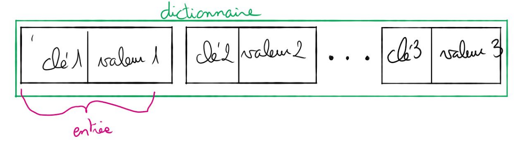
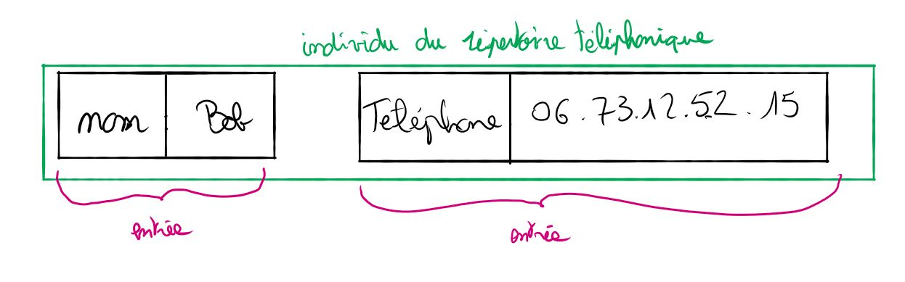

# Dictionnaire

## Les dictionnaires

### Définition

Un dictionnaire (aussi appelé tableau associatif) est une structure de données qui permet d’associer une valeur à une clé. Cette clé peut être un mot ou un entier. l’ensemble clé-valeur est appelé
entrée.

<figure markdown>

</figure>

**Exemple :**

<figure markdown>

</figure>

### Interface des dictionnaires

Voici les opérations que l’on peut effectuer sur le type abstrait dictionnaire :

* `ajout()` : on associe une nouvelle valeur à une nouvelle clé
* `modif()` : on modifie un couple clé :valeur en remplaçant la valeur courante par une autre
valeur (la clé restant identique)
* `suppr()` on supprime une clé (et donc la valeur qui lui est associée)
* `rech()` on recherche une valeur à l’aide de la clé associée à cette valeur.

**Exemples :**

Soit le dictionnaire `D` composé des couples : clé/valeur suivants => prenom : Kevin, nom :
Durand, date-naissance : 17-05-2005.

Pour chaque exemple ci-dessous on repart du dictionnaire d’origine :

* `ajout(D, tel : 06060606);` le dictionnaire D est maintenant composé des couples suivants :
prenom : Kevin, nom : Durand, date-naissance : 17-05-2005, tel : 06060606
* `modif(D, nom : Dupont);` le dictionnaire D est maintenant composé des couples suivants :
prenom : Kevin, nom : Dupont, date-naissance :17-05-2005
* `suppr(D, date − naissance);` le dictionnaire D est maintenant composé des couples suivants :
prenom : Kevin, nom :Durand
* `rech(D, prenom);` la fonction retourne Kevin

### Implémentation

L’implémentation des dictionnaires dans les langages de programmation peut se faire à l’aide
des tables de hachage. Les tables de hachages ainsi que les fonctions de hachages qui sont utilisées
pour construire les tables de hachages, ne sont pas au programme de NSI. Cependant, l’utilisation
des fonctions de hachages est omniprésente en informatique, il serait donc bon, pour votre "culture
générale informatique", de connaitre le principe des fonctions de hachages.

Pour avoir quelques idées sur le principe des tables de hachages, je vous recommande le visionnage
de cette vidéo : [wandida](https://www.youtube.com/watch?v=CkLctGYWFPA).

<figure markdown>
<iframe width="560" height="315" src="https://www.youtube.com/embed/CkLctGYWFPA?si=uWeyt1SHRQCCFdzk" title="YouTube video player" frameborder="0" allow="accelerometer; autoplay; clipboard-write; encrypted-media; gyroscope; picture-in-picture; web-share" referrerpolicy="strict-origin-when-cross-origin" allowfullscreen></iframe>
</figure>

Si vous avez visionné la vidéo de wandida, vous avez déjà compris que l’algorithme de recherche
dans une table de hachage a une complexité O(1) (le temps de recherche ne dépend pas du nombre
d’éléments présents dans la table de hachage), alors que la complexité de l’algorithme de recherche
dans un tableau non trié est O(n). Comme l’implémentation des dictionnaires s’appuie sur les tables
de hachage, on peut dire que l’algorithme de recherche d’un élément dans un dictionnaire a une
complexité `O(1`) alors que l’algorithme de recherche d’un élément dans un tableau non trié a une
complexité `O(n)`.

## Exercices

!!! example "Exercice 1"
    Préciser quelle est la structure de donnée à privilégier pour chacune de ces taches :
  
    1. Représenter un répertoire téléphonique.
    2. Stocker l’historique des actions effectuées dans un logiciel et disposer d’une commande Annuler.
    3. Envoyer des fichiers au serveur impression.
    4. On souhaite stocker un texte très long que l’on souhaite pouvoir modifier

!!! example "Exercice 2"
    Dans chacun des cas suivants, déterminez quelle structure de données est la plus adaptée :

    1. Gérer le flux des personnes arrivant à la caisse d’allocations familiales ;
    2. Mise en place d’un mécanisme annuler/refaire pour un traitement de texte ;
    3. Lors d’une partie échec, on veut enregistrer l’ensemble des coups joués et pouvoir les consulter.

!!! example "Exercice 3"
    Les résultats d’un vote ayant trois issues possibles ’A’, ’B’ et ’C’ sont stockés dans un tableau.

    Exemple :
    ```urne = ['A', 'A', 'A', 'B', 'C', 'B', 'C', 'B', 'C', 'B']```

    La fonction `depouille` doit permettre de compter le nombre de votes exprimés pour chaque
    artiste. Elle prend en paramètre un tableau et renvoie le résultat dans un dictionnaire dont les clés sont les noms des artistes et les valeurs le nombre de votes en leur faveur.
    La fonction `vainqueur` doit désigner le nom du ou des gagnants. Elle prend en paramètre un
    dictionnaire dont la structure est celle du dictionnaire renvoyé par la fonction depouille et renvoie un tableau. Ce tableau peut donc contenir plusieurs éléments s’il y a des artistes ex- aequo. Compléter les fonctions `depouille` et `vainqueur` ci-après pour qu’elles renvoient les résultats attendus.

    ``` py
    urne = ['A', 'A', 'A','B', 'C', 'B', 'C','B', 'C', 'B']

    def depouille(urne):
        resultat = ...
        for bulletin in urne:
            if ...:
                resultat[bulletin] = resultat[bulletin] + 1
            else:
                ...
        return resultat

    def vainqueur(election):
        vainqueur = ''
        nmax = 0
        for candidat in election:
            if ... > ... :
                nmax = ...
                vainqueur = candidat
        liste_finale = [nom for nom in election if election[nom] == ...]
        return ...
    ```

    Exemple d'utilisation :

    ``` py
    >>> election = depouille(urne)
    >>> election
    {'A': 3, 'B': 4, 'C': 3}
    >>> vainqueur(election)
    ['B']
    ```
