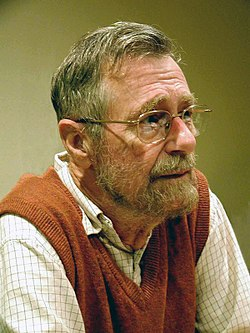
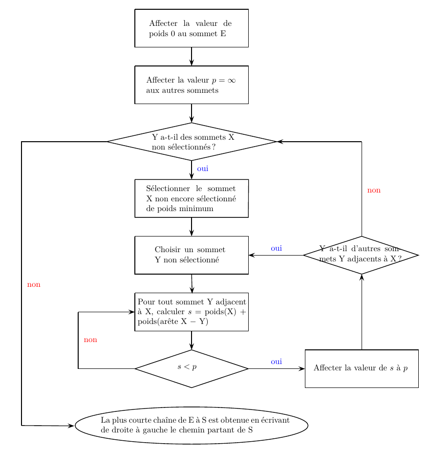
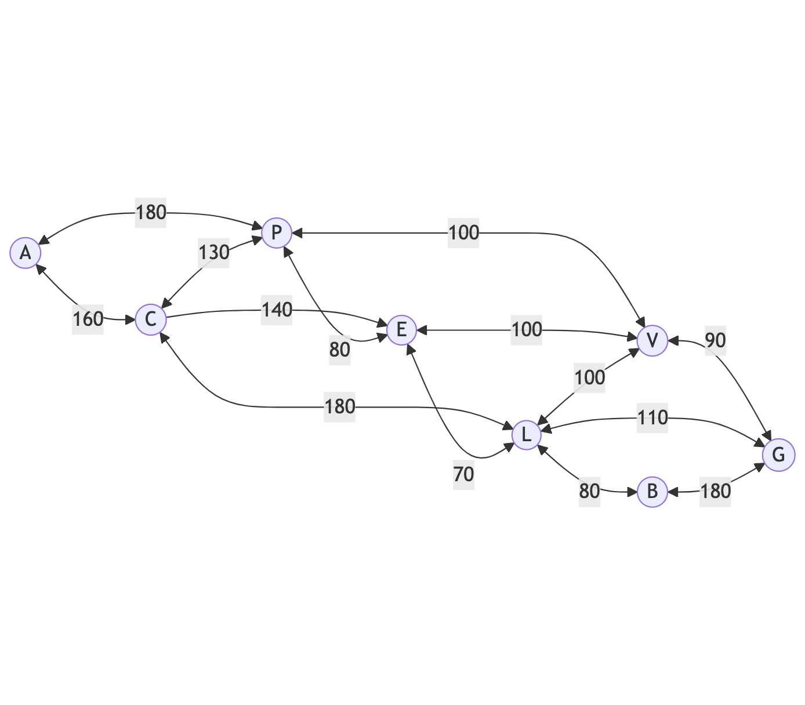
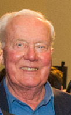

# Plus court chemin

## Algorithme de Dijkstra 

### Edsger Wybe Dijkstra

{ align=right width=150 }

Edsger Wybe Dijkstra (mathématicien et informaticien néerlandais 1930 − 2002) a proposé en 1959 un algorithme qui permet de calculer le plus court chemin entre un sommet particulier et tous les autres. C'est l'un des plus efficaces pour traiter les problèmes de plus court chemin. Grâce à la puissance du traitement informatique, il est utilisé par les logiciels d'optimisation de trajets réels (Navigateurs GPS, Site RATP. . .) ou virtuels (routage internet). Cet algorithme ne fonctionne que si le graphe ne possède que des valeurs positives.

### Algorithme de Dijkstra 

Si le plus court chemin reliant le sommet $E$ (entrée) au sommet $S$  (sortie) passe par les sommets $s_1, s_2,....,s_k$
 alors, les différentes étapes sont aussi les plus courts chemins reliant $E$ aux sommets successifs $s_1, s_2,....,s_k$. Nous devons dons construire de proche en proche le chemin cherché en choisissant à chaque itération de l'algorithme, un sommet $s_i$
 du graphe parmi ceux qui n'ont pas encore été traités, tel que la longueur connue provisoirement du plus court chemin allant de $E$ à $s_i$ soit la plus courte possible. L'algorigramme correspondant est donné ci-dessous :

<figure markdown>
 {width=600 }
 </figure>

### Exemple 

On considère l'extrait de carte de la région Auvergne-Rhône-Alpes donné ci-dessous :

<figure markdown>
 {width=600 }
 </figure>

Un technicien d'une entreprise doit se déplacer et pouvoir intervenir sur les différents sites de cette entreprises, situés dans les villes suivantes : Aurillac (A), Bourg-en-Bresse (B), Clermont-Ferrand (C), Saint-Etienne (E), Grenoble(G), Lyon (L), Le Puy-en-Velay(P), Valence(V). Il connait les distances suivantes par autoroute, en km :

<figure markdown>
| AC = 160 | PE = 80| VG = 90 |
|:--------:|:-------:|:-------:|
| AP = 180 |PV = 100 |LB = 80|
| CP = 130 |EL = 70 |LG = 110|
|CE = 140 |EV = 100 |BG = 180|
|CL = 180 |LV = 100 ||
</figure>

!!! example "Exercice 1"
    Donner une représentation sous forme de graphe de la situation présentée ci-dessus.

??? success "Correction"
    <figure markdown>
    {width=350px}
    </figure>>

!!! example "Exercice 2"
    Ayant terminé sa semaine de travail à Bourg-en-Bresse, le technicien souhaite retourner chez lui à Aurillac en faisant le moins de kilomètres possibles. Déterminer, en utilisant l'algorithme de Dijkstra, le plus court chemin entre les villes de Bourg-en-Bresse et Aurillac en empruntant le réseau routier, en s'aidant du tableau ci-dessous :

    <figure markdown>
    {width=600 }
    </figure>

    Quelle est alors la route à emprunter ?

??? success "Correction"

    <figure markdown>
    
    |     A    | B |     C    |     E    |     G    |     L    |     P    |     V      | Sommet choisi |
    |:--------:|:-:|:--------:|:--------:|:--------:|:--------:|:--------:|:----------:|:-------------:|
    | $\infty$ | 0 | $\infty$ | $\infty$ | $\infty$ | $\infty$ | $\infty$ | $\infty$   |      B(0)     |
    | $\infty$ | / | $\infty$ |  $\infty$ | 180 (B) | 80 (B)   |$\infty$  |  $\infty$ |     L(80)     |
    | $\infty$ | / |  260 (L) |  150 (L)  |  180 (B)|     /    | $\infty$ |  180 (L)   |     E(150)    |
    | $\infty$ | / |  260 (L) |     /     |  /      |      /   |  230 E |  180 (L)    |    G (180)    |
    |  $\infty$ | / |  260(L) |     /     |  /      |       /  |   230 E  |  180 (L) |     V(180)    |
    |  410 (P) | / |  260 (L) |     /    |  /       |     /    |  230 E   |     /      |     P(230)    |
    |  410 (P) | / |  260(L)  |     /    |     /    |     /    |     /    |     /      |     C(260)    |
    |  410 (P) | / |     /    |     /    |     /    |     /    |     /    |     /      |     A(410)    |
    <figure>

    B-> L ->  E-> P -> A

!!! example "Exercice 3"
    La route entre Le Puy-en-Velay et Aurillac est fermée à la circulation. Quel chemin doit-il alors emprunter?

??? success "Correction"
     B-> L ->  E-> C -> A

### Code Python de l'algorithme

!!! example "Exercice 4"
    Traduire l'algorigramme précédent en code Python. Vous pourrez vous aider des fonctions déterminées dans le chapitre algorithmes sur les graphes.

## Algo A*

<figure markdown>
{ align=left width=150 }
{ align=left width=130 }
{ align=left width=150 }
</figure>

L'algorithme A* est un algorithme de recherche de chemin dans un graphe entre un nœud initial et un nœud final. Il a été découvert par : Peter E. Hart (sur la photo de gauche), Nils John Nilsson (centre), Bertram Raphae (droite).  C'est un algorithme simple, ne nécessitant pas de prétraitement, et ne consommant que peu de mémoire. Il s'agit d'une extension de l'algorithme de Dijkstra. L'efficacité et la flexibilité de l'algorithme A* en font un outil précieux dans de nombreux domaines. Voici les principaux domaines dans lesquels il excelle :

* Jeux vidéo et divertissement ;
* Systèmes de navigation ;
* Robotique et automatisation ;
* Systèmes de réseaux.

