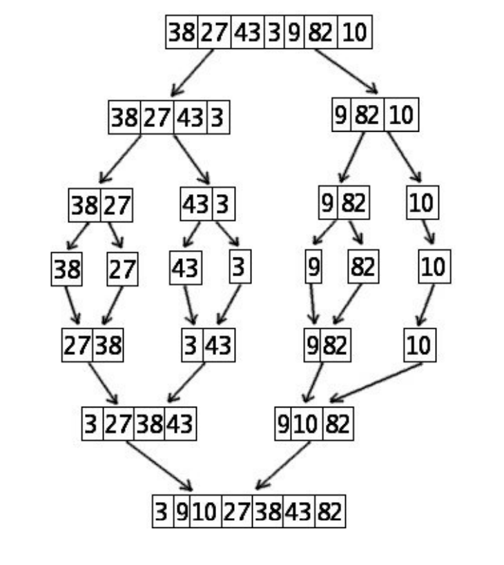

# Diviser pour régner

## Principe

Le diviser pour régner est une méthode algorithmique basée sur le principe suivant. On prend un problème (généralement complexe à résoudre), on divise ce problème en une multitude de petits problèmes, l’idée étant que les "petits problèmes" seront plus simples à résoudre que le problème original. Une fois les petits problèmes résolus, on recombine les "petits problèmes résolus" afin d’obtenir la solution du problème de départ.

Le paradigme "diviser pour régner" repose donc sur 3 étapes :

* DIVISER : le problème d’origine est divisé en un certain nombre de sous-problèmes indépendants
* RÉGNER : on résout les sous-problèmes (les sous-problèmes sont plus faciles à résoudre que le problème d’origine)
* COMBINER : les solutions des sous-problèmes sont combinées afin d’obtenir la solution du problème d’origine.

Les algorithmes basés sur le paradigme "diviser pour régner" sont très souvent des algorithmes récursifs.

## Recherche dichotomique

### Principe

La recherche par dichotomie (du grec dikhotomia, « division en deux parties ») est la recherche de la présence (ou non) d'un élément dans une liste triée. Notre fonction renverra donc un booléen.

### Recherche naïve

La recherche naïve (élément par élément) est naturellement de complexité linéaire. Nous allons voir que la méthode dichotomique est plus efficace.

!!! example "Exercice 1"
    Écrire une fonction qui recherche un élement dans une liste triée et qui renvoie un booléen.

### Recherche dicho

On recherche sur une liste triée. On compare le nombre recherché au nombre qui se trouve au centre du tableau.

* Si le nombre recherché est égal au nombre qui se trouve au centre du tableau, c’est terminé.
* Si le nombre recherché est inférieur au nombre qui se trouve au centre du tableau, on recommence sur la première moitié du tableau.
* Si le nombre recherché est supérieur au nombre qui se trouve au centre du tableau, on recommence sur la deuxième moitié du tableau.

Et ainsi de suite.

!!! example "Exercice 2"
    Réaliser la fonction `recherche_dicho()`sur une liste triée.

### Autre algorithme qui utilise la dichotomie

``` py linenums="1"
def recherche_dicho_rec(tab, val, i=0, j=None): 
    if j is None:                        
        j = len(tab)-1
    if i > j :
        return False
    m = (i + j) // 2
    if tab[m] < val :
        return recherche_dicho_rec(tab, val, m + 1, j)
    elif tab[m] > val :
        return recherche_dicho_rec(tab, val, i, m - 1 )
    else :
        return True

tab = [1, 5, 7, 9, 12, 13]
print(recherche_dicho_rec(tab, 12)) #affiche True
print(recherche_dicho_rec(tab, 17)) # affiche False
```

!!! example "Exercice 3"
    Comparer ces trois algorithmes. Lequel est le plus rapide ?

## Tris fusion

### Présentation

Le tri fusion est un tri récursif basé sur le principe "diviser pour régner". Cet algorithme repose donc sur une fonction auxiliaire, la fonction de fusion, qui prendra en argument deux listes triées et renverra la liste fusionnée.

Voici le principe de la fonction auxiliaire de fusion ordonnée de deux listes `L1` et `L2` de longueurs respectives `k` et `l` et une liste `M`.

* On initialise `i` et `j` à 0. On initialise `M` à `[]`.
* Tant que `i < k` et `j < l`, on compare `L1[i]` à `L2[j]`.
  
    * Si `L1[i] < L2[j]` alors :
  
        * On ajoute `L1[i]` à la fin de `M`.
        * On incrémente `i`
  
    * Sinon :

        * On ajoute `L2[j]` à la fin de `M` ;
        * On incrémente `j`

* Une fois la liste `M` de la façon suivante :
  
    * Si `i = k` et `j < l`, on ajoute les éléments `L2[j]`, ....., `L2[l − 1]` dans cet ordre à la fin de la liste `M`.
    * Si `i < k` et `j = l`, on ajoute les éléments `L1[i]`, ......, `L1[k − 1]` dans cet ordre à la fin de la liste `M`.
  
!!! example "Exercice 4"
    Suivons l’algorithme précédent pour réaliser à la main la fusion ordonnée des listes `L1 = [2, 5, 12]` et `L2 = [1, 6, 11, 15]` dans une liste `M`. Recopiez et complétez le tableau suivant :

    | i   | j   | M   | L1[i] | L2[j] |
    |:---:|:---:|:---:|:-----:|:-----:|
    |     |     |     |       |       |
    |     |     |     |       |       |
    |     |     |     |       |       |
    |     |     |     |       |       |
    |     |     |     |       |       |

** Exemple :**
Voici dans la figure ci-dessous une représentation de l’algorithme de tri fusion appliqué à la liste `A = [23, 12, 4, 56, 35, 32,42, 57, 3]`. Étudiez attentivement le schéma ci-dessous afin de mieux comprendre le principe du tri-fusion (identifiez bien les phases "DIVISER" et "COMBINER").

<figure markdown>
{width=350px}
</figure>

### Implémentation en Python

On définit d’abord une fonction permettant de fusionner deux listes triées au préalable en une seule liste triée.

!!! example "Exercice 5"
    Écrire la fonction fusion. 

!!! example "Exercice 6"
    On utilisera le découpage (ou slicing) pour la deuxième partie de l’algorithme. Cette fonction renvoie une copie triée de la liste passée en argument, sans la modifier.

    ``` py linenums="1"
        def tri_fusion(L):
        """ tri fusion d'une liste en récursif """
        if len(L) < 2:
            return L
        return fusion(triFusion(L[:len(L)//2]),triFusion(L[len(L)//2:]))
    ```

    Tester cette fonction avec la liste `L = [23, 12, 4, 56, 35, 57, 3, 11, 6]`

### Complexité

Le tri fusion a une complexité logarithmique bien meilleure qu'une complexité quadratique (tri sélection, tri insertion, tri à bulles). En conclusion, la complexité dans le pire des cas de l'algorithme du tri fusion vaut  $O(n\times log_2(n))$ avec $n$ la longueur de la liste.