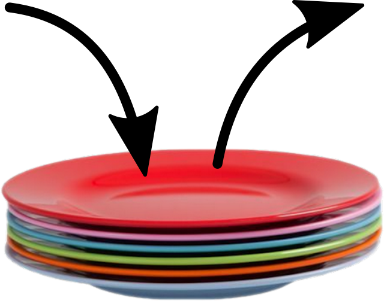
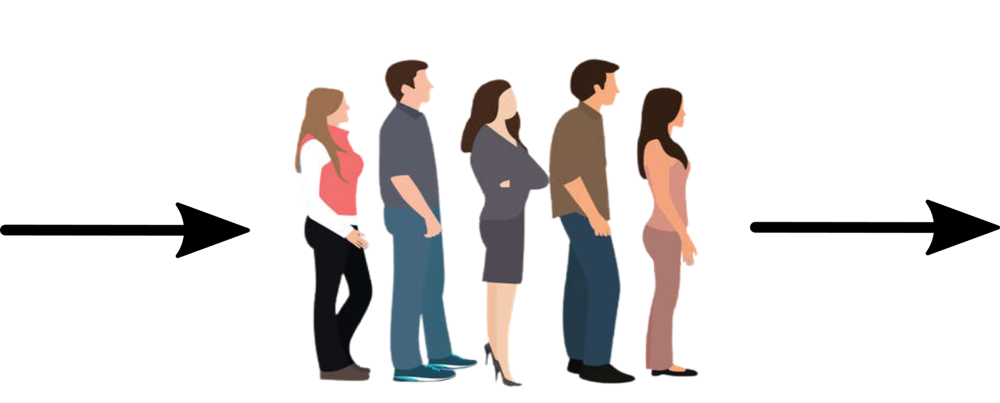

# Les piles et les files

## Les piles

### Définition

On retrouve dans les piles une partie des propriétés vues sur les listes. Dans les piles, il est uniquement possible de manipuler le dernier élément introduit dans la pile. On prend souvent l’analogie avec une pile d’assiettes : dans une pile d’assiettes la seule assiette directement accessible et la dernière assiette qui a été déposée sur la pile.

<figure markdown>
{width=200px}
</figure>

Les piles sont basées sur le **principe LIFO** (Last In First Out : le dernier rentré sera le premier à
sortir).

### Applications

* Une pile peut être utilisée pour stocker de l’information, que ce soit au niveau du processeur ou au niveau de programmes ou d’application.
* La programmation récursive nécessite l’utilisation d’une pile. En effet, lors de l'exécution d'une fonction récursive, le processeur empile successivement les appels à traiter : seule l'instruction du haut de la pile peut être traitée.
* Un navigateur ou un traitement de texte mémorise les actions effectuées afin de revenir en arrière pas à pas. Les pages ou les fichiers ouverts sont également mémorisés.
* Une pile peut être nécessaire au calcul d’expression mathématique suivant la notation utilisée (exemple la notation polonaise et la notation polonaise inversée).

<iframe src="https://commons.wikimedia.org/wiki/File:Typing_the_calculation_for_%228_times_6%22_into_a_pocket_calculator_HP-32SII_which_uses_RPN_logic.webm?embedplayer=yes" width="256" height="396.2377260981912" frameborder="0" loading="lazy" allow="autoplay; picture-in-picture" allowfullscreen></iframe>

### Interface des piles

Voici les opérations que l’on peut réaliser sur une pile :

* on peut vouloir créer une pile vide `creer_pile` (en général, à partir du constructeur)
* on peut savoir si une pile est vide (`pile_vide()`) ;
* on peut empiler un nouvel élément sur la pile (`empiler`)
* on peut récupérer l’élément au sommet de la pile tout en le supprimant. On dit que l’on dépile
(`depiler`)
* on peut accéder à l’élément situé au sommet de la pile sans le supprimer de la pile (`sommet`)
* on peut connaitre le nombre d’éléments présents dans la pile (`taille`).

### Implémentation en Python

!!! example "Exercice 1"
    Créer une class Pile en Python avec ces 5 opérations. Vous utiliserez les listes Python.

## Les files

### Définition

Comme les piles, les files ont des points communs avec les listes. Différences majeures : dans une
file on ajoute des éléments à une extrémité de la file et on supprime des éléments à l’autre extrémité.
On prend souvent l’analogie de la file d’attente devant un magasin pour décrire une file de données.
Les files sont basées sur le principe FIFO (First In First Out : le premier qui est rentré sera le
premier à sortir).

<figure markdown>
{width=300px}
</figure>

### Applications

On retrouve souvent ce principe FIFO en informatique notamment dans la gestion des processus. On les retrouve également pour un imprimante qui gère une file de documents en attente d’impression.

### Interface des files

Voici les opérations que l’on peut réaliser :

* `creer_file` pour créer un filer vide.
* `file_vide` pour savoir si une file est vide ;
* `ajout` pour ajouter un nouvel élément à la file
* `retire` pour récupérer l’élément situé en bout de file tout en le supprimant
* `premier` pour accéder à l’élément situé en bout de file sans le supprimer de la file
* `taille` pour connaitre le nombre d’éléments présents dans la file
  
### Implémentation en Python

!!! example "Exercice 2"
    Implémentez en Python ces 5 opérations à l'aide de liste en Python.

## Exercices

!!! example "Exercice 3"
    Supposons que l'on dispose du type Pile et du type File décrits précédemment. On pose pour contrainte de n'utiliser que ces deux structures de données (pas de list Python par exemple).

    Écrire une procédure `inverse` qui prend en paramètre une pile `p` et inverse l'ordre de ses éléments (et ne renvoie rien, ce n''est pas une fonction). La pile `p` passée en paramètre est modifiée par l'exécution de la procédure.

!!! example "Exercice 4"
    Supposons que l'on dispose du type Pile. Écrire une fonction `copie` qui prend en paramètre une pile `p` et renvoie une autre pile contenant les mêmes éléments que `p` dans le même ordre.

!!! example "Exercice 5"
    Supposons que l'on dispose du type Pile et uniquement cette structure de données. Écrire une fonction qui prend en paramètre une pile contenant des nombres entiersvet renvoie deux nouvelles piles : une contenant uniquement les nombres pairs, et une autre uniquement les nombres impairs de la pile de départ.

    Dans les deux piles renvoyées, les éléments doivent être dans l'ordre initial, et la pile initial ne doit pas être vide.

!!! example "Exercice 6"
    On dispose d'une chaîne de caractère contenant uniquement des parenthèses ouvrantes et fermantes, comme "((())))". Un parenthésage est correct, si en parcourant la chaîne de caractère de gauche à droite, à tout moment , le nombre de parenthèses dejà ouvertes est supérieur ou égal au nombre de parenthèses déjà fermées. De plus, dans la chaîne complète, il doit y avoir autant de parenthèses ouvrantes que de parenthèses fermantes.

    1. Écrire une portion de code, qui en utilisant le type Pile, parcourt la chaîne de caractère et empile une valeur (peu importe laquelle) lorsque le caractère est "(" et dépile une valeur lorsque le caractère est ")".
    2. Tester le code précédent sur les chaînes : "(()())", "())()(" et "(()". Que dire de ces trois cas ? Et comment, avec la pile, détecter le bon parenthésage ?
    3. Écrire une fonction `parenthesage` qui prend en paramètre une chaîne de caractères et renvoie `True` si la chaîne est bien parenthésée et `False` sinon. Attention, la fonction devra renvoyer `False` si la chaîne de caractère comporte un autre caractère que '(' et ')'.

!!! example "Exercice 7"
    Faire une classe pile et une classe file à l'aide des listes chaînées