# Algorithmes sur les graphes

## Représentations d'un graphe

### Rappels et exemple

Un graphe est un objet mathématique (très utilisé, notamment en informatique) constitué de sommets reliés entre eux par des arêtes (ou des arcs).

Exemple de graphe :

<figure markdown>
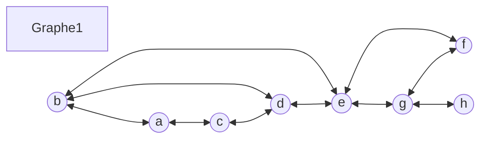
</figure>

Mathématiquement, on peut définir un graphe 𝐺 par un couple $G = (V, E)$ avec :

* $V$ un ensemble de sommets (vertices) (on dit aussi nœuds ou points)
* *E* un ensemble d’arêtes (edges) (on dit aussi arcs, liens ou lignes)
* Chaque arête est définie par une paire de deux sommets distincts :

$E \subset \{\{x,y\}|(x,y) \in V^2 ∧ x \neq 𝑦\}$

*Remarque* : Cette expression mathématique signifie que E est un sous-ensemble de l'ensemble de toutes les paires non ordonnées d'éléments distincts de V. Plus précisément :

1. $V^2$ représente le produit cartésien de V avec lui-même, c'est-à-dire l'ensemble de tous les couples (x,y) où x et y sont des éléments de V.

2. La condition $x \neq y$ exclut les paires où les deux éléments sont identiques.

3. $\{\{x,y\}|(x,y) \in V^2 ∧ x \neq y\}$ est l'ensemble de toutes les paires non ordonnées $\{x,y\}$ telles que x et y sont des éléments distincts de V.

4. $E \subset$ indique que E est un sous-ensemble de cet ensemble de paires.

En termes simples, E est un ensemble de paires d'éléments distincts de V, où l'ordre des éléments dans chaque paire n'est pas important. Cette notation est souvent utilisée pour décrire les arêtes d'un graphe non orienté, où V serait l'ensemble des sommets et E l'ensemble des arêtes .

<!-- 
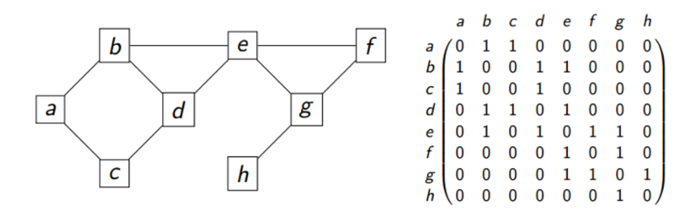 -->

### Représentation à l'aide d'un dictionnaire

On peut implémenter ce graphe en Python par un dictionnaire :

```python
G = {}
G['a'] = ['b','c']
G['b'] = ['a','d','e']
G['c'] = ['a','d']
G['d'] = ['b','c','e']
G['e'] = ['b','d','f','g']
G['f'] = ['e','g']
G['g'] = ['e','f','h']
G['h'] = ['g']
```

!!! example "Exercice 1"
    Après avoir implémenter le graphe G. Écrire des fonctions pour obtenir :

    * Nombre de sommets 
    * Nombre d'arêtes
    * Degré d'un sommet
    * Sommet de plus haut degré
    * Voisins d'un sommet
  
Si on le désire, nous pouvons à partir du dictionnaire G générer également la matrice d'adjacence :

``` py linenums="1"
liste = ['a', 'b', 'c', 'd', 'e', 'f', 'g', 'h']
n = len(liste)
A = [[0] * n for i in range(n)]
for i in range(n):
    for j in range(n):
        if liste[j] in G[liste[i]]:
            A[i][j] = 1
``` 

### A l'aide d'une liste de liste

Nous avons vu précédement que un graphe pouvait être représenté par une matrice d'adjacence.

``` py linenums="1"

A = [[0, 1, 1, 0, 0, 0, 0, 0],
[1, 0, 0, 1, 1, 0, 0, 0],
[1, 0, 0, 1, 0, 0, 0, 0],
[0, 1, 1, 0, 1, 0, 0, 0],
[0, 1, 0, 1, 0, 1, 1, 0],
[0, 0, 0, 0, 1, 0, 1, 0],
[0, 0, 0, 0, 1, 1, 0, 1],
[0, 0, 0, 0, 0, 0, 1, 0]]
```

!!! example "Exercice 2"
    Implémenter le graphe G avec cette matrice.
    Écrire les mêmes fonctions que précédemment.


    * Nombre de sommets 
    * Nombre d'arêtes
    * Degré d'un sommet
    * Sommet de plus haut degré
    * Voisins d'un sommet

!!! example "Exercice 3"
    Implémenter le graphe du réseau social suivant et determiner celui qui a le plus d’amis.
    

    Un réseau social comporte 6 abonnés (A, B, C, D, E et F) où :

    * A est ami avec B, C et D
    * B est ami avec A et D
    * C est ami avec A, E et D
    * D est ami avec tous les autres abonnés
    * E est ami avec C, D et F
    * F est ami avec E et D
    
<figure markdown>
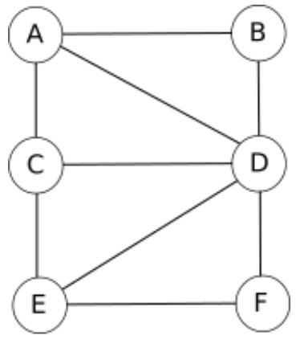{width=250px}
</figure>

### À l'aide d'une bibliothèque

La bibliothèque `networkX`  permet de manipuler des graphes.

Pour implémenter le graphe G, on commence par importer le module.

``` py linenums="1"
import networkx as nx
```

On crée un graphe vide.

``` py linenums="1"
#création du graphe
g1 = nx.Graph()
```

On ajoute les sommets (appelés node ou vertex)

``` py linenums="1"
#création des sommets
g1.add_node('a')
g1.add_node('b')
g1.add_node('c')
g1.add_node('d')
g1.add_node('e')
g1.add_node('f')
g1.add_node('g')
g1.add_node('h')
```

On ajoute les arêtes (appelés edge)

``` py linenums="1"
#Création des arêtes
g1.add_edge('a', 'b')
g1.add_edge('a', 'c')
g1.add_edge('b', 'd')
g1.add_edge('b', 'e')
g1.add_edge('c', 'd')
g1.add_edge('d', 'e')
g1.add_edge('e', 'g')
g1.add_edge('e', 'f')
g1.add_edge('g', 'f')
g1.add_edge('g', 'h')
```

On peut visualiser le graphe grâce à matplotlib et la fonction draw. Ici on a de plus configuré l’affichage pour que les étiquettes des sommets soient affichées, la taille des sommets soit de 800, la couleur de fond des sommets gris clair.

``` py linenums="1"
import matplotlib.pyplot as plt

nx.draw(g1, with_labels = True, 
        font_weight = 'bold',
        node_size = 800,
        node_color = 'lightgrey')
plt.show()
```

On peut également le faire avec des listes de sommets et d’arêtes :

``` py linenums="1"
import networkx as nx 
import matplotlib.pyplot as plt

#création des sommets
liste1 = ['a', 'b', 'c', 'd', 'e', 'f', 'g', 'h'] 
g2 = nx.Graph()
g2.add_nodes_from(liste1)

#création des arêtes
liste2=[('a','b'),('a','c'),('b','d'),('b','e'),('c','d'),('d','e'),('e','g'),('e','f'),('g','f'),('g','h')]
g2.add_edges_from(liste2)

#création du graphique
nx.draw(g2, with_labels=True,
        font_weight='bold',
        node_size=800,
        node_color='lightgrey')
plt.show()
```

Pour la matrice d’adjacence : **networkx** propose une méthode `nx.adjacency_matrix(g2)` qui stocke les coefficient saij de la matrice d’adjacence. Il suffit alors de remplir un tableau avec ces coefficients

``` py linenums="1"
B = nx.adjacency_matrix(g2)
print(B[(0,0)])
n=len(liste1)
A=[[0]*n for i in range(n)]
for i in range(n):
    for j in range(n):
        A[i][j]= B[(i,j)]
        
        
print(A)
```

La documentation de NetworkX est divisée en sections. Il existe notamment :

* une section pour obtenir les méthodes sur [https://networkx.org/documentation/stable/reference/functions.html](les sommets et les arêtes) ;
* une section pour obtenir les [https://networkx.org/documentation/stable/reference/algorithms/index.html](algorithmes disponibles) ;
* on pourra aussi consulter le [https://networkx.org/documentation/stable/tutorial.html](tutoriel) de **NetworkX**
  
Voici quelques fonctions  :

* degrés d’un sommet du graphe g : `g.degree('a')`
* nombre de sommets du graphe g : `g.number_of_nodes()`
* nombre d’arcs du graphe g : `g.number_of_edges()`
* `g.predecessors(i)` : liste des prédecesseurs du sommet $i$
* `g.successors(i) : liste des successeurs du sommet $i$
* `g.neighbors(i)` : liste des voisins du sommet $i$

!!! example "Exercice 4"
    Tester ces différents programmes.
    Écrire des fonctions permettant d’obtenir les informations suivantes sur le graphe G :

    * le nombre de sommets du graphe ;
    * le nombre d’arêtes du graphe ;
    * le degré d’un sommet ;
    * le sommet de plus haut degré ;
    * les voisins d’un sommet

!!! example "Exercice 5"
    Implémenter le graphe du réseau social suivant et faire afficher celui qui a le plus d’amis un réseau social comporte 6 abonnés (A, B, C, D, E et F) où :

    * A est ami avec B, C et D
    * B est ami avec A et D
    * C est ami avec A, E et D
    * D est ami avec tous les autres abonnés
    * E est ami avec C, D et F
    * F est ami avec E et D

<figure markdown>
{width=250px}
</figure>

## Principe des différents parcours

Un parcours de graphe est un algorithme consistant à explorer tous les sommets d'un graphe de proche en proche à partir d'un sommet initial. Ces parcours sont notamment utilisés pour rechercher un plus court chemin (et donc dans les GPS) ou pour trouver la sortie d'un labyrinthe...

Tous les parcours suivent plus ou moins le même algorithme de base :

* On visite un sommet A. On crée une structure $S$ qui contiendra au départ l'ensemble des voisins de $A$ .
* Tant que $S$ n’est pas vide :

    * on choisit un sommet s de $S$
    * on visite s
    * on ajoute à $S$ tous les voisins de s pas encore visités

Le choix de la structure de l'ensemble $S$ est prépondérant:

* Si on choisit une file (FIFO): on visitera les sommets dans l'ordre d'arrivée, donc les plus proches du sommet précédent. On obtient donc un parcours en largeur nommé Breadth First Search ou  BFS.
* Si on choisit une pile (LIFO): on visitera d'abord les derniers sommets arrivés, donc on parcourt le graphe en visitant à chaque étape un voisin du précédent. On obtient donc un parcours en profondeur nommé Depth First Search ou DFS.

**Remarque  :**   parcourir simplement le dictionnaire ou la matrice d’un graphe n’est pas considéré comme un parcours de graphe.

### Le parcours en largeur (Breadth First Search ou BFS)

#### Principe

Parcourir un graphe en largeur à partir d'un sommet consiste à visiter le sommet puis ses enfants, puis les enfants de ses enfants....

Comme nous l'avons vu dans le chapitre précédent, nous allons utiliser une file et une liste pour marquer les sommets visités.

#### Exemple

<figure markdown>
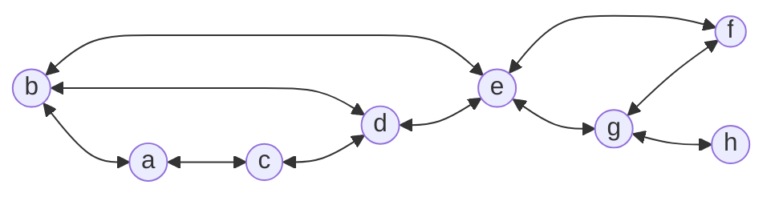
</figure>


Voici le code pour créer le dictionnaire qui représente le graphe  précédent et une fonction qui nous retourne la liste des voisins.

``` py linenums="1"
G = dict()
G['a'] = ['b','c']
G['b'] = ['a','d','e']
G['c'] = ['a', 'd']
G['d'] = ['b','c','e']
G['e'] = ['b','d', 'f', 'g']
G['f'] = ['e', 'g']
G['g'] = ['e', 'f', 'h']
G['h'] = ['g']

def voisins(G, sommet):
    return G[sommet]
``` 

!!! example "Exercice 1"
    Implémenter ce graphe et tester la fonction voisins}

Pour réaliser le parcours en largeur, on dispose d'un graphe (`G`, d'une liste (`sommet_visite`) et d'une file `f`. 

On prend `b` comme sommet de départ. On l'enfile.

Puis, tant que la file n'est pas vide (boucle `while`) :

* On défile `f` dans une variable `tmp`  ;
* Si `tmp` n'est pas dans `sommet_visite`, alors on l'ajoute à `sommet_visite`.
* Pour chaque voisin de `tmp` : s'il n'est ni dans `sommet_visite` ni dans la file, on l'enfile.
* On renvoie `sommet_visite`.

Voici l'évolution des contenus des variables pour les deux premiers tours de la boucle `while` :

**ÉTAPE 1 :**

```py linenums="1"
tmp = 'b'
sommet_visite = ['b']
f = 'a', 'd', 'e'
```

<!-- <figure markdown>
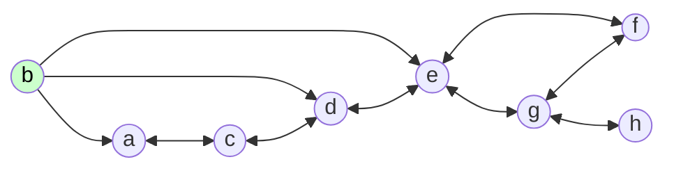
</figure> -->

<figure markdown>
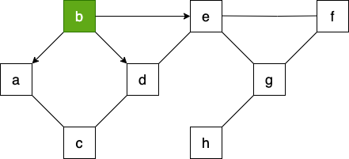
</figure> 


**ÉTAPE 2 :**
```py linenums="1"
tmp = 'a'
sommet_visite = ['b', 'a']
f = 'd', 'e', 'c'
```
<!-- 
<figure markdown>
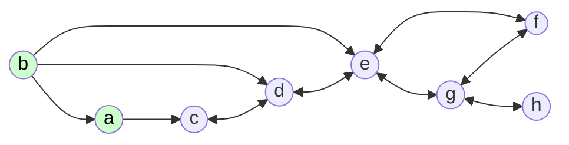
</figure>
 -->
<figure markdown>
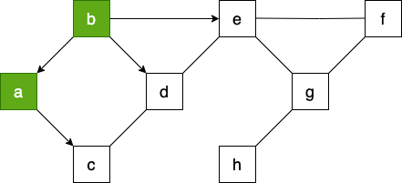
</figure>

!!! example "Exercice 2"
    Compléter le contenu des variables `tmp`, `sommet_visite` et `file`.

**ÉTAPE 3 :**
``` py
tmp = 
sommet_visite = 
f = 
```

<figure markdown>
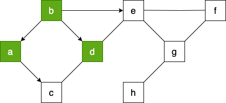
</figure>

**ÉTAPE 4 :**

``` py
tmp = 
sommet_visite = 
f = 
``` 

<figure markdown>
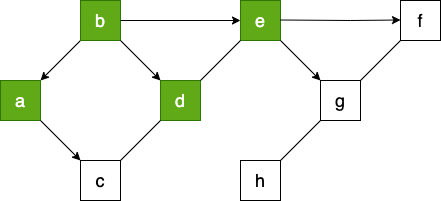
</figure>

**ÉTAPE 5 :**

``` py
tmp = 
sommet_visite = 
f = 
```

<figure markdown>

</figure>

**ÉTAPE 6 :**

``` py
tmp = 
sommet_visite = 
f = 
``` 

<figure markdown>

</figure>

**ÉTAPE 7 :**
``` py
tmp = 
sommet_visite = 
f = 
```

<figure markdown>

</figure>

**ÉTAPE 8 :**

``` py
tmp = 
sommet_visite = 
f = 
```

<figure markdown>

</figure>

Au final, l'arborescence associée au parcours peut donc être modélisée de la façon suivante :

<figure markdown>
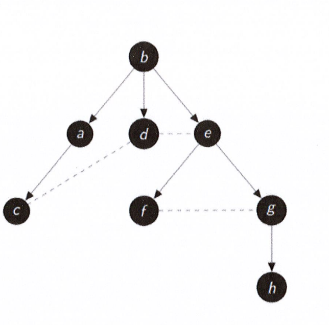{width=250px}
</figure>

Le parcours en largeur nous donne donc : ['b', 'a', 'd', 'e', 'c','f', 'g', 'h']

#### Implémentation du BFS en Python

Voici une classe `File` dans laquelle on a rajouté une méthode `present(self,x)` qui renvoie vrai si x est dans la file.

**Remarque :** Vous pouvez aussi utiliser votre propre classe `File`

``` py linenums="1"
class File:
    ''' classe File '''
    def __init__(self):
        self.L = []

    def vide(self):
        return self.L == []

    def defiler(self):
        assert not self.vide(), 'file vide'
        return self.L.pop(0)

    def enfiler(self, x):
        self.L.append(x)

    def taille(self):
        return len(self.L)

    def sommet(self):
        return self.L[0]

    def present(self,x):
        return x in self.L
```

Et voici l'algorithme du BFS :

```plaintext
fonction parcours_largeur(G, sommet):
    sommet_visite ← []
    f ← File()
    f.enfiler(sommet)
    
    Tant que f n’est pas vide faire :
        tmp ← f.defiler()
        afficher tmp
        
        Si tmp n’est pas dans sommet_visite alors
            ajouter tmp à sommet_visite
        Pour chaque voisin de tmp faire
            Si voisin n'est pas dans sommet_visite et n'est pas dans la file alors :
                    f.enfiler(voisin)
    Fin Tant que
    
    renvoyer sommet_visite
```

!!! example "Exercice 3"
    Implémenter cet algorithme en Python et tester le sur notre Graphe G

#### BFS - version récursive

La présence d’une boucle while nous suggère la version récursive de cet algorithme. On dispose
d’un graphe, d’une file contenant le sommet de départ, d’une liste, contenant le sommet de départ
et qui nous servira à marquer les sommets visités.
Le processus :

1. on défile la file dans une variable tmp (on l’affiche)
2. pour chaque voisin non déjà visité de tmp
3. on le note comme visité
4. on l’enfile
5. on recommence à partir de l’étape 1
Le processus s’arrête quand la file est vide.
Voici le programme :

``` plaintext
def bfs_rec(G, f, sommets_visites):
    if f.vide():
        return None
    tmp = f.defiler()
    print(tmp, end='')
    for u in voisins(G, tmp):
        if u not in sommets_visites:
            sommets_visites.append(u)
            f.enfiler(u)
            bfs_recur(G, f,sommets_visites)

f = File()
sommets_visites = []
sommet = 'b'
f.enfiler(sommet)
sommets_visites.append(sommet)
bfs_recur(G, f, sommmets_visites)
```

Exercice 4 :
    Faire fonctionner ce programme pour notre graphe.

#### Application : un chemin entre deux sommets

L’algorithme BFS découvre les sommets «par cercles concentriques» autour du point de départ.
On découvre d’abord tous les sommets à la distance 1 du point de départ, puis à la distance 2, puis
3, etc.

Un sommet situé à la distance 5 sera découvert en tant que voisin d’un sommet à la distance 4,
qui lui-même aura été découvert grâce à un sommet à la distance 3, qui lui-même...
On reprend notre graphe.

<figure markdown>

</figure>

Par exemple : a-b-e-g-h est l’un des chemins possibles entre a et h.

La méthode consiste à mémoriser les sommets voisins du sommet visité comme clé d’un dictionnaire et ayant pour valeur son parent (le sommet visité).

Le sommet de départ n’aura pas de parent (None).

A la fin, notre dictionnaire sera : '{’a’ : None, ’b’ : ’a’, ’c’ : ’a’, ’d’ : ’b’, ’e’ : ’b’, ’f’ : ’e’, ’g’ : ’e’, ’h’ : ’g’}'

Il nous faudra lire ce dictionnaire pour pouvoir établir le chemin entre a et h. h a pour parent e
qui a pour parent b et qui a pour parent a. D’où le chemin : a - b - e - g - h.

``` plaintext
fonction parcours_largeur(G_depart):
    parents <- dict()
    sommet_visite <- []
    f <- File()
    f.enfiler(depart)
    parents[depart] <- None
    tant que f n'est pas vide faire :
        on défile f dans tmp
        Si tmp n'est pas dans sommet_visite alors
            l'ajouter à sommet_visite
        Pour chaque voisin de tmp faire :
            Si il n'est pas dans sommet_visite et pas dans la file alors :
                l'enfiler
                parents[el] <- tmp
    fin tant que
    renvoyer parents
```

Cette fonction renvoie un dictionnaire qui contient les sommets visités (clés) et leurs parents
(valeurs).

Il faut maintenant exploiter ce dictionnaire pour faire afficher un chemin entre deux sommets.
C’est ce que réalise cette fonction qui prend en paramètre le sommet d’arrivée et le dictionnaire
parent.

```py linenums="1"
def solution(end, parent):
    chemin = []
    courant = end
    while courant != None :
        chemin = [courant] + chemin
        courant = parent[courant]
    return chemin
```

!!! example "Exercice 5"
    Implémenter l’alogorithme en Python et la fonction pour afficher un chemin entre les sommets
    b et h de notre graphe.

!!! example "Exercice 6"
    Reprendre ce travail en utilisant la version récursive du BFS.
    Il faudra ensuite une fonction pour recréer le chemin.

**Remarque :** Si le graphe est connexe, tout parcours BFS au départ de A va parcourir l’intégralité du graphe, et donc passera par B à un moment. Un chemin sera donc forcément trouvé entre A et B.

Comment est-on sûr que ce chemin trouvé est le plus court ?

La découverte des sommets par cercles concentriques entre A et B nous assure qu’on ne peut pas
rater le point B : s’il est à la distance k de A, il sera forcément visité puisque tous les sommets à la distance k vont passer par la liste d’attente, après les sommets de distance k-1 et avant les sommets de distance k+1.

Lorsqu’on remontera de B vers A en passant par les sommets parents successifs, il ne peut y
avoir qu’un seul sommet par «couche» : le chemin sera donc exactement de longueur k, il sera donc
minimal.

### Le parcours en profondeur(Depth First Search ou DFS)

#### Principe

Parcourir un graphe en profondeur à partir d’un sommet, consiste à explorer le graphe en suivant
un chemin. Lorsqu’on arrive sur un sommet qui n’a plus de voisins non visités, on le marque. Puis
on remonte dans le chemin pour explorer les voisins non visités d’un autre sommet...On utilise une
pile et deux listes.

#### Exemple

Prenons en exemple ce graphe :

<figure markdown>

</figure>

On dispose d’un graphe(G), de deux listes (sommets_visités , sommets_fermés) et d’une pile
(p). Le sommet de départ est par exemple ’g’, on l’empile. On met le sommet de départ dans la liste
sommets_visités. Puis tant que la pile n’est pas vide :

* On récupère le sommet de la pile dans une variable tmp
* voisins reçoit la liste des voisins de tmp non déjà visités
* Si voisins n’est pas vide :

    * v←un voisin choisi au hasard
    * sommets_visités←v
    * On empile v

* Sinon :`

    * sommets_fermés ← tmp
    * On dépile p

Voici les contenus des variables au premier tour de la boucle tant que :

<div style="text-align:center;font-size :x-large;font-style:bold"> Premier tour </div>

* tmp : `g`
* voisins : `[’e’, ’f’, ’h’]`
* v : `e`
* sommets_visités : `[’g’, ’e’]`
* pile : `[’g’, ’e’]`
* sommets_fermés : `[]`

<figure markdown>
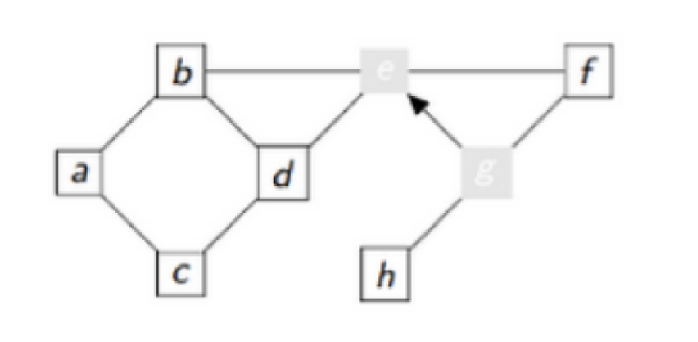{width=500px}
</figure>

<div style="text-align:center;font-size :x-large;font-style:bold"> Deuxième tour </div>

* tmp : `e`
* voisins : `[’b’, ’d’, ’f’]`
* v : `b`
* sommets_visités : `[’g’, ’e’, ’b’]`
* pile : `[’g’, ’e’, ’b’]`
* sommets_fermés : `[]`

<figure markdown>
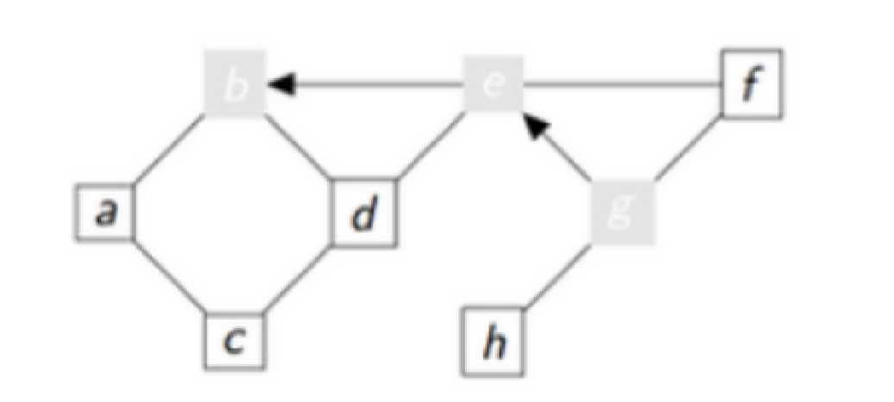{width=500px}
</figure>

!!! example "Exercice 7"
    Compléter les contenus des variables

<div style="text-align:center;font-size :x-large;font-style:bold"> 3 eme tour </div>

* tmp :
* voisins :
* v : 
* sommets_visités : 
* pile : 
* sommets_fermés : 

<figure markdown>
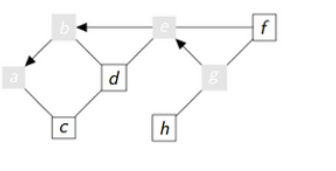{width=400px}
</figure>

<div style="text-align:center;font-size :x-large;font-style:bold"> 4eme tour </div>

* tmp :
* voisins :
* v : 
* sommets_visités : 
* pile : 
* sommets_fermés : 

<figure markdown>
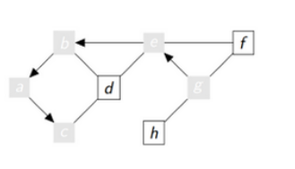{width=400px}
</figure>

<div style="text-align:center;font-size :x-large;font-style:bold"> 5eme tour </div>

* tmp :
* voisins :
* v : 
* sommets_visités : 
* pile : 
* sommets_fermés : 

<figure markdown>
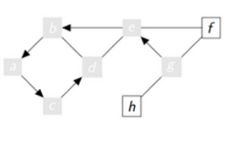{width=400px}
</figure>

<div style="text-align:center;font-size :x-large;font-style:bold"> 6eme tour </div>

* tmp : []
* voisins : d
* v :  
* sommets_visités : `[’g’, ’e’, ’b’, ’a’, ’c’, ’d’]`
* pile : `[’g’, ’e’, ’b’, ’a’, ’c’]`
* sommets_fermés :  `[’d’]`

<figure markdown>
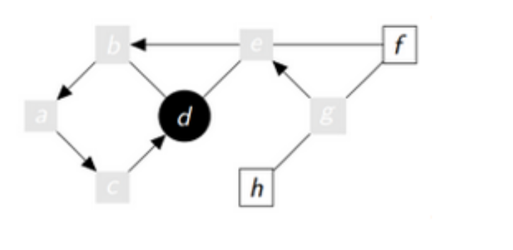{width=400px}
</figure>

!!! example "Exercice 8"
    Poursuivez

<div style="text-align:center;font-size :x-large;font-style:bold"> 7eme tour </div>

* tmp : 
* voisins : 
* v :  
* sommets_visités : 
* pile : 
* sommets_fermés :  

<figure markdown>
{width=400px}
</figure>

<div style="text-align:center;font-size :x-large;font-style:bold"> 8eme tour </div>

* tmp : 
* voisins : 
* v :  
* sommets_visités : 
* pile : 
* sommets_fermés :  

<figure markdown>
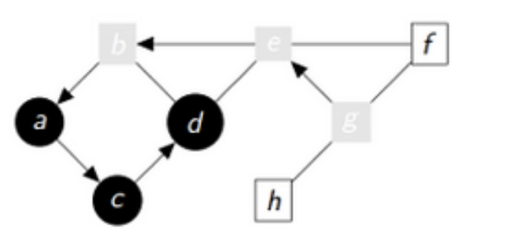{width=400px}
</figure>

<div style="text-align:center;font-size :x-large;font-style:bold"> 9eme tour </div>

* tmp : 
* voisins : 
* v :  
* sommets_visités : 
* pile : 
* sommets_fermés :  

<figure markdown>
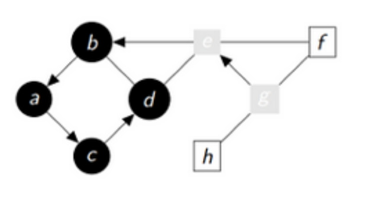{width=400px}
</figure>

<div style="text-align:center;font-size :x-large;font-style:bold"> 10eme tour </div>

* tmp : 
* voisins :
* v :  
* sommets_visités : 
* pile : 
* sommets_fermés :  

<figure markdown>
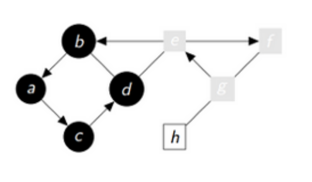{width=400px}
</figure>

<div style="text-align:center;font-size :x-large;font-style:bold"> 11eme tour </div>
* tmp : 
* voisins :
* v :  
* sommets_visités : 
* pile : 
* sommets_fermés :  

<figure markdown>
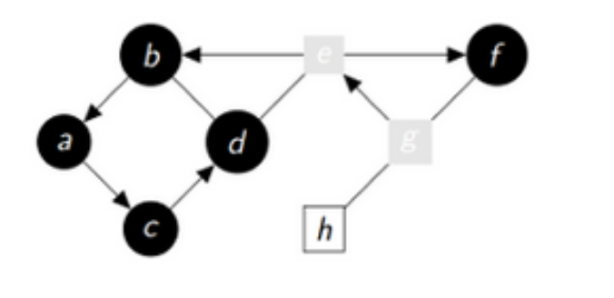{width=400px}
</figure>

<div style="text-align:center;font-size :x-large;font-style:bold"> 12eme tour </div>

* tmp : 
* voisins : 
* v :  
* sommets_visités : 
* pile : 
* sommets_fermés :  

<figure markdown>
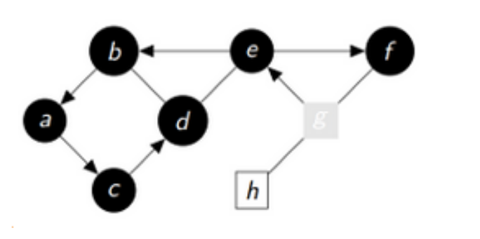{width=400px}
</figure>

<div style="text-align:center;font-size :x-large;font-style:bold"> 13eme tour </div>

* tmp : 
* voisins : 
* v :  
* sommets_visités : 
* pile :
* sommets_fermés :  

<figure markdown>
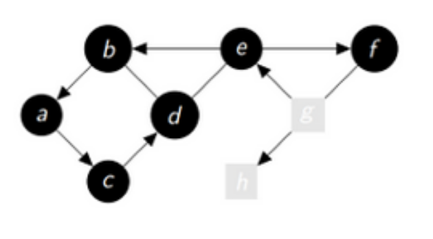{width=400px}
</figure>

<div style="text-align:center;font-size :x-large;font-style:bold"> 14eme tour </div>

* tmp : 
* voisins :
* v :  
* sommets_visités :
* pile :
* sommets_fermés :  

<figure markdown>
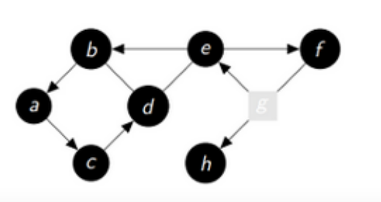{width=400px}
</figure>

<div style="text-align:center;font-size :x-large;font-style:bold"> 15eme tour </div>

* tmp : 
* voisins :
* v :  
* sommets_visités : 
* pile : 
* sommets_fermés :  

<figure markdown>
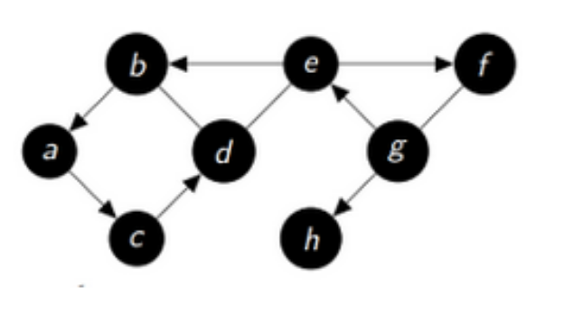{width=400px}
</figure>

**Remarque :** Comme les choix dans la liste des voisins sont aléatoires, il y a plusieurs parcours possibles.

Au final l’arborescence associée au parcours peut  donc  être  modélisée  de  la  façon  suivante :

`[’d’, ’c’, ’a’, ’b’, ’f’, ’e’, ’h’, ’g’]`

<figure markdown>
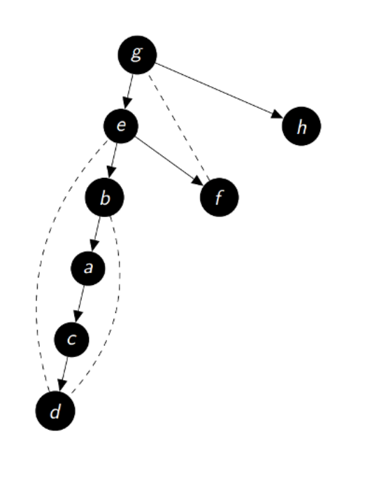{width=400px}
</figure>

#### DFS version 1

Voici une classe Pile :

``` py linenums="1"
class Pile:
    """classe Pile : création d’une instance Pile avec une liste"""

    def __init__(self):
        self.L = []
        
    def vide(self):
        return self.L == []
        
    def depiler(self):
        assert not self.vide(), "Pile vide"
        return self.L.pop()

    def sommet(self):
        assert not self.vide(), "Pile vide"
        return self.L[-1]

    def empiler(self,x):
        self.L.append(x)
```

Vous pouvez également utiliser votre propre classe Pile.Voici le code pour la création du dictionnaire qui représente le graphe G et une fonction qui renvoie les voisins d’un sommet.

``` py linenums="1"
G = dict()
G['a'] = ['b','c']
G['b'] = ['a','d','e']
G['c'] = ['a','d']
G['d'] = ['b','c','e']
G['e'] = ['b','d','f','g']
G['f'] = ['e','g']
G['g'] = ['e','f','h']
G['h'] = ['g']

def voisin(G,sommet):
    return G[sommet]
```

Voici une ligne de code qui permet de récupérer les voisins de tmp non déjà visités :

``` py linenums="1"
voisins = [y for y in voisin(G, tmp) if y not in sommets_visites]
```

La bibliothèque `random`  permet un choix aléatoire dans une liste :

``` py linenums="1"
import random 
v = random.choice(voisins)
```

``` plaintext title="Algorithme DFS"
fonction parcours_profondeur(G,sommet):
    sommets_visites <- []
    sommet_fermes <- []
    p <- Pile()
    sommets_visites <- sommet
    on empile le sommet dans p
    Tant que p n'est pas vide faire
        tmp <- le sommet de la pile
        voisins <- la liste des voisins de tmp non déjà visites
        Si voisins n'est pas vide alors
            v <- un voisin au hasard
            sommets_visites <- v
            on empile v
        Sinon
            sommets_fermes <- tmp
            on depile p
    fin tant que 
    renvoyer sommets_fermes
```


!!! example "Exercice 9"
    Implémenter cet algorithme en Python et tester le sur notre graphe G. 

**Remarque :** Comme les choix dans la liste des voisins sont aléatoires, il y a plusieurs parcours possibles.

#### DFS version 2

``` py linenums="1"
def dfs_bis(G,sommet):
    p = Pile()
    sommets_visites = []
    p.empiler(sommet)
    while p.vide() == False:
        tmp = p.depiler()
        if tmp not in sommets_visites:                         
            sommets_visites.append(tmp)
            #print(tmp, end=" ")
            voisins = [y for y in voisin(G,tmp) if y not in sommets_visites]
        for vois in voisins:
            p.empiler(vois) 
    return sommets_visites
            
c = dfs_bis(G, 'g') 
print('\n')
print(c)
``` 

!!! example "Exercice 10"
    Tester cette version sur notre graphe G.

#### DFS  version 3 (récursive)

On peut utiliser un algorithme récursif pour parcourir un graphe en profondeur. En voici la description :

1. On part d’un nœud du graphe.
2. On le marque comme visité s’il ne l’est pas déjà.
3. Pour chacun de ses voisins non visités, on reprend à partir du 1.

Il y a une "boucle" du 3. au 1. Cela présage une méthode récursive. Voici l’algorithme davantage détaillé :

``` plaintext

Données :
G est un graphe
sommet est un sommet du graphe
sommets_visites est une liste

fonction dfs(G,sommet):
    Si le sommet n'est pas dans la liste sommets_visites alors
        on le met dans la liste
    voisins <- la liste des voisins de sommet non deja visites
    Pour chaque voisin dans voisins faire 
        dfs(G,voisin)
    renvoyer sommets_visites
```

!!! example "Exercice 11"
    Écrire la fonction dfs et la faire fonctionner avec notre graphe avec comme sommet de départ ’g’.

**Remarque :** Le choix du premier voisin est le premier de la liste voisins qui correspond à celle implantée lors de la création du graphe: `G['g'] = ['e', 'f', 'h']`, en la modifiant par `G['g'] = ['f', 'e', 'h']`, vous obtiendrez un autre parcours...

### Application : un chemin entre deux sommets

L’objectif est de faire afficher un chemin entre deux sommets d’un graphe.

<figure markdown>

</figure>

Par exemple : `a - b - e - g - h` est l’un des chemins possible entre a et h

La méthode consiste à mémoriser les sommets voisins du sommet visité comme clés d’un dictionnaire et ayant pour valeur son parent(le sommet visité).Le sommet de départ n’aura bien entendu pas de parent (None).

``` plaintext linenums="1" title="Algorithme DFS modifié"

Données :
G est un graphe
depart : un sommet du graphe
arrivee : un sommet du graphe
sommets_visites est une liste
parents est un dictionnaire
parents[depart] = None

fonction dfs(G,depart):
    Si depart n'est pas dans la liste sommets_visites alors
        on le met dans la liste
    voisins <- la liste des voisins de depart non deja visites
    Pour chaque voisin dans voisins faire 
        parents[voisin] = depart
        dfs(G,voisin)
    renvoyer parents
```

Cette fonction renvoie un dictionnaire qui contient les sommets visités(clés) et leurs parents(valeurs).Il faut maintenant exploiter ce dictionnaire pour faire afficher un chemin entre deux sommets. C’est ce que réalise cette fonction qui prend en paramètre l’arrivée et le dictionnaire parents.

``` py linenums="1"
def solution(end, parents):
    chemin = []
    courant = end
    while courant !=None:
        chemin = [courant] + chemin
        courant = parents[courant]
    return chemin
```

!!! example "Exercice 12"
    Implémenter l’algorithme en Python et la fonction Solution pour faire afficher un chemin entre les sommets b et h de notre graphe G.

!!! example "Exercice 13"
    Reprendre ce dernier travail en utilisant et modifiant la fonction `dfs_bis`.

## Recherche de cycle

### Rappels

Une chaîne est une suite d’arêtes consécutives dans un graphe, un peu comme si on se promenait sur le graphe. On la désigne par les lettres des sommets qu’elle comporte. On utilise le terme de chaîne pour les graphes non orientés et le terme de chemin pour les graphes orientés.

Un cycle est une chaîne qui commence et se termine au même sommet.

<figure markdown>
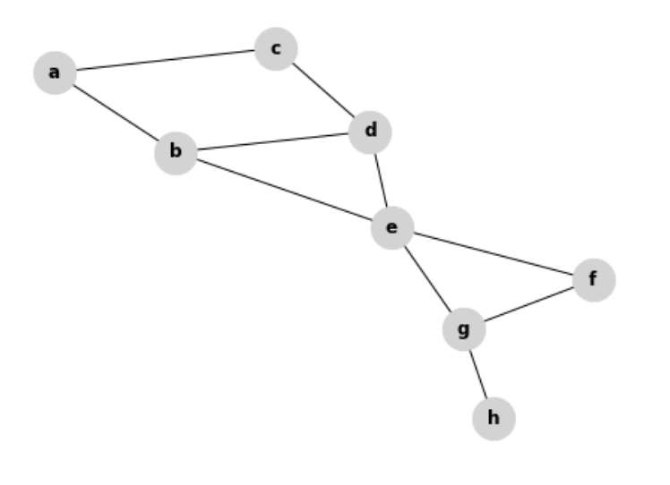{width=350px}
</figure>

a - b - e - d - c - a est un cycle

L’existence de cycle dans un graphe permet d'effectuer un trajet en revenant à son point de départ sans faire demi-tour...

<figure markdown>
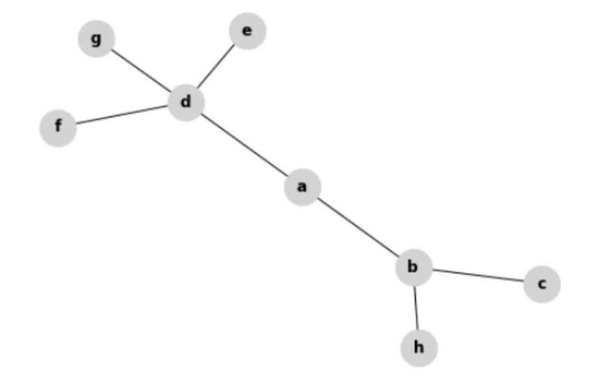{width=350px}
</figure>

### Algorithme de la présence d'un cycle

Voici un programme qui détecte la présence d’un cycle dans un graphe connexe non-orienté:

``` py linenums="1"
def detection_cycle(G, sommet):
    sommets_visites = []
    f = File()
    sommets_visites.append(sommet)
    f.enfiler((sommet, -1))
    while not f.vide():
        (tmp, parent) = f.defiler()
        voisins = voisin(G, tmp)
        for vois in voisins:
            if vois not in sommets_visites:
                sommets_visites.append(vois)
                f.enfiler((vois, tmp))
            elif vois != parent:
                return True
    return False
```

!!! example "Exercice 1"
    1. Quel type de parcours utilise ce programme ?
    2. Quel est le type des éléments placés dans la file ?

!!! example "Exercice 2"
    Faire fonctionner ce programme à la main sur ce graphe en partant du sommet 'a' :

    <figure markdown>
    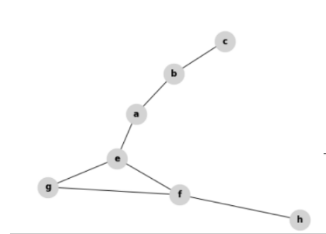{width=350px}
    </figure>

    ** <div style="font-size=x-large">   1  tour<div>**

    * tmp :  
    * parent : 
    * f : 
    * voisins :
    * sommets_visites :
    * f :
  
    ** <div style="font-size=x-large">   2<>  tour<div>**

    * tmp :  
    *  parent : 
    * f : 
    * voisins :
    * sommets_visites :
    * f :

    ** <div style="font-size=x-large">   3  tour<div>**

    * tmp :  
    *  parent : 
    * f : 
    * voisins :
    * sommets_visites :
    * f :

    ** <div style="font-size=x-large">   4  tour<div>**

    * tmp :
    * parent : 
    * f : 
    * voisins :
    * sommets_visites :
    * f :

    ** <div style="font-size=x-large">   6  tour<div>**

    * tmp :  
    *  parent : 
    * f : 
    * voisins :
    * sommets_visites :
    * f :

!!! example "Exercice 3"
    Pour finir de vous convaincre...Faire  fonctionner  ce  programme  à  la  main  pour  le  graphe  ci-dessous  en  partant  du sommet 'a'. Noter les contenus des variables au dernier tour.

<figure markdown>
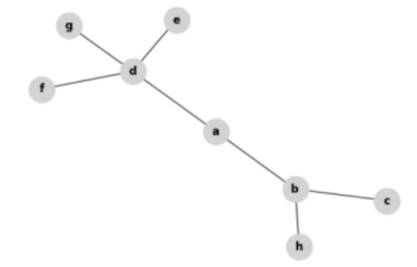{width=350px}
</figure>

## Bibliographie

* [pixees](https://informatique-lycee.forge.apps.education.fr/terminale_nsi/cours-terminale/)
* [Site de G.Lassus](https://glassus.github.io/terminale_nsi/T1_Structures_de_donnees/1.4_Graphes/cours/)
* [site très intéressant pour dessiner, et coder un graphe.A voir !](https://frederic-zinelli.gitlab.io/algographe/)