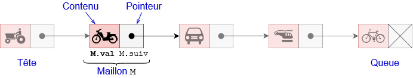
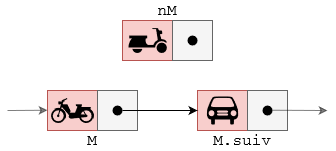
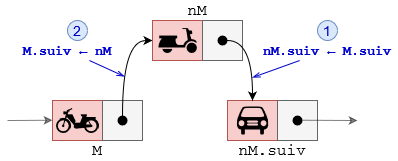
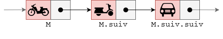
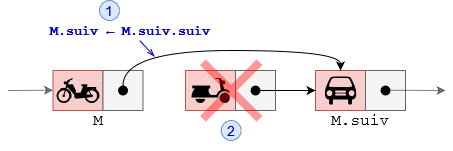

# Les listes

## Introduction

### Les structures linéaires

De nombreux algorithmes "classiques" manipulent des structures de données plus complexes que des
simples nombres. Nous allons ici voir quelques-unes de ces structures de données. Nous allons commencer
par les listes, et deux formes restreintes : les piles et les files. Ces trois types de structures sont qualifiés de
linéaires.

### Les autres types de structures

On distingue :

* Les structures par accès par clé : les dictionnaires
* les structures hiérarchiques : les arbres
* les structures relationnelles : les graphes
  
### Les opérations élémentaires

Une structure de donnée possède un ensemble de routines (procédures ou fonctions) permettant d’ajouter,
d’effacer, d’accéder aux données. Cet ensemble de routines est appelé interface.

L’interface est généralement constituée de 4 routines élémentaires dites CRUD :

* Create : ajout d’une donnée
* Read : lecture d’une donnée
* Update : modification d’une donnée
* Delete : suppression d’une donnée

Derrière les opérations de lecture, de modification, ou de suppression d’une donnée se cache une autre
routine tout aussi importante : la recherche d’une donnée.

## Le type abstrait : liste

### Définition

Le type abstrait de données “liste” modélise une séquence ordonnée d’éléments, dans laquelle on peut accéder, ajouter, supprimer et modifier des éléments à des positions données, indépendamment de la manière dont elle est implémentée (tableau, chaînage, etc.).

Une liste est une structure de données permettant de regrouper des données. Le langage de programmation
Lisp (inventé par John McCarthy en 1958) a été un des premiers langages de programmation à introduire
cette notion de liste (Lisp signifie "list processing").

On prendra des listes indicées à partir de 0.

Exemple de liste : `L = {Buzz ; x ; 1012 ; f9 ; Alan}`

Dans cette liste, l’élément 2 est 1012. Cette liste comporte 5 éléments.

### Interface des listes

Voici l’interface d’une liste

* `listeVide` : créer une liste vide.
* `inserer(L, e, i)` : ajoute l’élément e à l’index i dans la nouvelle liste L.
* `supprimer(L, i)` : l’élément situé à la position i est supprimé de la liste L
* `modif ier(L, e, i)` l’élément situé à la position i dans la liste L est écrasé par le nouvel élément e
* `longueur(L)` : renvoie le nombre d’éléments dans L.
* `lire(L, i)` : renvoie l’élément d’indice i de L.
  
Exemple d’utilisation de liste : `L = { Buzz ; x ; 1012 ; f9 ; Alan}`

* `inserer(L, 25, 0)` : nous donne `L = { 25 ; Buzz ; x ; 1012 ; f9 ; Alan }`
* `supprimer(L, 3)` nous donne `L = { 25 ; Buzz ; x ; f9 ; Alan }`.
* `modifier(L, 59, 2)` nous donne `L = { 25 ; Buzz ; 59 ; f9 ; Alan }`.
* `longueur(L)` nous donne 5
* `lire(L, 4)` nous donne `Alan`

!!! example "Exercice 1"
    On donne `L = { NSI ; plaisir ; jeux ; livres ; π ; E0F1}`
    Expliciter ce que font chacune des commandes suivantes :

    1. `inserer(L, 33, 2)`
    2. `supprimer(L, 4)`
    3. `modifier(L, programmation, 0)`
    4. `longueur(L)`
    5. `lire(L, 2)`

### Implémentation des listes

Pour implémenter les listes (ou les piles et les files), beaucoup de langages de programmation utilisent
un mélange de deux structures : les tableaux et les listes chaînées.

#### Les tableaux

* Chaque élément d’un tableau est indicé.
* Si tous les éléments du tableau sont du même type, ils occupent tous la même taille en mémoire, soit
t. Il suffit alors de stocker l’adresse du premier élément, soit a et on accède à un élément d’indice k en
calculant son adresse en mémoire par a + k × t. Tous les éléments sont donc accessibles avec un coût
constant le temps de calcul de l’adresse et l’accès à cette adresse.
* La place du tableau en mémoire est réservé à la création , soit n × t si n est le nombre d’éléments et t
la taille d’un élément.
* Une contrainte est l’impossibilité de remplacer un élément d’un type par un autre élément d’un autre
type ou d’agrandir la taille du tableau.

Exemple de tableau :

<figure markdown>

</figure>

#### Les tableaux dynamiques

Dans certains langages de programmation, on trouve une version "évoluée" des tableaux : les tableaux
dynamiques. Les tableaux dynamiques ont une taille qui peut varier. Il est donc relativement simple d’insérer
des éléments dans le tableau. Ce type de tableaux permet d’implémenter facilement le type abstrait liste (de
même pour les piles et les files)

À noter que les "listes Python" (listes Python) sont des tableaux dynamiques.

Attention de ne pas confondre avec le type abstrait liste défini ci-dessus, ce sont de "faux amis".
Problème Si on a besoin d’ajouter un élément à un tableau, on crée un nouveau tableau plus grand, on
copie les éléments de l’ancien tableau dans le nouveau, on ajoute le nouvel élément à la fin, on remplace
l’ancien tableau par le nouveau, et enfin on supprime l’ancien tableau. Ce qui est extrèmement coûteux en
nombre d’opération.

#### Les listes chaînées

Une liste chaînée est une structure de données linéaire où les éléments (appelés nœuds, éléménts ou maillon) ne sont pas stockés dans des emplacements mémoire contigus. Chaque nœud contient des données et un pointeur (ou référence) vers le nœud suivant dans la séquence. Cette liste chaînée commence par ce qu'on appelle la tête et se termine par la queue.

<figure markdown>

</figure>

Chaque maillon ou noeud peut être implémenté de la manière suivante :

``` py linenums="1"
class Maillon:
    def __init__(self,valeur=None):
        self.val = valeur
        self.suiv = None # Pas de maillon suivant

    def __str__(self):
        return f"({self.val})" # affiche simplement la valeur du maillon
```

Donc chaque maillon `M` de la liste est composé de la manière suivante :

* d’un contenu utile `M.val` de n’importe quel type,
* d’un pointeur `M.`suiv` pointant vers l’élément suivant de la séquence.

**Remarque 1:** le dernier élément de la liste possède un pointeur `M.suiv` vide. 

**Remarque 2 :** Une liste chaînée `L` est entièrement définie par son maillon de tête `L.tete`

On peut envisager d'écrire une liste composée d'un seul maillon :

``` py linenums="1"
class ListeChainee:
    def __init__(self):
        self.tete = None # Liste vide
```

Son attribut `tete` est de type Maillon. Dans notre exemple, il vaut `None` si la liste est vide. On peut alors
créer une liste ainsi :

```py linenums="1"
liste = ListeChainee()
M1, M2 = Maillon(5), Maillon(8)
M1.suiv = M2
liste.tete = M1
```

!!! example "Exercice 2"
    Implémenter en Python la méthode `est_vide(self)`

!!! example "Exercice 3"
    Compléter la méthode `__str__(self)` suivante :

    ```py linenums="1"
    def __str__(self):
        affichage = ..........
        maillon = self.tete
        while maillon is not None:
            affichage.append(str(maillon.val))
            maillon = ........
        return "{" + " ; ".join(affichage) + "}"
    ```

!!! example "Exercice 4"
    Sur le modèle du code précédent, écrire la méthode `taille(self)` qui retourne la taille de la liste chaînée.

!!! example "Exercice 5"
    De même, écrire les méthodes `get_dernier_maillon()` qui retourne le dernier maillon de la chaîne, et la méthode `get_maillon_indice(i)` qui retourne la maillon d'indice `i`.

!!! question "Insertion d'un maillon"
    Pour insérer un maillon nM après un maillon M , il faut :

    * Faire pointer le pointeur `nM.suiv` vers `M.suiv`
    * Faire pointer le pointeur `M.suiv` vers `nM`

    <figure markdown>
    
    </figure>
    <figure markdown>
    
    </figure>

!!! example "Exercice 6"
    En suivant les schémas des interfaces d’insertion de maillon, implémenter en Python les fonctions
    `ajouter_debut(M)` , `ajouter_fin(M)` et `ajouter_apres(i, M)`

!!! question "Suppression d'un maillon"
    Pour supprimer le maillon suivant un maillon M , il faut :

    * Faire pointer le pointeur `M.`suiv` vers `M.suiv.suiv`
    * Détruire (effacer de la mémoire) le maillon `M.suiv`

    <figure markdown>
    
    </figure>
    <figure markdown>
    
    </figure>

!!! example "Exercice 7"
    En suivant les schémas des interfaces de suppression de maillon, implémenter les méthodes suivantes :
    `supprimer_debut()` qui supprime le premier élement de la liste, `supprimer_fin()` qui supprime le
    dernier élément de la liste et enfin `supprimer_apres(i)` qui supprime le maillon de la liste `L` situé
    après le maillon d’indice `i`.

    Remarque : Ces dernières méthodes doivent retourner le maillon supprimé.

#### Comparaison des différentes implémentations des listes


| Opération           | Tableau statique   | Tableau dynamique | Liste chaînée |
| ------------------- | ------------------ | ----------------- | ------------- |
| Accès par index     | O(1)               | O(1)              | O(n)          |
| Insertion en fin    | Impossible ou O(n) | O(1) amorti       | O(n)          |
| Insertion en milieu | O(n)               | O(n)              | O(n)          |
| Insertion en tête   | O(n)               | O(n)              | O(1)          |
| Suppression         | O(n)               | O(n)              | O(n)          |
