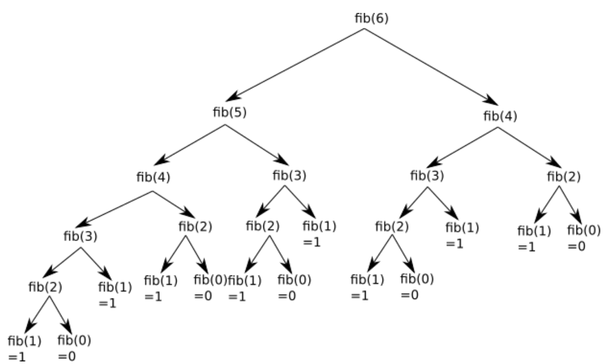

# Programmation dynamique 

## Contexte

!!! example "Exercice 1"
    1. Écrire une fonction récursive qui calcule la factorielle $n$. Rappel : $n! = 1 \times 2 \times 3 \times ... \times n$
    2. Écrire une fonction récursive qui permet de calculer le nième terme de la suite de Fibonacci.

Donc pour $n=6$, cette deuxième fonction peut se représenter par le schéma ci-dessous :

<figure markdown>
{width=400px}
</figure>

Vous pouvez constater que l’on a une structure arborescente (typique dans les algorithmes récursifs), si on additionne
toutes les feuilles de cette structure arborescente (fib(1)=1 et `fib(0)=0)`, on retrouve bien 8.

En observant attentivement le schéma ci-dessus, vous avez remarqué que de nombreux calculs sont inutiles, car effectué
2 fois : par exemple on retrouve le calcul de `fib(4)` à 2 endroits (en haut à droite et un peu plus bas à gauche) :

<figure markdown>
{width=400px}
</figure>

!!! example "Exercice 2"
    Calculer le temps mis pour calculer le 30 ème terme de la suite de fibonacci. 

## Programmation Dynamique

### Premiers exemples sur la suite de Fibonacci

En considérant l’algorithme précédant, on comprend bien qu’il est particulièrement inefficace de calculer plusieurs fois le même sous-calcul. Afin d’améliorer le temps de calcul de l’algorithme, nous décidons donc de mémoriser les calculs déjà effectués dans un tableau. Il existe deux méthodes différentes :


=== "Bottom Up"

    On va calculer les nombres de la suite de Fibonacci jusqu’à en partant de `F(n)` et `F(0)` et `F(1)`. On appelle ce type de méthode une méthode Bottom-Up. Ce n’est pas une méthode récursive.

    ``` py linenums="1"
    def fibo_asc(n : int) -> int :
        F = [0]*(n+1)
        F[1] = 1
        for i in range(2,n+1) :
            F[i] = F[i-1] + F[i-2]
        return F[n]
    ```

=== "Top Down"

    On va calculer les nombres de Fibonacci récursivement, mais en sauvegardant les calculs déjà effectués dans un dictionnaire Python. On appelle ce type de méthode une approche Top-Down :

    ``` py linenums="1"
    def fibonacci_desc(n: int, memo=None) -> int:
        if memo is None:
            memo = {}  # Dictionnaire pour stocker les résultats déjà calculés
    
        if n in memo:
            return memo[n]  # Si déjà calculé, on retourne la valeur enregistrée
    
        if n <= 1:
            return n  # Cas de base : fib(0) = 0, fib(1) = 1
    
        # Calcul et stockage dans memo
        memo[n] = fibonacci_desc(n - 1, memo) + fibonacci_desc(n - 2, memo)
        return memo[n]
    ```

!!! example "Exercice 3"
    Calculer à nouveau le temps mis pour calculer le 30 ème terme de la suite de fibonacci avec les nouveaux algorithmes.

## Programmation dynamique

* Lors d'un calcul effectué de manière récursive, il peut  arriver que de multiples appels récursifs soient identiques. Pour éviter de recalculer plusieurs fois la même chose, on peut stocker les résultats intermédiaires. On appelle cette technique la mémoïsation.
Cette technique minimise le nombre d'opérations et accélère grandement l'exécution du programme. Le prix à payer est l'utilisation d'une structure de stockage des valeurs intermédiaires, et donc une augmentation de la mémoire utilisée par le programme.

* Lors d'un calcul effectué de manière itérative, il est parfois plus simple de commencer par une «petite» version du problème pour progressivement remonter vers la solution du problème global.

## Application à un algorithme glouton  : le rendu de monnaie

### Une définition d'un algorithme glouton

Les algorithmes gloutons sont souvent utilisés pour résoudre ces problème pour lesquels on cherche la meilleure solution (selon un critère défini) dans un ensemble de solutions possibles.. On cherche une solution optimale en effectuant le meilleur choix possible à chaque étape de l'algorithme. Dans ce type de résolution, il n'y a pas de retour en arrière. Lorsqu'un choix est fait, il n'est pas modifié par la suite. On se retrouve donc à chaque étape, avec un problème de plus en plus petit à résoudre.

Attention toutefois, cette méthode ne fournit pas systématiquement la solution optimale au problème proposé.

Parmi ces algorithmes gloutons (vus en première) :

* rendu de monnaie ;
* problème du voyageur ;
* problème du sac à dos.

### Exposé du problème du rendu de monnaie

Supposons qu’un achat induise un rendu de 49 euros. Quelles pièces peuvent être rendues? La réponse, bien qu’évidente, n’est pas unique. Quatre pièces de 10 euros, 1 pièce de 5 euros et deux pièces de 2 euros conviennent. Mais quarante-neuf pièces de 1 euros conviennent également! Si la question est de **rendre la monnaie avec un minimum de pièces**, le problème change de nature. Mais la réponse reste simple : c’est la première solution proposée. Toutefois, comment parvient-on à un tel résultat ? Quels choix ont été faits qui optimisent le nombre de pièces rendus? C’est le problème du rendu de monnaie dont la solution dépend du système de monnaie utilisé.

Dans le système monétaire français, les pièces prennent les valeurs 1, 2, 5, 10, 20, 50, 100 euros (on oublie le billet de 500 euros). Rendre 49 euros avec un minimum de pièces est un problème d’optimisation. En pratique, sans s’en rendre compte généralement, tout individu met en œuvre un algorithme glouton.

**On choisit d’abord la plus grandeur valeur de monnaie**, parmi 1, 2, 5, 10, contenue dans 49 euros. En l’occurence, quatre fois une pièce de 10 euros. La somme de 9 euros restant à rendre, il choisit une pièce de 5 euros, puis deux pièces de 2 euros. Cette stratégie gagnante pour la somme de 49 euros l’est-elle pour n’importe quelle somme à rendre ? On peut montrer que la réponse
est positive pour le système monétaire français. Pour cette raison, un tel système de monnaie est qualifié de canonique. 

Par contre, quand le sytème monétaire n'est pas canonique, il devient intéressant de voir ce que donnent nos algorithmes.

### Algorithme glouton itératif

On cherche, pour un système de pièces canonique, à rendre à chaque fois la plus grosse pièce possible.

!!! example "Exercice 4"
    Proposer une fonction `rendu_glouton` pour le rendu de monnaie qui prend en argument la liste des différentes pièces classées par valeurs croissantes et la valeur à rendre et qui renvoie le nombre de pièce à rendre.

    Exemple d'utilisation :

    ``` py linenums="1"
    >>> rendu_glouton([1, 2, 5], 12)
    3
    ```

    Tester avec : 

    ``` py linenums="1"
    >>> rendu_glouton([1, 6, 10], 12)
    ```
    Que nous donne cet algorithme ?

### Algorithme récursif

Il est possible aussi de construire cet algorithme de manière récursive.

Il faut pour cela faire les observations suivantes :

* Pour rappel, le rendu est toujours possible : dans le pire des cas, le nombre de pièces à rendre est égal à la somme de départ (rendu effectué à coups de pièces de 1)
* Si `p` est une pièce de `pieces`, le nombre minimal de pièces nécessaires (contenant `p`) pour rendre la somme `somme` est égal à 1 + le nombre minimal de pièces nécessaires pour rendre la somme$ `somme - p`.
  
Cette dernière observation est cruciale. Elle repose sur le fait qu'il suffit d'ajouter 1 pièce (la pièce de valeur p) à la meilleure combinaison qui rend $somme - p$ pour avoir la meilleure combinaison qui rend somme (meilleure combinaison parmi celles contenant p).

On va donc passer en revue toutes les pièces `p` et mettre à jour à chaque fois le nombre minimal de pièces.

!!! example "Exercice 5"

    Compléter la fonction `rendu_rec()`.
    ``` py linenums="1"

    def rendu_rec(pieces, somme):
        if somme == 0:
            return ....
        if ..... < 0:
            return float('inf')
    
        min_pieces = float('inf')
        for piece in pieces:
            nb_pieces = ... + rendu_rec(...., somme-.....)
            min_pieces = min(min_pieces, ...)
    return min_pieces

    print(rendu_recursif([1, 2, 5], 12)) # affiche 3
    print(rendu_recursif([1, 6, 10], 12)) # affiche 2
    ```
    Conclusion ?
    y-a-t-il un autre problème ?    

Le temps de calcul étant trop grand pour les "grandes" valeurs de somme, on peut donc légitimement penser à mémoïser notre algorithme, en stockant les valeurs pour éviter de les recalculer.

### Algorithme récursif memoïsé

!!! example "Exercice 6"

    Compléter la fonction `rendu_recursif_memoise()` qui prend en paramètres une liste de pièces `pieces` et la somme à `rendre_somme` et qui renvoie le nombre minimal de pièces qu'il faut rendre.

    On utilisera le dictionnaire `memo_rendu` dans lequel on associera à chaque somme `somme` son nombre de pièces minimal.

    On procèdera de manière classique :

    * Soit la somme est disponible dans le dictionnaire, et on se contente de renvoyer la valeur associée.
    * Soit on la calcule (comme dans l'algorithme classique), puis on stocke le résultat dans le dictionnaire avant de le renvoyer.

    ```py linenums="1"
    def rendu_monnaie_top_down(pieces: list, somme:int, memo=None) -> int:
        if memo is None:
            memo = {}  
    
        if .... in memo:
            return memo[somme]  
    
        if .... == 0:
            return 0  
    
        if .... < 0:
            return float('inf')  # Impossible de rendre un montant négatif
    
        min_pieces = float('inf')
    
        for piece in pieces:
            nb_pieces = ...
            if nb_pieces != float('inf'):
                min_pieces = min(min_pieces, nb_pieces + 1)

        memo[somme] = min_pieces  
        return ....
    ```

    Tester l'algorithme sur une somme égale à 107 et sur des systèmes non canoniques.

### Algorithme bottom-up

En utilisant la version (bottom-up) nous allons ici calculer successivement tous les rendus minimaux jusqu'à somme avant de calculer le rendu minimal de somme.

!!! example "exercice 7"

    Compléter la fonction `rendu_bottom_up` qui prend en paramètres une liste de pièces pieces et la somme à rendre somme et qui renvoie le nombre minimal de pièces qu'il faut rendre.

    Nous stockerons chaque rendu dans un dictionnaire rendu, initialisé à la valeur 0 pour la clé 0.

    ```py linenums="1"
    def rendu_bottom_up(pieces, somme):
        rendu = {...}
        for s in range(..., ...): # 
            rendu[s] = ... #
            for p in pieces:
                if p <= s:
                    rendu[s] = min(..., ... + ...)
        return ...   

    print(rendu_bottom_up([1, 6, 10], 107)) # 12
    ```

Notre algorithme itératif est de complexité linéaire (par rapport à la variable somme).
