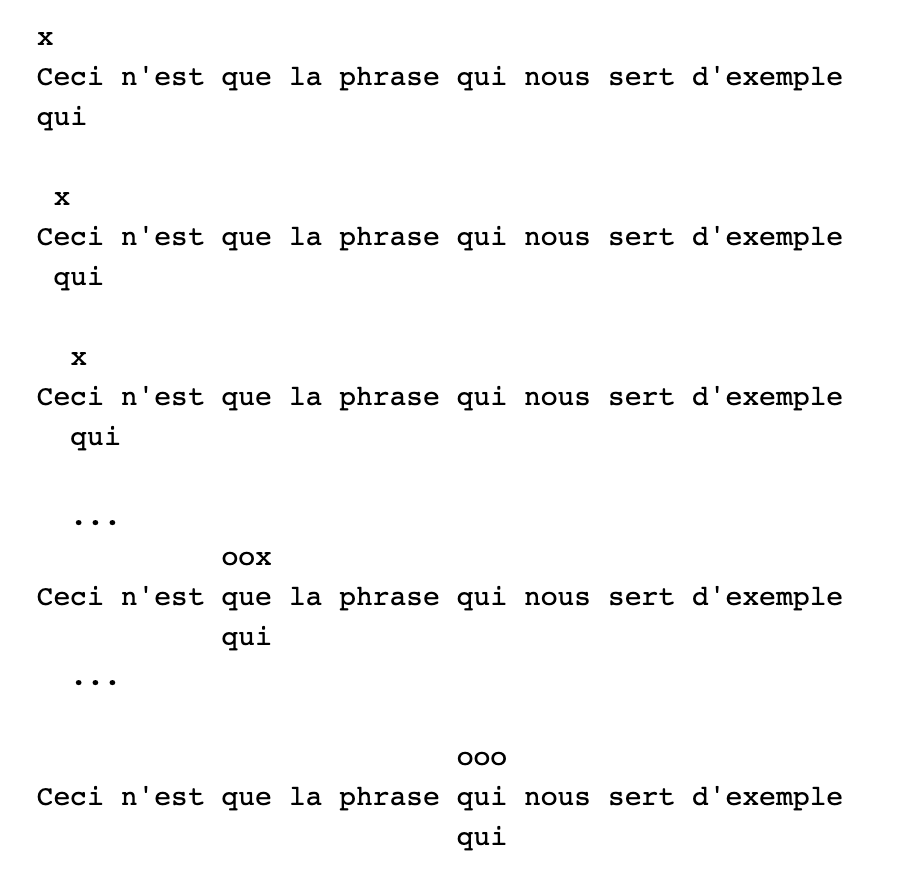
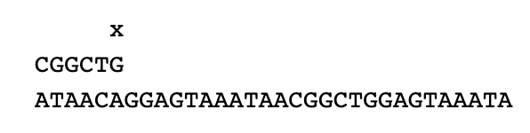
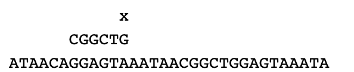
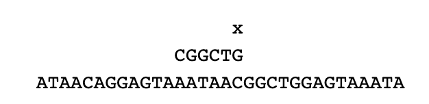
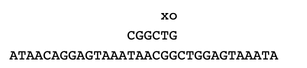
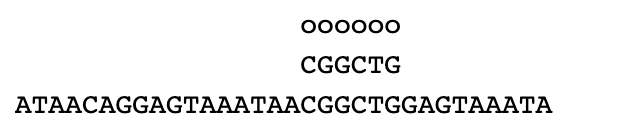

# Recherche textuelle

## Introduction

Les algorithmes qui permettent de trouver une sous-chaîne de caractères dans une chaîne de caractères plus grande sont des grands classiques de l’algorithmique.

Un des secteurs qui utilise le plus cette recherche textuelle est le domaine de la bioinformatique notamment dans l’analyse des informations génétiques. Cette information génétique présente dans nos cellules est portée par les molécules d’ADN et permet la fabrication des protéines. Ces molécules d’ADN sont, entre autres, composées de bases azotées ayant pour noms : Adénine (représenté par un A), Thymine (représenté par un T), Guanine (représenté par un G) et Cytosine (représenté par un C).

<figure markdown>
{width=300px}
</figure>

Il est souvent nécessaire de détecter la présence de certains enchaînements de bases azotées (dans la plupart des cas un triplet de bases azotées code pour 1 acide aminé et la combinaison d’acides aminés forme une protéine).

## Comment fonctionnent ces algorithmes ?

L’objectif, ici, est de construire des algorithmes de recherche textuelle, d’en comprendre les principes et de les comparer.

Nous étudierons ici un algorithme simplifié de Boyer-Moore.

Tout comme la plupart des applications, Python possède sa propre méthode de recherche, ce script affiche la présence ou non d’une occurrence. (mot) dans un texte (phrase).

``` py linenums="1"
phrase="Ceci n'est que la phrase qui nous sert d'exemple"
mot1="qui"
mot2="quiche"
print(mot1 in phrase)
print(mot2 in phrase)
```

Remarque : nous disposons également de la méthode `find()`

Exemple :
``` py linenums="1"
txt = "Bonjour les TNSI"

x = txt.find("TNSI")

print(x) # affiche 12
```

Il y a encore la méthode `index`

``` py linenums="1"
string = "Bonjour les TNSI"
print(string.index("TNSI"))
``` 

Danx ce cours, nous allons étudier comment fonctionnent ces fonctions/méthodes à l'aide d'une approche naïve et d'une approche beaucoup plus efficace.

## Une approche "naïve"

Pour savoir si un mot est dans une phrase, la méthode qui nous vient à l’esprit est la suivante :

On parcourt le texte d’indice en indice depuis le début du texte en vérifiant à chaque pas si les lettres du mot coïncident comme illustré dans l'[animation](https://boyer-moore.codekodo.net/recherche_naive.php) suivante.

<figure markdown>
{width=400px}
</figure>

!!! example "Exercice 1 :"

    1. Écrire une fonction `occurrence` qui renvoie si un mot est trouvée dans une phrase à partir d’un indice `i`. Cette fonction prend en arguments le mot (l’occurrence), la phrase (le texte), et la position du mot dans le texte (l’indice i). Celle-ci retournera un booléen.
    2. Vérifier que `occurrence(mot1, phrase, 2)` renvoie `Faux`.
    3. Pour quelle valeur de i `occurrence(mot1, phrase, i)` renvoie `Vrai`.

!!! example "Exercice 2 :"
    Écrire une fonction `recherche` qui prend en paramètres un mot et un texte et qui renvoie l’indice où apparaît le mot dans le texte et "occurrence non trouvée" si le mot n’est pas dans le texte. (On utilisera la fonction occurrence donnée plus haut)
    Appliquer cette fonction à la phrase2, qui représente une séquence d’un brin d’ADN, avec l’occurrence ’CGGCAG’ (La fonction doit renvoyer 15). La phrase2 se trouve dans l’espace des classes sur l’ENT.

!!! example "Exercice 3 :"
    Modifier la fonction `recherche` (en recherches...) pour que cette fois-ci elle renvoie la liste des indices où apparaît le mot dans le texte.
    Pour phrase2 et mot3 ("ACG"), vous devez obtenir : [12, 137, 205, 325, 360], ce qui signifie que le mot ’ACG’ apparaît 5 fois. (aux indices indiqués dans la liste)

!!! example "Exercice 4 :"
    Le fichier `vh.txt` contient le premier tome des misérables de Victor Hugo.
    Il faut le placer dans le même dossier que ce programme.
    Le code ci-dessous mesure en seconde le temps d’exécution de 5 appels de la fonction recherches(mot,texte), pour le mot `Valjean` et le texte `tome1`.
    Vous devriez trouver une valeur entre 1,10 et 1,13 ...
    Que signifie le 196 affiché ?

``` py linenums="1"
from timeit import default_timer as timer
with open('vh.txt','r') as vh:
tome1 = vh.read()
d=timer()
for i in range(5):
    print(len(recherches('Valjean',tome1)))
f=timer()
print(f-d)
```

## Algorithme de Boyer-Moore

Nous verrons ici l'algorithme de Boyer-Moore-Horspool qui est une simplification (moins efficace) de l'algorithme de Boyer-Moore.

### Description

L'algorithme de Boyer-Moore-Horspool améliore l'algorithme naïf en effectuant un décalage intelligent en cas d'échec. C'est à dire qu'on ne se déplace pas d'un caractère vers la droite lorsque le motif n'a pas été trouvé. Le décalage va dépendre de la lettre qui a échouée. Ainsi, le texte est parcouru plus rapidement et la recherche est plus efficace.

La deuxième idée est de faire la comparaison avec le motif de la droite vers la gauche de façon à tirer encore plus avantage du décalage variable.

Le principe de cet algorithme est exposé dans cette [animation](https://boyer-moore.codekodo.net/recherche_boyer.php)

Regardons cela de plus près sur un exemple.

### Exemple
L’objectif est de rechercher l’occurrence `CGGCTG` dans la séquence `ATAACAGGAGTAAATAACGGCTGGAGTAAATA`.

On aligne et on teste l’occurrence par la droite :

<figure markdown>
{width=300px}
</figure>

Il n'y a pas de correspondance car $G\ne A$. On décale alors le motif  vers la droite car la lettre A n'est pas dans le motif. Les positions intermédiaires ne peuvent donc pas réussir. Donc on décale l'occurrence de 6 rangs (la longueur de l'occurrence).

<figure markdown>
{width=300px}
</figure>

On est dans une situation similaire, et en deux étapes on obtient ce que la méthode naïve aurait fait en 12 étapes !

<figure markdown>
{width=300px}
</figure>

Dans cette situation, le G et le C ne correspondent pas mais il y a un C dans l'occurrence, on décalera donc l'occurrence de 2 rangs (place du premier C depuis la fin de l'occurrence)

On obtient donc :

<figure markdown>
{width=300px}
</figure>

Cette fois-ci les G correspondent puis T et G ne correspondent pas, or il y a un G (avant le T) dans l'occurrence.

On décale donc de 3 rangs.

On obtient donc:

<figure markdown>
{width=300px}
</figure>

On trouve une correspondance complète.

Pour continuer la recherche il suffit de la relancer un rang plus loin...

En appliquant à chaque étape un décalage adapté, on accélère grandement le processus.

### Une première fonction

!!! example "Exercice 5 :"
    Que fait la fonction ci-dessous. Expliquer la valeur de la clé ’a’.

``` py linenums="1"
def table_saut(mot):
    dico = {}
    m = len(mot)
    for i in range(m-1):
        dico[mot[i]] = m - 1 - i
    return dico

print(table_saut("Valjean"))
```

### L'algorithme

Voici l’algorithme qui réalise le processus décrit plus haut.

``` 

Fonction boyer_moore(mot,texte):


longText <- longueur du texte
longMot  <- longueur du mot
positions <- []
decalage <- dico(mot) // notre fonction précédente
i <- 0
Tant que i < ou = a longText - longMot:
    pour j allant de longMot -1 a -1 par pas de -1 :
        Si texte[i+j] est different  mot[j]:
            Si texte[i+j] est une cle de decalage et que sa valeur est inferieure a j
                i <- i + decalage[texte[i+j]]
            Sinon :
                i <- i+j+1
            trouve <- False
            Break
        Sinon:
            trouve <- True
    Si trouve est vrai:
        on ajoute i a positions
            i <- i+1
renvoyer positions
``` 

!!! example "Exercice 6"
    Implémenter cette fonction en commentant les différentes parties.
    Appliquer le sur le texte de Victor Hugo avec le mot 'Valjean' pour vérifier son bon fonctionnement.
    Faire afficher le temps d'exécution de 5 appels de la fonction boyer_moore. Qu'en déduisez - vous ?


!!! example "Exercice 7"
    Reprendre la comparaison avec la recherche de l'occurrence 'e'

## Conclusion

L’algorithme de Boyer-Moore fut inventé en 1977. Il peut être encore amélioré avec plusieurs tables de saut, chacune correspondant au saut possible en fonction du caractère testé dans la clé. Cet ajout de table présente un intérêt pour les recherches avec une clé de taille importante.
