# Les Graphes

## Introduction

Au milieu du XXème siècle, le physicien hongrois Eugène Wigner parle de "la déraisonnable efficacité des mathématiques dans les sciences de la nature". La modélisation mathématique facilite la compréhension d’un problème car elle détermine un seul vocabulaire formel pour différentes situations, et elle permet de trouver une méthode de résolution automatique via un programme informatique.

Le modèle mathématique que nous allons voir dans ce chapitre est le graphe.
On utilise les graphes dans de nombreuses situations :

* les réseaux de communication ( internet, téléphonie) ;
* les réseaux sociaux ;
* les circuits électriques ;
* les bases de données relationnelles ;
* le codage ;
* la hiérarchie des fichiers informatiques ;
*  la représentation des molécules ;
* en biologie pour la représentation de la séquence ARN.

## Graphe non-orientés

### Un premier exemple

Imaginez un réseau social ayant 6 abonnés : Jules, Simon, Arthur, Jean, Lucien, et Maxime où :

* Jules est ami avec Simon, Arthur et Jean
* Simon est ami avec Jules et Jean
* Arthur est ami avec Jules, Lucien et Jean
* Jean est ami avec tous les autres abonnés
* Lucien est ami avec Arthur, Jean et Maxime
* Maxime est ami avec Lucien et Jean
  
La description de ce réseau social, malgré son faible nombre d’abonnés, est déjà quelque peu rébarbative, alors imaginez cette même description avec un réseau social comportant des millions d’abonnés !

Il existe un moyen plus "visuel" pour représenter ce réseau social : on peut représenter chaque abonné par un cercle (avec le nom de l’abonné situé dans le cercle) et chaque relation "X est ami avec Y" par un segment de droite reliant X et Y ("X est ami avec Y" et "Y est ami avec X" étant représenté par le même
segment de droite).

En modélisant ces prénoms par A,B,C,D,E et F, on obtient avec le réseau social décrit ci-dessus :

<figure markdown>
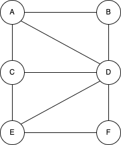{width=200px}
</figure>

Ce genre de figure s’appelle un graphe non orientés. Les graphes sont des objets mathématiques très utilisés, notamment en informatique. Les cercles sont appelés des sommets et les segments de droites qui
relient 2 sommets des arêtes.
Plus formellement on dira qu’un graphe G est un couple G = (V, E) avec V un ensemble de sommets et
E un ensemble d’arêtes

!!! Example "Exercice 1 :"
    Construisez un graphe de réseau social à partir des informations suivantes :

    * A est ami avec B et E
    * B est ami avec A et C
    * C est ami avec B,F et D
    * D est ami avec C,F et E
    * E est ami avec A,D et F
    * F est ami avec C, D et E
  
### Vocabulaire des graphes non-orientés

* On note x-y l’arête (x-y) dans un graphe non orienté où x et y sont les deux extrémités.
* Deux arêtes d’un graphe sont dites adjacentes si elles ont au moins un sommet en commun.
* deux sommets d’un graphe non-orienté sont dits adjacents s’il existe une arête les joignants.
* dans un graphe non-orienté, on appelle degré d’un sommet x le nombre d’arête dont x est une
extrémité.
* dans un graphe non-orienté, on appelle chaîne toute suite de sommets consécutifs reliés par des arêtes.
* une chaîne est dite élémentaire si elle ne comporte pas plusieurs fois le même sommet.
* une chaîne dont le sommet de début est le même que le sommet de fin est appelé cycle.
* un graphe non-orienté est dit connexe lorsqu’il existe une chaîne pour toute paire de sommet.

<figure markdown>
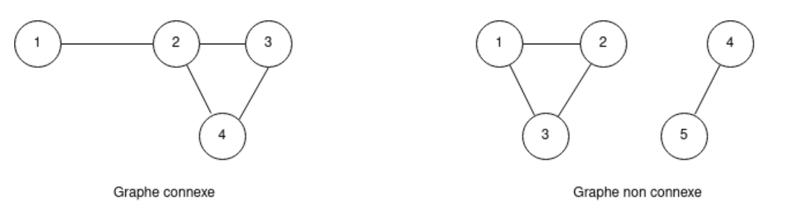{width=600px}
</figure>

## Les graphes orientés

### Un premier exemple

Les logiciels de cartographie permettant, connaissant votre position grâce à un récepteur GPS, d’indiquer la route à suivre pour se rendre à endroit B. Comment modéliser l’ensemble des lieux et des routes ?
Simplement à l’aide d’un graphe !

Chaque lieu est un sommet et les routes qui relient les lieux entre eux
sont des arêtes.

Soit les lieux suivants : A, B, C, D, E, F et G.

Les différents lieux sont reliés par les routes suivantes :

* il existe une route entre A et C ;
* il existe une route entre A et B ;
* il existe une route entre A et D ;
* il existe une route entre B et F ;
* il existe une route entre B et E ;
* il existe une route entre B et G ;
* il existe une route entre D et G ;
* il existe une route entre E et F.
  
Ici aussi, la représentation sous forme de graphe s’impose :

<figure markdown>
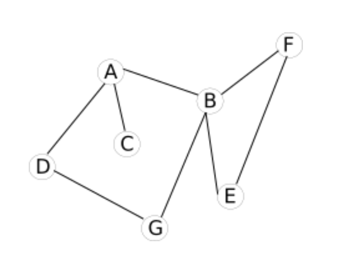{width=300px}
</figure>

**Problème :** avec cette représentation du réseau routier sous forme de graphe, il est impossible de tenir compte des routes en sens unique (par exemple il est possible d’aller de A vers D mais pas de D vers A)

Voici de nouvelles contraintes :

* il existe une route entre A et C (double sens) ;
* il existe une route entre A et B (sens unique B->A) ;
* il existe une route entre A et D (sens unique A->D) ;
* il existe une route entre B et F (sens unique B->F) ;
* il existe une route entre B et E (sens unique E->B) ;
* il existe une route entre B et G (double sens) ;
* il existe une route entre D et G (double sens) ;
* il existe une route entre E et F (double).
  
Pour tenir compte de ces nouvelles contraintes, on utilisera un graphe orienté :

<figure markdown>
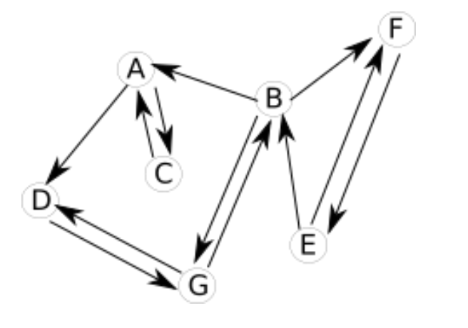{width=300px}
</figure>

Dans un graphe orienté, les arêtes possèdent une orientation. Ces "arêtes orientées" sont souvent appelées "arcs". On dira qu’un graphe orienté G est un couple G = (V,A) avec V un ensemble de sommets et A un
ensemble d’arcs.

### Vocabulaire

* On note x→ y l’arc (x,y) dans un graph orienté où x est son extrémité initiale et y son extrémité
finale. y est le successeur de x et x est le prédécesseur de y.
* deux arcs d’un graphe sont adjacents s’ils possèdent au moins une extrémité commune ;
* Deux sommets d’un graphe orienté sont dits adjacents s’il existe un arc les joignant.
* Dans un graphe orienté, on appelle degré d’un sommet x le nombre d’arcs dont x est une extrémité.
* Dans un graphe orienté, on appelle chemin toute suite de sommet consécutifs relié par des arcs.
* Un chemin est dit éléméntaire s’il ne comporte pas plusieurs fois le même sommet.
* Un chemin dont le somme de début est le même que le sommet de fin est appelé circuit.

## Les graphes pondérés

### Exemple

Parfois il est intéressant d’associer aux arrêtes ou aux arcs des valeurs, on parle alors de graphes pondérés.

Si nous revenons à notre "graphe cartographie", il est possible d’associer à chaque arête la distance en Km entre les 2 lieux

<figure markdown>
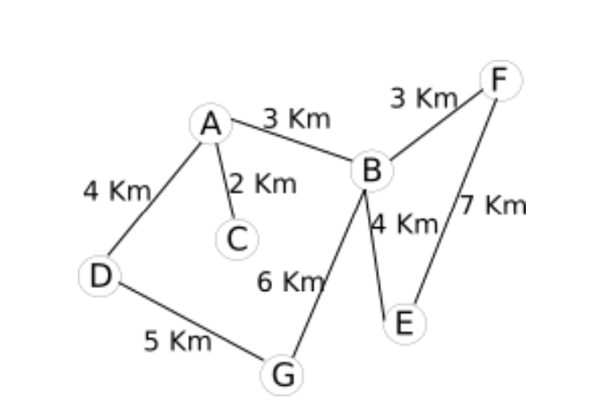{width=300px}
</figure>

Il est aussi possible d’associer à chaque arête la durée du trajet entre 2 points :

<figure markdown>
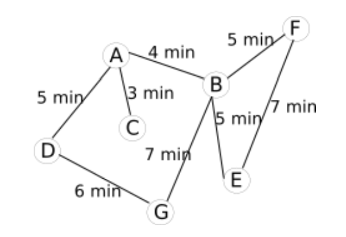{width=300px}
</figure>

En fonction du choix fait par le conducteur (trajet le plus court "en distance" ou trajet le plus court "en temps"), l’algorithme permettant de déterminer le "chemin le plus court entre 2 points" travaillera sur le graphe "graphe pondéré (Km)cartographie" ou sur le graphe "graphe pondéré (minutes) cartographie". À noter que le "graphe pondéré (minutes) cartographie" peut évoluer au cours du temps en fonction du trafic routier : une application comme Waze utilise les données en en provenance des utilisateurs de l’application afin de mettre à jour en temps réél leur "graphe pondéré (minutes) cartographie".

Un graphe est pondéré (ou valué) si on attribue à chaque arête une valeur numérique (la plupart du temps positive), qu'on appelle mesure, poids, coût ou valuation.

## Implémentation d’un graphe à l’aide d’une matrice d’adjacence

Il existe deux méthodes permettant d’implémenter un graphe : les matrices d’adjacences et les listes
d’adjacences.

### Définition d’une matrice
Une matrice est un tableau à double entrée. Exemple, la matrice A ci-dessous.

$$
A =
\begin{pmatrix}
  1  & 2   & 3   & 8  & 10  \\
  4  & 5   & 6   & 6  & 9  \\
  7  & 8  & 9  & 6  & 5 \\
\end{pmatrix}
$$

La matrice A ci-dessus est constitué de 3 lignes et 5 colonnes. On appelle matrice carrée une matrice qui
comporte le même nombre de lignes et de colonnes. Les matrices d’adjacences sont des matrices carrées.

### Exemple

<figure markdown>
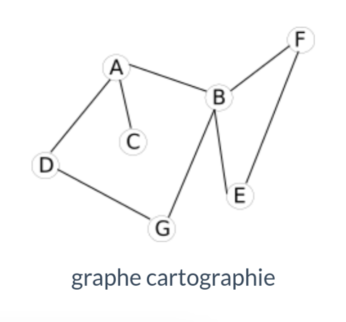{width=200px}
</figure>

Voici la matrice d’adjacence de ce graphe :

$$
A =
\begin{pmatrix}
0 & 1 & 1 & 1  & 0 & 0 & 0  \\
1 & 0 & 0 & 0  & 0 & 0 & 0  \\
1 & 0 & 0 & 0  & 0 & 0 & 0  \\ 
1 & 0 & 0 & 0  & 0 & 0 & 1 \\
0 & 1 & 0 & 0  & 1 & 0 & 0 \\
0 & 1 & 0 &1  & 0 & 0 & 0  \\
\end{pmatrix}
$$

### Comment construire une matrice d’adjacence ?

<figure markdown>
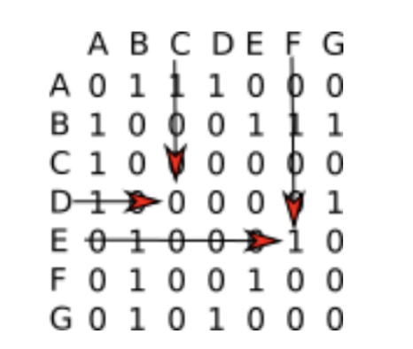{width=200px}
</figure>

Il faut savoir qu’à chaque ligne correspond un sommet du graphe et qu’à chaque colonne correspond aussi
un sommet du graphe. À chaque intersection ligne i-colonne j (ligne i correspond au sommet i et colonne j
correspond au sommet j), on place un 1 s’il existe une arête entre le sommet i et le sommet j, et un zéro s’il n’existe pas d’arête entre le sommet i et le sommet j.

* Il existe une arête entre le sommet E et le sommet F, nous avons donc placé un 1 à l’intersection de
la ligne E et de la colonne F (il en est de même à l’intersection de la ligne F et de la colonne E)
* Il n’existe pas d’arête entre le sommet D et le sommet C, nous avons donc placé un 0 à l’intersection
de la ligne D et de la colonne C (il en est de même à l’intersection de la ligne C et de la colonne D)

!!! Example "Exercice 2 :"
    Vérifiez que la matrice d’adjacence proposée ci-dessus correspond bien au graphe "cartographie".

!!! Example "Exercice 3 :"
    Établissez la matrice d’adjacence du graphe ci-dessous.

<figure markdown>
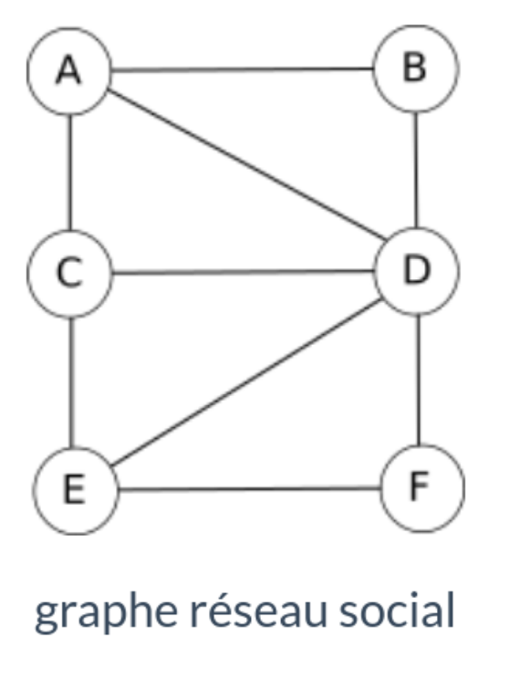{width=200px}
</figure>

### Matrice d’adjacence pour un graphe orienté

Le principe reste le même : si le sommet i (ligne) est lié au sommet j (colonne), nous avons un 1 à
l’intersection (0 dans le cas contraire).

**Exemple :**
<figure markdown>
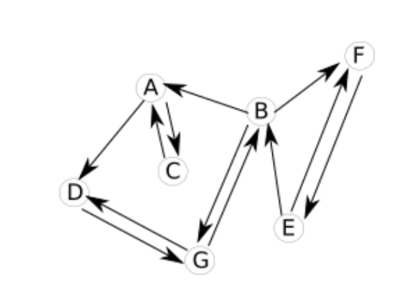{width=300px}
</figure>

La matrice d'adjacence est :

$$
A =
\begin{pmatrix}
0 & 0 & 1 & 1 & 0 & 0 & 0  \\
1 & 0 & 0 & 0 & 1 & 1 & 1  \\
1 & 0 & 0 & 0 & 0 & 0 & 0  \\ 
0 & 0 & 0 & 0 & 0 & 0 & 1 \\
0 & 1 & 0 & 0 & 0 & 1 & 0 \\
0 & 0 & 0 & 0 & 1 & 0 & 0  \\
0 & 1 & 0 & 1 & 0 & 0 & 0  \\
\end{pmatrix}
$$

!!! Example "Exercice 4 :" 
    Vérifiez que la matrice d’adjacence proposée ci-dessus correspond bien au graphe orienté "cartographie".

!!! Example "Exercice 5 :"
    Etablir la matrice du graphe orienté ci-dessous.

<figure markdown>
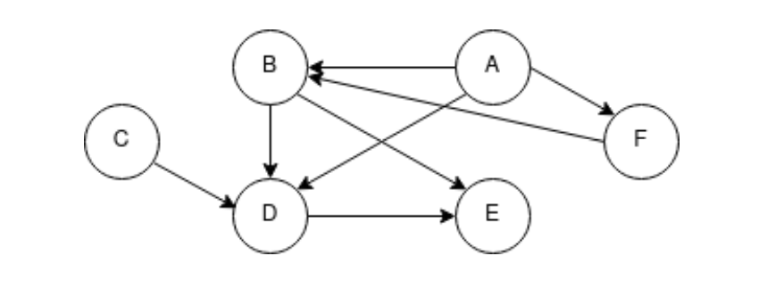{width=300px}
</figure>

### Matrice d’adjacence d’un graphe pondéré

On remplace les 1 par les valeurs liées à chaque arc

<figure markdown>
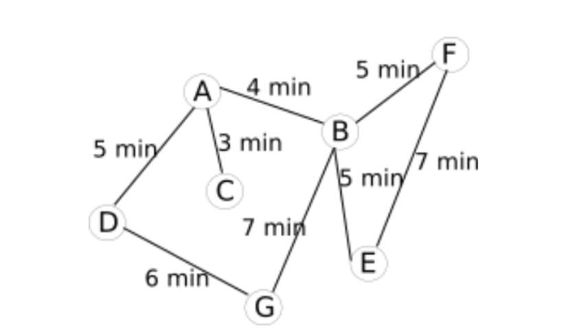{width=300px}
</figure>

La matrice d'adjacence :

$$
A =
\begin{pmatrix}
0 & 4 & 3 & 5 & 0 & 0 & 0  \\
4 & 0 & 0 & 0 & 5 & 5 & 7  \\
3 & 0 & 0 & 0 & 0 & 0 & 0  \\ 
5 & 0 & 0 & 0 & 0 & 0 & 6 \\
0 & 5 & 0 & 0 & 0 & 7 & 0 \\
0 & 5 & 0 & 0 & 7 & 0 & 0  \\
0 & 7 & 0 & 6 & 0 & 0 & 0  \\
\end{pmatrix}
$$

!!! Example "Exercice 6 :"
    Vérifiez que la matrice d’adjacence proposée ci-dessus correspond bien au graphe pondéré (minutes) "cartographie".

## Les listes d’adjacences

### Pour les graphes non-orientés

Pour commencer, on définit une liste des sommets du graphe. À chaque élément de cette liste, on associe une autre liste qui contient les sommets lié à cet élément.

Reprenons l’exemple du "graphe cartographie" :

<figure markdown>
{width=300px}
</figure>

Voici la liste d'adjacence de ce graphe :

<figure markdown>
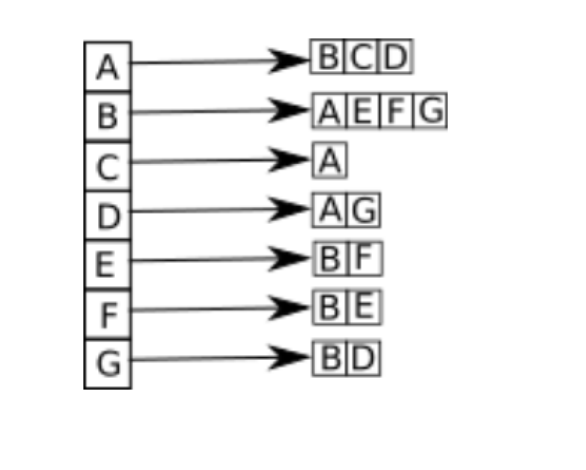{width=150px}
</figure>

### Pour les graphes orientés

Pour les graphes orientés, il est nécessaire de définir 2 listes : la liste des successeurs et la liste des prédécesseurs. Soit un arc allant d’un sommet A vers un sommet B (flèche de A vers B). On dira que B est
un successeur de A et que A est un prédécesseur de B.

<figure markdown>
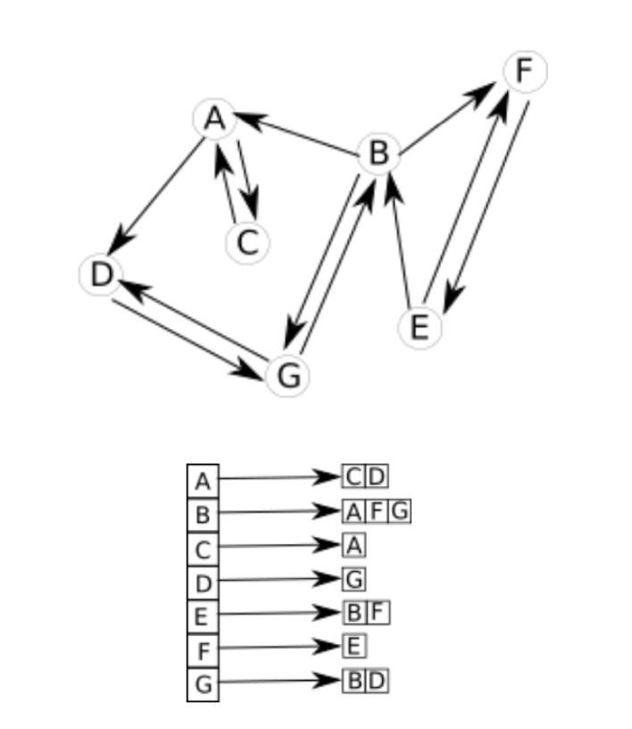{width=300px}
</figure>
Liste d'adjacence successeurs du graphe orienté cartographie

<figure markdown>
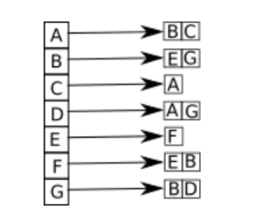{width=150px}
</figure>
Liste d'adjacence prédécesseurs du graphe orienté cartographie

## Exercices 

### Exercice 1 :

Tracer les graphes associés aux matrices d’adjacence données. Puis donner sa liste des successeurs et des
prédecesseurs.

$$
M =
\begin{pmatrix}
0 & 1 & 0 & 0 & 0 \\
0 & 0 & 1 & 1 & 1 \\
0 & 1 & 0 & 1 & 0 \\
0 & 0 & 1 & 0 & 0 \\
1 & 1 & 0 & 1 & 0 \\
\end{pmatrix}
$$

### Exercice 2 :

On souhaite organiser un tournoi de football avec 5 équipes (numérotées de 1 à 5). Chaque
équipe rencontre une seule fois toutes les autres.

1. Représenter la situation sous la forme d’un graphe.
2. Combien d’arêtes possède-t-il ?En déduire le nombre de matchs au total pour ce tournoi ?
3. Ce graphe est-il connexe ?

### Exercice 3 :

Un club de tennis doit sélectionner deux joueurs parmi quatre pour représenter le club à un tournoi
national. Les quatre joueurs sont notés A,B,C et D. Pour réaliser la séléction, le club organise des matchs :
chaque joueur rencontre les trois autres.

**Règle :**

* tout match gagné donne un point.
* tout match perdu enlève un point.

Les joueurs sélectionnés sont les joueurs ayant obtenu le plus grand nombre de points. On donne les
résultats sous la forme d’un graphe orienté.

Le sens de l’arc A $\to$ B indique que le joueur A a battu B

<figure markdown> 
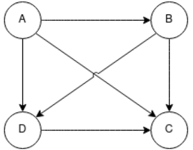{width=150px}
</figure>

1. Donner le nombre de points de chaque joueur
2. En déduire les joueurs sélectionnés